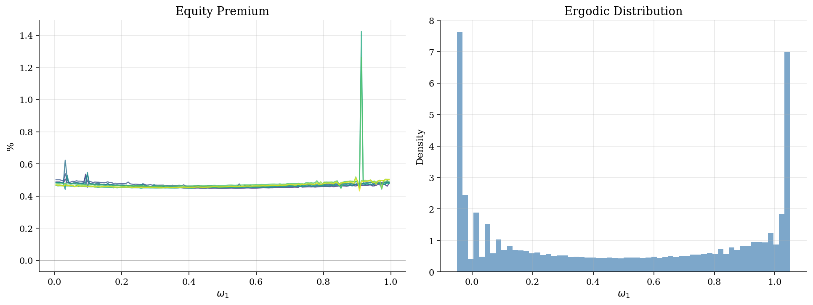
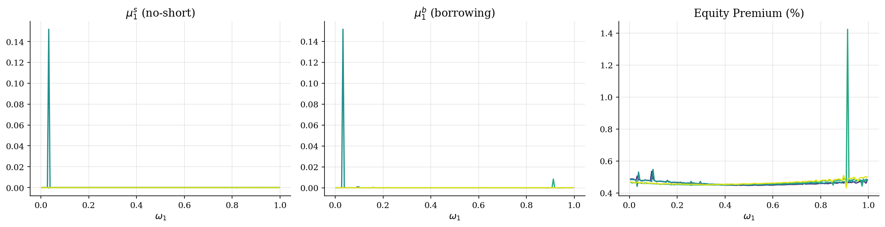

# Heaton-Lucas (1996): Incomplete Markets via STPFI

> Two agents trade equity and bonds with constraints, solved via STPFI with JAX autodiff. Direct translation of HL1996.gmod.

## Overview

Heaton and Lucas (1996) study risk sharing and asset pricing with two agents trading equity and a risk-free bond under short-sale and borrowing constraints.

The endogenous state is the **wealth share** $\omega_1$ with an implicit law of motion. This implementation is a direct translation of the official GDSGE toolbox model (`HL1996.gmod`) into JAX/Python.

## Equations

**Euler equations** (equity: $g^{1-\gamma}$, bonds: $g^{-\gamma}$):

$$-1 + \beta \, \mathbb{E}\!\left[g'^{1-\gamma} (c_1'/c_1)^{-\gamma} \frac{p_s'+d'}{p_s}\right] + \mu_1^s = 0$$

$$-1 + \beta \, \mathbb{E}\!\left[g'^{-\gamma} (c_1'/c_1)^{-\gamma} / p_b\right] + \mu_1^b = 0$$

**Complementary slackness:** $\mu^s_i \cdot s_i' = 0$, $\mu^b_i \cdot (b_i'-\bar K^b) = 0$

**Budget:** $c_i + p_s s_i' + p_b b_i' = \omega_i(p_s+d)+\eta_i$

**Consistency:** $\omega_1' = \frac{s_1'(p_s'+d') + b_1'/g'}{p_s'+d'}$

## Model Setup

| Parameter | Value | Description |
|-----------|-------|-------------|
| $\beta$ | 0.95 | Discount factor |
| $\gamma$ | 1.5 | CRRA |
| $\bar{K}^b$ | -0.05 | Borrowing limit |
| States | 8 | Markov for $(g,d,\eta)$ |
| Grid | 201 pts on $[-0.05, 1.05]$ | |
| Unknowns | 19/point | |

## Solution Method

**STPFI** (Cao, Luo, Nie 2023): solve 19-equation system at each of 1608 collocation points per iteration using `scipy.optimize.root` with exact JAX autodiff Jacobians.

```
Algorithm:
  1. Init c₁⁰ = ω·d+η₁, c₂⁰ = (1-ω)·d+1-η₁, pₛ⁰ = 1
  2. For each iteration:
     For each (z, ω) on grid:
       Solve 19 eqs: 4 Euler + 4 compl. + bond clear + 2 budget + 8 consist.
     Dampened update, check convergence
```

Result: **80 iters** (Δ=2.06e-02, res=1.27e-03).

## Results


*Equity premium and ergodic distribution of wealth share.*


*Multipliers and equity premium — kinks where constraints bind.*

**Euler Equation Errors**

| Metric   |   Equity EE |   Bond EE |
|:---------|------------:|----------:|
| Mean     |     0.00303 |  0.000916 |
| Max      |     0.24    |  0.149    |
| Median   |     0.00269 |  0.00058  |

Converged in **80 iterations**. Euler errors: equity mean=3.03e-03, max=2.40e-01. GDSGE C++ benchmark: mean 2.08E-05, max 3.40E-03.

## Economic Takeaway

1. Binding constraints generate equity premium with moderate $\gamma=1.5$.

2. Multiplier kinks reveal exact constraint boundaries.

3. STPFI + JAX autodiff: exact 19x19 Jacobians at 1608 collocation points.

## Reproduce

```bash
python run.py
```

## References

- Heaton, J. & Lucas, D. (1996). *JPE* 104(3), 443-487.
- Cao, D., Luo, W. & Nie, G. (2023). *RED* 51, 199-225.
