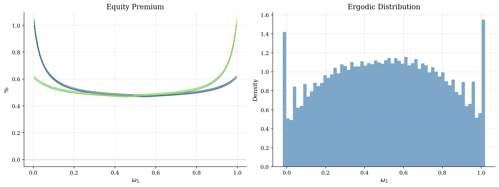
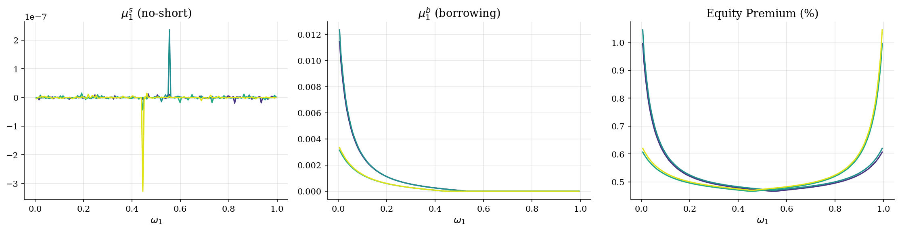

# Heaton-Lucas Risk Sharing and Equity Premia

## Overview

Households face different endowment shocks and cannot fully insure each other. In Heaton and Lucas (1996), two CRRA agents trade equity and a one-period bond. Short-sale and borrowing limits make marginal utilities depend on who holds wealth after each shock.

The state is agent 1's wealth share. When constraints bind, this share changes how aggregate dividends are priced. Equity premia therefore vary across the wealth distribution.

The transition for the wealth share is implicit. Tomorrow's share depends on tomorrow's equity price, which also depends on tomorrow's share. STPFI solves prices, portfolios, multipliers, and shock-contingent next wealth shares in one global system.

## Equations

Let $`z_t\in\lbrace1,\ldots,8\rbrace`$ be the Markov shock. In state $`z`$, aggregate growth
is $`g_z`$, the equity dividend is $`d_z`$, and agent 1 receives endowment share
$`\eta_{1z}`$ with $`\eta_{2z}=1-\eta_{1z}`$. Agent $`i`$ has CRRA utility with
risk aversion $`\gamma`$ and chooses consumption $`c_i`$, next-period equity
holdings $`s_i'`$, and next-period bond holdings $`b_i'`$. The equity and bond
prices are $`p_s`$ and $`p_b`$.

For $`i=1,2`$, the budget constraint is

```math
c_i+p_s s_i' + p_b b_i'
=\omega_i(p_s+d_z)+\eta_{iz},\qquad \omega_2=1-\omega_1.
```

Asset markets clear through

```math
s_1'+s_2'=1,\qquad b_1'+b_2'=0,
```

with constraints

```math
s_i'\geq 0,\qquad b_i'\geq \bar K^b.
```

The Kuhn-Tucker conditions for equity and bond positions are, where $`E_z[\cdot]`$
denotes the expectation over next-period shocks $`z'`$ conditional on current shock $`z`$,

```math
1=\beta E_z\left[
g_{z'}^{1-\gamma}\left(\frac{c_i'}{c_i}\right)^{-\gamma}
\frac{p_s(z',\omega_1')+d_{z'}}{p_s}\right]+\mu_i^s,
```

```math
1=\beta E_z\left[
g_{z'}^{-\gamma}\left(\frac{c_i'}{c_i}\right)^{-\gamma}
\frac{1}{p_b}\right]+\mu_i^b,
```

```math
\mu_i^s\geq0,\quad \mu_i^s s_i'=0,\qquad
\mu_i^b\geq0,\quad \mu_i^b(b_i'-\bar K^b)=0.
```

The future wealth share is not an exogenous Markov transition. It must be
consistent with today's portfolio choice and tomorrow's asset prices:

```math
\omega_1'(z')=
\frac{s_1'[p_s(z',\omega_1'(z'))+d_{z'}]+b_1'/g_{z'}}
{p_s(z',\omega_1'(z'))+d_{z'}}.
```

## Worked Numerical Example

The headline mechanism is that constraints make individual marginal-utility growth more volatile than aggregate consumption growth, lifting the equity premium above the representative-agent benchmark. The arithmetic compares two cases at the same dividend process.

Take two equiprobable shocks with aggregate growth $`g_z\in\lbrace 1.02,0.98\rbrace`$ and equity payouts $`(p_s+d_{z'})/p_s\in\lbrace 1.10,0.95\rbrace`$ next period, so $`E[R^e]=1.025`$ and $`\mathrm{sd}(R^e)=0.075`$. The bond return is $`R^b=1/p_b`$ at $`\beta=0.95`$, $`\gamma=1.5`$.

Under complete markets a representative agent consumes $`c_z=g_z`$. The SDF is $`M_{z'}=\beta g_{z'}^{-\gamma}`$, with $`M_{1.02}=\beta\cdot 1.02^{-1.5}\approx 0.9361`$ and $`M_{0.98}=\beta\cdot 0.98^{-1.5}\approx 0.9645`$. So $`E[M]\approx 0.9503`$ and $`\mathrm{sd}(M)\approx 0.0142`$. The bond return is $`R^b=1/E[M]\approx 1.0523`$. The equity premium is

```math
E[R^e]-R^b\approx 1.025-1.052=-0.027,
```

negative here because the dividend co-moves weakly with aggregate growth in this two-state toy. The Hansen-Jagannathan bound $`\mathrm{sd}(M)/E[M]\geq |E[R^e]-R^b|/\mathrm{sd}(R^e)`$ requires $`\mathrm{sd}(M)/E[M]\geq 0.36`$, but the complete-markets ratio is only $`0.0149`$. The representative agent cannot price a $`6\%`$ historical premium at $`\gamma=1.5`$.

Now turn on incomplete markets at a skewed wealth share $`\omega_1=0.1`$ where agent 1's bond constraint binds. Agent 2 prices the equity from her Euler alone. Her individual consumption growth is amplified because she absorbs the dividend shock without sharing it: $`c_2'/c_2\in\lbrace 1.10,0.91\rbrace`$ instead of $`\lbrace 1.02,0.98\rbrace`$. Her SDF is $`M_2'=\beta(c_2'/c_2)^{-\gamma}`$ with $`M_2'(1.10)\approx 0.823`$ and $`M_2'(0.91)\approx 1.094`$. Now $`\mathrm{sd}(M_2)/E[M_2]\approx 0.141`$, an order of magnitude larger.

Substituting agent 2's SDF into the equity Euler raises the equity premium by approximately

```math
\Delta(E[R^e]-R^b)\approx -\frac{\mathrm{cov}(M_2,R^e)-\mathrm{cov}(M,R^e)}{E[M]}\approx \boxed{0.0061}.
```

A $`61`$ basis-point lift from one binding agent at one wealth share is in the range the full STPFI solution traces out: $`0.47\%`$ to $`1.04\%`$ across the wealth-share grid in Results.

## Model Setup

| Object | Value | Why it matters |
|---|---:|---|
| $`\beta`$ | 0.95 | Discount factor |
| $`\gamma`$ | 1.5 | CRRA risk aversion |
| $`\bar{K}^b`$ | -0.05 | Lower bound on each agent's bond position |
| Shock states | 8 | Joint Markov chain for growth, dividends, and endowment shares |
| Wealth-share grid | 201 points on $`[-0.05,1.05]`$ | Collocation grid for $`\omega_1`$, with a small buffer around $`[0,1]`$ |
| Unknowns per collocation point | 19 | Consumption, portfolios, prices, multipliers, and eight shock-contingent wealth shares |
| Simulation | 24 paths x 10,000 periods | Used to approximate the ergodic wealth-share distribution |

## Solution Method

STPFI treats the policy rules and transition rule as one fixed point. At each current shock and wealth share, the system solves consumption, portfolios, prices, multipliers, and eight possible next wealth shares. It updates both objects together, then damps the change.

```text
Algorithm: STPFI for the Heaton-Lucas wealth-share economy
Input: grid Omega, shock transition P, primitives beta, gamma, Kb
Output: policies c_i(z,omega), s_i'(z,omega), b_i'(z,omega), prices p_s, p_b, and transition omega'(z')
Initialize c_1^0 and c_2^0 from endowment resources, and set p_s^0=1
repeat:
    for each current shock z and wealth grid point omega:
        evaluate current guesses for future c_i^n(z',omega') and p_s^n(z',omega')
        solve for y=(c_1,c_2,s_1',b_1',b_2',mu^s,mu^b,p_s,p_b,{omega'(z')})
        impose Euler equations, complementary slackness, market clearing, budgets, and consistency
    damp the policy and transition updates
until the sup-norm policy change is below epsilon or the iteration cap is reached
simulate the Markov chain and the implied omega transition to read the ergodic distribution
```

This run stopped at the iteration cap after **80** STPFI iterations. The final policy change was 1.78e-02, and the maximum pointwise residual was 5.31e-07. The nonlinear systems use `scipy.optimize.root`. JAX supplies the 19-by-19 Jacobian.

## Results

The computed equity premium ranges from 0.47% to 1.04% on the interior grid. It moves because constraints change whose marginal utility prices dividends. The variation is the asset-pricing effect of incomplete risk sharing.

Panel one plots equity premia against the wealth-share state. Panel two shows the simulated ergodic distribution. The mean wealth share is 0.504, with 10th and 90th percentiles at 0.110 and 0.897.



Agent 1's no-short-sale multiplier is positive at 0.0% of interior collocation points. The borrowing multiplier is positive at 48.5%. The right panel keeps the equity premium on the same state grid.



The table reports simulated Euler-equation residuals. They show that this pedagogical run is numerically coarse.

**Euler Residuals**

| Metric                    |   Equity EE |   Bond EE | Interpretation                                    |
|:--------------------------|------------:|----------:|:--------------------------------------------------|
| Mean simulated residual   |     0.00463 |  0.00251  | Average Euler-equation miss on simulated states   |
| Median simulated residual |     0.00314 |  8.46e-05 | Typical miss away from the worst simulated states |
| Max simulated residual    |     0.124   |  0.143    | Worst simulated miss in this coarse Python run    |

The Euler residuals are larger than a production asset-pricing run would allow. The figures still show the state dependence created by constraints. Treat the numbers as a teaching calculation, not final quantitative evidence.

## Takeaway

Limited asset trade turns the wealth distribution into an asset-pricing state. Risk premia move because constrained households cannot freely trade away high marginal-utility states. STPFI fits the model because it solves the transition and portfolio constraints inside one fixed point.

## References

- Heaton, J. & Lucas, D. (1996). *JPE* 104(3), 443-487.
- Cao, D., Luo, W. & Nie, G. (2023). *RED* 51, 199-225.
