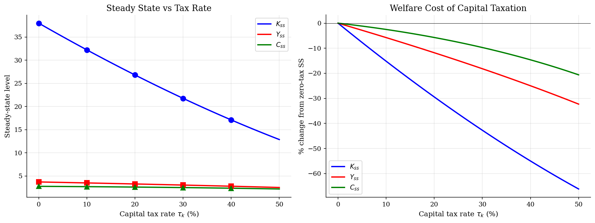
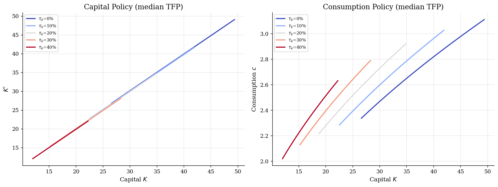
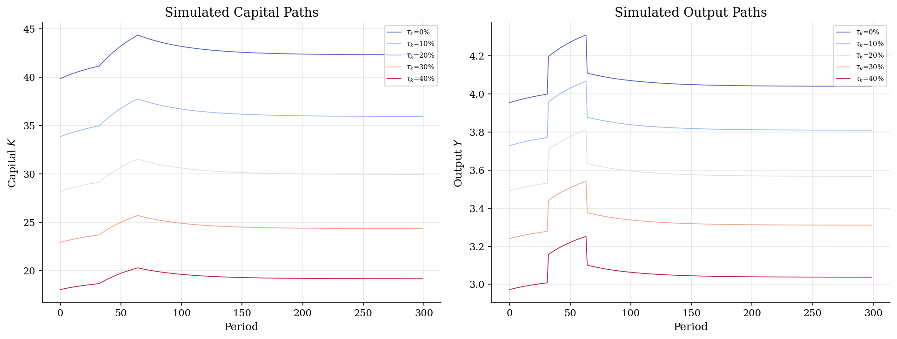
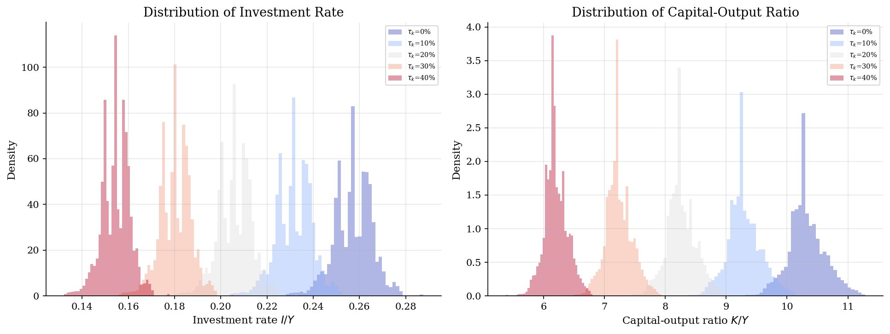

# RBC with Capital Taxation

> How capital income taxes distort investment, steady-state capital, and business cycle dynamics.

## Overview

This model extends the standard RBC framework with a capital income tax $\tau_k$. The government taxes the return on capital at rate $\tau_k$ and returns the revenue as a lump-sum transfer. Even though the transfer makes the tax revenue-neutral, the tax wedge distorts the intertemporal margin: the after-tax return on saving is $(1-\tau_k) r$, reducing the incentive to accumulate capital.

We solve globally for five tax rates (0% to 40%) and compare the resulting steady states, policy functions, and business cycle dynamics.

## Equations

$$V(K, z) = \max_{c, K'} \left\{ u(c) + \beta \, \mathbb{E}\left[V(K', z')\right] \right\}$$

**Budget constraint (with lump-sum rebate):**
$$c + K' = z K^\alpha + (1-\delta) K$$

**Euler equation (after-tax):**
$$c^{-\sigma} = \beta \, \mathbb{E}\left[ c'^{-\sigma} \left((1-\tau_k) \alpha z' K'^{\alpha-1} + 1 - \delta\right) \right]$$

**Steady state capital:**
$$K_{ss}(\tau_k) = \left(\frac{(1-\tau_k)\alpha}{1/\beta - 1 + \delta}\right)^{\frac{1}{1-\alpha}}$$

## Model Setup

| Parameter | Value | Description |
|-----------|-------|-------------|
| $\beta$  | 0.99 | Discount factor |
| $\alpha$ | 0.36 | Capital share |
| $\sigma$ | 2.0 | CRRA coefficient |
| $\delta$ | 0.025 | Depreciation rate |
| $\rho$   | 0.95 | TFP persistence |
| $\sigma_\varepsilon$ | 0.01 | TFP innovation std |
| $\tau_k$ | [0.0, 0.1, 0.2, 0.3, 0.4] | Tax rates compared |

## Solution Method

**Value Function Iteration** followed by **Euler equation refinement**. For each tax rate, we first solve the planner's VFI on a 40x5 grid, then refine the consumption policy using the after-tax Euler equation with the correct tax wedge on the marginal product of capital.

The tax does not change the budget set (due to lump-sum rebate) but alters the first-order condition, driving a wedge between the marginal rate of substitution and the marginal rate of transformation.

## Results

A 30% capital tax reduces steady-state capital by 42.7% and steady-state output by 18.2% relative to the no-tax benchmark. The consumption loss is smaller (9.7%) because reduced capital also means less depreciation.

Higher taxes shift the entire capital policy function downward: for any given state, the agent chooses less capital accumulation because the after-tax return is lower. This creates a permanently lower capital stock and output level.


*Steady-state levels and percentage losses as a function of the capital tax rate*


*Policy functions at median TFP for different capital tax rates*


*Simulated capital and output paths under different tax rates*


*Distribution of investment rate and capital-output ratio across tax regimes*

**Steady State and Simulation Statistics by Tax Rate**

| Tax rate   |    K_ss |   Y_ss |   C_ss |   K_ss / K_ss(0) |   Mean K (sim) |   std(Y) % |
|:-----------|--------:|-------:|-------:|-----------------:|---------------:|-----------:|
| 0%         | 37.9893 | 3.7041 | 2.7543 |            1     |        38.974  |      6.665 |
| 10%        | 32.2229 | 3.4909 | 2.6853 |            0.848 |        33.076  |      6.714 |
| 20%        | 26.8064 | 3.2671 | 2.597  |            0.706 |        27.532  |      6.767 |
| 30%        | 21.7584 | 3.0307 | 2.4868 |            0.573 |        22.3595 |      6.823 |
| 40%        | 17.101  | 2.779  | 2.3515 |            0.45  |        17.5845 |      6.881 |

## Economic Takeaway

Capital taxation has powerful long-run effects through the accumulation channel:

1. **Steady-state distortion**: The tax-adjusted Euler equation $K_{ss}(\tau) \propto (1-\tau)^{1/(1-\alpha)}$ shows capital falls more than proportionally with the tax rate due to the capital share amplification.

2. **Laffer curve in levels**: While tax revenue rises initially, the eroding base means that very high capital taxes can actually reduce total revenue.

3. **Business cycle interaction**: Higher taxes reduce the investment-output ratio, making consumption a larger share of output. This can reduce output volatility (consumption is smoother than investment) but increase welfare costs of fluctuations.

4. **Dynamic inefficiency**: The capital tax drives a wedge between the social and private return on capital, causing the economy to underaccumulate capital relative to the optimum.

## Reproduce

```bash
python run.py
```

## References

- Chamley, C. (1986). *Optimal Taxation of Capital Income in General Equilibrium*. Econometrica.
- Judd, K. (1985). *Redistributive Taxation in a Simple Perfect Foresight Model*. JPE.
- Cao, D., Luo, W., and Nie, G. (2023). *Global DSGE Models*. Review of Economic Dynamics.
- Cole, H. and Obstfeld, M. (1991). *Commodity Trade and International Risk Sharing*. JME.
