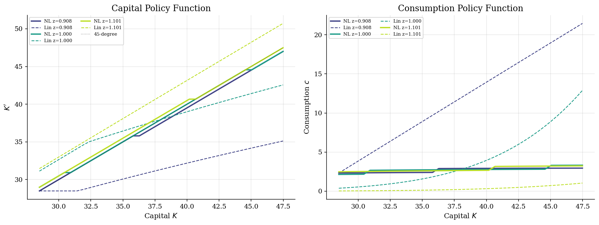
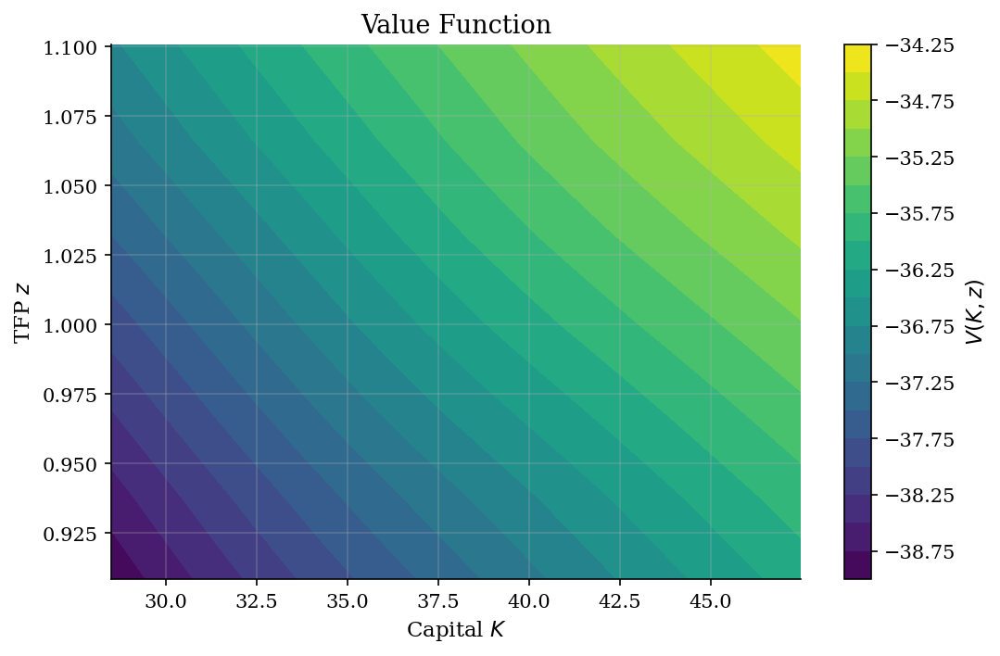
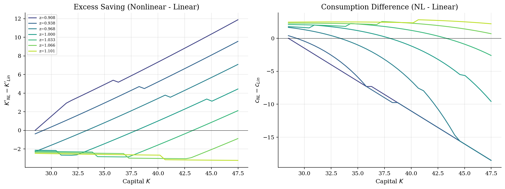
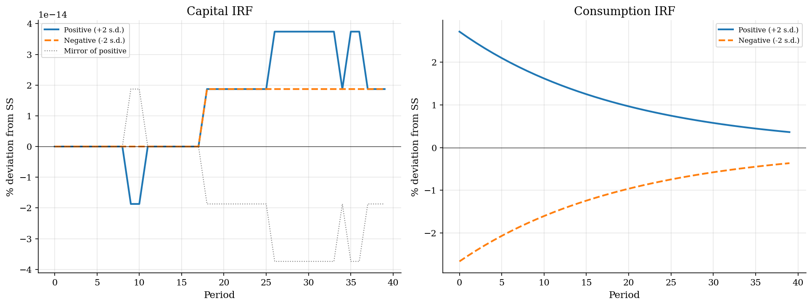
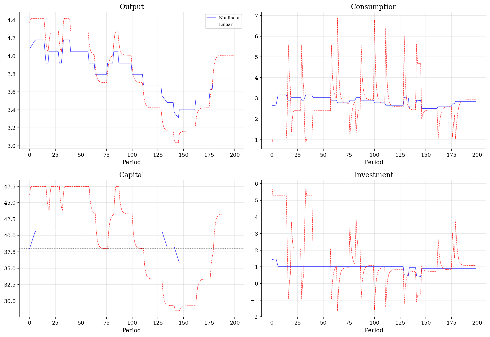

# RBC Model: Global Nonlinear Solution

> Standard RBC solved globally via VFI on a 2D grid, compared to log-linearized perturbation.

## Overview

The Real Business Cycle (RBC) model is the workhorse of modern macroeconomics. We solve it globally using value function iteration on a tensor-product grid over capital and TFP, avoiding the approximation errors inherent in log-linearization.

Global methods capture nonlinear effects that perturbation methods miss: precautionary savings (agents save more due to uncertainty), asymmetric responses to positive vs negative shocks, and risk premia.

## Equations

$$V(K, z) = \max_{c, K'} \left\{ \frac{c^{1-\sigma}}{1-\sigma} + \beta \, \mathbb{E}\left[V(K', z')\right] \right\}$$

subject to:
$$c + K' = z K^\alpha + (1-\delta) K$$
$$\ln z' = \rho \ln z + \sigma_\varepsilon \epsilon', \quad \epsilon' \sim N(0,1)$$

**Euler equation:**
$$c^{-\sigma} = \beta \, \mathbb{E}\left[ c'^{-\sigma} \left(\alpha z' K'^{\alpha-1} + 1 - \delta\right) \right]$$

## Model Setup

| Parameter | Value | Description |
|-----------|-------|-------------|
| $\beta$  | 0.99 | Discount factor |
| $\alpha$ | 0.36 | Capital share |
| $\sigma$ | 2.0 | CRRA coefficient |
| $\delta$ | 0.025 | Depreciation rate |
| $\rho$   | 0.95 | TFP persistence |
| $\sigma_\varepsilon$ | 0.01 | TFP innovation std |
| Capital grid | 40 points on [28.49, 47.49] | |
| TFP grid | 7 points (Tauchen) | |
| $K_{ss}$ | 37.9893 | Steady-state capital |

## Solution Method

**Value Function Iteration (VFI)** on a tensor-product grid with discrete maximization over the capital grid. The TFP process is discretized using the Tauchen method. Continuation values are computed by taking expectations over the Markov transition matrix.

Converged in **49 iterations** (error = 9.33e-07).

For comparison, we also compute the log-linearized solution using the method of undetermined coefficients around the deterministic steady state.

## Results

**Precautionary savings:** The nonlinear solution predicts mean capital of 37.9030 vs steady state 37.9893, an excess of -0.0863 (-0.23%). Agents save more because marginal utility is convex ($\sigma > 1$), making downside risk costly.

**Asymmetric responses:** Negative TFP shocks produce larger capital declines than positive shocks produce capital increases, reflecting the concavity of the value function in capital.


*Policy functions: nonlinear VFI (solid) vs log-linear (dashed) at low, median, and high TFP*


*Value function over the (K, z) state space*


*Nonlinear minus linearized policy: positive K' difference shows precautionary savings*


*Asymmetric impulse responses to positive vs negative TFP shocks (nonlinear effects)*


*Simulated paths: nonlinear (blue) vs linearized (red dashed)*

**Business Cycle Statistics (5000 periods, burn-in 500)**

| Method          |   std(Y) % |   std(C)/std(Y) |   std(I)/std(Y) |   corr(C,Y) |   corr(I,Y) |   mean(K) |
|:----------------|-----------:|----------------:|----------------:|------------:|------------:|----------:|
| Nonlinear (VFI) |      4.463 |           1.145 |           2.246 |       0.856 |       0.493 |   37.903  |
| Log-linear      |      8.511 |           4.271 |          86.333 |      -0.143 |       0.23  |   38.3186 |

## Economic Takeaway

Global nonlinear methods reveal features that log-linearization misses:

1. **Precautionary savings**: With CRRA utility ($\sigma > 1$), uncertainty raises the expected marginal utility of consumption, causing agents to save more than the certainty-equivalent prediction.

2. **Asymmetric business cycles**: Recessions are sharper and more persistent than expansions because the concavity of the production function amplifies negative shocks.

3. **Accuracy at extremes**: Log-linearization performs well near steady state but diverges at the boundaries of the state space, precisely where the nonlinear effects are most important for welfare.

## Reproduce

```bash
python run.py
```

## References

- Cooley, T. and Prescott, E. (1995). *Economic Growth and Business Cycles*. In Frontiers of Business Cycle Research.
- Cao, D., Luo, W., and Nie, G. (2023). *Global DSGE Models*. Review of Economic Dynamics.
- Aruoba, S.B., Fernandez-Villaverde, J., and Rubio-Ramirez, J. (2006). *Comparing Solution Methods for Dynamic Equilibrium Economies*. JED.
