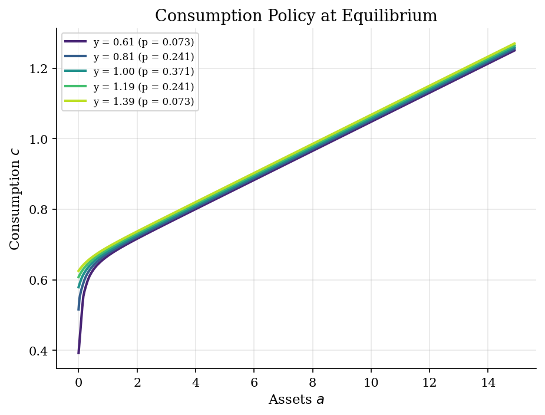
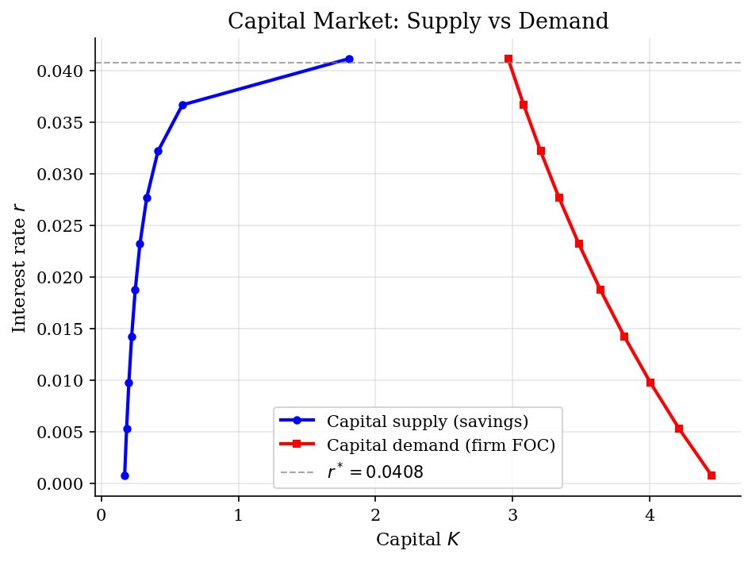
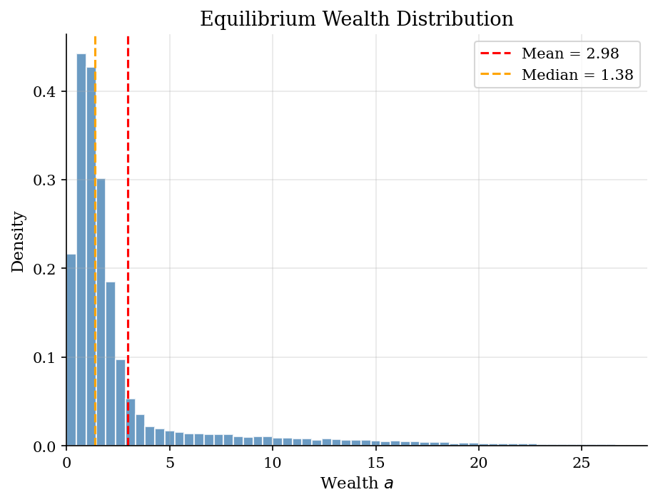
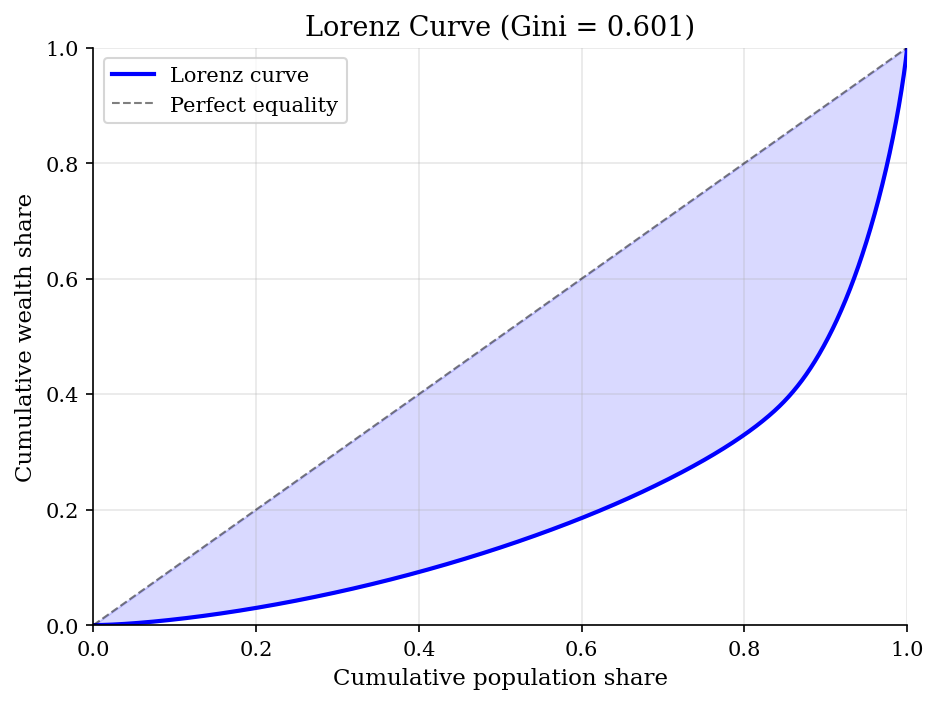

# EGP-Aiyagari Model

> Aiyagari (1994) general equilibrium with Endogenous Grid Points for the household problem.

## Overview

The Aiyagari model is the workhorse framework for studying how idiosyncratic income risk and incomplete markets shape the wealth distribution and aggregate capital accumulation in general equilibrium.

Households face uninsurable IID income shocks and self-insure by accumulating a risk-free asset (capital). A representative firm rents capital and labor in competitive factor markets. The equilibrium interest rate clears the capital market: aggregate household savings must equal the firm's capital demand.

We solve the household problem using the Endogenous Grid Points (EGP) method, which is dramatically faster than VFI because it avoids root-finding. This speed advantage is critical in the GE loop, where the household problem must be solved many times at different interest rates.

## Equations

**Household problem:**
$$V(a, y) = \max_{c, a'} \left\{ u(c) + \beta \, \mathbb{E}[V(a', y')] \right\}$$
$$\text{s.t.} \quad c + a' = (1+r)a + wy, \quad a' \ge 0$$

**EGP Euler equation inversion:**
$$u'(c_t) = \beta (1+r) \, \mathbb{E}[u'(c_{t+1})]$$
$$c_t = (u')^{-1}\left(\beta (1+r) \, \mathbb{E}[u'(c_{t+1})]\right)$$
$$a_t = \frac{c_t + a_{t+1} - wy}{1+r} \quad \text{(endogenous grid)}$$

**Firm problem:**
$$r = \alpha K^{\alpha-1} L^{1-\alpha} - \delta, \qquad w = (1-\alpha) K^{\alpha} L^{-\alpha}$$

**Capital market clearing:**
$$\int a \, d\mu(a, y) = K$$

## Model Setup

| Parameter | Value | Description |
|-----------|-------|-------------|
| $\beta$  | 0.96 | Discount factor |
| $\sigma$ | 2 | CRRA risk aversion |
| $\alpha$ | 0.36 | Capital share |
| $\delta$ | 0.08 | Depreciation rate |
| $\mu_y$  | 1.0 | Mean income |
| $\sigma_y$ | 0.2 | Std dev of income |
| Income states | 5 | IID normal discretization |
| Asset grid | 100 points | $a \in [0.0, 50.0]$ |

## Solution Method

**Two-loop structure:**

1. **Outer loop (K/L ratio iteration):** Starting from an initial guess for the capital-labor ratio, compute prices ($r$, $w$), solve the household problem, simulate the economy, and update the K/L ratio with dampening toward the simulated aggregate.

2. **Inner loop (EGP):** For given prices, iterate on the Euler equation using the endogenous grid points method. Instead of searching for optimal savings at each grid point (as in VFI), EGP inverts the Euler equation to find the *current* assets that rationalize each *future* asset choice. This avoids root-finding entirely.

The inner EGP loop converged in **11 iterations**. The outer K/L iteration converged in **49 iterations** (tolerance = 1e-04).

## Results


*Consumption policy functions at equilibrium for each income state*


*Capital supply (household savings) and demand (firm FOC) as functions of r*


*Stationary wealth distribution in equilibrium*


*Lorenz curve for wealth distribution (Gini = 0.601)*

**Equilibrium Statistics**

| Statistic                |     Value |
|:-------------------------|----------:|
| Interest rate r          |  0.040776 |
| Wage w                   |  1.183    |
| Aggregate capital K      |  2.9758   |
| Output Y                 |  0.9984   |
| Capital-output ratio K/Y |  2.9807   |
| Wealth Gini              |  0.6006   |
| Mean MPC (windfall)      |  0.0587   |
| Fraction constrained     |  0.0018   |
| 10th percentile wealth   |  0.4678   |
| 50th percentile wealth   |  1.3835   |
| 90th percentile wealth   |  7.845    |
| 99th percentile wealth   | 24.3085   |

## Economic Takeaway

The Aiyagari model demonstrates how precautionary savings demand from uninsurable income risk drives the equilibrium interest rate below the rate of time preference ($r^* < 1/\beta - 1$).

**Key insights:**
- Households over-accumulate assets as a buffer against bad income shocks. This *precautionary savings motive* pushes the capital stock above the representative-agent level and the interest rate below $1/\beta - 1$.
- The wealth distribution is right-skewed and exhibits a Gini coefficient of 0.601. The borrowing constraint binds for 0.2% of households.
- The EGP method makes the GE loop feasible: each inner solve takes only 11 Euler-equation iterations (vs. hundreds with VFI), enabling rapid iteration over the capital-labor ratio.
- The mean MPC out of a small windfall is 0.059, reflecting the heterogeneity in marginal propensities to consume across the wealth distribution.

## Reproduce

```bash
python run.py
```

## References

- Aiyagari, S. R. (1994). "Uninsured Idiosyncratic Risk and Aggregate Saving." *Quarterly Journal of Economics*, 109(3), 659-684.
- Carroll, C. D. (2006). "The Method of Endogenous Gridpoints for Solving Dynamic Stochastic Optimization Problems." *Economics Letters*, 91(3), 312-320.
- Kaplan, G. (2017). Lecture notes on heterogeneous agent macroeconomics.
