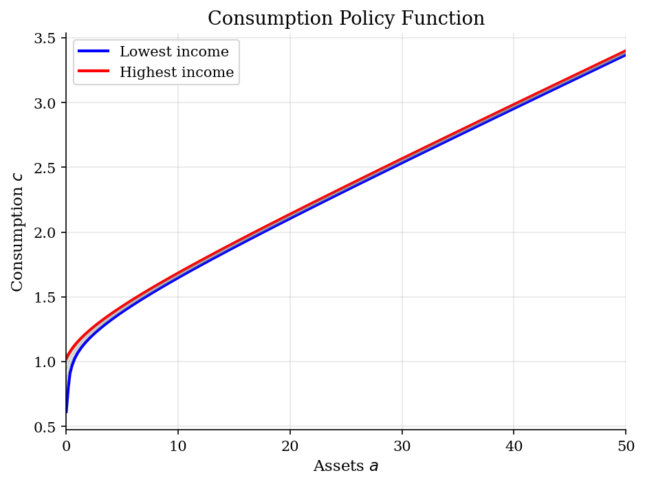
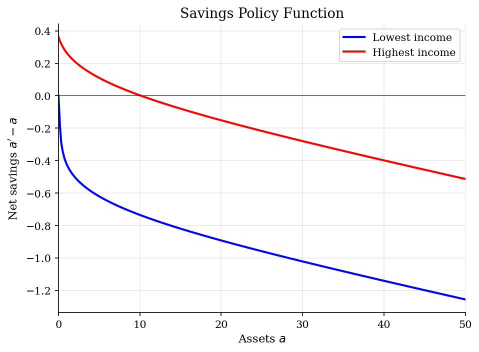
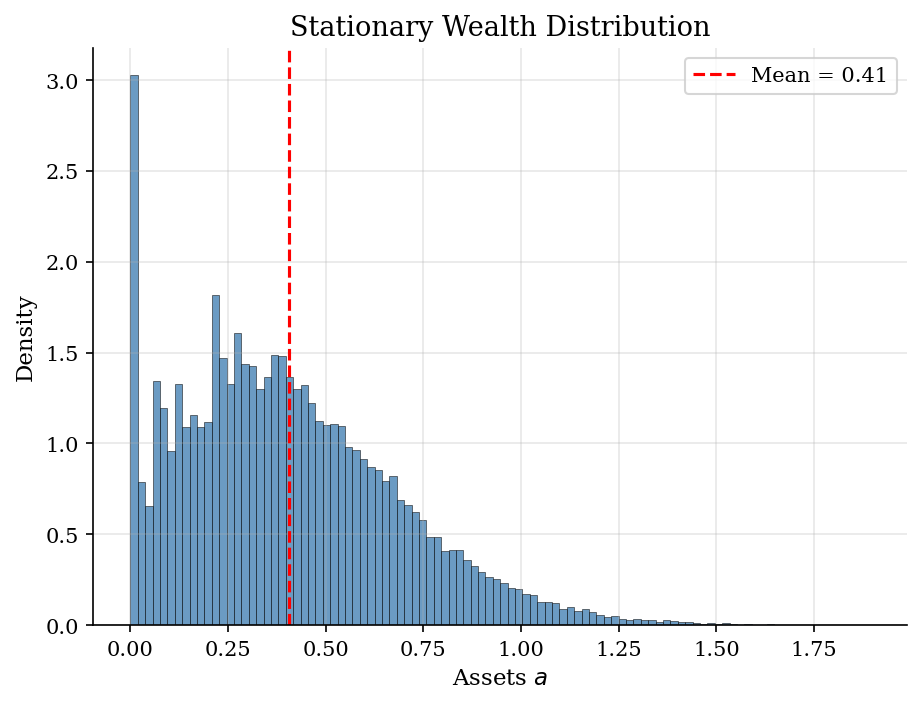
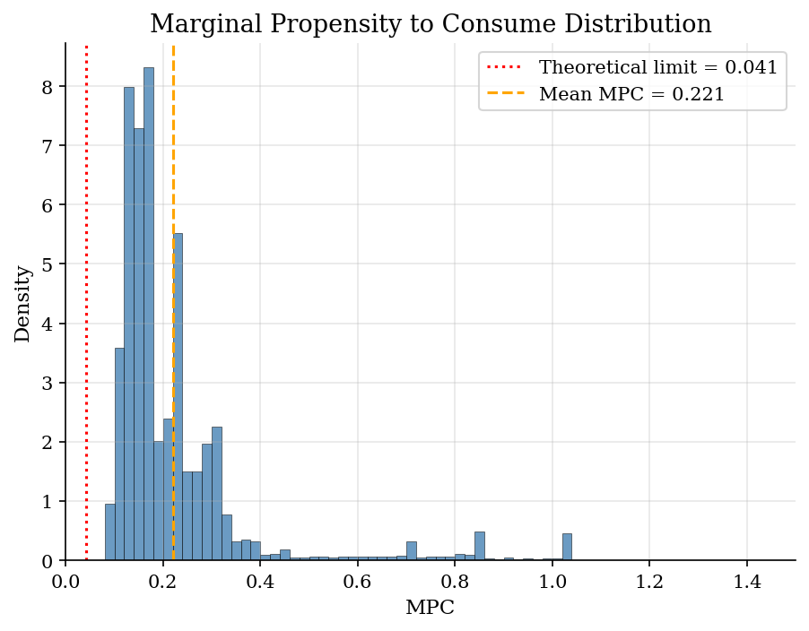

# Endogenous Grid Points (EGP) with IID Income

> Carroll's (2006) endogenous grid points method for solving the standard incomplete-markets consumption-savings problem.

## Overview

The Endogenous Grid Points (EGP) method solves the household savings problem under income uncertainty using a computational trick that eliminates the expensive inner maximization of standard VFI. Instead of searching for optimal consumption at each asset grid point, EGP inverts the Euler equation: given a grid on *savings* $a'$, it computes the *implied* current assets $a$ that are consistent with choosing that level of savings.

This is a partial-equilibrium model: the interest rate $r$ is exogenous. Agents face IID income risk, cannot borrow, and self-insure through precautionary savings.

## Equations

$$V(a, y) = \max_{c \ge 0} \left\{ u(c) + \beta \, \mathbb{E}\left[ V(a', y') \right] \right\}$$

subject to: $c + a' = Ra + y$, $\quad a' \ge 0$, $\quad y \sim F(y)$ IID.

**Euler equation:** $u'(c) = \beta R \, \mathbb{E}\left[ u'(c'(a', y')) \right]$ (with equality when $a' > 0$).

**EGP insight:** Fix a grid $\{a'_j\}$. For each $a'_j$:
1. Compute RHS: $\mu_j = \beta R \sum_{k} u'(c(a'_j, y_k)) \pi_k$
2. Invert: $c_j = (u')^{-1}(\mu_j)$
3. Recover implied assets: $a_j = (c_j + a'_j - y) / R$

This gives pairs $(a_j, a'_j)$ — the **endogenous grid** — from which we interpolate the savings policy on the original exogenous grid.

## Model Setup

| Parameter | Value | Description |
|-----------|-------|-------------|
| $\gamma$ | 2 | CRRA risk aversion |
| $\beta$  | 0.95 | Discount factor |
| $r$      | 0.03 | Interest rate |
| $\mu_y$  | 1.0 | Mean income |
| $\sigma_y$ | 0.2 | Std dev of income |
| $n_y$    | 5 | Income grid points |
| $n_a$    | 50 | Asset grid points |
| $a_{\max}$ | 50 | Maximum assets |
| $N_{sim}$ | 50,000 | Simulated agents |
| $T_{sim}$ | 500 | Simulation periods |

## Solution Method

**Endogenous Grid Points (Carroll, 2006):** Instead of iterating on the value function with an inner maximization, EGP iterates on the *Euler equation*. At each iteration:

1. Compute expected marginal utility $\mathbb{E}[u'(c')]$ using the current consumption function and the IID income distribution.
2. Apply the Euler equation to get today's consumption: $c = (u')^{-1}(\beta R \, \mathbb{E}[u'(c')])$.
3. Use the budget constraint to find the **implied** current assets: $a = (c + a' - y)/R$.
4. Interpolate from the endogenous grid $(a, a')$ back to the exogenous grid.

This avoids all root-finding and grid search in the inner loop, making EGP significantly faster than VFI — typically by an order of magnitude.

Converged in **151 iterations** (tolerance = 1e-06).

## Results


*Consumption policy by income state: higher income shifts the policy up*


*Net savings (a'-a) by income state: low-income agents dissave, high-income agents accumulate*


*Simulated stationary wealth distribution with right skew and mass at the constraint*


*MPC distribution: constrained agents have MPC near 1, wealthy agents approach the theoretical limit*

**Summary Statistics from Simulated Stationary Distribution**

| Statistic                    | Value   |
|:-----------------------------|:--------|
| Mean assets                  | 0.406   |
| Mean consumption             | 1.013   |
| Gini coefficient (wealth)    | 0.381   |
| Average MPC (large transfer) | 0.221   |
| Average MPC (small transfer) | 0.244   |
| Fraction constrained         | 3.1%    |
| Theoretical MPC limit        | 0.0413  |

## Economic Takeaway

The EGP method demonstrates that clever reformulation of the optimality conditions can yield dramatic computational gains without any approximation error. By inverting the Euler equation, we avoid the costly inner maximization of standard VFI.

**Key insights:**
- **Speed:** EGP converges in the same number of iterations as VFI but each iteration is much cheaper — no root-finding or grid search over consumption.
- **Precautionary savings:** Under income uncertainty, agents accumulate a buffer stock of wealth even though $\beta R < 1$. The borrowing constraint and prudence motive (convex marginal utility) drive this behavior.
- **Wealth inequality:** The stationary distribution is right-skewed with a mass point at the borrowing constraint. Constrained agents have MPC near 1, while wealthy agents have MPC near the theoretical lower bound $R(\beta R)^{-1/\gamma} - 1 \approx 0.041$.
- **MPC heterogeneity:** The average MPC is well above the representative-agent benchmark, driven by the large fraction of constrained or near-constrained households. This has important implications for fiscal policy: transfers are more stimulative when targeted at low-wealth households.

## Reproduce

```bash
python run.py
```

## References

- Carroll, C. D. (2006). "The Method of Endogenous Gridpoints for Solving Dynamic Stochastic Optimization Problems." *Economics Letters*, 91(3), 312-320.
- Deaton, A. (1991). "Saving and Liquidity Constraints." *Econometrica*, 59(5), 1221-1248.
- Carroll, C. D. (1997). "Buffer-Stock Saving and the Life Cycle/Permanent Income Hypothesis." *Quarterly Journal of Economics*, 112(1), 1-55.
- Kaplan, G. and Violante, G. L. (2022). "The Marginal Propensity to Consume in Heterogeneous Agent Models." *Annual Review of Economics*, 14, 747-775.
