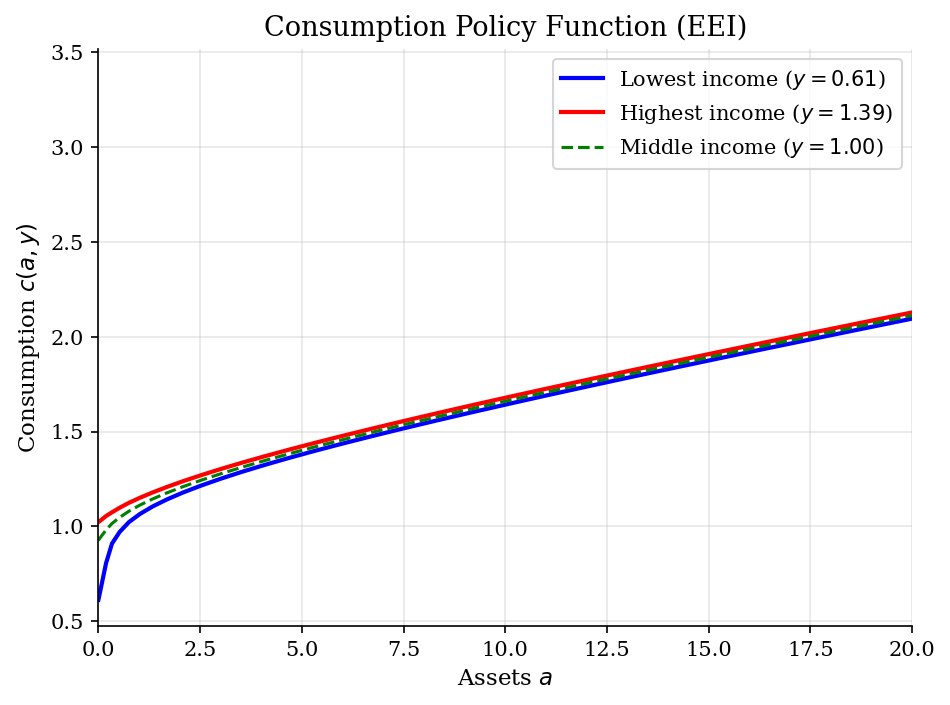
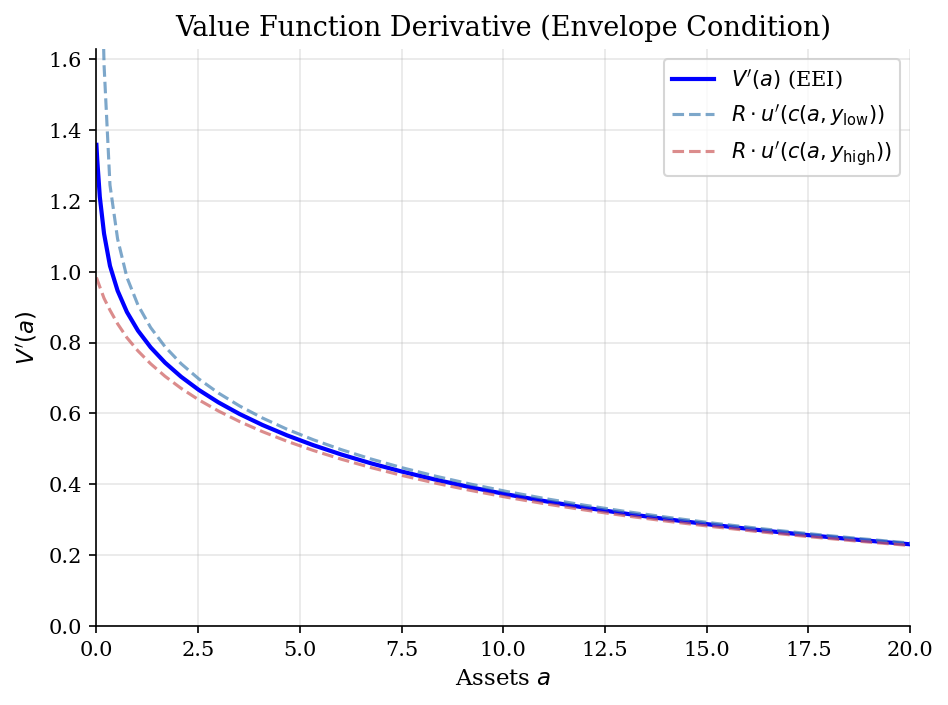
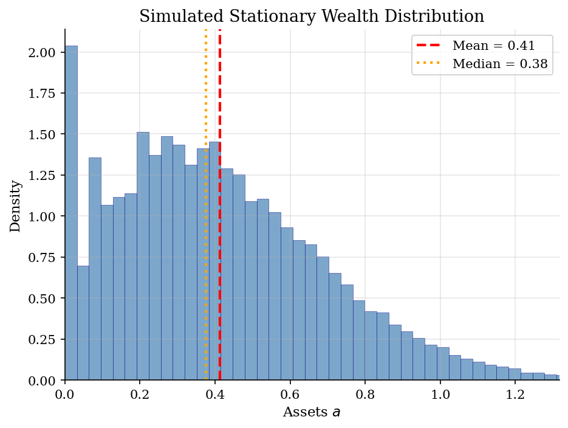
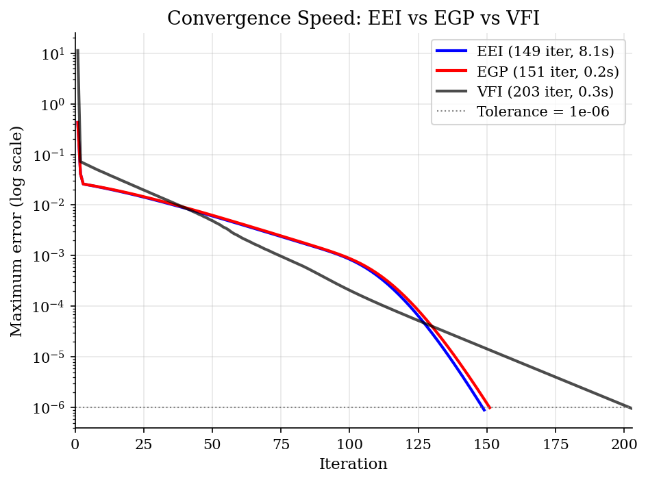

# Envelope Equation Iteration (EEI)

> Solving the income-fluctuation problem by iterating on the envelope condition V'(a) = R * u'(c*(a)).

## Overview

The envelope equation iteration (EEI) method solves the standard heterogeneous-agent consumption-savings problem by exploiting the **envelope theorem**. Rather than iterating on the value function $V(a)$ as in VFI, or inverting the Euler equation onto an endogenous grid as in EGP, EEI iterates directly on the derivative $V'(a)$ using the envelope condition.

The key insight is that the envelope theorem links the value function derivative to the policy function: $V'(a) = R \cdot u'(c^*(a,y))$ averaged over income states. This, combined with the Euler equation, gives a complete characterization of the optimal policy without ever computing $V(a)$ itself. The method avoids both the costly inner maximization of VFI and the grid inversion of EGP.

## Equations

**Household problem (IID income):**

$$V(a) = \mathbb{E}_y \left[ \max_{a' \ge \underline{a}} \left\{ u(Ra + y - a') + \beta \, V(a') \right\} \right]$$

**Envelope condition (the key equation):**

$$V'(a) = R \cdot \mathbb{E}_y\left[ u'(c^*(a, y)) \right]$$

This follows from the envelope theorem applied to the Bellman equation: differentiating
through the max, the optimal choice satisfies $V'(a) = \partial u / \partial a = R \cdot u'(c)$.

**Euler equation (first-order condition):**

$$u'(c^*(a, y)) = \beta \, V'(a'), \quad a' = Ra + y - c$$

with complementary slackness at the borrowing constraint $a' \ge \underline{a}$.

**EEI algorithm:** Given a guess $V'_n(a)$:
1. For each $(a, y)$: find $c$ satisfying $u'(c) = \beta \, V'_n(Ra + y - c)$ (or set $a' = \underline{a}$ if constrained)
2. Update: $V'_{n+1}(a) = R \cdot \mathbb{E}_y[u'(c^*(a, y))]$
3. Repeat until $\|V'_{n+1} - V'_n\|_\infty < \varepsilon$

**CRRA utility:** $u(c) = \frac{c^{1-\sigma}}{1-\sigma}$, $\quad u'(c) = c^{-\sigma}$

## Model Setup

| Parameter | Value | Description |
|-----------|-------|-------------|
| $\beta$  | 0.95 | Discount factor |
| $\sigma$ | 2 | CRRA risk aversion |
| $r$      | 0.03 | Interest rate |
| $R = 1+r$ | 1.03 | Gross return |
| $\mu_y$  | 1.0 | Mean income |
| $\sigma_y$ | 0.2 | Income std dev |
| Income states | 5 | Discretized normal |
| Asset grid | 50 points | Power-spaced on $[0.0, 50]$ |
| $\underline{a}$ | 0.0 | Borrowing limit |

## Solution Method

**Envelope Equation Iteration (EEI):** We iterate on the derivative of the value function $V'(a)$ rather than on $V(a)$ itself.

At each iteration:
1. Given $V'_n(a)$ on the asset grid, for each state $(a, y)$ we solve the Euler equation $u'(c) = \beta \cdot V'_n(R a + y - c)$ for $c$, checking whether the borrowing constraint $a' \ge \underline{a}$ binds.
2. Update the derivative using the envelope condition: $V'_{n+1}(a) = R \cdot \mathbb{E}_y[u'(c^*(a, y))]$.
3. Check convergence: $\|V'_{n+1} - V'_n\|_\infty < 10^{-6}$.

**EEI** converged in **149 iterations** (8.07s).

For comparison, we also solve the same problem with:
- **VFI** (grid search): 203 iterations (0.30s)
- **EGP** (endogenous grid points): 151 iterations (0.15s)

All three methods converge to the same policy function, but differ in computational cost per iteration and total iterations to convergence.

## Results


*Consumption policy function c(a,y) from EEI for different income states*


*Value function derivative V'(a) from the envelope condition, with R*u'(c) for extreme income states*


*Simulated stationary wealth distribution from 50,000 agents over 500 periods*


*Convergence comparison across three solution methods for the same problem*

**Solution Statistics: EEI vs VFI vs EGP**

| Statistic                    |      EEI | VFI   | EGP   |
|:-----------------------------|---------:|:------|:------|
| Iterations to converge       | 149      | 203   | 151   |
| Wall-clock time (s)          |   8.07   | 0.30  | 0.15  |
| Mean assets (rel. to income) |   0.4118 | ---   | ---   |
| Fraction constrained (%)     |   3.1    | ---   | ---   |
| Mean MPC                     |   0.2184 | ---   | ---   |
| Theoretical MPC limit        |   0.0413 | ---   | ---   |
| 10th percentile wealth       |   0.074  | ---   | ---   |
| 50th percentile wealth       |   0.376  | ---   | ---   |
| 90th percentile wealth       |   0.793  | ---   | ---   |

## Economic Takeaway

The envelope equation iteration method demonstrates that the same economic problem — a household choosing consumption and savings under income uncertainty and borrowing constraints — can be attacked from multiple computational angles.

**Key insights:**
- **Three views of the same optimality condition:** VFI iterates on $V(a)$, EGP iterates on $c(a)$ via the inverted Euler equation on an endogenous grid, and EEI iterates on $V'(a)$ via the envelope theorem. All converge to the same policy function.
- **The envelope theorem is powerful:** $V'(a) = R \cdot u'(c^*(a))$ links the value function derivative directly to the policy function, bypassing the need to compute $V$ itself. This is the same envelope theorem that underlies the Euler equation derivation, but used as a computational device.
- **Speed-accuracy tradeoffs:** EGP is typically fastest because it avoids nonlinear equation solving entirely. EEI requires solving the Euler equation at each grid point (like Euler equation iteration), but updates via the envelope condition. VFI with grid search is slowest per iteration and requires many more iterations due to the contraction rate $\beta$.
- **Precautionary savings motive:** Mean assets are 0.41 times mean income, driven by the buffer-stock motive under IID income risk. About 3.1% of agents are at the borrowing constraint.
- **MPCs are heterogeneous:** The mean MPC is 0.218, well above the theoretical lower bound of 0.041 for a patient unconstrained agent. Constrained and low-wealth agents have MPCs near 1, while wealthy agents approach the lower bound.

## Reproduce

```bash
python run.py
```

## References

- Maliar, L. and Maliar, S. (2013). Envelope Condition Method with an Application to Default Risk Models. *Journal of Economic Dynamics and Control*, 37(7), 1439-1459.
- Carroll, C. D. (2006). The Method of Endogenous Gridpoints for Solving Dynamic Stochastic Optimization Problems. *Economics Letters*, 91(3), 312-320.
- Kaplan, G. (2017). Lecture Notes on Heterogeneous Agent Models. University of Chicago.
- Ljungqvist, L. and Sargent, T. (2018). *Recursive Macroeconomic Theory*. MIT Press, 4th edition, Ch. 18.
