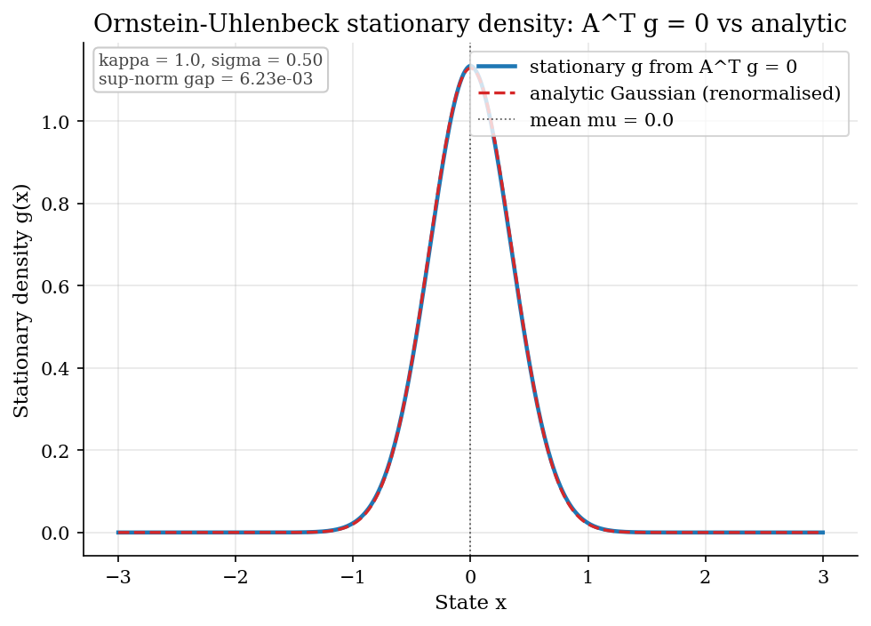
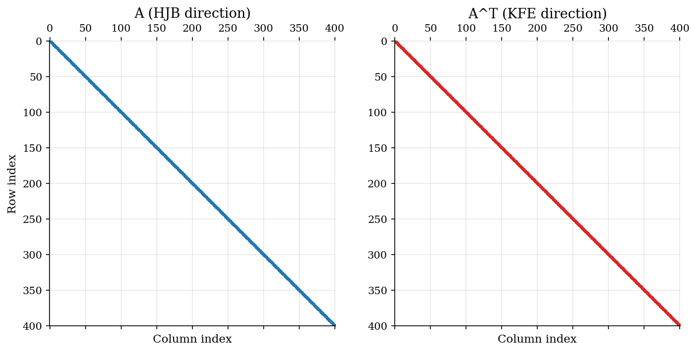
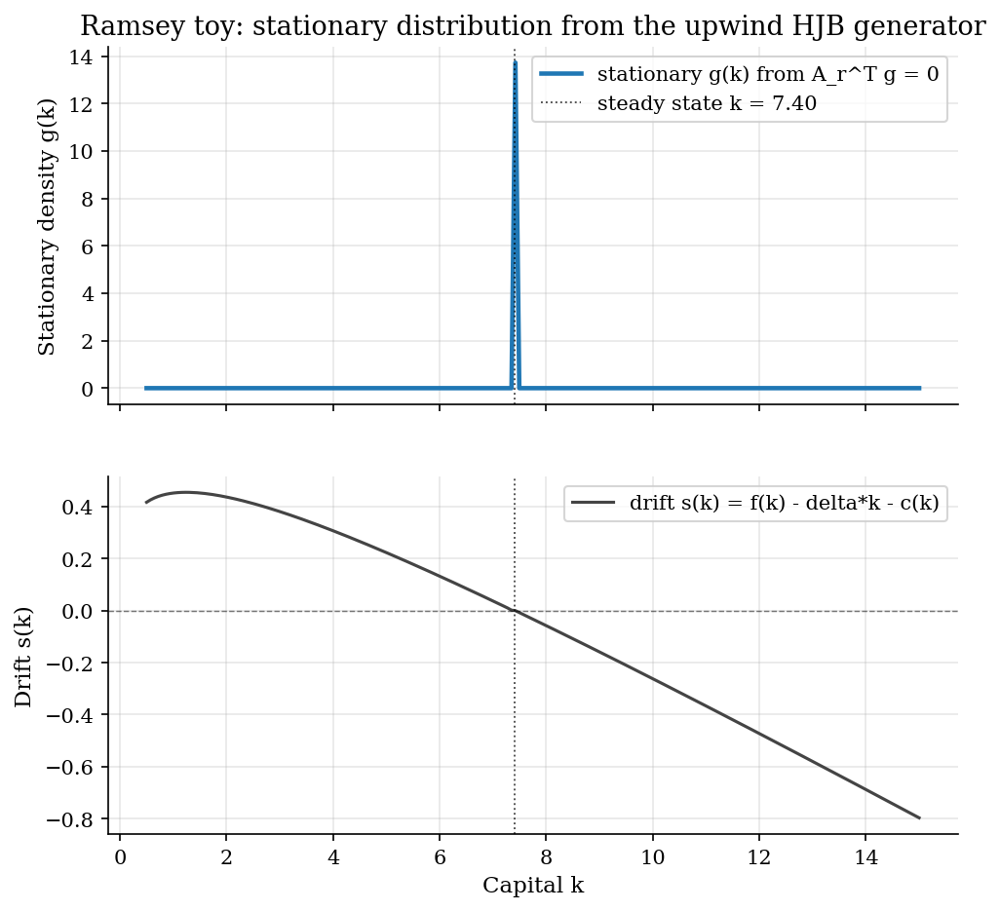
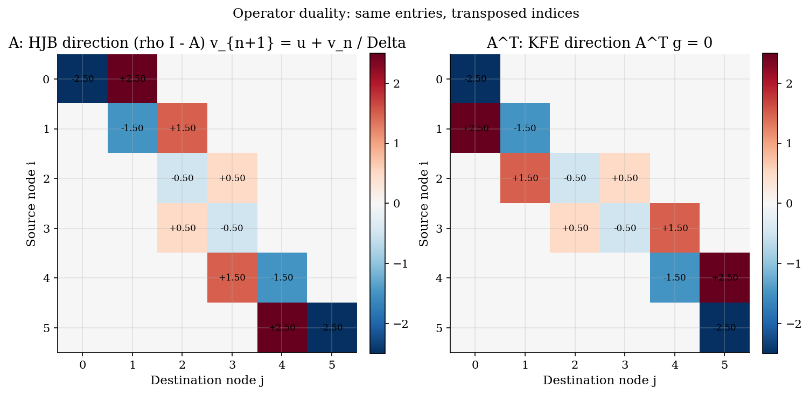
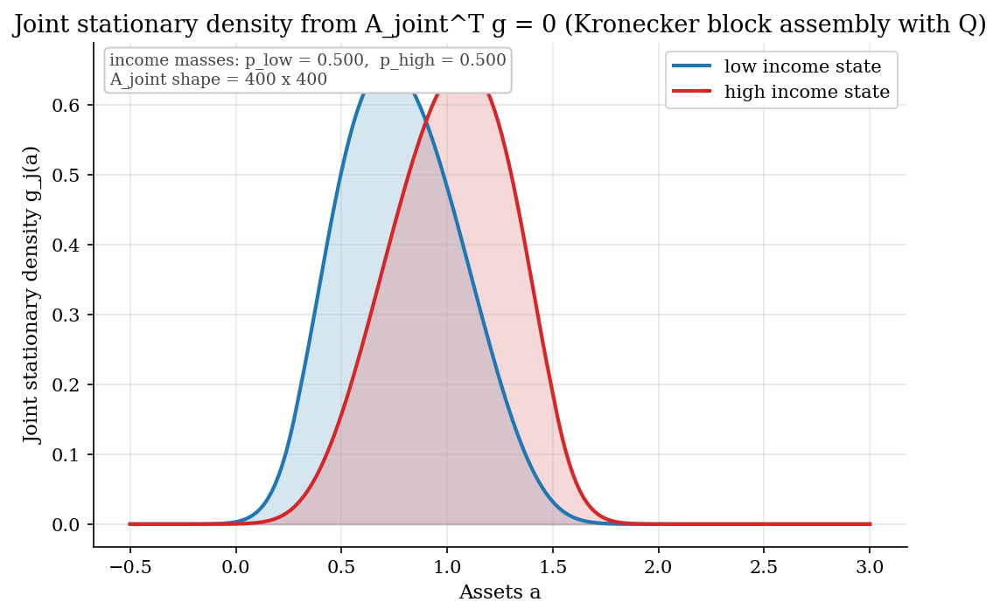

# Kolmogorov Forward Equation and the Stationary Wealth Distribution

## Overview

The Kolmogorov forward equation propagates a population density of households along the drift implied by their consumption policy. Its stationary form closes a Huggett or Aiyagari steady state by pinning down the long-run distribution of assets and income.

Mass conservation drives the derivation. Households neither appear nor vanish, so density flows in and out of any asset interval balance, plus net Poisson income switching. Discretising that bookkeeping on the same grid as the HJB yields a sparse linear system whose stationary solution is the cross section.

The upwind generator built in [`optimal-control/upwind-finite-differences/`](../../optimal-control/upwind-finite-differences/) acts on values from the right. Its transpose acts on densities from the left. One matrix discretises the stationary equilibrium of the dense Huggett tutorial in [`heterogeneous-agents/huggett-incomplete-markets/`](../../heterogeneous-agents/huggett-incomplete-markets/) and the continuous-time Aiyagari tutorial in [`heterogeneous-agents/aiyagari-hact/`](../../heterogeneous-agents/aiyagari-hact/). The discrete-time analog is the Young (2010) lottery iteration in the steady-state block of [`heterogeneous-agents/sequence-space-jacobian-hank/`](../../heterogeneous-agents/sequence-space-jacobian-hank/).

## Preliminary readings

- [`optimal-control/upwind-finite-differences/`](../../optimal-control/upwind-finite-differences/)

## Equations

Let $`x`$ be a one-dimensional state on a bounded interval $`[\underline x, \overline x]`$. Let $`g(x, t)`$ be the density of agents at state $`x`$ at time $`t`$. Each agent drifts at rate $`s(x)`$ under diffusion of constant volatility $`\sigma \geq 0`$. Differentiating the integral mass balance gives the continuity equation,

```math
\frac{\partial g}{\partial t}(x, t) =
-\frac{\partial}{\partial x}\big[s(x)  g(x, t)\big]
+ \frac{\sigma^2}{2}  \frac{\partial^2 g}{\partial x^2}(x, t) .
```

The first term is the divergence of the deterministic flux $`s(x)  g(x, t)`$. The second is the diffusion correction from Wiener noise; it vanishes for a purely convective process. In steady state $`\partial_t g = 0`$, so the density satisfies $`-\partial_x[s g] + (\sigma^2/2)  \partial_{xx} g = 0`$ with normalisation $`\int g  dx = 1`$.

Discretise $`x`$ on a uniform grid $`x_1 < x_2 < \cdots < x_n`$ with spacing $`\Delta x`$. Let $`g_i = g(x_i)`$. The upwind operator that discretises the HJB also carries the drift block of the forward equation. Let $`A`$ denote that operator, built in [`optimal-control/upwind-finite-differences/`](../../optimal-control/upwind-finite-differences/). Its rows sum to zero with non-negative off-diagonals, so $`A`$ is a continuous-time Markov generator on the grid. Discrete mass conservation becomes a single linear system,

```math
A^{\top}  g = 0,
\qquad
\sum_i g_i  \Delta x = 1 .
```

The system is singular. $`A`$ has zero row sums, so $`A^{\top}`$ carries the constant vector in its left null space and $`g`$ in its right null space. To pin the scale, replace one row of $`A^{\top}`$ with the normalisation constraint, solve, then rescale to integrate to one. The dense Huggett and Aiyagari tutorials invoke this stationary KFE solve.

For a multi-component state, the joint generator is built blockwise. Take a two-state Poisson income chain $`j \in \lbrace L, H \rbrace`$. Let $`\lambda_{LH}`$ be the jump rate from $`L`$ to $`H`$, and $`\lambda_{HL}`$ the rate from $`H`$ to $`L`$. The income generator is

```math
Q =
\begin{pmatrix}
-\lambda_{LH} & \lambda_{LH} \\
 \lambda_{HL} & -\lambda_{HL}
\end{pmatrix} .
```

Off-diagonals are Poisson jump rates. Each row sums to zero, so $`Q`$ is a continuous-time Markov generator on the income axis. The joint generator on the product state space is

```math
A_{\mathrm{joint}}
= \mathrm{diag}(A_{L}, A_{H}) + Q \otimes I_n ,
```

where $`A_j`$ is the asset-axis generator for income state $`j`$, and $`I_n`$ is the $`n \times n`$ identity. The first term advances assets within each income state. The second shuffles mass across income states at every asset level. The stationary joint density solves $`A_{\mathrm{joint}}^{\top} g = 0`$ by the same single-row-replacement trick. [`heterogeneous-agents/aiyagari-hact/`](../../heterogeneous-agents/aiyagari-hact/) generalises this with an $`N`$-state Rouwenhorst-derived chain.

## Model Setup

The prelim runs three examples that share one upwind generator. Symbols match the dense tutorials, so a reader walking to Huggett or Aiyagari-HACT sees no notational drift.

| Symbol | Value or set | Role |
|---|---|---|
| $`x`$ | grid node | generic 1D state [from `optimal-control/upwind-finite-differences/`] |
| $`a`$ | (Huggett asset grid) | asset, instance of $`x`$ [from `heterogeneous-agents/huggett-incomplete-markets/`] |
| $`k`$ | $`[0.5, 15.0]`$ | capital, instance of $`x`$ [from `optimal-control/hjb-growth/`] |
| $`g(x)`$ | grid array | cross-sectional density [from `huggett-incomplete-markets/` and `aiyagari-hact/`] |
| $`s(x)`$ | grid array | signed drift, sign chooses the upwind side [from `huggett-incomplete-markets/`] |
| $`A`$ | sparse $`n \times n`$ | upwind generator on the 1D state [from `optimal-control/upwind-finite-differences/`] |
| $`A^{\top}`$ | sparse $`n \times n`$ | forward operator for the density [prelim introduces the explicit duality name; dense tutorials adopt it on cut] |
| $`Q`$ | $`2 \times 2`$ generator | continuous-time Markov generator for two-state Poisson income [from `aiyagari-hact/`] |
| $`\lambda_{LH}, \lambda_{HL}`$ | $`(1.2, 1.2)`$ | Poisson jump rates between income states [prelim adds the directional double subscript; `huggett-incomplete-markets/` uses $`\lambda_L, \lambda_H`$ for the same two rates] |
| $`\Lambda`$ | discrete-time lottery weights | Young (2010) lottery transition matrix [prelim names this for the SSJ cross-reference; `sequence-space-jacobian-hank/` currently refers to it as `bar Lambda` in pseudocode only] |
| $`i^{\ast}`$ | row index | normalisation row replacing one redundant equation [prelim introduces this naming] |
| OU parameters $`(\kappa, \mu, \sigma)`$ | $`(1.0, 0.0, 0.5)`$ | mean reversion, long-run mean, volatility of the Ornstein-Uhlenbeck example |
| OU grid | 401 points on $`[-3, 3]`$ | uniform 1D grid for the OU stationary solve |
| Ramsey grid | 200 points on $`[0.5, 15.0]`$ | uniform 1D capital grid reused from the upwind prelim |
| Joint grid | 200 asset points $`\times`$ 2 income | uniform 1D asset grid with the two-state income chain |

The symbol $`A`$ collides with the lead matrix of rational-expectations systems in the linearised DSGE block. Each scope labels its $`A`$ on first use. The dense Huggett and Aiyagari-HACT tutorials use $`A`$ in the continuous-time meaning of this prelim.

## Solution Method

### Stationary solve by row replacement

The discretised stationary KFE is $`A^{\top} g = 0`$ with $`\sum_i g_i  \Delta x = 1`$. Zero row sums of $`A`$ give $`A^{\top}`$ a non-trivial right null space spanned by the stationary density. Fold the normalisation into the system by replacing one row of $`A^{\top}`$ with the constraint. Pick a row index $`i^{\ast}`$. Set row $`i^{\ast}`$ of $`A^{\top}`$ to the unit row $`e_{i^{\ast}}^{\top}`$. Set the right-hand side to $`e_{i^{\ast}}`$ with zeros elsewhere. Solve the non-singular sparse system by LU. Rescale by $`(\sum_i g_i  \Delta x)^{-1}`$ to integrate to one. The helper `lib.finite_differences.stationary_distribution` packages this recipe.

```text
Algorithm: stationary distribution by row replacement
Inputs    sparse generator A (zero row sums), grid spacing dx, fix-row index i*
Output    probability vector g with sum_i g_i * dx = 1

form AT as the transpose of A
overwrite row i_star of AT with the unit row that has a 1 in column i_star and 0 elsewhere
form right-hand side b as the unit vector with a 1 in entry i_star and 0 elsewhere
solve AT g = b by sparse LU
clip negative entries to zero (rounding cleanup)
rescale g by dividing through by the integral sum_i g_i times dx
return g
```

### Operator duality across the HJB and the KFE

One sparse matrix carries information in two directions. The HJB step inverts $`(\rho I - A)`$ to step the value function backward in pseudo-time. The KFE step inverts a modified $`A^{\top}`$ for the stationary density. Results visualises this side by side. The spy patterns of $`A`$ and $`A^{\top}`$ share the same nonzero structure. Entry $`(i, j)`$ of $`A`$ becomes entry $`(j, i)`$ of $`A^{\top}`$. Achdou et al. (2022) emphasise this duality, which runs through the dense Huggett and Aiyagari-HACT tutorials.

### Multi-state generalisation via Kronecker blocks

The 1D solve generalises by block assembly. Take an income chain with generator $`Q \in \mathbb{R}^{N \times N}`$ and asset-axis generators $`A_1, \dots, A_N`$ at each income state. The joint generator is $`\mathrm{diag}(A_1, \dots, A_N) + Q \otimes I_n`$. The block-diagonal piece advances assets within each income state. The Kronecker piece shuffles income at every asset level. Single-row replacement pins the joint stationary scale.

## Results

### Ornstein-Uhlenbeck stationary density against the analytic Gaussian

The first example builds $`A`$ for the OU drift $`s(x) = -\kappa  (x - \mu)`$ on a 401-point grid over $`[-3, 3]`$. A centered second-difference diffusion block scaled by $`\sigma^2 / 2`$ is added, then $`A^{\top} g = 0`$ is solved. The analytic stationary density on the real line is Gaussian with mean $`\mu`$ and variance $`\sigma^2 / (2 \kappa)`$. The numerical density matches it (renormalised to the bounded interval) in shape, location, and spread. The sup-norm gap is $`6.2 \times 10^{-3}`$. The first moment matches to four decimals. The second moment is $`0.127`$ against an analytic target of $`0.125`$. The residual gap is boundary truncation: the Gaussian has unbounded support; the discrete solve restricts to $`[-3, 3]`$.



### Sparse-matrix pattern of A and its transpose

The OU example produces a sparse $`401 \times 401`$ generator with at most three nonzeros per row: the diagonal and two neighbours. The spy pattern of $`A`$ has mass on the main diagonal, one super-diagonal, one sub-diagonal. Transposing a tridiagonal matrix preserves tridiagonality, so $`A^{\top}`$ has the same shape. Entries differ: every super-diagonal entry of $`A`$ becomes a sub-diagonal entry of $`A^{\top}`$ at the mirrored index. Only the structural shape is shared.



### Ramsey toy: stationary distribution from the upwind HJB generator

The second example feeds the upwind generator from prelim #1's toy Ramsey HJB into the stationary solve. The Ramsey drift is deterministic, pointing toward the steady state from both sides. The analytic stationary distribution is a point mass at $`k^{\ast} = (\alpha/(\rho+\delta))^{1/(1-\alpha)} \approx 7.40`$. The numerical density concentrates on a single node next to $`k^{\ast}`$, with two neighbours carrying residual mass from the row-replacement normalisation. The drift panel confirms the sign change at $`k^{\ast}`$: positive on the left, negative on the right. The same generator drove the HJB solve in [`optimal-control/upwind-finite-differences/`](../../optimal-control/upwind-finite-differences/); one matrix, two equations.



### Operator duality on a six-node grid

The 6-node visualisation shows the same matrix entries as $`A`$ on the left (HJB direction) and as $`A^{\top}`$ on the right (KFE direction). $`A_{ij}`$ is the rate at which mass flows from $`i`$ to $`j`$. The transpose entry $`A^{\top}_{ji}`$ is the rate at which value at $`j`$ depends on value at $`i`$ backward. Both panels show the same numbers, mirrored across the diagonal. The forward operator for the density and the backward operator for the value function are adjoints under one transposition.



### Joint asset-income stationary density

The third example assembles a joint $`400 \times 400`$ generator over 200 asset nodes and 2 income states. Each asset block uses a stylised mean-reverting drift toward an income-specific target, plus a diffusion to keep the density smooth. The Kronecker income block $`Q \otimes I_n`$ shuffles mass between the income states at every asset level, at Poisson rates $`\lambda_{LH} = \lambda_{HL} = 1.2`$. The solve recovers two unimodal densities, each concentrated near its income-specific target, with marginal masses $`p_L = p_H = 0.5`$ matching the symmetric calibration. [`heterogeneous-agents/aiyagari-hact/`](../../heterogeneous-agents/aiyagari-hact/) uses this block-matrix construction with an $`N`$-state chain.



## Takeaway

Mass conservation in continuous time yields one matrix that serves two equations. The upwind generator inverted by the HJB step also defines the forward operator for the cross-sectional density. Transposing it, then replacing one row with the normalisation constraint, turns a singular system into a sparse linear solve. The answer is the stationary distribution.

The dense Huggett solve in [`heterogeneous-agents/huggett-incomplete-markets/`](../../heterogeneous-agents/huggett-incomplete-markets/) and the multi-state Aiyagari-HACT solve in [`heterogeneous-agents/aiyagari-hact/`](../../heterogeneous-agents/aiyagari-hact/) use this workhorse. The discrete-time analog is the Young (2010) lottery iteration in the steady-state block of [`heterogeneous-agents/sequence-space-jacobian-hank/`](../../heterogeneous-agents/sequence-space-jacobian-hank/).

## References

1. Achdou, Y., Han, J., Lasry, J.-M., Lions, P.-L., and Moll, B. (2022). "Income and Wealth Distribution in Macroeconomics: A Continuous-Time Approach." *Review of Economic Studies* 89(1), 45-86. The canonical economic reference for the $`A`$ vs $`A^{\top}`$ duality in computational heterogeneous-agent macroeconomics.
2. Pavliotis, G. A. (2014). *Stochastic Processes and Applications: Diffusion Processes, Fokker-Planck and Langevin Equations.* Springer. Chapters 2-3 derive the forward equation from the Chapman-Kolmogorov identity.
3. Gardiner, C. (2004). *Handbook of Stochastic Methods*, 3rd ed. Springer. Section 3.2 derives the Fokker-Planck equation from mass balance with physical intuition.
4. Young, E. R. (2010). "Solving the Incomplete Markets Model with Aggregate Uncertainty Using the Krusell-Smith Algorithm and Non-Stochastic Simulations." *Journal of Economic Dynamics and Control* 34(1), 36-41. The lottery iteration that is the discrete-time analog of the continuous-time stationary solve developed here.
- **See also.** The upwind generator $`A`$ assembled here is built in [`optimal-control/upwind-finite-differences/`](../../optimal-control/upwind-finite-differences/). The single-income-state $`A^{\top} g = 0`$ solve appears in equilibrium form in [`heterogeneous-agents/huggett-incomplete-markets/`](../../heterogeneous-agents/huggett-incomplete-markets/). The multi-state generator construction with $`Q`$ on a richer Rouwenhorst chain appears in [`heterogeneous-agents/aiyagari-hact/`](../../heterogeneous-agents/aiyagari-hact/). The discrete-time lottery iteration that is the analog of this stationary solve appears in the steady-state block of [`heterogeneous-agents/sequence-space-jacobian-hank/`](../../heterogeneous-agents/sequence-space-jacobian-hank/).
