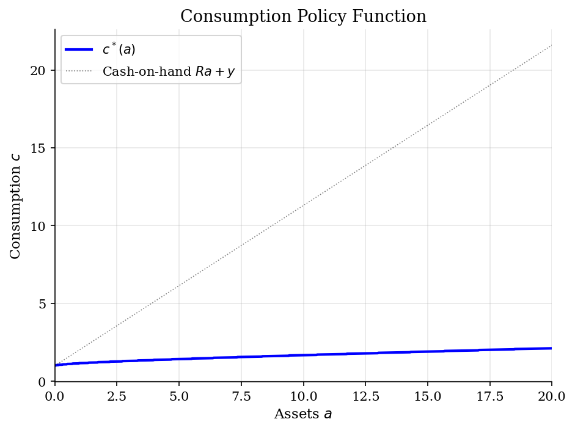
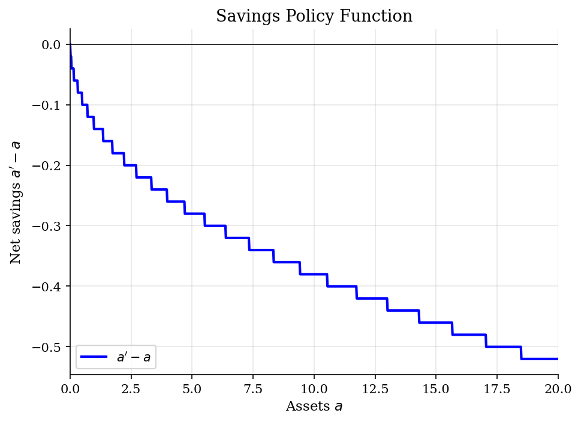
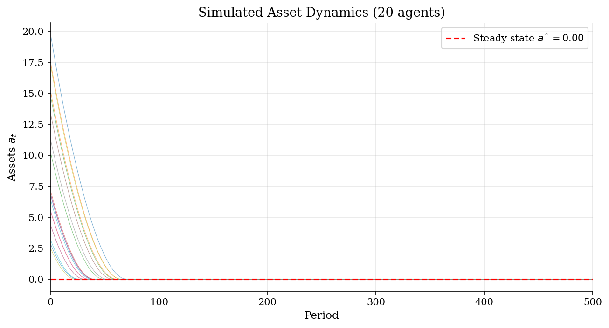

# Deterministic VFI Consumption-Savings

> Infinite-horizon savings problem with deterministic income, solved by value function iteration on a discrete asset grid.

## Overview

This is the simplest heterogeneous-agents building block: a single agent choosing how much to consume and save each period, facing a constant interest rate $r$ and deterministic income $y$. The agent can save in a risk-free asset but faces a borrowing constraint $a \ge 0$.

Despite its simplicity, this model introduces the core mechanics of HA models: discrete asset grids, the consumption-savings Bellman equation, and forward simulation of asset dynamics. The borrowing constraint generates a kink in the consumption policy function at low wealth levels.

## Equations

$$V(a) = \max_{a' \in [\underline{a},\, \bar{a}]} \left\{ u(c) + \beta \, V(a') \right\}$$

subject to the budget constraint:

$$c = Ra + y - a'$$

where $a$ is current assets, $a'$ is savings (next-period assets), $R = 1+r$ is the gross
interest rate, and $y$ is deterministic income.

**CRRA utility:** $u(c) = \frac{c^{1-\gamma} - 1}{1 - \gamma}$, with $\gamma$ the coefficient
of relative risk aversion.

**Euler equation:** $u'(c) \ge \beta R \, u'(c')$, with equality when $a' > \underline{a}$.

## Model Setup

| Parameter | Value | Description |
|-----------|-------|-------------|
| $\gamma$  | 2 | CRRA risk aversion |
| $\beta$   | 0.95 | Discount factor |
| $r$       | 0.03 | Interest rate |
| $y$       | 1 | Deterministic income |
| $\underline{a}$ | 0 | Borrowing limit |
| Grid points | 1000 | Linear spacing on $[0, 20]$ |
| Simulated agents | 100 | Forward simulation |
| Simulation periods | 500 | Time horizon |

## Solution Method

**Value Function Iteration (VFI):** Starting from an initial guess $V_0(a) = u(ra + y) / (1 - \beta)$, we iterate on the Bellman equation:

$$V_{n+1}(a) = \max_{a' \in [\underline{a},\, \bar{a}]} \left\{ u(Ra + y - a') + \beta \, V_n(a') \right\}$$

The maximization is performed by evaluating all feasible savings choices on the asset grid (discrete search). Convergence is declared when $\|V_{n+1} - V_n\|_\infty < 10^{-6}$.

Converged in **70 iterations** (error = 0.00e+00).

**Steady-state assets:** $a^* = 0.0000$, **steady-state consumption:** $c^* = 1.0000$.

## Results


*Value function V(a) over the asset grid*


*Consumption policy function c(a)*


*Savings policy: net change in assets a'-a as a function of current assets*


*Simulated asset paths converging to steady state*

**Policy Function at Selected Grid Points**

|   Assets (a) |   Consumption c(a) |   Savings a'(a) |   Net savings a'-a |    V(a) |
|-------------:|-------------------:|----------------:|-------------------:|--------:|
|        0     |             1      |          0      |             0      | -0      |
|        2.222 |             1.2669 |          2.022  |            -0.2002 |  1.7094 |
|        4.444 |             1.3936 |          4.1842 |            -0.2603 |  3.0079 |
|        6.667 |             1.5203 |          6.3463 |            -0.3203 |  4.0876 |
|        8.889 |             1.627  |          8.5285 |            -0.3604 |  5.0148 |
|       11.111 |             1.7337 |         10.7107 |            -0.4004 |  5.8262 |
|       13.333 |             1.8404 |         12.8929 |            -0.4404 |  6.5457 |
|       15.556 |             1.9271 |         15.0951 |            -0.4605 |  7.19   |
|       17.778 |             2.0338 |         17.2773 |            -0.5005 |  7.7716 |
|       20     |             2.1205 |         19.4795 |            -0.5205 |  8.2999 |

## Economic Takeaway

The deterministic consumption-savings model illustrates how a borrowing-constrained agent accumulates assets toward a steady state.

**Key insights:**
- With $\beta R < 1$ (impatience dominates returns), the agent has a finite steady-state asset level $a^*$ where consumption equals income plus net interest: $c^* = ra^* + y$.
- The borrowing constraint $a \ge 0$ binds for agents with very low wealth, creating a kink in the consumption policy where $c = Ra + y$ (consume everything).
- All agents converge to the same steady state regardless of initial assets, since income is deterministic. This is why stochastic income (the next model) is needed to generate a non-degenerate wealth distribution.
- The savings policy function $a' - a$ crosses zero exactly at the steady state: agents below save, agents above dissave.

## Reproduce

```bash
python run.py
```

## References

- Ljungqvist, L. and Sargent, T. (2018). *Recursive Macroeconomic Theory*. MIT Press, 4th edition, Ch. 16.
- Kaplan, G. (2017). *Heterogeneous Agent Models: Codes*. Lecture notes.
- Deaton, A. (1991). Saving and Liquidity Constraints. *Econometrica*, 59(5), 1221-1248.
