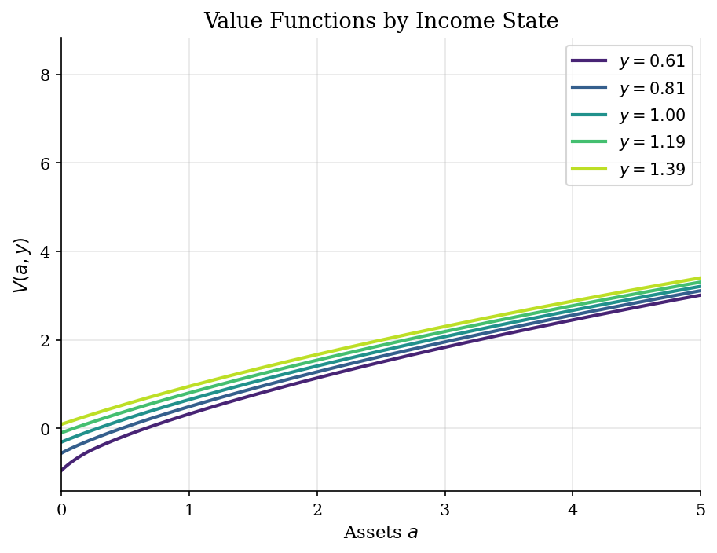
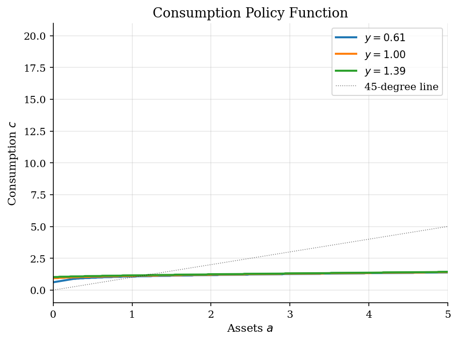
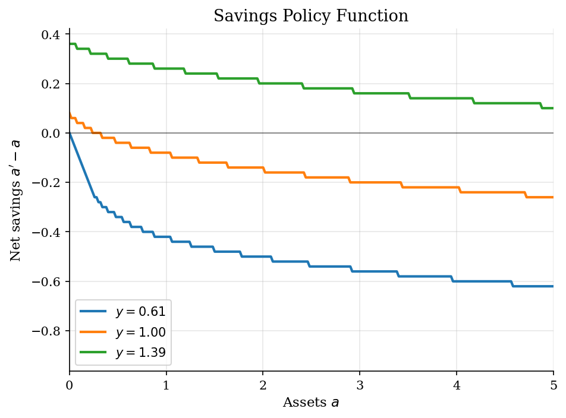
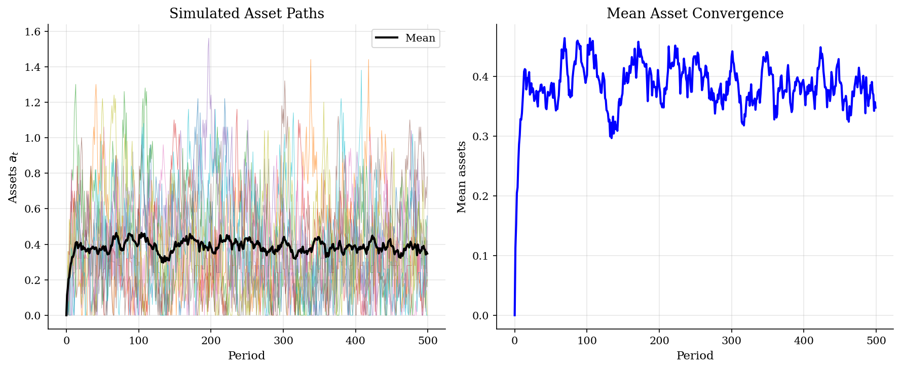

# VFI with IID Income Risk

> Consumption-savings problem with uninsurable IID income shocks and a borrowing constraint.

## Overview

This model solves the canonical incomplete-markets consumption-savings problem where agents face IID income risk. Each period, the agent receives a random income draw from a discretized normal distribution and must decide how much to consume and how much to save in a risk-free asset.

Unlike the deterministic case, agents face *uninsurable* income risk: they cannot write state-contingent contracts. This creates a **precautionary savings motive** -- agents save more than they would under certainty as a buffer against bad income realizations. The borrowing constraint further amplifies this motive by preventing agents from smoothing consumption via debt.

## Equations

$$V(a, y) = \max_{c \ge 0} \left\{ u(c) + \beta \, \mathbb{E}\left[ V(a', y') \right] \right\}$$

subject to:

$$a' = R \cdot a + y - c, \qquad a' \ge \underline{a}$$

where $a$ is assets, $y$ is income (IID), $R = 1+r$ is the gross interest rate,
and $\underline{a}$ is the borrowing limit.

**CRRA utility:** $u(c) = \frac{c^{1-\gamma}}{1-\gamma}$

**IID income:** $y \sim \mathcal{N}(\mu, \sigma^2)$, discretized to 5 points.

Since income is IID, the expectation simplifies:
$$\mathbb{E}[V(a', y')] = \sum_{j=1}^{n_y} V(a', y_j) \cdot \pi_j$$

## Model Setup

| Parameter | Value | Description |
|-----------|-------|-------------|
| $\gamma$ | 2 | CRRA risk aversion |
| $\beta$ | 0.95 | Discount factor |
| $r$ | 0.03 | Interest rate |
| $\mu_y$ | 1.0 | Mean income |
| $\sigma_y$ | 0.2 | Std dev of income |
| $n_y$ | 5 | Income grid points |
| $n_a$ | 1000 | Asset grid points |
| $a_{\max}$ | 20.0 | Maximum assets |
| $\underline{a}$ | 0.0 | Borrowing limit |
| $N_{sim}$ | 100 | Simulated agents |
| $T_{sim}$ | 500 | Simulation periods |

## Solution Method

**Value Function Iteration (VFI):** We iterate on the Bellman equation:

$$V_{n+1}(a, y) = \max_{a' \ge \underline{a}} \left\{ u(Ra + y - a') + \beta \sum_{j} V_n(a', y_j) \pi_j \right\}$$

until $\|V_{n+1} - V_n\|_\infty < 10^{-6}$. Because income is IID, the expected continuation value $\mathbb{E}[V(a', y')]$ depends only on $a'$ (not the current income state), which simplifies computation.

We search over the asset grid for the optimal savings choice at each state $(a, y)$, exploiting the fact that consumption is residual: $c = Ra + y - a'$.

Converged in **204 iterations** (error = 9.76e-07).

## Results


*Value functions for each income state -- higher income shifts V up*


*Consumption policy: agents with higher income consume more at every asset level*


*Net savings: low-income agents dissave, high-income agents accumulate*


*Simulated asset paths and mean convergence across agents*

**Consumption and Savings Policy at Selected Asset Grid Points**

|   Assets (a) |   c*(a, Low y) |   c*(a, Mid y) |   c*(a, High y) |   a'(a, Low y) |   a'(a, Mid y) |   a'(a, High y) |
|-------------:|---------------:|---------------:|----------------:|---------------:|---------------:|----------------:|
|         0    |         0.6133 |         0.9199 |          1.0264 |         0      |         0.0801 |          0.3604 |
|         0.5  |         0.9686 |         1.0551 |          1.1015 |         0.1602 |         0.4605 |          0.8008 |
|         1    |         1.0637 |         1.1101 |          1.1565 |         0.5806 |         0.9209 |          1.2613 |
|         2    |         1.1738 |         1.2002 |          1.2466 |         1.5015 |         1.8619 |          2.2022 |
|         5.01 |         1.384  |         1.4104 |          1.4368 |         4.3844 |         4.7447 |          5.1051 |
|         9.99 |         1.6537 |         1.6601 |          1.6864 |         9.2492 |         9.6296 |          9.99   |
|        14.99 |         1.8839 |         1.9103 |          1.9167 |        14.1742 |        14.5345 |         14.9149 |
|        20    |         2.1142 |         2.1205 |          2.1469 |        19.0991 |        19.4795 |         19.8398 |

**Cross-Sectional Asset Distribution (Final Period)**

| Statistic                        | Value   |
|:---------------------------------|:--------|
| Mean assets / mean income        | 0.357   |
| Fraction at borrowing constraint | 10.0%   |
| 10th percentile                  | 0.055   |
| 50th percentile (median)         | 0.329   |
| 90th percentile                  | 0.700   |
| 99th percentile                  | 0.844   |

## Economic Takeaway

IID income risk fundamentally changes savings behavior compared to the deterministic case.

**Key insights:**
- **Precautionary savings:** Agents save *more* than they would under certainty as a buffer against bad income draws. The concavity of the value function (risk aversion) means agents are more hurt by low consumption than they are helped by high consumption, so they self-insure through asset accumulation.
- **Borrowing constraint binds:** A positive fraction of agents are at the borrowing limit in any period. These constrained agents cannot smooth consumption when hit by low income, creating welfare losses.
- **Wealth inequality:** Even with IID (no persistent) income shocks, the stationary asset distribution is right-skewed -- a few agents accumulate substantial wealth while many remain near the constraint.
- **IID simplification:** Because income is IID, the expected continuation value $\mathbb{E}[V(a', y')]$ depends only on $a'$, not the current income state. This makes the problem computationally simpler than the AR(1) case where the full state is $(a, y)$ with persistent transitions.

## Reproduce

```bash
python run.py
```

## References

- Kaplan, G. (2017). *Heterogeneous Agent Models: Lecture Notes*.
- Deaton, A. (1991). Saving and Liquidity Constraints. *Econometrica*, 59(5), 1221-1248.
- Carroll, C. (1997). Buffer-Stock Saving and the Life Cycle/Permanent Income Hypothesis. *Quarterly Journal of Economics*, 112(1), 1-55.
- Aiyagari, S.R. (1994). Uninsured Idiosyncratic Risk and Aggregate Saving. *Quarterly Journal of Economics*, 109(3), 659-684.
