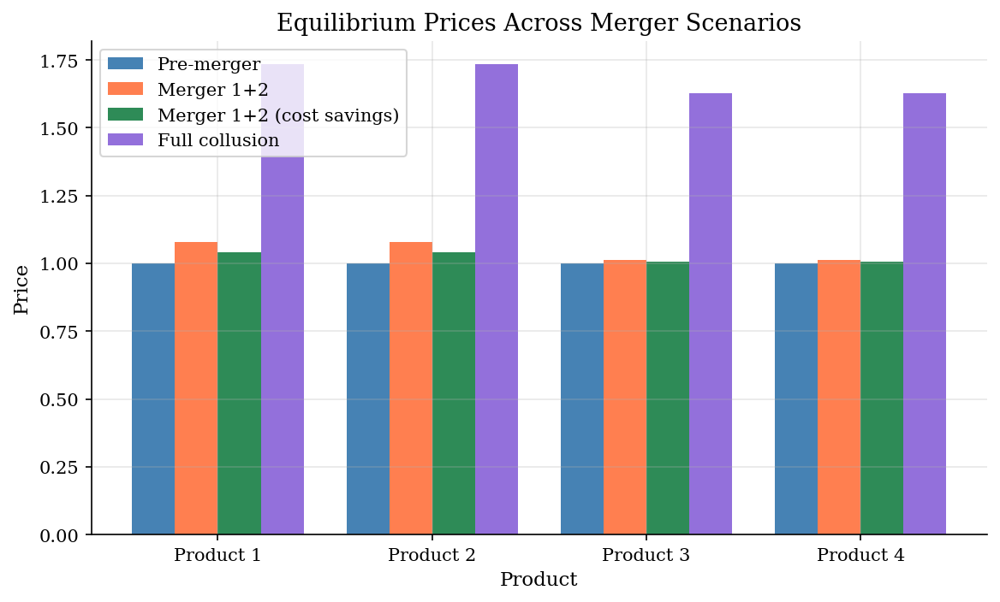
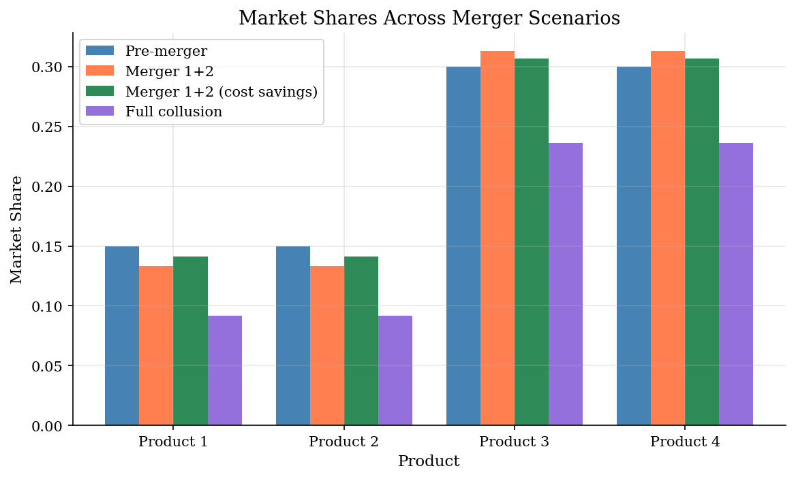
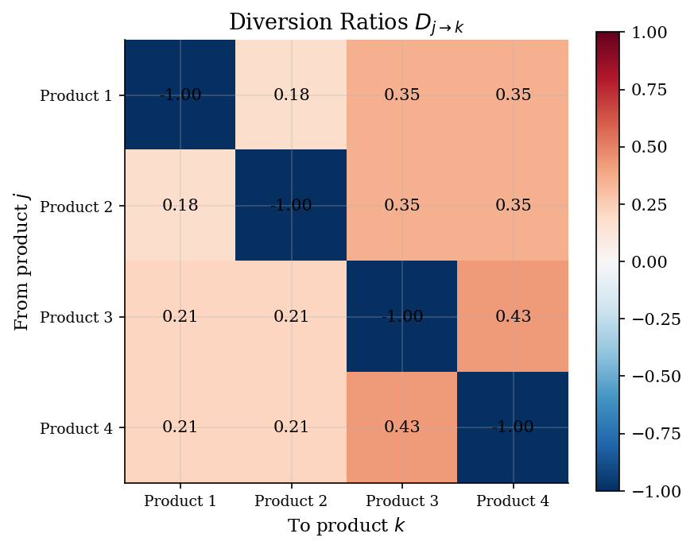

# Bertrand-Nash Pricing with Logit Demand

> Differentiated product oligopoly pricing, calibration, and merger simulation.

## Overview

This model implements the standard toolkit for antitrust merger analysis in differentiated product markets. Firms compete in prices (Bertrand-Nash), consumers choose products according to a logit discrete choice model, and the analyst calibrates the structural parameters (price sensitivity, product quality, marginal costs) from observed market data.

The key application: given a proposed merger, predict the equilibrium price increase by re-solving the pricing game under the new ownership structure.

## Equations

**Logit demand:** Consumer $i$ chooses product $j$ with probability:
$$s_j = \frac{\exp(\alpha p_j + \xi_j)}{1 + \sum_{k=1}^{J} \exp(\alpha p_k + \xi_k)}$$

where $\alpha < 0$ is the price coefficient and $\xi_j$ is product $j$'s quality.

**Bertrand-Nash FOC:** Each multi-product firm $f$ sets prices to satisfy:
$$s_j + \sum_{k \in \mathcal{F}_f} (p_k - c_k) \frac{\partial s_k}{\partial p_j} = 0 \quad \forall j \in \mathcal{F}_f$$

In matrix form: $\mathbf{s} + (\Omega \circ \Delta') (\mathbf{p} - \mathbf{c}) = 0$

where $\Omega$ is the ownership matrix and $\Delta = \partial \mathbf{s} / \partial \mathbf{p}'$ is the demand Jacobian.

**Diversion ratio:** $D_{j \to k} = \frac{s_k}{1 - s_j}$ — fraction of product $j$'s lost sales captured by product $k$.

**GUPPI:** $\text{GUPPI}_j = \sum_{k \in \mathcal{F}_f, k \neq j} D_{k \to j} (p_k - c_k)$ — upward pricing pressure from merger.

## Model Setup

| Parameter | Value | Description |
|-----------|-------|-------------|
| Products | 4 | 4 single-product firms + outside good |
| Shares | [np.float64(0.15), np.float64(0.15), np.float64(0.3), np.float64(0.3)] | Market shares (outside good: 0.10) |
| Prices | [np.float64(1.0), np.float64(1.0), np.float64(1.0), np.float64(1.0)] | Pre-merger prices |
| Margin | 0.5 | Price-cost margin (firm 1) |
| $\alpha$ | -2.3529 | Calibrated price coefficient |

## Solution Method

**Step 1: Calibrate** structural parameters ($\alpha, \xi, c$) by inverting the Bertrand-Nash FOC from observed prices, shares, and margins.

**Step 2: Verify** that the calibrated model replicates observed equilibrium (FOC residuals: 0.00e+00).

**Step 3: Simulate** mergers by changing the ownership matrix $\Omega$ and solving the new pricing game via `scipy.optimize.fsolve`.

## Results


*Equilibrium prices across merger scenarios*


*Market shares shift as prices rise post-merger*


*Diversion ratios: where do lost sales go?*

**Merger Simulation Results**

| Scenario                  |   Avg Price |   Price Change (%) |   Consumer Surplus |   HHI |
|:--------------------------|------------:|-------------------:|-------------------:|------:|
| Pre-merger                |      1      |               0    |             0.3318 |  2778 |
| Merger 1+2                |      1.0456 |               4.56 |             0.3098 |  3351 |
| Merger 1+2 (cost savings) |      1.0241 |               2.41 |             0.3197 |  3338 |
| Full collusion            |      1.6808 |              68.08 |            -0.1788 | 10000 |

## Economic Takeaway

Merger simulation reveals the tension between market power and efficiency:

**Key insights:**
- **Unilateral effects**: When Firm 1 merges with Firm 2, both products' prices rise because the merged firm internalizes the diversion between them. Competing products' prices also rise (strategic complements).
- **Diversion ratios** determine merger severity: if products 1 and 2 are close substitutes (high diversion), the merger causes larger price increases.
- **Cost efficiencies** can offset market power: a 10% marginal cost reduction partially or fully reverses the price increase from the merger.
- **Full collusion** (monopoly) produces the highest prices — this is the upper bound on how harmful market concentration can be.
- The logit model's **IIA property** (Independence of Irrelevant Alternatives) means diversion ratios are proportional to market shares — a strong assumption. The BLP random coefficients model relaxes this.

## Reproduce

```bash
python run.py
```

## References

- Berry, S. (1994). "Estimating Discrete-Choice Models of Product Differentiation." *RAND Journal of Economics*, 25(2).
- Werden, G. and Froeb, L. (1994). "The Effects of Mergers in Differentiated Products Industries." *Journal of Law, Economics, & Organization*, 10(2).
- Nevo, A. (2000). "Mergers with Differentiated Products: The Case of the Ready-to-Eat Cereal Industry." *RAND Journal of Economics*, 31(3).
