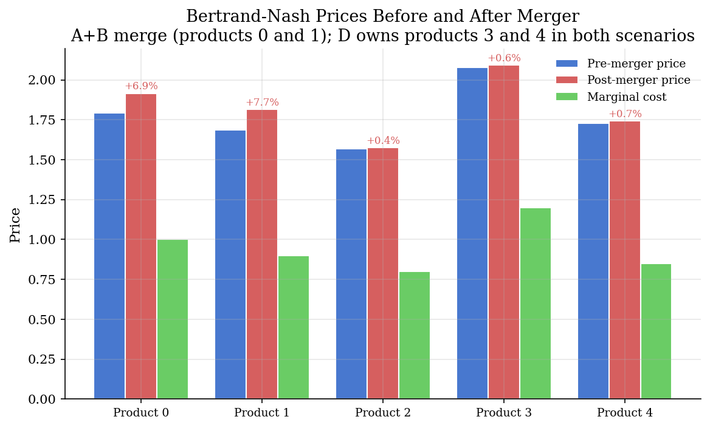
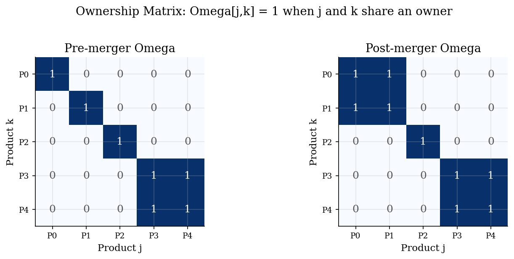
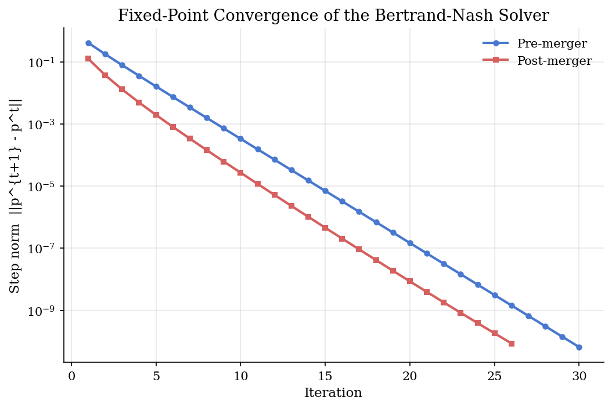

# Multi-Product Bertrand-Nash Pricing and the Ownership Matrix

## Overview

A market has several differentiated products. Each product is sold by a firm, but a firm may sell more than one. The firm picks each of its prices to maximize its own profit, taking the rivals' prices as fixed. Standard Bertrand competition (price-setting equilibrium with imperfect substitutes) becomes more interesting once one firm internalizes the cross-price effect between two products it owns.

The accounting device that records who owns what is the ownership matrix. It is a binary matrix with a one in row j and column k whenever product j and product k share an owner. The matrix is symmetric and has ones on the diagonal. The merger of two single-product firms flips a single pair of off-diagonal entries from zero to one.

This prelim derives the multi-product Bertrand-Nash first-order condition (FOC), shows that it stacks into a linear system whose coefficient matrix is the Hadamard product (elementwise multiplication) of the ownership matrix and the demand Jacobian (the matrix of how each share moves with each price), and uses that system three ways. It computes equilibrium prices by fixed-point iteration. It recovers marginal costs from observed prices and shares by a single inversion. And it produces post-merger counterfactual prices by changing one block of the ownership matrix and resolving. The same machinery is the markup-recovery engine in [`industrial-organization/logit-supply-side/`](../../industrial-organization/logit-supply-side/) once demand is estimated. It is also the pricing backbone of the merger screens in [`industrial-organization/merger-simulation/`](../../industrial-organization/merger-simulation/).

## Equations

We need a way to write the multi-product firm's FOC that respects which products belong to which firm. Let $`j`$ index the $`J`$ inside products, let $`p_j`$ be price, let $`c_j`$ be marginal cost, and let $`s_j(p)`$ be the market share of product $`j`$ as a function of the price vector $`p = (p_1, \ldots, p_J)`$. Let $`f(j) \in \{1, \ldots, F\}`$ name the owner of product $`j`$. The ownership matrix is the binary indicator of co-ownership:

```math
\Omega_{jk} = \mathbf{1}\lbrace f(j) = f(k) \rbrace.
```

$`\Omega`$ is symmetric and has ones on the diagonal. The merger of two firms changes $`f`$ only on the products of the two firms, and the resulting $`\Omega`$ differs from the pre-merger matrix in exactly the off-diagonal cells that link the merging products.

We need a familiar benchmark before generalizing. With a single-product firm, $`\Omega`$ reduces to the identity and only the own-price share derivative survives in the FOC. Differentiating $`(p_j - c_j) s_j(p)`$ with respect to $`p_j`$ and setting the result to zero gives the classic single-product Lerner condition:

```math
p_j - c_j = -\frac{s_j}{\partial s_j / \partial p_j}.
```

The denominator is negative because demand slopes down in own price, so the markup is positive. This formula is what is generalized below: with co-owned rivals, the right-hand side picks up extra terms that capture cross-product cannibalization.

We need the FOC of one firm choosing one price while internalizing every co-owned product's response. Firm $`f`$'s profit is $`\pi_f = \sum_{j : f(j) = f} (p_j - c_j) s_j(p)`$. Differentiating with respect to a single price $`p_j`$ and using the ownership indicator to identify co-owned products gives the scalar FOC:

```math
0 = s_j(p) + \sum_{k=1}^{J} \Omega_{jk}  (p_k - c_k)  \frac{\partial s_k(p)}{\partial p_j}, \qquad j = 1, \ldots, J.
```

The own-price term $`s_j`$ comes from differentiating $`(p_j - c_j) s_j`$ with respect to $`p_j`$. The sum is the within-firm price externality: raising $`p_j`$ shifts demand to substitute products $`k`$, and the firm cares about that shift only when $`f(k) = f(j)`$.

We need a single matrix equation that bundles all $`J`$ first-order conditions. Collect the demand Jacobian (matrix of share derivatives) as $`\Delta(p) \in \mathbb{R}^{J \times J}`$ with $`\Delta_{kj}(p) = \partial s_k(p) / \partial p_j`$. The Hadamard product $`\Omega \odot \Delta^{\top}`$ zeros out cross-firm Jacobian entries and keeps within-firm entries unchanged. Stacking the $`J`$ FOCs gives the vector form:

```math
s(p) + \big(\Omega \odot \Delta(p)^{\top}\big) (p - c) = 0.
```

The transpose on $`\Delta`$ comes from the FOC indexing: row $`j`$ of the bracketed matrix collects $`\Omega_{jk}  \Delta_{kj}(p)`$ across $`k`$, which is column $`j`$ of $`\Omega \odot \Delta`$ before the transpose. The merger flips entries of $`\Omega`$ from zero to one; the FOCs then solve for new equilibrium prices.

We need a closed-form rearrangement that turns the FOC into a fixed-point map for the equilibrium price vector. Solving the linear system for $`p - c`$ and adding $`c`$ gives:

```math
p = c - \big(\Omega \odot \Delta(p)^{\top}\big)^{-1} s(p).
```

The right-hand side depends on $`p`$ through $`s(p)`$ and $`\Delta(p)`$, so this is a fixed-point equation, not a closed-form solution. Iterating from a sensible starting price (a small markup over $`c`$, or the pre-merger equilibrium as a warm start) and damping each update keeps the iteration stable. A contraction-mapping argument applies under standard demand-curvature assumptions; here we verify convergence numerically.

We need the same algebra in reverse for marginal-cost recovery. The same FOC, evaluated at observed prices $`p^{\mathrm{obs}}`$, observed shares $`s^{\mathrm{obs}} = s(p^{\mathrm{obs}})`$, and the observed Jacobian $`\Delta^{\mathrm{obs}} = \Delta(p^{\mathrm{obs}})`$, is linear in $`c`$:

```math
c = p^{\mathrm{obs}} + \big(\Omega \odot (\Delta^{\mathrm{obs}})^{\top}\big)^{-1} s^{\mathrm{obs}}.
```

Cost recovery is one matrix inversion. No iteration, no calibration of $`c`$ to a target margin; the FOC plus the observed primitives identifies marginal cost up to the precision of the demand estimate.

## Model Setup

| Object | Symbol | Role |
|---|---|---|
| Product index | $`j`$ | Inside product, $`j = 1, \ldots, J`$ |
| Firm index | $`f`$ | Owner of one or more products [from `merger-simulation/`] |
| Number of inside products | $`J`$ | Set to 5 in the example [from `merger-simulation/`] |
| Price vector | $`p`$ | Equilibrium object [from `logit-supply-side/`] |
| Marginal cost vector | $`c`$ | Recovered from FOC [from `logit-supply-side/`] |
| Share function | $`s(p)`$ | Demand, logit form in the example [from `logit-supply-side/`] |
| Demand Jacobian | $`\Delta(p)`$ | $`\Delta_{kj} = \partial s_k / \partial p_j`$ [from `merger-simulation/`] |
| Ownership matrix | $`\Omega`$ | Binary co-ownership indicator [from `merger-simulation/`] |
| Hadamard product | $`\odot`$ | Elementwise matrix product [prelim introduces] |
| Logit price coefficient | $`\alpha`$ | Set to 1.5 |
| Product utilities | $`x_j`$ | Mean utility intercepts, 5-vector |
| Pre-merger owners | $`(f(1), \ldots, f(5))`$ | $`(A, B, C, D, D)`$: three single-product firms and one two-product firm |
| Post-merger owners | $`(f(1), \ldots, f(5))`$ | $`(AB, AB, C, D, D)`$: A and B merge into AB |

The annotations record which symbols are shared with the dense tutorials that adopt this prelim. Reusing names keeps the cross-references rename-free.

## Solution Method

The procedure has three stages. The first computes the pre-merger equilibrium. The second uses the same FOC, evaluated at the equilibrium, to back out marginal costs. The third changes the ownership matrix and resolves.

```text
Procedure: Bertrand-Nash equilibrium with ownership matrix
Inputs : marginal cost vector c (J,); product utilities x (J,);
         logit coefficient alpha; owner assignment owners (length J);
         convergence tolerance tol; damping weight w in (0, 1].
Outputs: equilibrium price vector p_star and convergence history.

1. Build the ownership matrix.
   Omega[j, k] = 1 if owners[j] == owners[k], else 0.

2. Initialise p at c + 0.5 (a small markup over cost), or pass a warm
   start such as the pre-merger equilibrium.

3. Repeat until ||p_new - p|| < tol:
   - Compute shares s and Jacobian Delta at the current p.
   - Form the linear system matrix M = Omega elementwise-times Delta'.
   - Solve M (p - c) = -s for the raw next-iterate price p_raw.
   - Damp: p_new = w * p_raw + (1 - w) * p   with w = 0.5 here.

4. (Cost recovery) At observed (p_obs, s_obs, Delta_obs), set
   c = p_obs + inv(Omega elementwise-times Delta_obs') s_obs.

5. (Merger counterfactual) Rebuild Omega from the post-merger owners
   and rerun steps 2 to 3, starting from the pre-merger prices.
```

Damping is not formally required, but it widens the basin of attraction so the iteration converges from coarse starting values. With the pre-merger equilibrium as a warm start for the post-merger solve, the iteration converges in fewer steps.

The same machinery covers different demand systems by replacing `shares_logit` and `jacobian_logit` with linear or log-linear analogues; the FOC and the Hadamard structure stay the same. Random-coefficient demand, bilateral bargaining (Nash-in-Nash), and merger screen formulas (UPP, GUPPI, CMCR) build on this base and are out of scope here.

## Results

The calibrated economy has five products with utility intercepts $`(2.0, 1.8, 1.5, 2.2, 1.6)`$ and true marginal costs $`(1.00, 0.90, 0.80, 1.20, 0.85)`$. The pre-merger ownership has three single-product firms (A, B, C) for products 0, 1, 2 and one two-product firm (D) for products 3 and 4. The post-merger ownership merges A and B into a single two-product firm (AB) that owns products 0 and 1; firms C and D are unchanged.

The bar chart compares the pre-merger equilibrium price, the post-merger equilibrium price, and the true marginal cost for each product.



The two merging products see the largest price increases: product 0 rises by $`6.9\%`$ and product 1 by $`7.7\%`$. That is the within-firm internalization channel: the merged firm AB now owns both products and lifts their prices so that the cross-price externality between them is no longer wasted on the rival. Products 2, 3, and 4 rise by less than $`1\%`$; those movements are general-equilibrium spillovers through the logit cross-price terms. Firm D's products rise by similar small amounts because firm D was already a two-product firm, both before and after, and gains only from softer competitive pressure on its rivals.

The ownership-matrix heatmaps make the change concrete.



The two diagonal $`2 \times 2`$ blocks on the right are the AB and D ownership clusters. Before the merger, only the D block (rows 3 and 4) has off-diagonal ones. After the merger, the AB block (rows 0 and 1) lights up as well. Every price effect downstream is the consequence of those two new entries.

The fixed-point iterator converges geometrically on log scale, both pre- and post-merger.



Pre-merger convergence takes 30 iterations from the cold start $`p = c + 0.5`$. Post-merger convergence takes 26 iterations using the pre-merger equilibrium as a warm start. The damping weight $`0.5`$ keeps the iteration stable; without it, the system can overshoot when the Jacobian moves between iterations.

Cost recovery is exact to machine precision (maximum absolute error $`3.2 \times 10^{-11}`$), which is the algebraic consequence of solving the same linear system in reverse. In practice, the precision of recovered costs is limited by the precision of the estimated demand Jacobian, not by the recovery formula itself.

## Takeaway

The multi-product Bertrand FOC is a single linear system in the price-minus-cost vector. The ownership matrix is the structure that turns that system from one-product-one-equation into one-firm-many-equations. Mergers are changes in the ownership matrix; cost recovery is the same system solved in reverse; counterfactual prices are the same system re-solved under a new ownership matrix.

This machinery is the supply-side core of differentiated-products IO. Logit-specific estimation and instrument design (Berry inversion, IV, GMM) build on this base in [`industrial-organization/logit-supply-side/`](../../industrial-organization/logit-supply-side/). Merger-screen formulas (UPP, GUPPI, CMCR) and the welfare frontier build on it in [`industrial-organization/merger-simulation/`](../../industrial-organization/merger-simulation/). Random-coefficient demand replaces the logit Jacobian with a richer one but reuses the same FOC; that extension is in [`industrial-organization/blp-random-coefficients/`](../../industrial-organization/blp-random-coefficients/).

## References

- Berry, S., Levinsohn, J., and Pakes, A. (1995). "Automobile Prices in Market Equilibrium." *Econometrica*, 63(4), 841-890. Supply-side derivation of the multi-product Bertrand FOC under logit demand.
- Nevo, A. (2000). "A Practitioner's Guide to Estimation of Random-Coefficients Logit Models of Demand." *Journal of Economics and Management Strategy*, 9(4), 513-548. Supply appendix has the cleanest exposition of the FOC and ownership matrix.
- Werden, G. and Froeb, L. (1994). "The Effects of Mergers in Differentiated Products Industries: Logit Demand and Merger Policy." *Journal of Law, Economics, and Organization*, 10(2), 407-426. Direct merger application of the same FOC.
- Conlon, C. and Gortmaker, J. (2020). "Best Practices for Differentiated Products Demand Estimation with PyBLP." *RAND Journal of Economics*, 51(4), 1108-1161. Modern computational reference for ownership-matrix supply-side solves.
- **See also.** The cereal demand and markup-recovery tutorial in [`industrial-organization/logit-supply-side/`](../../industrial-organization/logit-supply-side/) plugs estimated demand into the same FOC and adds Berry inversion and IV estimation. The merger-screening tutorial in [`industrial-organization/merger-simulation/`](../../industrial-organization/merger-simulation/) uses the same FOC for the post-merger equilibrium and adds the UPP, GUPPI, and CMCR screens at observed prices. The random-coefficient extension is in [`industrial-organization/blp-random-coefficients/`](../../industrial-organization/blp-random-coefficients/). The bilateral-bargaining alternative to Bertrand-Nash is in [`industrial-organization/nash-in-nash/`](../../industrial-organization/nash-in-nash/).
