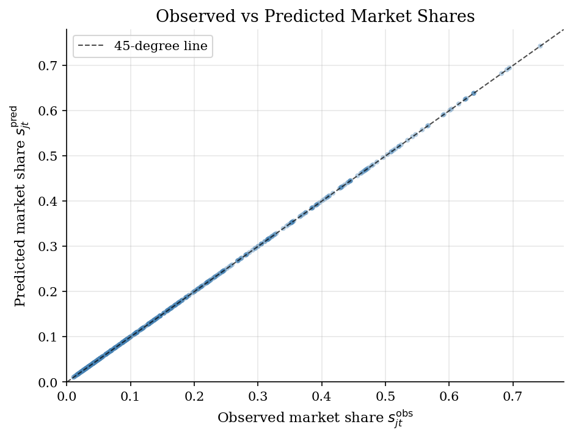
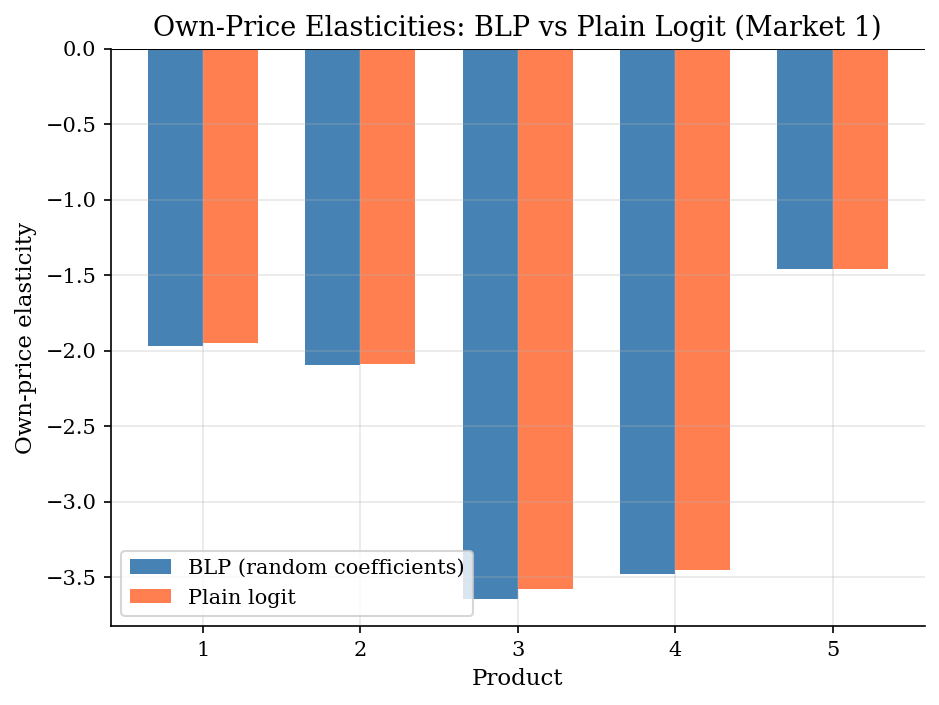
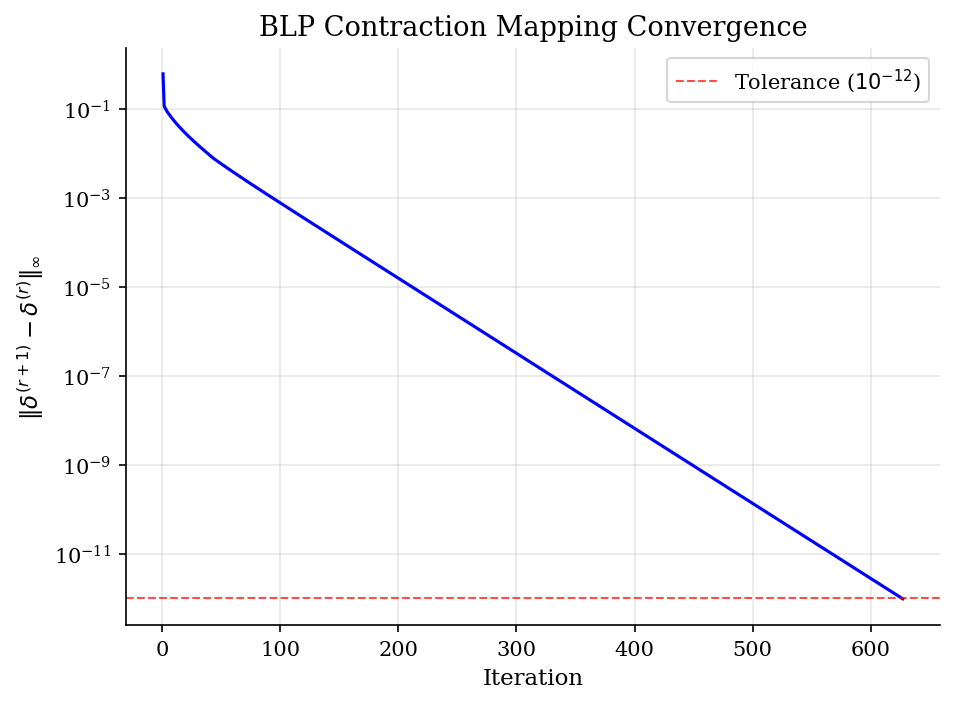
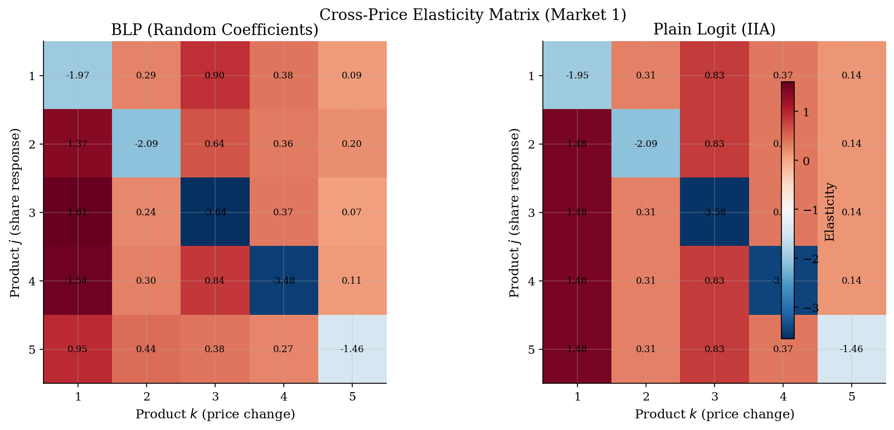

# BLP Random Coefficients Logit

> Demand estimation with heterogeneous consumer preferences via Berry, Levinsohn, and Pakes (1995).

## Overview

The BLP model estimates demand for differentiated products while allowing consumer preferences to vary across the population. Standard logit demand imposes the IIA (Independence of Irrelevant Alternatives) property: the ratio of choice probabilities between any two products is independent of the characteristics of all other products. This produces unrealistic substitution patterns.

Random coefficients break IIA by letting each consumer have a different marginal utility for product characteristics. Consumers who value a characteristic highly will substitute toward products that share that characteristic, creating a realistic pattern where similar products compete more intensely.

## Equations

**Indirect utility** of consumer $i$ for product $j$ in market $t$:

$$u_{ijt} = \beta_0 + \beta_x x_{jt} + \alpha p_{jt} + \xi_{jt} + \sigma_x \nu_{i1} x_{jt} + \sigma_p \nu_{i2} p_{jt} + \varepsilon_{ijt}$$

where $\nu_i \sim N(0, I)$ generates preference heterogeneity and $\varepsilon_{ijt}$ is T1EV (logit error).

**Decomposition** into mean utility $\delta_{jt}$ and individual deviation $\mu_{ijt}$:

$$\delta_{jt} = \beta_0 + \beta_x x_{jt} + \alpha p_{jt} + \xi_{jt}, \qquad \mu_{ijt} = \sigma_x \nu_{i1} x_{jt} + \sigma_p \nu_{i2} p_{jt}$$

**Market shares** via simulation over $ns$ draws:

$$s_{jt} = \frac{1}{ns} \sum_{i=1}^{ns} \frac{\exp(\delta_{jt} + \mu_{ijt})}{1 + \sum_{k=1}^{J} \exp(\delta_{kt} + \mu_{ikt})}$$

**BLP contraction mapping** to invert shares:

$$\delta^{(r+1)}_{jt} = \delta^{(r)}_{jt} + \log s^{\text{obs}}_{jt} - \log s^{\text{pred}}_{jt}(\delta^{(r)}, \sigma)$$

## Model Setup

| Parameter | Value | Description |
|-----------|-------|-------------|
| $T$ | 100 | Number of markets |
| $J$ | 5 | Products per market |
| $ns$ | 200 | Simulation draws |
| $\beta_0$ | 2.0 | Intercept |
| $\beta_x$ | 1.5 | Characteristic coefficient |
| $\alpha$ | -0.8 | Mean price coefficient |
| $\sigma_x$ | 0.8 | Std dev of random coeff on $x$ |
| $\sigma_p$ | 0.3 | Std dev of random coeff on price |

## Solution Method

**Nested Fixed-Point (NFXP) with GMM:**

The BLP estimator has a nested structure. The *outer loop* searches over nonlinear parameters $\sigma = (\sigma_x, \sigma_p)$ to minimize the GMM objective. For each candidate $\sigma$:

1. **Inner loop (contraction mapping):** Invert observed shares to recover mean utilities $\delta(\sigma)$ using the BLP contraction $\delta^{(r+1)} = \delta^{(r)} + \log s^{\text{obs}} - \log s^{\text{pred}}(\delta^{(r)}, \sigma)$. Berry (1994) proved this map is a contraction.

2. **IV regression:** Regress $\delta$ on $[1, x, p]$ using instruments $[1, x, z]$ (2SLS) to recover linear parameters $(\beta_0, \beta_x, \alpha)$ and structural errors $\xi$.

3. **GMM criterion:** $Q(\sigma) = \xi(\sigma)' Z (Z'Z)^{-1} Z' \xi(\sigma)$, exploiting the moment condition $E[z_{jt} \cdot \xi_{jt}] = 0$.

Contraction converged in **627 iterations** at true parameters. GMM optimization used Nelder-Mead (46 function evaluations).

## Results


*Observed vs predicted market shares at estimated parameters. Points near the 45-degree line indicate good model fit.*


*Own-price elasticities in market 1. BLP produces heterogeneous elasticities across products; plain logit elasticities are driven almost entirely by price level.*


*Convergence of the BLP contraction mapping. The log-linear decline confirms the contraction property proved by Berry (1994).*


*Cross-price elasticity matrices. BLP produces asymmetric off-diagonal entries reflecting heterogeneous substitution; plain logit cross-elasticities depend only on the column product (IIA).*

**Estimated vs True Parameters**

| Parameter                  |   True |   Estimated |
|:---------------------------|-------:|------------:|
| $\beta_0$ (intercept)      |    2   |       1.969 |
| $\beta_x$ (characteristic) |    1.5 |       1.576 |
| $\alpha$ (price)           |   -0.8 |      -0.835 |
| $\sigma_x$ (RC on $x$)     |    0.8 |       0.951 |
| $\sigma_p$ (RC on price)   |    0.3 |       0.196 |

## Economic Takeaway

The BLP random coefficients logit model fundamentally changes how we think about demand substitution in differentiated product markets.

**Key insights:**
- **Breaking IIA:** In plain logit, if a product is removed from the market, its share is redistributed to all remaining products in proportion to their existing shares — regardless of similarity. BLP's random coefficients create realistic patterns where close substitutes absorb more share.
- **Heterogeneous elasticities:** The cross-price elasticity matrix is no longer symmetric in the off-diagonal. Products that attract similar consumer types exhibit stronger cross-price effects.
- **Contraction mapping:** Berry (1994) proved that the mapping $\delta \mapsto \delta + \log s^{\text{obs}} - \log s^{\text{pred}}(\delta)$ is a contraction, guaranteeing unique inversion from shares to mean utilities. This is the computational backbone of BLP.
- **Identification:** Price endogeneity ($\text{Cov}(p, \xi) \neq 0$) requires instruments. Cost shifters ($z$) that affect price but not utility provide exclusion restrictions for 2SLS estimation of the linear parameters.

## Reproduce

```bash
python run.py
```

## References

- Berry, S., Levinsohn, J., and Pakes, A. (1995). "Automobile Prices in Market Equilibrium." *Econometrica*, 63(4), 841-890.
- Berry, S. (1994). "Estimating Discrete-Choice Models of Product Differentiation." *RAND Journal of Economics*, 25(2), 242-262.
- Nevo, A. (2000). "A Practitioner's Guide to Estimation of Random-Coefficients Logit Models of Demand." *Journal of Economics & Management Strategy*, 9(4), 513-548.
