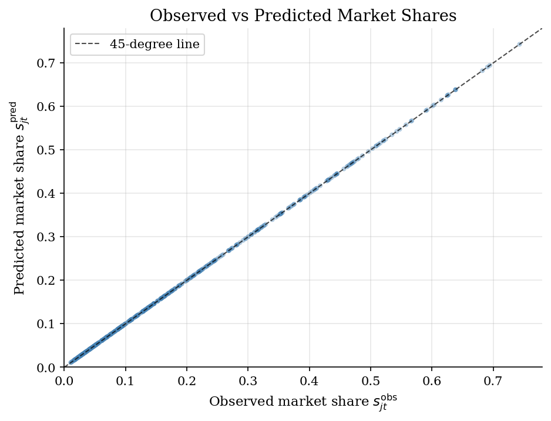
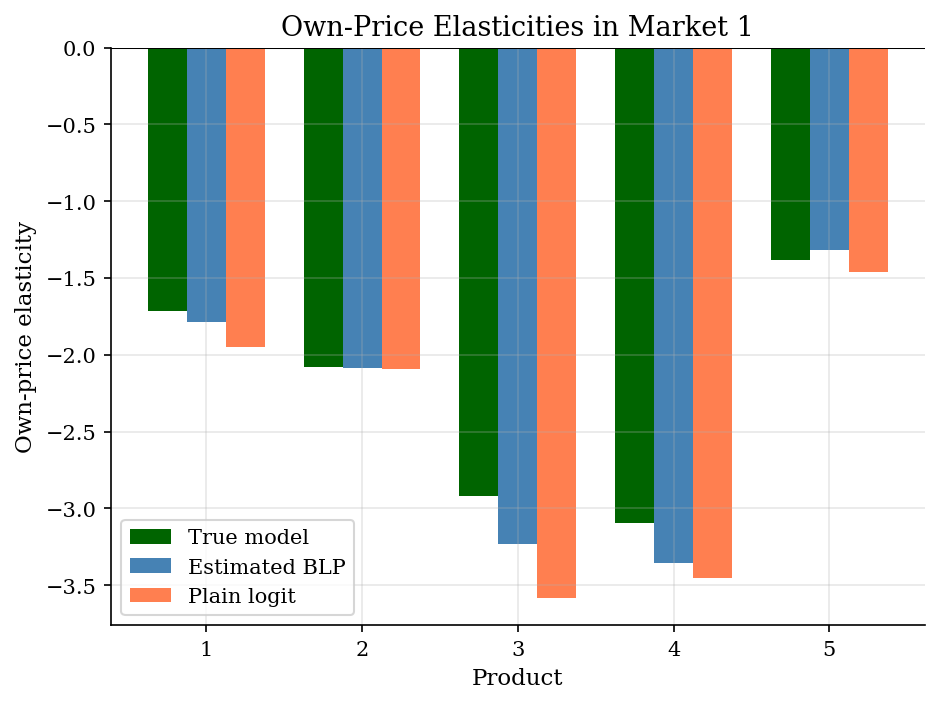
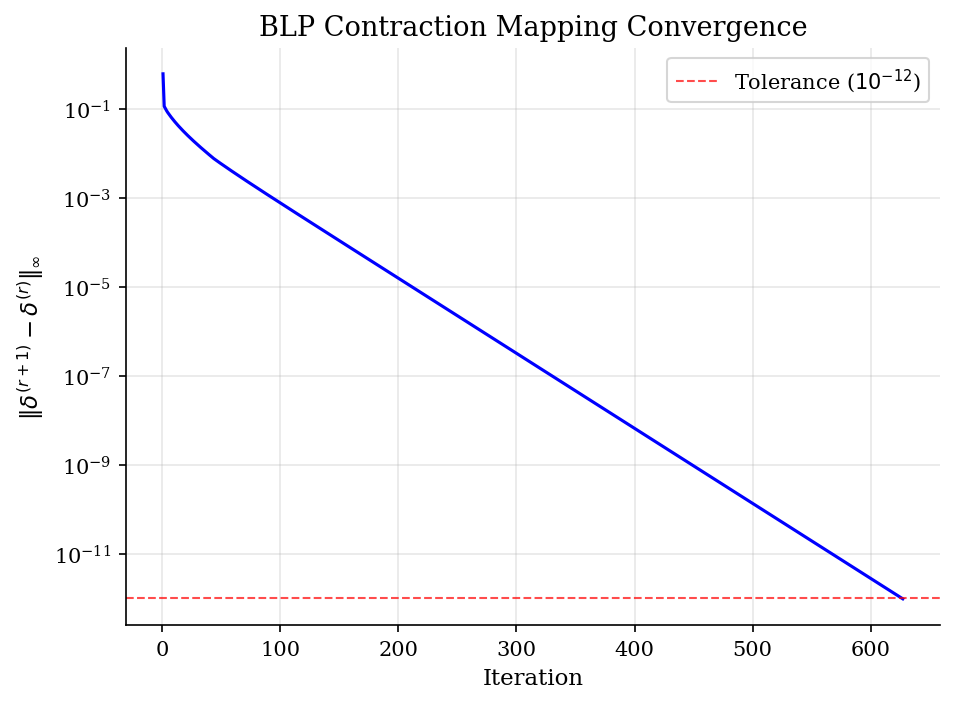
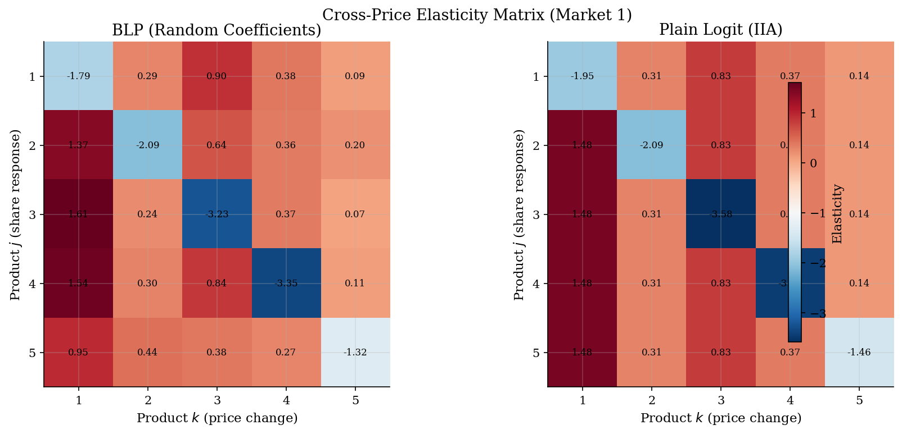

# Differentiated-Products Demand with BLP

## Overview

An antitrust analyst needs to know where demand goes after one product raises price. Market shares alone do not answer that question.

The object is differentiated-products demand with heterogeneous consumers. Products are closer substitutes when they attract similar buyers.

The main difficulty is that market shares are aggregate outcomes. The analyst does not observe each consumer's taste draw, but the substitution calculation depends on the distribution of those tastes.

The computation estimates those tastes from market shares. A BLP contraction recovers mean utility for each trial dispersion, and IV/GMM chooses dispersion.

## Preliminary readings

- [`numerical-methods/simulated-likelihood/`](../../numerical-methods/simulated-likelihood/)
- [`structural-econometrics/gmm-foundations/`](../../structural-econometrics/gmm-foundations/)

## Equations

Consumer $`i`$ in market $`t`$ chooses among $`J`$ inside goods and an outside good.

Think of $`x_{jt}`$ as a product attribute such as quality, style, or size.

The indirect utility from inside product $`j`$ is:

```math
u_{ijt} = \beta_0 + \beta_x x_{jt} + \alpha p_{jt} + \xi_{jt} + \sigma_x \nu_{i1} x_{jt} + \sigma_p \nu_{i2} p_{jt} + \varepsilon_{ijt}
```

Here $`x_{jt}`$ is an observed product characteristic, $`p_{jt}`$ is price,
$`\xi_{jt}`$ is unobserved quality, $`\nu_i \sim N(0,I)`$, and
$`\varepsilon_{ijt}`$ is Type-I extreme value.

The outside good has utility
normalized to zero.

Mean utility and individual taste enter separately:

```math
\delta_{jt} = \beta_0 + \beta_x x_{jt} + \alpha p_{jt} + \xi_{jt}, \qquad \mu_{ijt} = \sigma_x \nu_{i1} x_{jt} + \sigma_p \nu_{i2} p_{jt}
```

For a candidate $`\sigma = (\sigma_x, \sigma_p)`$, simulated market shares average the conditional logit probability over $`ns`$ fixed draws $`\nu_i`$ from $`N(0, I)`$ that are held constant across $`\sigma`$ values; the construction and the common-random-numbers smoothness argument are in [`numerical-methods/simulated-likelihood/`](../../numerical-methods/simulated-likelihood/):

```math
s_{jt}(\sigma) = \frac{1}{ns} \sum_{i=1}^{ns} \frac{\exp(\delta_{jt} + \mu_{ijt})}{1 + \sum_{k=1}^{J} \exp(\delta_{kt} + \mu_{ikt})}.
```

The BLP contraction finds the mean utilities that make predicted shares equal
observed shares:

```math
\delta^{(r+1)}_{jt} = \delta^{(r)}_{jt} + \log s^{\text{obs}}_{jt} - \log s^{\text{pred}}_{jt}(\delta^{(r)}, \sigma)
```

Given $`\delta(\sigma)`$, the linear demand equation is:

```math
\delta_{jt} = X_{jt}\theta_1 + \xi_{jt}, \qquad X_{jt}=(1,x_{jt},p_{jt})
```

Here $`\theta_1 = (\beta_0, \beta_x, \alpha)`$ collects the linear demand coefficients.

The identifying moments are $`E[Z_{jt}\xi_{jt}]=0`$. The instruments include
a cost shifter and sums of rival characteristics, so price can be endogenous
through $`\mathrm{Cov}(p_{jt},\xi_{jt}) \ne 0`$.

## Worked Numerical Example

Take one market with two inside products and an outside good. Observed shares are $`s^{\text{obs}} = (0.4, 0.3)`$ with outside share $`0.3`$. Each inside product has characteristic $`x_1 = x_2 = 1`$, and the random coefficient sits only on that characteristic with $`\sigma = 1`$ and $`\beta_r \sim N(0, 1)`$. Use $`R = 3`$ simulation draws $`\nu_r \in \lbrace -1, 0, 1 \rbrace`$, so $`\beta_r = \sigma\nu_r = (-1, 0, 1)`$. Start the contraction at $`\delta^{(0)} = (0, 0)`$.

For each draw, the conditional logit probability of product 1 is

```math
P_1(\delta, \nu_r) = \frac{\exp(\delta_1 + \beta_r x_1)}{1 + \exp(\delta_1 + \beta_r x_1) + \exp(\delta_2 + \beta_r x_2)}.
```

Evaluate at $`\delta = (0, 0)`$ for each draw. For $`\nu = -1`$:

```math
P_1(\delta, \nu_1) = \frac{e^{-1}}{1 + e^{-1} + e^{-1}} = \frac{0.368}{1.736} \approx 0.212.
```

For $`\nu = 0`$, symmetry gives $`P_1(\delta, \nu_2) = 1/3 \approx 0.333`$. For $`\nu = 1`$:

```math
P_1(\delta, \nu_3) = \frac{e^{1}}{1 + e^{1} + e^{1}} = \frac{2.718}{6.436} \approx 0.422.
```

Average across draws to form the simulated predicted share for product 1:

```math
s_1^{\text{pred}}(\delta^{(0)}) = \tfrac{1}{3}(0.212 + 0.333 + 0.422) \approx 0.323.
```

By symmetry across products at $`\delta = 0`$, $`s_2^{\text{pred}} \approx 0.323`$ and the outside share is $`1 - 0.646 = 0.354`$. Apply one step of the BLP contraction $`\delta^{(1)} = \delta^{(0)} + \log s^{\text{obs}} - \log s^{\text{pred}}`$:

```math
\delta_1^{(1)} = 0 + \log(0.4) - \log(0.323) = -0.916 - (-1.130) = 0.214,
```

```math
\delta_2^{(1)} = 0 + \log(0.3) - \log(0.323) = -1.204 - (-1.130) = -0.074.
```

```math
\boxed{\delta^{(1)} = (0.214, -0.074)}.
```

The product with the larger observed share moves up the most, and the contraction nudges $`\delta`$ in the direction that closes the share-residual gap. Iterating this update is the inner loop that delivers $`\delta(\sigma)`$ for each candidate dispersion in the outer GMM search.

## Model Setup

The example has 100 independent markets with five products per market. Each product has an observed characteristic, an unobserved quality draw, a cost shifter, and a price. Price loads on both cost and unobserved quality, so the IV step has an actual endogeneity problem to solve.

| Object | Value | Role |
|-----------|-------|-------------|
| $`T`$ | 100 | Markets |
| $`J`$ | 5 | Products per market |
| $`ns`$ | 200 | Simulation draws used for shares |
| $`\beta_0`$ | 2.0 | Mean inside-good utility |
| $`\beta_x`$ | 1.5 | Mean taste for $`x`$ |
| $`\alpha`$ | -0.8 | Mean price coefficient |
| $`\sigma_x`$ | 0.8 | Dispersion in taste for $`x`$ |
| $`\sigma_p`$ | 0.3 | Dispersion in price sensitivity |

## Solution Method

The estimator is a nested fixed point with GMM. The outer search chooses the taste-dispersion parameters $`\sigma=(\sigma_x,\sigma_p)`$. For each trial $`\sigma`$, the inner contraction finds the mean utilities $`\delta(\sigma)`$ that reproduce the observed shares.

It helps to separate two jobs. The contraction is an inversion: it finds the product-level mean utilities that rationalize the observed shares for the current taste distribution. The IV/GMM step is identification: it asks whether the implied unobserved quality is orthogonal to cost and rival-characteristic instruments. The elasticity matrix is computed only after both jobs are done.

```text
Inputs: observed shares s_obs, characteristics x, prices p, instruments Z, draws nu
Choose trial nonlinear parameters sigma = (sigma_x, sigma_p)
Initialize delta with the simple-logit inversion log(s_jt) - log(s_0t)
Repeat until the share residual is small:
    predict shares s_pred(delta, sigma) by averaging over taste draws nu
    update delta <- delta + log(s_obs) - log(s_pred)
Run 2SLS of delta(sigma) on (1, x, p) using Z
Compute xi(sigma) and Q(sigma) = n g(sigma)' W g(sigma), where g = Z' xi / n
Search over sigma and keep the minimizer
Output: sigma_hat, theta_1_hat, xi_hat, elasticities
```

The contraction is the share inversion. It asks what common product utility must be present for the model to match observed shares after averaging over consumer heterogeneity.

The GMM step then checks whether the recovered unobserved qualities are orthogonal to excluded cost and rival-characteristic instruments.

At the true nonlinear parameters, the contraction converged in **627 iterations** with max $`|\delta^{\mathrm{recovered}}-\delta^{\mathrm{true}}|=2.45e-11`$.

The GMM search first ran a coarse starting grid, where the grid evaluated the objective 25 times. The Nelder-Mead refinement from the best grid point then evaluated the objective 46 more times. The convergence diagnostics in the Results table record these counts so they can be checked against a fresh run.

## Results

The estimated model matches the simulated market shares closely. The elasticity comparison is the harder check. It asks whether estimated heterogeneity changes substitution in the right direction.

The share fit lies on the 45-degree line. The contraction makes predicted shares match observed shares at the chosen dispersion. This plot checks the inversion, not the substitution pattern.



The true-model bars are available because the data are simulated. Estimated BLP follows the product-level pattern. The largest own-elasticity error is 0.315 in this market. Plain logit has no consumer-specific price coefficient.



The inner fixed point is stable. The update norm falls steadily on the log scale, so the inversion can sit inside GMM.



The cross-elasticity matrix is the main economic object. In plain logit, each column has identical off-diagonal entries. A price increase sends proportional demand to each rival. In BLP, off-diagonal entries vary because products attract different buyers.



The parameter table checks the simulation truth. The nonlinear dispersion estimates are less exact than the linear coefficients. They are also what break IIA.

**Estimated vs True Parameters**

| Parameter                  |   True |   Estimated |
|:---------------------------|-------:|------------:|
| $`\beta_0`$ (intercept)      |    2   |       1.969 |
| $`\beta_x`$ (characteristic) |    1.5 |       1.576 |
| $`\alpha`$ (price)           |   -0.8 |      -0.835 |
| $`\sigma_x`$ (RC on $`x`$)     |    0.8 |       0.951 |
| $`\sigma_p`$ (RC on price)   |    0.3 |       0.196 |

These are the runtime counts and accuracy checks the prose refers to: contraction iterations at the true parameters, the max recovered-versus-true mean-utility error, starting-grid objective evaluations, Nelder-Mead objective evaluations, and the largest own-elasticity error in market 1. Committing them lets a re-run verify the numbers in the text against an on-disk artifact.

**Convergence and Search Diagnostics**

| Diagnostic          |      Value |
|:--------------------|-----------:|
| contraction_iters   | 627        |
| max_delta_error     |   2.45e-11 |
| grid_evals          |  25        |
| gmm_nfev            |  46        |
| max_own_elast_error |   0.315    |

## Takeaway

BLP changes the estimated substitution object. The contraction lets each candidate $`\sigma`$ fit observed shares. IV/GMM chooses heterogeneity using moments for recovered unobserved quality. With heterogeneity, substitution no longer has to follow existing shares.

## References

- Berry, S., Levinsohn, J., and Pakes, A. (1995). "Automobile Prices in Market Equilibrium." *Econometrica*, 63(4), 841-890.
- Berry, S. (1994). "Estimating Discrete-Choice Models of Product Differentiation." *RAND Journal of Economics*, 25(2), 242-262.
- Nevo, A. (2000). "A Practitioner's Guide to Estimation of Random-Coefficients Logit Models of Demand." *Journal of Economics & Management Strategy*, 9(4), 513-548.
