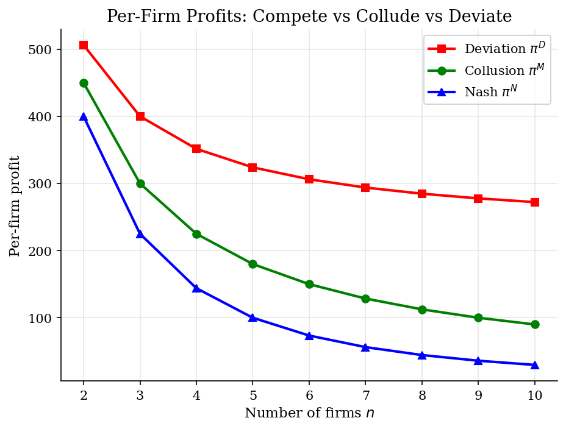
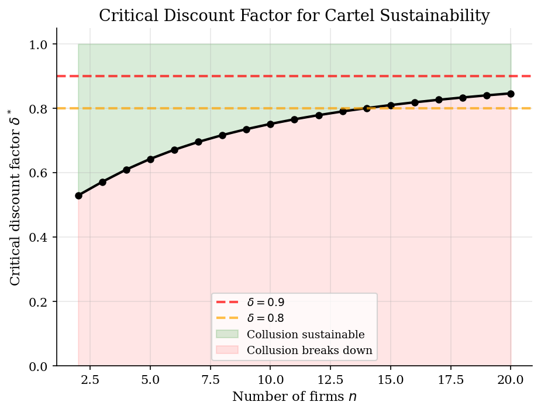
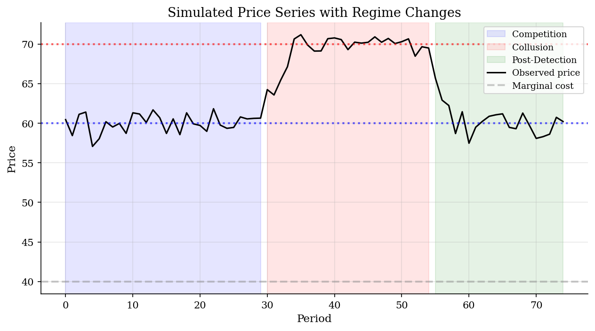
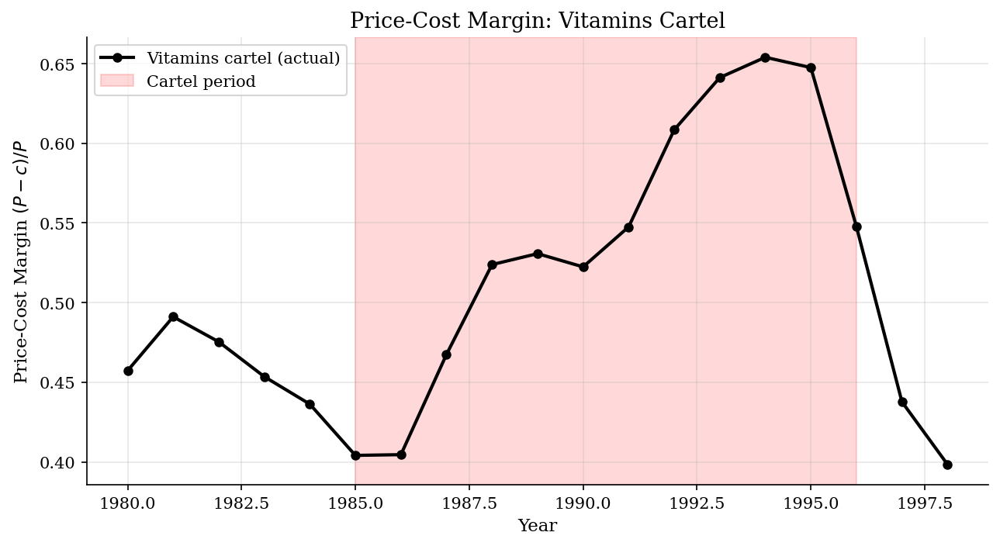

# Collusion Detection

> Cartel stability analysis using repeated Cournot games and structural break detection.

## Overview

Cartels face a fundamental tension: joint profit maximization requires output restriction, but each member can increase its own profit by secretly expanding output. This model analyzes cartel stability through the lens of repeated game theory, using grim trigger strategies to characterize when collusion is self-enforcing.

We apply the framework to a symmetric Cournot oligopoly and illustrate structural break detection using the global vitamins cartel (Igami & Sugaya, 2021) as a case study.

## Equations

**Cournot oligopoly with $n$ symmetric firms:**

Inverse demand: $P = a - Q$, where $Q = \sum_{i=1}^n q_i$.

| Regime | Per-firm quantity | Per-firm profit |
|--------|-------------------|-----------------|
| Nash equilibrium | $q^N = \frac{a-c}{n+1}$ | $\pi^N = \left(\frac{a-c}{n+1}\right)^2$ |
| Collusion (joint monopoly) | $q^M = \frac{a-c}{2n}$ | $\pi^M = \frac{(a-c)^2}{4n}$ |
| Deviation (best response to collusion) | $q^D = \frac{(n+1)(a-c)}{4n}$ | $\pi^D = \frac{(n+1)^2(a-c)^2}{16n^2}$ |

**Grim trigger strategy:** collude until any firm deviates, then revert to Nash forever.

**Critical discount factor:**
$$\delta^* = \frac{\pi^D - \pi^M}{\pi^D - \pi^N}$$

Collusion is sustainable if and only if $\delta \geq \delta^*$.

For the symmetric Cournot case: $\delta^* = \frac{(n+1)^2}{n^2 + 6n + 1}$ (increasing in $n$).

## Model Setup

| Parameter | Value | Description |
|-----------|-------|-------------|
| $a$       | 100   | Demand intercept |
| $c$       | 40   | Marginal cost (symmetric) |
| $n$       | 2 (baseline) | Number of firms |
| Simulation | 30+25+20 periods | Competition, collusion, post-detection |

## Solution Method

**Analytical Cournot solution:** Profits under Nash, collusion, and deviation are computed in closed form for the linear demand model.

**Trigger strategy analysis:** The critical discount factor $\delta^*$ is derived from the incentive compatibility constraint: the one-period gain from deviation must not exceed the present value of lost future collusion profits.

**Structural break detection:** We simulate a price series with three regimes (competition, collusion, post-detection) and examine how prices and price-cost margins shift across regimes. The vitamins cartel data provides an empirical benchmark.

## Results


*Per-firm profits under Nash competition, collusion, and one-shot deviation as a function of the number of firms*


*Critical discount factor as a function of the number of firms -- more firms make collusion harder to sustain*


*Simulated price series showing competition, collusion, and post-detection regimes*


*Price-cost margin over time showing elevated margins during collusion*

**Cartel Stability Conditions for Different Market Structures (a=100, c=40)**

|   Firms (n) |   pi_Nash |   pi_Collude |   pi_Deviate |   delta* | Sustainable (delta=0.9)   |
|------------:|----------:|-------------:|-------------:|---------:|:--------------------------|
|           2 |     400   |        450   |        506.2 |   0.5294 | Yes                       |
|           3 |     225   |        300   |        400   |   0.5714 | Yes                       |
|           4 |     144   |        225   |        351.6 |   0.6098 | Yes                       |
|           5 |     100   |        180   |        324   |   0.6429 | Yes                       |
|           6 |      73.5 |        150   |        306.2 |   0.6712 | Yes                       |
|           8 |      44.4 |        112.5 |        284.8 |   0.7168 | Yes                       |
|          10 |      29.8 |         90   |        272.2 |   0.7516 | Yes                       |
|          15 |      14.1 |         60   |        256   |   0.8101 | Yes                       |
|          20 |       8.2 |         45   |        248.1 |   0.8464 | Yes                       |

## Economic Takeaway

Cartels are inherently unstable because each member faces a prisoner's dilemma: the collective optimum requires restraint, but individual incentives push toward expansion.

**Key insights:**
- The deviation temptation ($\pi^D - \pi^M$) always exceeds zero: cheating on the cartel is always profitable in the short run.
- Collusion is sustainable only if firms are sufficiently patient ($\delta \geq \delta^*$). The Folk Theorem guarantees that cooperation can be sustained in repeated games when the discount factor is high enough.
- **More firms make collusion harder.** The critical discount factor $\delta^*$ is strictly increasing in $n$, approaching 1 as $n \to \infty$. This is Stigler's (1964) insight: cartels face greater coordination problems as membership grows.
- For a duopoly, $\delta^* = 0.5294$; for $n=10$, $\delta^* = 0.7516$.
- Structural breaks in price series and price-cost margins provide empirical signatures of collusion. The vitamins cartel shows elevated margins during the cartel period (1991--1995), consistent with the model's predictions.
- Porter (1983) and Harrington (2008) develop econometric methods to detect these regime changes from market data alone.

## Reproduce

```bash
python run.py
```

## References

- Stigler, G. (1964). A Theory of Oligopoly. *Journal of Political Economy*, 72(1), 44--61.
- Porter, R. (1983). A Study of Cartel Stability: The Joint Executive Committee, 1880--1886. *Bell Journal of Economics*, 14(2), 301--314.
- Harrington, J. (2008). Detecting Cartels. In *Handbook of Antitrust Economics*. MIT Press.
- Igami, M. and Sugaya, T. (2021). Measuring the Incentive to Collude: The Vitamin Cartels, 1990--1999. *Review of Economic Studies*, 89(3), 1460--1494.
