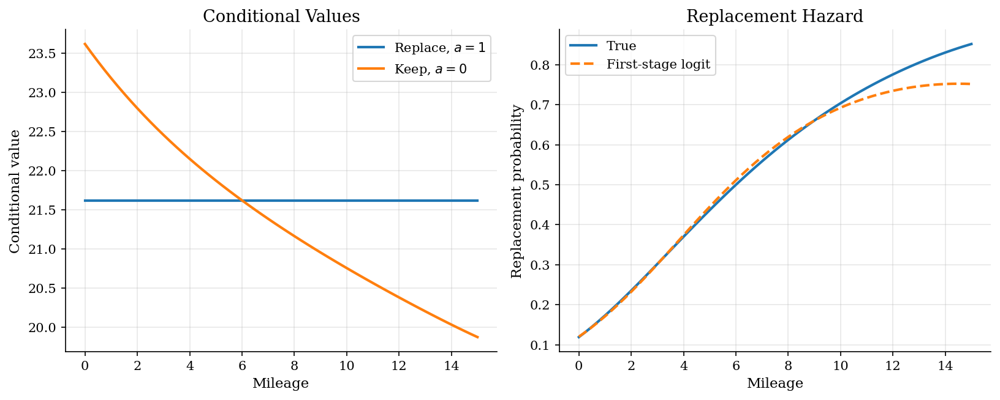
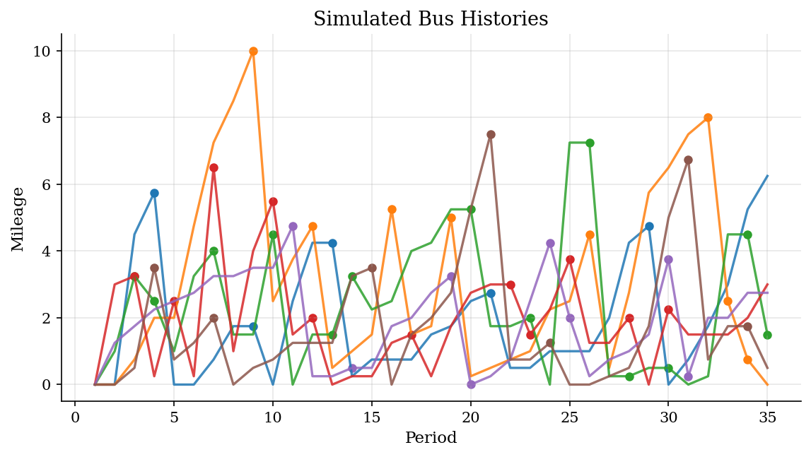
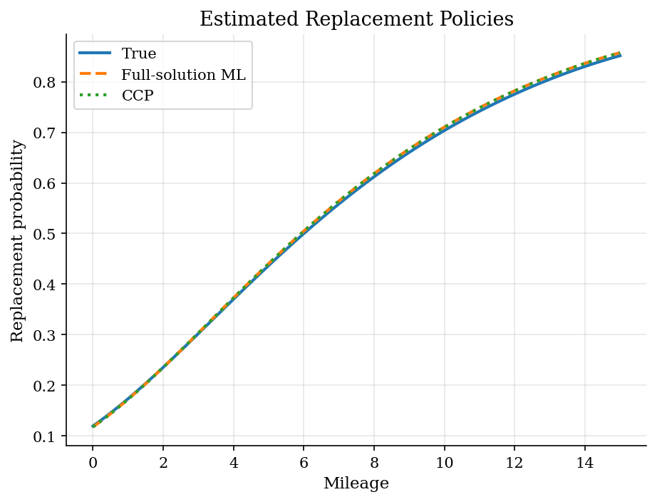

# Bus Engine Replacement: NFXP, CCP, MPEC, and the MCE-IRL Interpretation

## Overview

A transit agency observes each bus before deciding whether to replace its engine. Keeping the old engine saves money today. It also lets mileage rise and makes future operation worse.

The object is the mileage-specific replacement hazard. It depends on current keep payoffs and the continuation value from resetting the engine.

That continuation value is the reason the model is dynamic. A bus with low current operating cost may still be close to replacement if keeping it pushes the next-period mileage distribution into costly states.

Computation is needed because each trial parameter vector implies a dynamic program. The likelihood uses the replacement policy produced by that fixed point. The tutorial compares NFXP, CCP, and MPEC estimates for the same hazard.

## Equations

Let $`x_t \in X`$ denote mileage at the start of period $`t`$. The action
$`a_t=1`$ replaces the engine and $`a_t=0`$ keeps it. Replacement flow utility is
normalized to zero:

```math
u(x,1) = 0,
```

and the keep payoff is

```math
u(x,0) = \theta_0 + \theta_1 x, \qquad \theta_1 < 0.
```

The transition matrix $`F_a(x' \mid x)`$ gives next period's mileage. Replacement
uses $`F_1`$ and is close to the transition from a new engine. Keeping uses $`F_0`$
and lets mileage drift upward.

With additive Type-I extreme value shocks, the conditional value functions
satisfy

```math
v_a(x) = u(x,a) + \beta \sum_{x'} F_a(x' \mid x)
\left[\log\left(\exp(v_1(x')) + \exp(v_0(x'))\right) + \gamma\right],
```

where $`\gamma`$ is Euler's constant. The replacement probability is

```math
P_\theta(1 \mid x) =
\frac{\exp(v_1(x))}{\exp(v_1(x))+\exp(v_0(x))}.
```

For panel observations $`(x_{it}, d_{it})`$, where $`d_{it}=1`$ means replacement,
the full-solution likelihood is

```math
\ell(\theta)=\sum_{i,t}
d_{it}\log P_\theta(1 \mid x_{it}) +
(1-d_{it})\log[1-P_\theta(1 \mid x_{it})].
```

The CCP estimator starts from a first-stage estimate $`\hat p(x)`$ of
$`\Pr(a=1 \mid x)`$. Given $`\hat p`$, form the policy transition

```math
\hat F(x' \mid x)=\hat p(x)F_1(x' \mid x)+[1-\hat p(x)]F_0(x' \mid x).
```

For any candidate $`\theta`$, the Hotz-Miller ex ante value solves the linear
system

```math
W_\theta =
\bar u_\theta(\hat p)+\beta \hat F W_\theta,
```

where $`\bar u_\theta(\hat p)`$ includes the keep payoff and the logit entropy
terms implied by $`\hat p`$.

The model-implied replacement probability is then

```math
P_\theta^{HM}(1 \mid x)
=\Lambda\left(\beta F_1 W_\theta
-\theta_0-\theta_1 x-\beta F_0 W_\theta\right),
```

with $`\Lambda(z)=1/(1+\exp(-z))`$.

The MPEC estimator chooses $`\theta`$ and the conditional values $`v`$ jointly:

```math
\max_{\theta,v}\ \ell(\theta,v)
\quad\text{subject to}\quad
v_a(x) = u(x,a;\theta) + \beta \sum_{x'} F_a(x' \mid x)
\left[\log\sum_{j\in\lbrace0,1\rbrace}\exp(v_j(x'))+\gamma\right]
```

for every action and mileage state. The likelihood still uses the logit choice
formula.

The fixed point appears as equality constraints rather than an inner loop inside
the objective.

## Worked Numerical Example

Recover the mileage-cost slope $`\theta_1`$ from observed conditional choice probabilities on a two-state, two-action slice of the bus problem. Mileage states are $`x \in \{x_L, x_H\}`$ with $`x_L = 0`$ and $`x_H = 10`$. The observed replacement hazards are $`\sigma(1 \mid x_L) = 0.05`$ and $`\sigma(1 \mid x_H) = 0.40`$, so $`\sigma(0 \mid x_L) = 0.95`$ and $`\sigma(0 \mid x_H) = 0.60`$. The discount factor is $`\beta = 0.9`$ and the replacement payoff is normalized to $`u(x, 1) = 0`$.

Apply the Hotz-Miller inversion $`v_1(x) - v_0(x) = \log[\sigma(1 \mid x) / \sigma(0 \mid x)]`$ at each state:

```math
v_1(x_L) - v_0(x_L) = \log(0.05 / 0.95) = \log(0.05263) = -2.944,
```

```math
v_1(x_H) - v_0(x_H) = \log(0.40 / 0.60) = \log(0.6667) = -0.405.
```

Replacement resets the engine to the low-mileage transition, so $`v_1`$ does not depend on the current state. Subtracting the two equations cancels $`v_1`$ and gives a direct read on the keep-value gradient:

```math
v_0(x_L) - v_0(x_H) = -0.405 - (-2.944) = 2.539.
```

The keep conditional value satisfies $`v_0(x) = \theta_0 + \theta_1 x + \beta \, E_0(x)`$, where $`E_0(x) = \sum_{x'} F_0(x' \mid x) [\log(\exp v_1(x') + \exp v_0(x')) + \gamma]`$. In the two-state toy the continuation difference $`\beta [E_0(x_L) - E_0(x_H)]`$ is small relative to the flow gap, so the leading term in $`v_0(x_L) - v_0(x_H)`$ is $`\theta_1 (x_L - x_H) = -10\,\theta_1`$. Equating gives

```math
-10\,\theta_1 \approx 2.539 \quad \Longrightarrow \quad \boxed{\theta_1 \approx -0.254}.
```

The recovered slope is negative because keep payoff falls with mileage. The toy value $`-0.254`$ exceeds the data-generating $`-0.15`$ used on the full 61-state grid because the two-state collapse loads the continuation-value difference, which carries part of the gradient on the 61-state grid, back onto the flow payoff. Hotz-Miller on the full grid restores the continuation term and recovers $`\theta_1 = -0.153`$, matching the table in Results.

## Model Setup

| Parameter | Value | Description |
|-----------|-------|-------------|
| $`\beta`$ | 0.9 | Discount factor |
| $`\theta_0`$ | 2.00 | Keep-engine payoff intercept |
| $`\theta_1`$ | -0.15 | Mileage cost slope |
| Mileage states | 61 | Grid for $`x \in [0,15]`$ |
| Transition law | Exponential increments | Replacement resets to the low-mileage transition |
| Buses | 1500 | Simulated panel units |
| Periods | 35 | Observations per bus |
| Ground truth | Known | Data are simulated from $`\theta=(2.00,-0.15)`$ |

## Solution Method

The three estimators organize the same economic restrictions differently. NFXP solves the Bellman fixed point inside every likelihood evaluation. CCP estimation uses a first-stage replacement hazard to turn continuation values into a linear policy-evaluation problem. MPEC gives the optimizer the values directly and enforces the Bellman equations as constraints.

The nested fixed-point estimator treats the dynamic program as part of the likelihood. Every candidate $`\theta`$ implies a replacement hazard only after the conditional value functions have been solved.

```text
Algorithm: nested fixed-point likelihood for replacement
Input: grid X, transitions F_0 and F_1, discount beta, panel choices (x_it, d_it)
Output: structural estimate theta and implied policy P_theta(1 | x)
for each candidate theta proposed by the outer optimizer:
    initialize conditional values v_0(x), v_1(x)
    repeat:
        inclusive(x) = log(exp(v_1(x)) + exp(v_0(x))) + gamma
        update v_1(x) = beta * sum_x' F_1(x' | x) inclusive(x')
        update v_0(x) = theta_0 + theta_1 x + beta * sum_x' F_0(x' | x) inclusive(x')
        error = sup_x,a |v_a^(new)(x) - v_a^(old)(x)|
    until error < epsilon
    compute P_theta(1 | x) from the logit choice formula
    evaluate the panel choice likelihood
choose theta that maximizes the likelihood
```

The Hotz-Miller estimator moves the dynamic program into a first-stage policy estimate. The first stage is a logit in mileage and mileage squared.

```text
Algorithm: Hotz-Miller CCP estimator
Input: same grid, transitions, beta, and panel choices
Output: structural estimate theta_CCP and implied policy P_theta^HM(1 | x)
Estimate first-stage CCPs p_hat(x) = Pr(d=1 | x)
Build the policy transition F_hat = p_hat F_1 + (1 - p_hat) F_0
for each candidate theta:
    construct expected flow payoffs under p_hat, including logit entropy terms
    solve (I - beta F_hat) W_theta = expected_flow_theta
    recover P_theta^HM(1 | x) from replacement and keep continuation values
    evaluate the panel choice likelihood
choose theta that maximizes the likelihood
```

The MPEC estimator puts the Bellman equations into the optimizer itself.

```text
Algorithm: MPEC for dynamic discrete choice
Input: grid, transitions, beta, panel choices, starting theta and values
Decision variables: theta, v_1(x), v_0(x) for every mileage state
Objective: maximize the panel choice likelihood implied by v
Constraints: Bellman residuals equal zero for both actions and all states
Use a constrained nonlinear optimizer to move theta and v jointly
Report theta, likelihood, optimizer status, and the max Bellman residual
```

Maximum-causal-entropy inverse reinforcement learning (MCE-IRL) describes the same recovery problem in a different vocabulary. Under known transitions and Type-I extreme value shocks, the soft-Bellman equations and the MCE-IRL objective coincide algebraically with NFXP, term by term. The two literatures rename the same fixed point: payoffs become rewards, conditional value functions become soft-Q functions, and the replacement hazard becomes the soft policy. This tutorial does not run a separate MCE-IRL estimator, because at this setup it would be the NFXP code with relabelled variables.

```text
MCE-IRL on Rust's bus engine, written in NFXP terms (no separate run here)
Input: same grid X, transitions F_0 and F_1, discount beta, panel choices
for each candidate theta:
    solve the soft-Bellman equations                # = NFXP inner fixed point
    compute the soft policy from the logit formula  # = replacement hazard
    evaluate the maximum-causal-entropy log-likelihood
    (= NFXP panel-choice log-likelihood, term by term)
choose theta that maximizes the likelihood
```

MCE-IRL appears here as an interpretation, not as a new estimator. The point is that the structural-econometrics and inverse-RL literatures use different names for the same recovery problem. At this finite-state, known-transition, logit-shock setup the MCE-IRL likelihood is the NFXP likelihood, so the NFXP estimates already report the MCE-IRL answer.

## Results

The keep value starts high because a low-mileage engine is still useful. As mileage rises, replacement buys a better future state. The first-stage logit tracks the true hazard where the panel has observations.



The panel shows where the likelihood has data. Low and medium mileage states are common after replacement. Very high mileage states are scarce: only **0.29%** of bus-periods have mileage at least 10.



The true policy stays on the graph because the data are simulated. All three estimators recover the same shape. Replacement is rare for fresh engines and rises when keeping becomes costly. Remaining gaps are largest in sparsely visited states.



All three estimates are close to the data-generating parameters. They differ in how they represent the Bellman fixed point.

**Structural parameter estimates**

| Parameter   |   True |   Full-solution ML |   Full ML error |      CCP |   CCP error |     MPEC |   MPEC error |
|:------------|-------:|-------------------:|----------------:|---------:|------------:|---------:|-------------:|
| theta_0     |   2    |            2.01812 |         0.01812 |  2.01767 |     0.01767 |  2.01808 |      0.01808 |
| theta_1     |  -0.15 |           -0.15346 |        -0.00346 | -0.15334 |    -0.00334 | -0.15346 |     -0.00346 |

The diagnostics check sample support and numerical feasibility. The MPEC residual confirms the constrained solve.

**Simulation and solver diagnostics**

| Moment                    |         Value |
|:--------------------------|--------------:|
| Repair rate               |   0.253181    |
| Average mileage           |   2.21011     |
| Share with mileage >= 10  |   0.00293333  |
| VFI iterations            | 228           |
| Full ML success           |   1           |
| CCP success               |   1           |
| MPEC success              |   1           |
| MPEC iterations           |   4           |
| MPEC max Bellman residual |   1.89644e-11 |

## Takeaway

Dynamic discrete choice turns observed hazards into statements about current payoffs and continuation values. In this replacement problem, mileage matters today and tomorrow. NFXP solves the Bellman fixed point inside the likelihood. CCP estimation uses a first-stage hazard before the structural step. MPEC estimates parameters and values jointly while enforcing the Bellman equations as constraints.

Maximum-causal-entropy IRL is the same algorithm as NFXP under this setup. The structural-econometrics and inverse-RL literatures rename payoffs as rewards and value functions as soft-Q functions, but the soft-Bellman fixed point and the panel-choice likelihood are identical. Knowing both vocabularies makes the structural and reinforcement-learning literatures easier to read.

## References

- [Rust, J. (1987). Optimal Replacement of GMC Bus Engines: An Empirical Model of Harold Zurcher. *Econometrica*, 55(5), 999-1033.](https://doi.org/10.2307/1911259)
- [Hotz, V. J. and Miller, R. A. (1993). Conditional Choice Probabilities and the Estimation of Dynamic Models. *Review of Economic Studies*, 60(3), 497-529.](https://doi.org/10.2307/2298122)
- **See also.** The same Rust replacement model is estimated by soft Q-learning and a Deep Q-Network in [`structural-econometrics/q-learning-bus-engine/`](../../structural-econometrics/q-learning-bus-engine/), recovering the identical fixed point without an explicit transition matrix.
