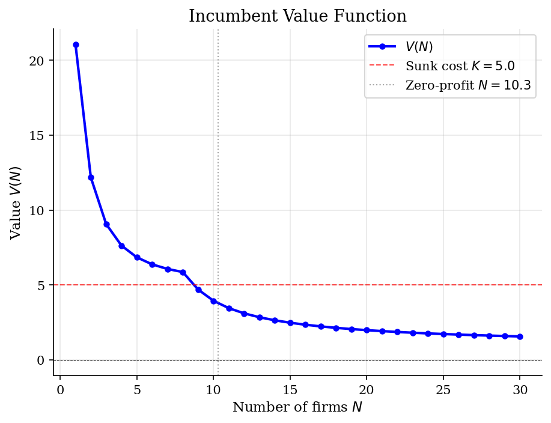
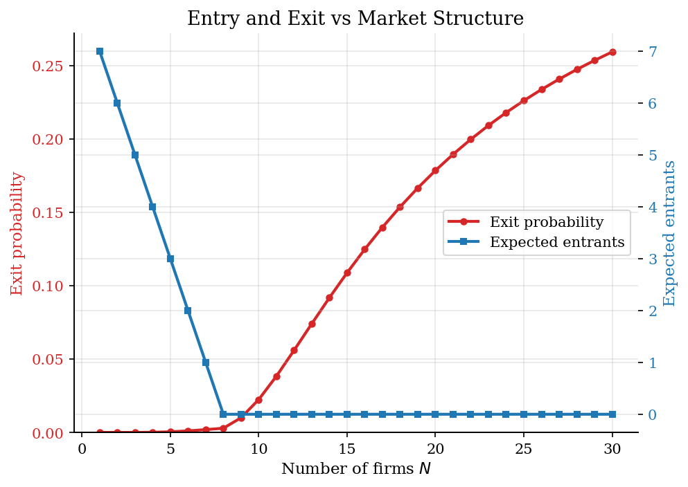
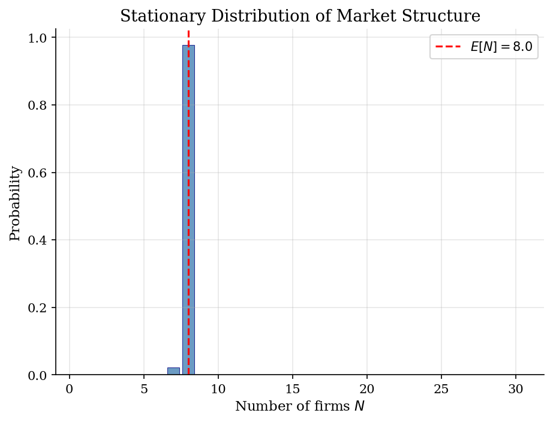
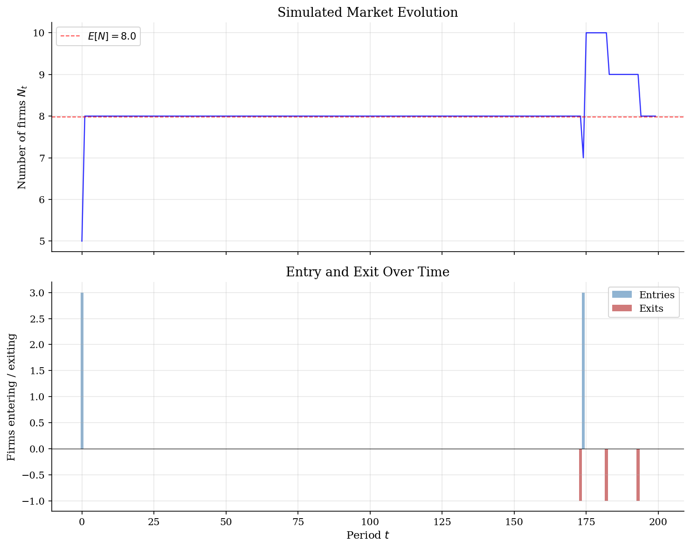

# Dynamic Entry and Exit

> Firm turnover and market structure in an oligopolistic industry with sunk entry costs.

## Overview

This model studies how firms' entry and exit decisions determine market structure over time. Each period, incumbent firms decide whether to continue operating (paying a fixed cost $f$) or exit permanently. Simultaneously, potential entrants decide whether to pay a sunk cost $K$ to enter the market. Firms compete as Cournot oligopolists, so profits depend on the number of active firms.

The model generates a stationary equilibrium with persistent heterogeneity in market structure: even in steady state, there is simultaneous entry and exit ("churning"). This captures a key empirical regularity in industrial organization -- markets exhibit substantial firm turnover despite relatively stable aggregate concentration.

## Equations

**Per-firm Cournot profit with $N$ symmetric firms:**

$$\pi(N) = \frac{(a - c)^2}{b \cdot (N+1)^2}$$

**Incumbent's value function (with logistic idiosyncratic shock $\varepsilon$):**

$$V_I(N) = \sigma_\varepsilon \cdot \log\!\left(1 + \exp\!\left(\frac{\pi(N) - f + \beta \, \mathbb{E}[V_I(N')]}{\sigma_\varepsilon}\right)\right)$$

This is the log-sum (inclusive value) from the logit model. An incumbent stays iff
$\pi(N) - f + \varepsilon + \beta \, \mathbb{E}[V(N')] \geq 0$; the logistic shock
generates a smooth exit probability:

$$p_{\text{exit}}(N) = \frac{1}{1 + \exp\!\big((\pi(N) - f + \beta \, \mathbb{E}[V(N')]) / \sigma_\varepsilon\big)}$$

**Free entry condition:**

$$V_I(N') \leq K$$

Potential entrants enter until the expected value of incumbency (in the post-entry market)
falls below the sunk cost $K$.

**Transition:**

$$N' = \text{Binomial survivors}(N, 1 - p_{\text{exit}}) + \text{Entrants}$$

## Model Setup

| Parameter | Value | Description |
|-----------|-------|-------------|
| $a$       | 10  | Demand intercept |
| $b$       | 1  | Demand slope |
| $c$       | 2  | Marginal cost |
| $f$       | 0.5  | Fixed operating cost (per period) |
| $K$       | 5.0  | Sunk entry cost |
| $\beta$  | 0.95 | Discount factor |
| $\sigma_\varepsilon$ | 1.0 | Logistic shock scale |
| $N_{\max}$ | 30 | Maximum number of firms |

## Solution Method

**Dampened Value Function Iteration (VFI)** with log-sum inclusive values:

1. Initialize $V(N)$ for all states $N = 1, \ldots, N_{\max}$.
2. For each state, compute the exit probability from the logistic choice model using the current $V$.
3. Compute $\mathbb{E}[V(N')]$ by integrating over the binomial distribution of survivors (other $N-1$ incumbents), with free entry determining entrants at each realization.
4. Update $V(N)$ using the log-sum formula with dampening factor 0.3.
5. Iterate until $\|V_{n+1} - V_n\|_\infty < 10^{-8}$.

Converged in **718 iterations** (error = 9.84e-09).

The stationary distribution is computed by constructing the Markov transition matrix $P(N' | N)$ and finding its invariant distribution via power iteration.

## Results


*Incumbent value function V(N): value of being an active firm as a function of market structure*


*Exit probability and expected entry as functions of the number of active firms*


*Stationary distribution of the number of active firms*


*Simulated market: number of firms and entry/exit flows over 200 periods*

**Equilibrium Statistics**

| Statistic                     |     Value |
|:------------------------------|----------:|
| Expected number of firms E[N] |    7.98   |
| Std. deviation of N           |    0.15   |
| Modal number of firms         |    8      |
| Zero-profit N (static)        |   10.3    |
| Per-firm profit at E[N]       |    0.79   |
| Net profit (pi - f) at E[N]   |    0.29   |
| HHI at E[N]                   | 1250      |
| Expected exit rate            |    0.0028 |
| Expected entry (firms/period) |    0.02   |
| VFI iterations                |  718      |

**Value Function and Policies at Selected Market Structures**

|   N |   Profit pi(N) |   Net profit pi-f |   V(N) |   Exit prob |   Entry |
|----:|---------------:|------------------:|-------:|------------:|--------:|
|   1 |         16     |            15.5   | 21.067 |      0      |       7 |
|   2 |          7.111 |             6.611 | 12.178 |      0      |       6 |
|   3 |          4     |             3.5   |  9.067 |      0      |       5 |
|   5 |          1.778 |             1.278 |  6.845 |      0.0004 |       3 |
|   7 |          1     |             0.5   |  6.069 |      0.0019 |       1 |
|  10 |          0.529 |             0.029 |  3.945 |      0.0224 |       0 |
|  15 |          0.25  |            -0.25  |  2.477 |      0.1088 |       0 |
|  20 |          0.145 |            -0.355 |  1.98  |      0.1785 |       0 |
|  25 |          0.095 |            -0.405 |  1.722 |      0.2261 |       0 |
|  30 |          0.067 |            -0.433 |  1.561 |      0.2593 |       0 |

## Economic Takeaway

Dynamic entry/exit models explain why markets have persistent differences in concentration. Entry costs create barriers that sustain above-competitive profits, while exit occurs when negative shocks or increased competition erode incumbents' continuation values.

**Key insights:**
- The value of incumbency declines sharply with $N$: more competitors erode Cournot rents. Beyond a threshold, $V(N) \approx 0$ and firms prefer to exit.
- The sunk cost $K$ creates hysteresis: incumbents only face the per-period cost $f$ to stay, while entrants must pay $K$ up front. This wedge between entry and exit thresholds is the source of persistence in market structure.
- The model generates "churning" -- simultaneous entry and exit even in steady state -- because idiosyncratic shocks push some incumbents below the exit threshold while the market remains attractive enough for new entrants.
- The stationary distribution concentrates near the free-entry equilibrium $N$, but stochastic turnover generates a non-degenerate spread around this point.

## Reproduce

```bash
python run.py
```

## References

- Ericson, R. and Pakes, A. (1995). Markov-perfect industry dynamics: A framework for empirical work. *Review of Economic Studies*, 62(1):53-82.
- Hopenhayn, H. (1992). Entry, exit, and firm dynamics in long run equilibrium. *Econometrica*, 60(5):1127-1150.
- Rust, J. (1987). Optimal replacement of GMC bus engines: An empirical model of Harold Zurcher. *Econometrica*, 55(5):999-1033.
- Pakes, A. and McGuire, P. (1994). Computing Markov-perfect Nash equilibria: Numerical implications of a dynamic differentiated product model. *RAND Journal of Economics*, 25(4):555-589.
