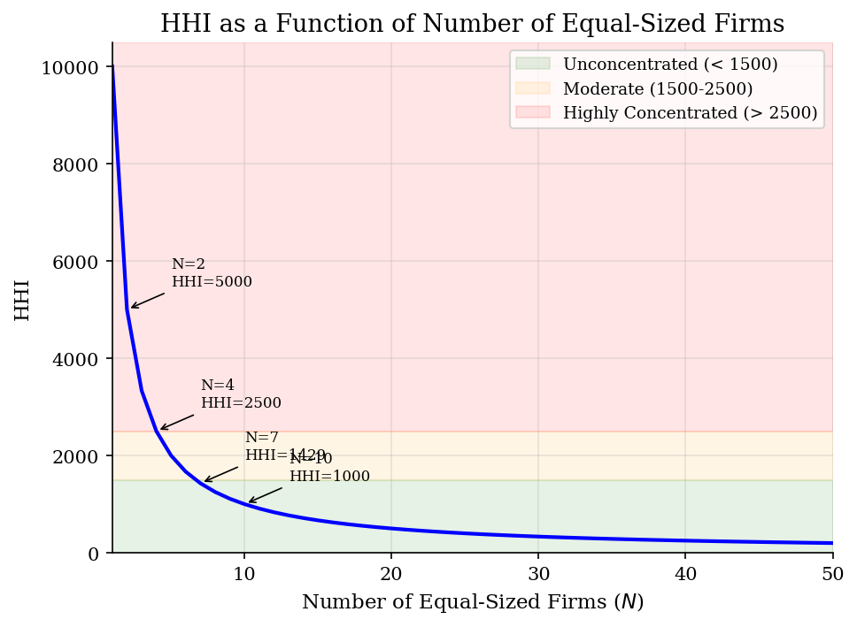
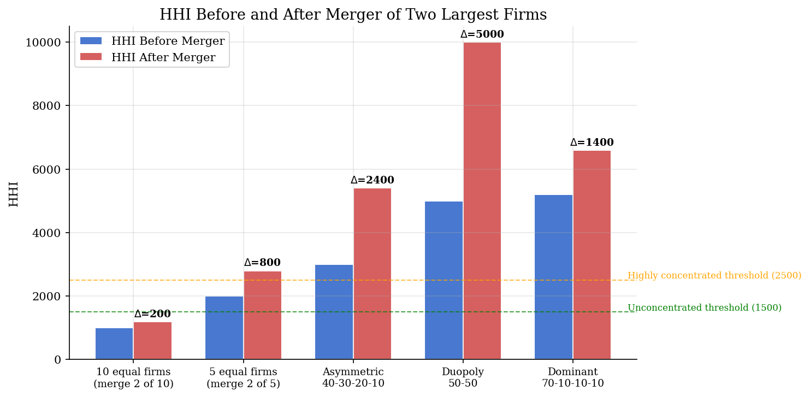
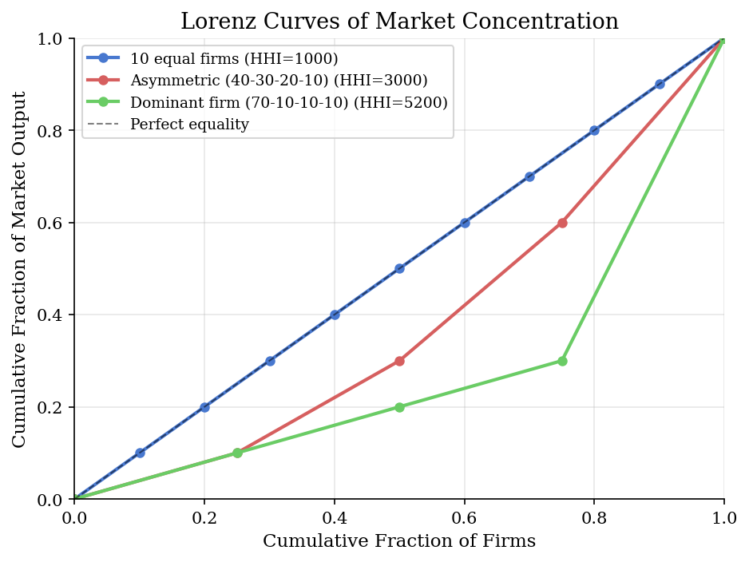

# Effective HHI: Market Concentration and Merger Analysis

> The Herfindahl-Hirschman Index as the standard antitrust screening tool for market concentration and merger review.

## Overview

The Herfindahl-Hirschman Index (HHI) is the most widely used measure of market concentration in antitrust economics. It equals the sum of squared market shares (times 10,000) and ranges from near zero (atomistic competition) to 10,000 (monopoly). The U.S. DOJ and FTC use HHI thresholds to screen horizontal mergers.

This model computes HHI for a variety of market structures, demonstrates the delta-HHI formula for mergers, and compares how concentration changes in segmented versus differentiated product markets.

## Equations

**Herfindahl-Hirschman Index:**

$$\text{HHI} = \sum_{i=1}^{N} s_i^2 \times 10{,}000$$

where $s_i$ is firm $i$'s market share (as a fraction).

**Delta-HHI from a merger of firms $i$ and $j$:**

$$\Delta\text{HHI} = 2 \, s_i \, s_j \times 10{,}000$$

This follows because the merged firm's share is $s_i + s_j$, so
$(s_i + s_j)^2 - s_i^2 - s_j^2 = 2 s_i s_j$.

**DOJ/FTC Merger Guidelines thresholds:**
- HHI < 1,500: **Unconcentrated** — mergers unlikely to raise concerns
- 1,500 $\le$ HHI < 2,500: **Moderately concentrated** — mergers raising HHI by more than 100 warrant scrutiny
- HHI $\ge$ 2,500: **Highly concentrated** — mergers raising HHI by more than 200 presumed to enhance market power

## Model Setup

| Parameter | Value | Description |
|-----------|-------|-------------|
| $N$ | 1 to 100 | Number of firms |
| $s_i$ | Various | Market shares (fractions summing to 1) |
| $\alpha$ | -1.0 | Own-price demand sensitivity |
| $\beta_{\text{seg}}$ | 0.0 | Cross-price sensitivity (segmented) |
| $\beta_{\text{diff}}$ | 0.1 | Cross-price sensitivity (differentiated) |

## Solution Method

**HHI computation** is direct summation of squared shares. For merger analysis, we use the closed-form delta-HHI = $2 s_i s_j \times 10{,}000$.

**Differentiated products equilibrium** uses Bertrand-Nash pricing. Each firm maximizes profit taking rivals' prices as given, with linear demand $q = a + (\partial q / \partial p) \cdot p$. The FOC is:

$$p - c + (\Omega \circ (\partial q / \partial p)^\top)^{-1} q = 0$$

where $\Omega$ is the ownership matrix. We solve this system of equations via `scipy.optimize.fsolve` and compare HHI before and after mergers change $\Omega$.

## Results

**Segmented vs. Differentiated Product Markets (merger of firms 1 and 2):**

| Market Type | HHI Before | HHI After | $\Delta$HHI |
|-------------|-----------|----------|------------|
| Segmented ($\beta=0$) | 3125 | 5937 | 2812 |
| Differentiated ($\beta=0.1$) | 2600 | 4288 | 1688 |

In segmented markets ($\beta = 0$, no cross-price effects), a merger changes ownership but cannot raise prices because products are independent. HHI still changes mechanically through quantity reallocation. In differentiated markets ($\beta > 0$), merged firms internalize cross-price externalities, raising prices on substitutes and amplifying concentration.


*HHI declines as 10000/N for equal-sized firms, with DOJ/FTC threshold regions shaded*


*HHI before and after merger of the two largest firms across market structures*


*Lorenz curves: more bowed curves indicate greater concentration and higher HHI*

**HHI for Example Market Structures**

| Market Structure                |   N Firms |   Top Share (%) |   HHI | Classification          |
|:--------------------------------|----------:|----------------:|------:|:------------------------|
| Perfect competition (100 firms) |       100 |               1 |   100 | Unconcentrated          |
| 10 equal firms                  |        10 |              10 |  1000 | Unconcentrated          |
| 5 equal firms                   |         5 |              20 |  2000 | Moderately Concentrated |
| Asymmetric (40-30-20-10)        |         4 |              40 |  3000 | Highly Concentrated     |
| Duopoly (50-50)                 |         2 |              50 |  5000 | Highly Concentrated     |
| Dominant firm (70-10-10-10)     |         4 |              70 |  5200 | Highly Concentrated     |
| Near-monopoly (90-5-5)          |         3 |              90 |  8150 | Highly Concentrated     |
| Monopoly                        |         1 |             100 | 10000 | Highly Concentrated     |

## Economic Takeaway

The HHI is the workhorse screening tool for antitrust enforcement. Its appeal lies in simplicity: it requires only market shares and has a clean algebraic relationship to merger-induced concentration changes.

**Key insights:**
- For $N$ equal-sized firms, HHI $= 10{,}000/N$. Moving from 10 to 5 firms doubles HHI from 1,000 to 2,000.
- Delta-HHI from a merger equals $2 s_i s_j \times 10{,}000$ — mergers between larger firms generate disproportionately bigger jumps in concentration.
- HHI is a *necessary* but not *sufficient* indicator of market power. Two markets can have the same HHI but very different competitive conditions depending on product differentiation, entry barriers, and demand elasticities.
- In differentiated product markets, the ownership matrix $\Omega$ governs which cross-price effects are internalized. A merger changes $\Omega$ and thereby changes equilibrium prices — even holding costs and demand parameters fixed.
- The DOJ/FTC thresholds (1,500 and 2,500) are screens, not bright lines. Context-specific analysis — including efficiencies, entry, and buyer power — determines the ultimate competitive assessment.

## Reproduce

```bash
python run.py
```

## References

- U.S. Department of Justice & Federal Trade Commission (2010). *Horizontal Merger Guidelines*.
- Werden, G. (1991). "A Robust Test for Consumer Welfare Enhancing Mergers Among Sellers of Differentiated Products." *Journal of Industrial Economics*, 39(4).
- Farrell, J. and Shapiro, C. (1990). "Horizontal Mergers: An Equilibrium Analysis." *American Economic Review*, 80(1), 107-126.
- Tirole, J. (1988). *The Theory of Industrial Organization*. MIT Press, Ch. 5.
