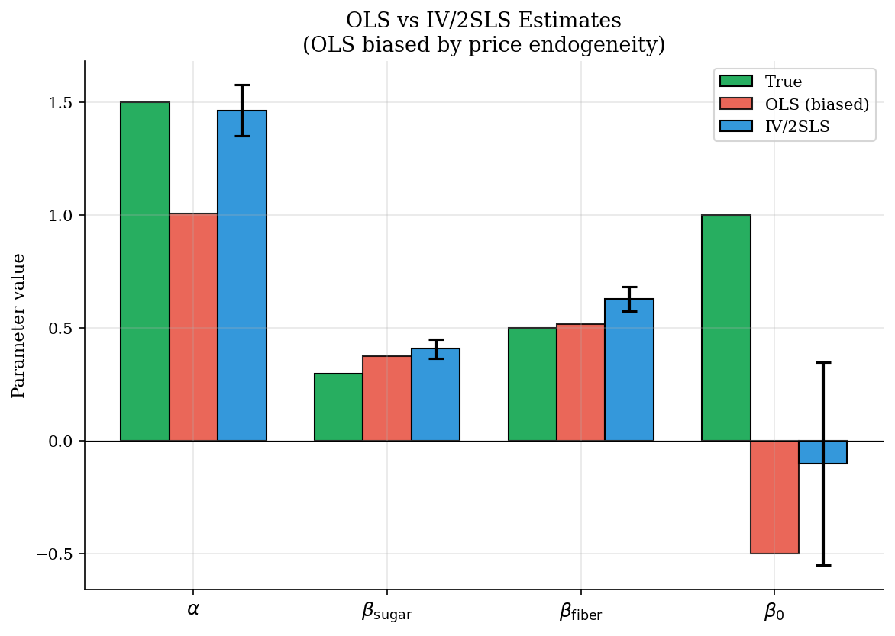
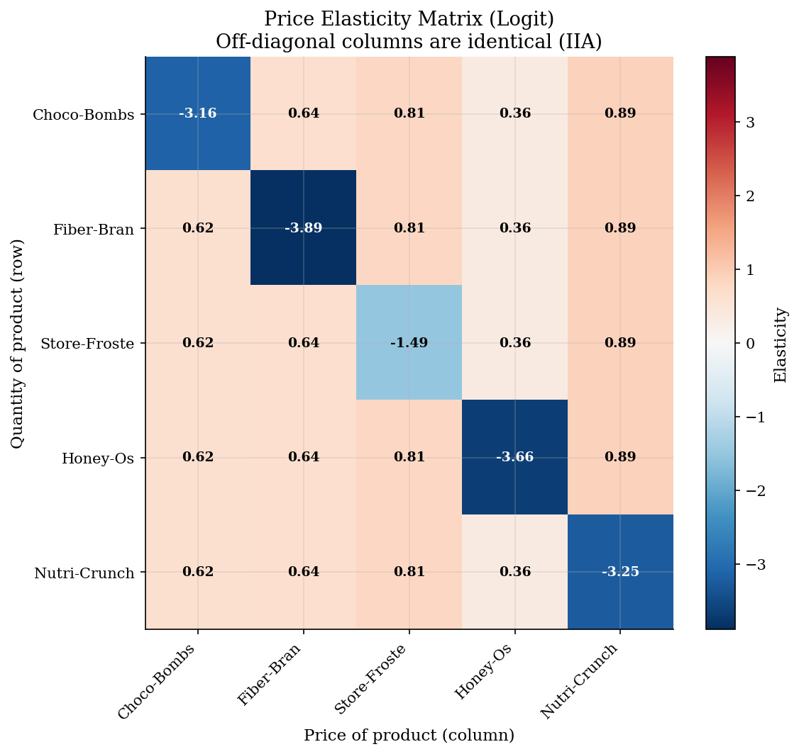
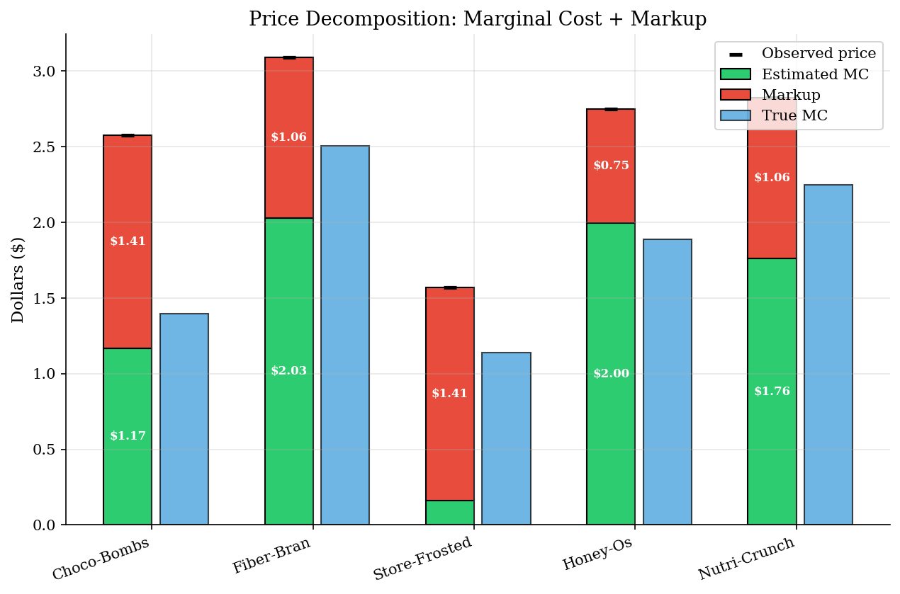
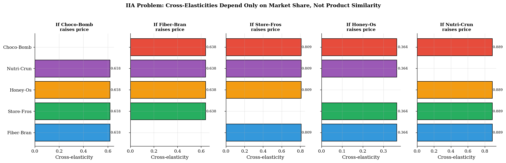

# Logit Demand with Supply-Side Markup Recovery

> Berry (1994) inversion + Bertrand-Nash FOC to recover marginal costs without accounting data.

## Overview

This is the **supply-side companion** to the standard logit discrete-choice demand model. The key innovation: given demand estimates from Berry inversion and IV/2SLS, we can recover each firm's marginal costs from observed prices using the Bertrand-Nash first-order conditions -- *without ever seeing accounting data*.

We generate synthetic cereal market data (5 products, 100 markets), estimate demand via OLS (biased) and IV/2SLS (consistent), compute price elasticities (illustrating the IIA limitation), and then back out markups and marginal costs from the supply side.

## Equations

**Demand (Berry inversion):**

$$\ln s_j - \ln s_0 = \beta_0 + \beta_{\text{sugar}} x_j^{\text{sugar}} + \beta_{\text{fiber}} x_j^{\text{fiber}} - \alpha \, p_j + \xi_j$$

The Berry (1994) inversion transforms the nonlinear share equation into a linear
regression by taking the log-ratio of inside to outside shares.

**Elasticities (IIA limitation):**

$$\eta_{jj} = -\alpha \, p_j (1 - s_j), \qquad \eta_{jk} = \alpha \, p_k \, s_k \quad (j \neq k)$$

Cross-elasticities depend *only* on the rival's price and share, not on product
similarity -- this is the IIA problem.

**Supply side (Bertrand-Nash FOC):**

$$\mathbf{p} - \mathbf{mc} = \Omega^{-1} \mathbf{s}$$

where $\Omega_{jk} = -\frac{\partial s_k}{\partial p_j} \cdot \mathbf{1}[\text{same firm}]$.
Multi-product firms internalise cannibalisation and charge higher markups.

## Model Setup

| Parameter | Value | Description |
|-----------|-------|-------------|
| $\alpha$ | 1.5 | Price sensitivity |
| $\beta_{\text{sugar}}$ | 0.3 | Sugar taste |
| $\beta_{\text{fiber}}$ | 0.5 | Fiber taste |
| $\beta_0$ | 1.0 | Base utility |
| Products | 5 | Choco-Bombs, Fiber-Bran, Store-Frosted, Honey-Os, Nutri-Crunch |
| Markets | 100 | Cross-sectional variation in costs |
| Firms | 3 | Firms 1 and 2 own 2 products each (multi-product) |

## Solution Method

**Step 1 -- Berry Inversion.** Transform observed market shares into mean utilities: $\delta_j = \ln s_j - \ln s_0$. This linearises the logit model.

**Step 2 -- IV/2SLS.** Price is endogenous (correlated with $\xi_j$). We instrument using cost shifters and BLP-style instruments (sum of rival characteristics). The first stage projects price onto the instrument space; the first-stage F-statistic is **303.1** (well above the Stock-Yogo threshold of 10).

**Step 3 -- Markup Recovery.** Given the estimated $\alpha$, compute the matrix of share derivatives $\partial s_j / \partial p_k$. Combine with the ownership matrix to form $\Omega$, then solve $\Omega (\mathbf{p} - \mathbf{mc}) = \mathbf{s}$ for marginal costs.

## Results


*Parameter estimates: True vs OLS (biased) vs IV/2SLS (consistent). OLS attenuates price sensitivity because high-xi products command higher prices.*


*Elasticity matrix. Cross-elasticities in each column are identical -- the IIA limitation of the simple logit.*


*Price = marginal cost + markup. Estimated MC (green, from Bertrand-Nash FOC) compared with true MC (blue). No accounting data required.*


*IIA demonstration. When any product raises its price, substitution to each rival is proportional to that rival's market share -- not to how similar the products are.*

**Estimation Results: True vs OLS vs IV/2SLS**

| Parameter   |   True |    OLS |   IV/2SLS |   IV s.e. |
|:------------|-------:|-------:|----------:|----------:|
| alpha       |    1.5 |  1.009 |     1.465 |     0.058 |
| beta_sugar  |    0.3 |  0.376 |     0.409 |     0.022 |
| beta_fiber  |    0.5 |  0.519 |     0.63  |     0.027 |
| beta_const  |    1   | -0.5   |    -0.1   |     0.23  |

## Economic Takeaway

**1. Endogeneity bias is real and large.** OLS underestimates price sensitivity because high unobserved quality ($\xi_j$) raises both demand and price. IV/2SLS using cost shifters corrects this.

**2. The IIA problem.** The simple logit forces all cross-price elasticities in a column to be identical. If sugary Choco-Bombs raises its price, consumers unrealistically substitute to healthy Fiber-Bran at the same rate as similar Store-Frosted. The nested logit or random-coefficients logit (BLP) fixes this.

**3. Supply-side cost recovery.** Given demand estimates, the Bertrand-Nash FOC lets us back out marginal costs from observed prices and market shares alone. Multi-product firms (who internalise cannibalisation) charge higher markups. This is the foundation of merger simulation: predict how costs, markups, and prices change when the ownership matrix changes.

**Next step:** The BLP random-coefficients logit (see `blp-random-coefficients/`) allows heterogeneous consumers and richer substitution patterns.

## Reproduce

```bash
python run.py
```

## References

- Berry, S. (1994). "Estimating Discrete-Choice Models of Product Differentiation." *RAND Journal of Economics* 25(2), 242-262.
- Berry, S., Levinsohn, J., and Pakes, A. (1995). "Automobile Prices in Market Equilibrium." *Econometrica* 63(4), 841-890.
- Nevo, A. (2001). "Measuring Market Power in the Ready-to-Eat Cereal Industry." *Econometrica* 69(2), 307-342.
- Train, K. (2009). *Discrete Choice Methods with Simulation*. Cambridge University Press, 2nd edition, Ch. 3.
