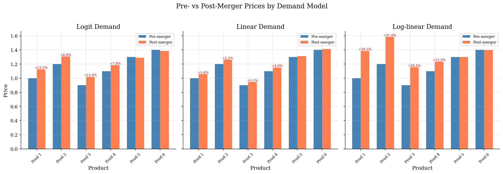
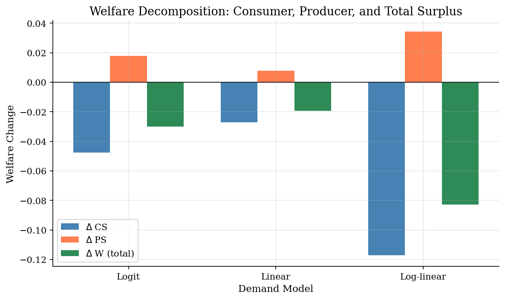
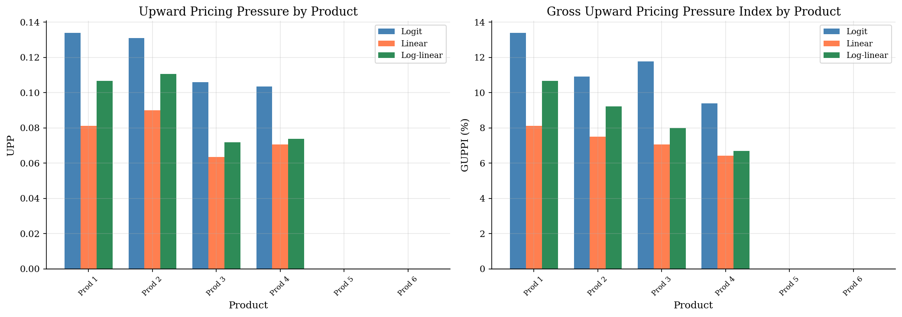
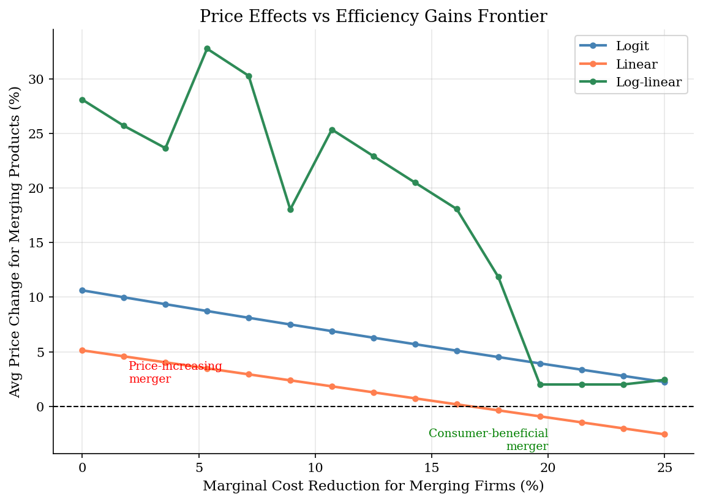

# Merger Simulation with Multiple Demand Systems

> Comparing merger effects across logit, linear, and log-linear demand to show how functional form assumptions drive antitrust policy conclusions.

## Overview

Horizontal merger analysis in differentiated product markets hinges on the assumed demand system. This model calibrates three demand specifications --- logit, linear, and log-linear --- to identical pre-merger data, then simulates the same merger (Firm 1 acquires Firm 2) under each. The results diverge, illustrating a central challenge in structural merger analysis.

**Why demand form matters:**
- **Logit** imposes the IIA property: substitution to the outside good is proportional to share, which overstates escape to non-purchase and can understate price effects among close substitutes.
- **Linear demand** has bounded quantities and a choke price, implying substitution patterns that differ qualitatively from discrete choice.
- **Log-linear (constant elasticity)** demand has no choke price --- demand never reaches zero --- and often predicts the largest price increases because margins are sensitive to elasticity.

We also compute standard antitrust screening metrics: UPP (Upward Pricing Pressure), GUPPI (Gross Upward Pricing Pressure Index), and CMCR (Compensating Marginal Cost Reduction), all of which vary across demand systems.

## Equations

**Bertrand-Nash FOC (general):**
$$q_j + \sum_{k \in \mathcal{F}_f} \frac{\partial q_k}{\partial p_j} (p_k - c_k) = 0 \quad \forall j \in \mathcal{F}_f$$

In matrix form: $\mathbf{q} + (\Omega \circ \mathbf{J}') (\mathbf{p} - \mathbf{c}) = 0$ where $\mathbf{J} = \partial \mathbf{q} / \partial \mathbf{p}'$.

**Logit:** $s_j = \frac{\exp(\xi_j + \alpha p_j)}{1 + \sum_k \exp(\xi_k + \alpha p_k)}$

**Linear:** $q_j = a_j - \sum_k B_{jk} p_k$

**Log-linear:** $\ln q_j = a_j + \sum_k E_{jk} \ln p_k$

**Diversion ratio:** $D_{j \to k} = -\frac{\partial q_k / \partial p_j}{\partial q_j / \partial p_j}$

**UPP:** $\text{UPP}_j = \sum_{k \text{ newly co-owned}} D_{j \to k} \cdot (p_k - c_k)$

**GUPPI:** $\text{GUPPI}_j = \text{UPP}_j / p_j$

**CMCR:** $\text{CMCR}_j = \text{UPP}_j / c_j$ --- marginal cost reduction needed to offset pricing pressure.

## Model Setup

| Parameter | Value | Description |
|-----------|-------|-------------|
| Products $J$ | 6 | 3 firms, 2 products each |
| Shares | [np.float64(0.12), np.float64(0.1), np.float64(0.15), np.float64(0.13), np.float64(0.08), np.float64(0.07)] | Pre-merger market shares |
| Prices | [np.float64(1.0), np.float64(1.2), np.float64(0.9), np.float64(1.1), np.float64(1.3), np.float64(1.4)] | Pre-merger prices |
| Margins | [np.float64(0.4), np.float64(0.35), np.float64(0.45), np.float64(0.4), np.float64(0.3), np.float64(0.28)] | Price-cost margins |
| Outside share | 0.35 | Logit outside good |
| $\alpha$ (logit) | -3.2258 | Calibrated price coefficient |
| Cross-price ratio (linear) | 0.10 | Cross-slope / geometric mean of own-slopes |
| Cross elasticity (log-linear) | 0.30 | Symmetric cross-price elasticities |
| Merger | Firm 1 + Firm 2 | Products 1-4 under common ownership |

## Solution Method

**Step 1: Calibrate** each demand system from the same observed data (shares, prices, margins). The FOC is inverted to recover marginal costs, and demand parameters are chosen to match observed equilibrium.

**Step 2: Verify** FOC residuals at pre-merger prices (logit: 1.1e-02, linear: 2.8e-17, log-linear: 1.4e-17).

**Step 3: Screen** using UPP, GUPPI, and CMCR --- first-order approximations to merger harm that do not require solving the full post-merger equilibrium.

**Step 4: Simulate** by changing the ownership matrix $\Omega$ and solving the new Bertrand-Nash equilibrium via `scipy.optimize.fsolve`.

**Step 5: Evaluate** welfare changes: consumer surplus (CS), producer surplus (PS), and total welfare ($W = CS + PS$).

## Results


*Pre- vs post-merger prices across three demand systems. Merging products (1-4) see larger price increases; the magnitude depends heavily on the demand model.*


*Welfare decomposition across demand systems: consumers lose, producers may gain, and the net effect depends on the demand model.*


*UPP and GUPPI by product and demand model. Only merging products (1-4) have positive values; non-merging products have zero UPP by construction.*


*How much marginal cost reduction is needed to offset the merger price increase? The break-even point differs substantially across demand models.*

**Merger Effects Comparison Across Demand Models**

| Demand Model   |   Avg Price Change (%) |   Max Price Change (%) |   Delta CS |   Delta PS |   Delta W |   Avg GUPPI (%) |   Avg CMCR (%) |
|:---------------|-----------------------:|-----------------------:|-----------:|-----------:|----------:|----------------:|---------------:|
| Logit          |                  10.62 |                  13.38 |    -0.0476 |     0.0178 |   -0.0299 |           11.37 |          19.05 |
| Linear         |                   5.13 |                   5.59 |    -0.0272 |     0.0078 |   -0.0193 |            7.27 |          12.15 |
| Log-linear     |                  27.75 |                  38.51 |    -0.1171 |     0.0344 |   -0.0827 |            8.64 |          14.41 |

## Economic Takeaway

The choice of demand functional form is not innocuous --- it is arguably the most consequential modeling decision in structural merger simulation.

**Key insights:**
- **Logit demand** imposes IIA: all products (including the outside good) absorb diverted sales in proportion to their shares. This typically understates harm from mergers between close substitutes because too much substitution 'escapes' to non-purchase.
- **Linear demand** has finite choke prices and bounded substitution. Cross-price effects depend on the assumed cross-slope parameters, making results sensitive to calibration choices.
- **Log-linear (constant elasticity) demand** has no choke price and can imply very large price effects, especially when own-price elasticities are low (high margins).
- **UPP and GUPPI** are first-order approximations that avoid solving the full post-merger equilibrium. They are useful screens but cannot capture feedback effects (rivals' price responses, demand curvature).
- **CMCR** translates merger harm into the language of efficiency: how large must cost synergies be to leave consumers no worse off? This is the standard the DOJ/FTC apply.
- The **efficiency frontier** plot shows that the break-even cost reduction can differ by a factor of two or more across demand models --- a sobering reminder that policy conclusions are model-dependent.

The practical lesson: robust merger analysis should present results under multiple demand specifications, not rely on a single functional form.

## Reproduce

```bash
python run.py
```

## References

- Werden, G. and Froeb, L. (1994). "The Effects of Mergers in Differentiated Products Industries: Logit Demand and Merger Policy." *Journal of Law, Economics, & Organization*, 10(2).
- Farrell, J. and Shapiro, C. (2010). "Antitrust Evaluation of Horizontal Mergers: An Economic Alternative to Market Definition." *The B.E. Journal of Theoretical Economics*, 10(1).
- Werden, G. (1996). "A Robust Test for Consumer Welfare Enhancing Mergers Among Sellers of Differentiated Products." *Journal of Industrial Economics*, 44(4).
- Nevo, A. (2000). "Mergers with Differentiated Products: The Case of the Ready-to-Eat Cereal Industry." *RAND Journal of Economics*, 31(3).
- Berry, S., Levinsohn, J., and Pakes, A. (1995). "Automobile Prices in Market Equilibrium." *Econometrica*, 63(4).
