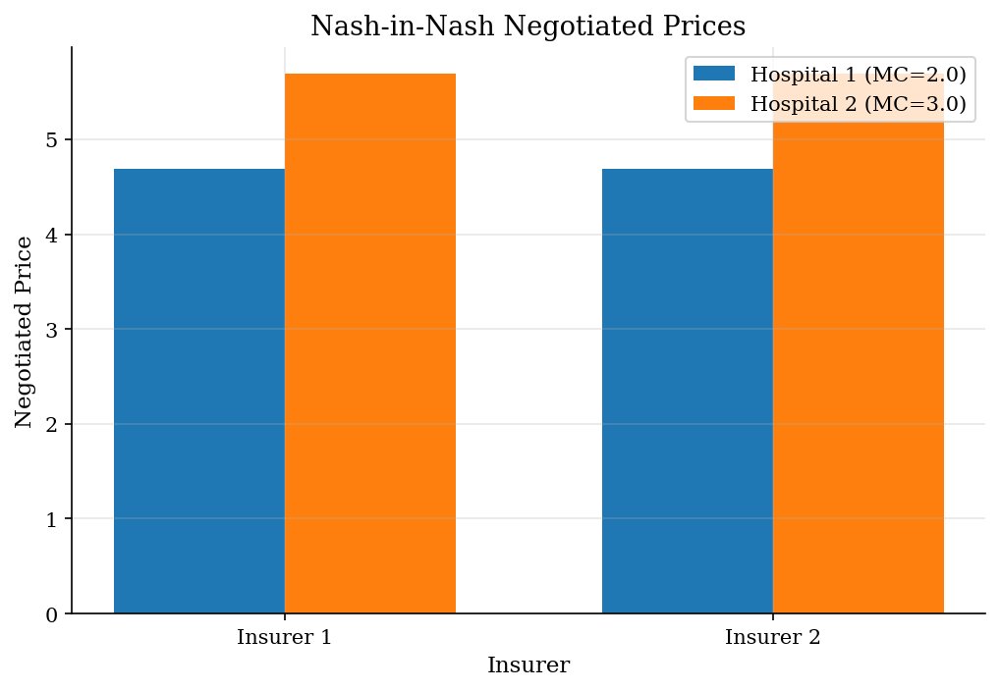
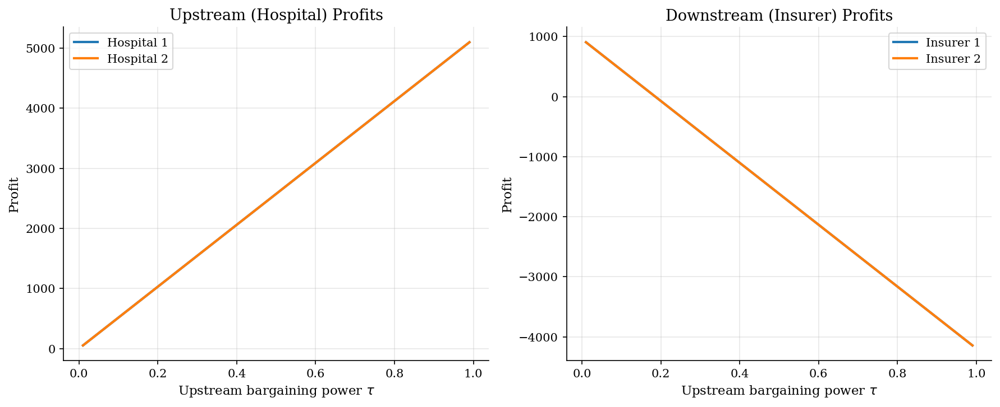
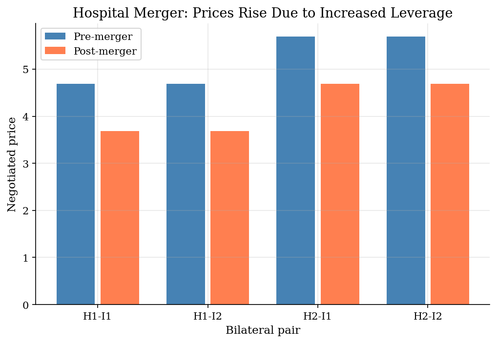

# Nash-in-Nash Bargaining

> Bilateral negotiations in vertical markets between upstream suppliers and downstream firms.

## Overview

The Nash-in-Nash framework models bilateral negotiations in markets with vertical structure: upstream firms (hospitals, manufacturers) negotiate prices with downstream firms (insurers, retailers). Each bilateral pair bargains simultaneously, taking other pairs' agreements as given.

This model is widely used in health economics (hospital-insurer negotiations) and retail (manufacturer-retailer bargaining). The key insight: a firm's bargaining leverage depends on its *incremental value* — how much the other side loses by walking away from this specific deal.

## Equations

**Nash bargaining solution** for pair $(u, d)$:
$$p_{ud}^* = \arg\max_{p} \left(\pi_u^{\text{agree}} - \pi_u^{\text{disagree}}\right)^\tau \left(\pi_d^{\text{agree}} - \pi_d^{\text{disagree}}\right)^{1-\tau}$$

**Simplified form (linear surplus):**
$$p_{ud}^* = \tau \cdot \frac{\Delta_d(u)}{q_d} + c_u$$

where $\Delta_d(u) = (P_d - c_d)(q_d^{\text{agree}} - q_d^{\text{disagree}})$ is hospital $u$'s incremental value to insurer $d$.

**Key property:** Negotiated price depends on the *outside option* — what happens if this specific deal falls through while all other deals remain in place.

## Model Setup

| Parameter | Value | Description |
|-----------|-------|-------------|
| Upstream firms | 2 | Hospitals |
| Downstream firms | 2 | Insurers |
| $\tau$ | 0.5 | Upstream bargaining power |
| $\alpha$ | 10.0 | Consumer WTP per hospital |
| MC upstream | [np.float64(2.0), np.float64(3.0)] | Hospital marginal costs |
| Market size | 1000 | Potential enrollees |

## Solution Method

Each bilateral negotiated price is computed analytically from the Nash bargaining solution. The key step is computing the disagreement payoff: what demand would each insurer face if it lost access to a specific hospital? This determines each hospital's *incremental value* and hence its bargaining leverage.

## Results


*Negotiated prices: higher-cost hospital commands higher price*


*Profits shift from downstream to upstream as bargaining power increases*


*Hospital merger raises all negotiated prices by increasing outside option*

**Nash-in-Nash Negotiation Results**

| Pair                   |   Pre-merger price |   Post-merger price |   Change (%) |   Demand (full) |   Demand (disagree) |
|:-----------------------|-------------------:|--------------------:|-------------:|----------------:|--------------------:|
| Hospital 1 - Insurer 1 |             4.6923 |              3.6896 |       -21.37 |           478.3 |               110.4 |
| Hospital 1 - Insurer 2 |             4.6923 |              3.6896 |       -21.37 |           478.3 |               110.4 |
| Hospital 2 - Insurer 1 |             5.6923 |              4.6896 |       -17.62 |           478.3 |               110.4 |
| Hospital 2 - Insurer 2 |             5.6923 |              4.6896 |       -17.62 |           478.3 |               110.4 |

## Economic Takeaway

Nash-in-Nash bargaining reveals how vertical market structure affects prices:

**Key insights:**
- **Incremental value = leverage**: a hospital that is *essential* to an insurer's network commands a higher negotiated price. The outside option (network without that hospital) determines bargaining power.
- **Bargaining power matters**: as $\tau$ increases, surplus shifts from insurers to hospitals. At $\tau = 1$, hospitals extract all incremental value.
- **Hospital mergers raise prices**: when hospitals merge, the combined entity negotiates as a single unit, and the disagreement point becomes losing *both* hospitals — a much worse threat. This increases leverage and prices.
- **Policy implication**: antitrust authorities should focus on *incremental value* rather than market share alone when evaluating hospital mergers.

## Reproduce

```bash
python run.py
```

## References

- Horn, H. and Wolinsky, A. (1988). "Bilateral Monopolies and Incentives for Merger." *RAND Journal of Economics*, 19(3).
- Crawford, G. and Yurukoglu, A. (2012). "The Welfare Effects of Bundling in Multichannel Television Markets." *American Economic Review*, 102(2).
- Ho, K. and Lee, R. (2017). "Insurer Competition in Health Care Markets." *Econometrica*, 85(2).
