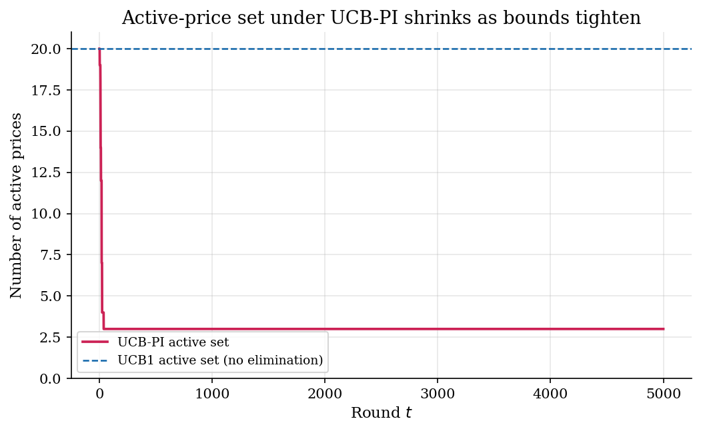
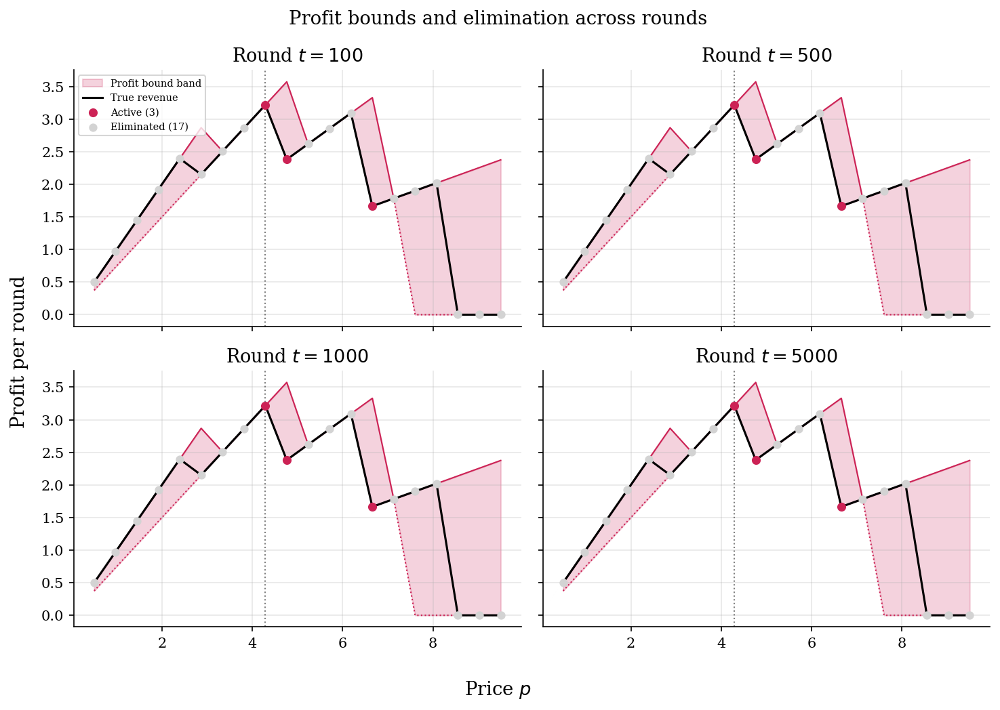
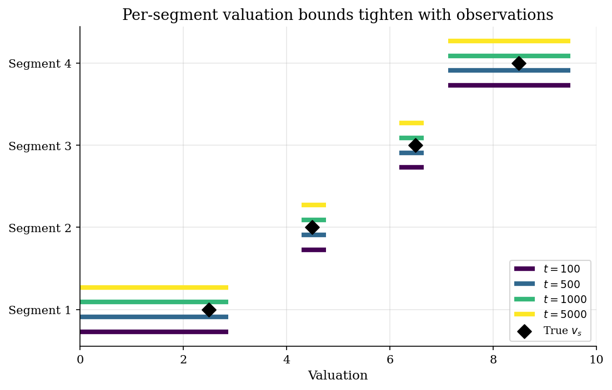
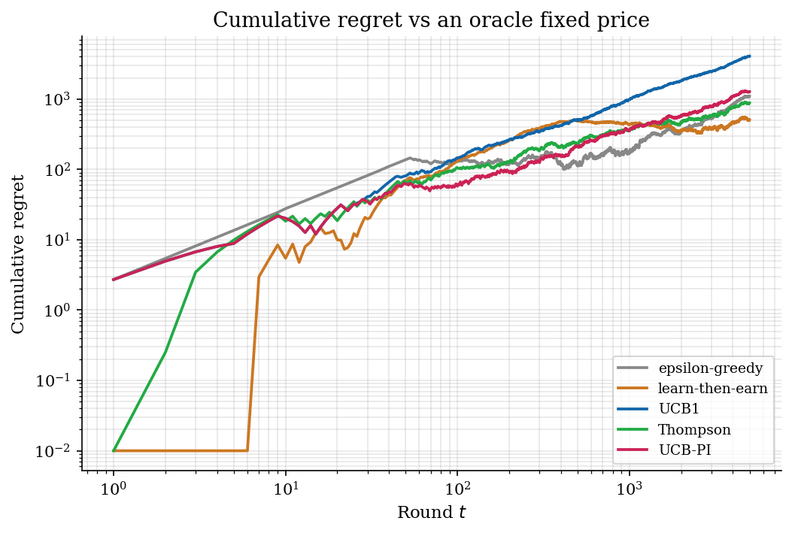

# Online Pricing with Revealed-Preference Bounds

## Overview

A seller posts prices on a discrete grid for many rounds. Each round one
customer arrives and either buys or walks away. The seller never observes
the customer's reservation value directly; the only signal is the binary
outcome at the posted price. Over time the seller wants to converge to the
revenue-maximising price without paying too much in lost revenue while
learning.

Pure bandit algorithms (epsilon-greedy, UCB1, Thompson sampling) treat each
price on the grid as an independent arm. They learn each arm's expected
revenue separately, with no shared information across arms. That is
wasteful here, because purchase decisions are monotone in price: a customer
who buys at price `p` would also buy at any lower price, and a customer who
walks away at `p` will also walk away at any higher price. Economists
recognise this as a revealed-preference restriction.

This tutorial uses that monotonicity to convert each observation into a
valuation bound on the arriving customer's segment. Bounds across segments
imply lower and upper demand at every price, which in turn imply lower and
upper expected profit at every price. Any price whose upper-profit bound
falls below some other price's lower-profit bound is dominated and can be
eliminated from the active set. The UCB with partial identification
(UCB-PI) hybrid runs standard UCB1 over the shrinking active set.

The economic content is essential. Without the WARP-style monotonicity the
seller cannot link observations across prices and arms, and UCB1 keeps
twenty prices in play indefinitely. With the monotonicity, the active set
collapses to a handful of prices within the first hundred rounds, and the
seller spends the rest of the horizon refining estimates only inside that
small set.

## Equations

Let $`s \in \{1, \ldots, S\}`$ index segments with fixed but unknown
valuations $`v_s`$. The seller posts prices on a discrete grid
$`\{p_1, \ldots, p_K\}`$ over $`[0, V_{\max}]`$. At round $`t`$ a segment
$`s_t`$ arrives uniformly at random and either buys or does not. Per-round
revenue is denoted $`\mathrm{rev}_t`$ (the spec reserves $`r_t`$ for
regret):

```math
y_t = \mathbf{1}\{v_{s_t} \geq p_t\}, \qquad \mathrm{rev}_t = p_t \, y_t.
```

The oracle benchmark is the best fixed price under the population valuation
distribution:

```math
p^{\ast} = \arg\max_{p \in \{p_1, \ldots, p_K\}} p \cdot \frac{1}{S}
\sum_{s=1}^S \mathbf{1}\{v_s \geq p\}.
```

Cumulative regret after $`T`$ rounds against $`p^{\ast}`$ is

```math
\mathrm{Reg}(T) = T \cdot \mathbb{E}[\mathrm{rev} \mid p^{\ast}]
- \sum_{t=1}^T \mathrm{rev}_t.
```

WARP-style bound updates after observing $`(s_t, p_t, y_t)`$ are

```math
\begin{aligned}
y_t = 1 &\implies v_{s_t}^{L} \leftarrow \max(v_{s_t}^{L}, p_t),\\
y_t = 0 &\implies v_{s_t}^{U} \leftarrow \min(v_{s_t}^{U}, p_t).
\end{aligned}
```

These bounds imply lower and upper demand at any price $`p`$, here written
as per-arrival fractions (the spec's count form differs by a factor of
$`1/S`$ and gives the same dominance comparison):

```math
D_{L}(p) = \frac{1}{S} \sum_{s=1}^S \mathbf{1}\{v_s^{L} \geq p\}, \qquad
D_{U}(p) = \frac{1}{S} \sum_{s=1}^S \mathbf{1}\{v_s^{U} \geq p\}.
```

The corresponding profit bounds are $`\pi_{L}(p) = p \, D_{L}(p)`$ and
$`\pi_{U}(p) = p \, D_{U}(p)`$, and the dominance elimination rule is

```math
\text{drop } p \text{ if } \pi_{U}(p) \leq \max_q \pi_{L}(q).
```

UCB-PI then runs UCB1 over the surviving prices, with the index

```math
\mathrm{UCB}_t(p) = \widehat{\mathrm{rev}}_t(p) + p_{\max}
\sqrt{\frac{2 \log(t+1)}{n_t(p)}},
```

where $`\widehat{\mathrm{rev}}_t(p)`$ is the empirical mean per-round
revenue at price $`p`$ and $`n_t(p)`$ is the number of rounds it has been
played.

## Model Setup

| Symbol | Meaning | Value |
|---|---|---|
| $`S`$ | Number of segments | 4 |
| $`v_s`$ | True segment valuations | 2.5, 4.5, 6.5, 8.5 |
| $`V_{\max}`$ | Upper bound on any valuation | 10.0 |
| $`K`$ | Number of grid prices | 20 |
| $`p_1, \ldots, p_K`$ | Price grid | uniform on $`[0.5, 9.5]`$ |
| $`T`$ | Horizon | 5000 rounds |
| $`p^{\ast}`$ | Oracle best price | 4.29 |
| $`\mathbb{E}[r \mid p^{\ast}]`$ | Oracle revenue per round | 3.22 |

The segment sequence $`(s_1, \ldots, s_T)`$ is drawn once and shared across
all algorithms so that comparisons are not confounded by arrival noise.

## Solution Method

Five algorithms share the bandit interface: at each round they pick a
price from the active set, observe a buy or no-buy, and update internal
state. UCB-PI adds segment-level bound updates and a dominance filter.

```text
Inputs: prices P, segments [s_1..s_T], valuations v, horizon T, V_max
State (UCB-PI): counts n, empirical means m, lower bounds vL, upper bounds vU,
       active mask A (initialised to all True)

For t in 1..T:
    1. Compute UCB index over A: score[k] = m[k] + p_max sqrt(2 log t / n[k]).
    2. Pick k = argmax score[k] for k in A.
    3. Observe arrival s_t and outcome y_t = 1{v[s_t] >= P[k]}.
    4. r_t = P[k] * y_t.  Update n[k] and m[k].
    5. Update segment bounds:
           if y_t == 1: vL[s_t] = max(vL[s_t], P[k])
           else        : vU[s_t] = min(vU[s_t], P[k])
    6. Recompute demand bounds D_L, D_U at every price.
       Recompute profit bounds piL = P * D_L, piU = P * D_U.
       Set A = {k : piU[k] >= max piL}.
```

The four baselines drop steps 5-6 and treat each price as an independent
arm. UCB1 uses the same index but never eliminates, so its active set is
always the full grid. Thompson sampling keeps a Beta posterior on the buy
probability at each price. Epsilon-greedy explores uniformly with
probability $`0.10`$ and otherwise plays the empirical-best price.
Learn-then-earn explores uniformly for the first $`400`$ rounds, then
commits.

## Results

The active-price set under UCB-PI shrinks from 20 to 3 by the first
diagnostic checkpoint at round 100 and stays there for the rest of the
horizon. UCB1 keeps all 20 prices in play throughout, because nothing in
its update rule lets one price's observations rule out another.



The remaining three active prices straddle the oracle price 4.29 and
account for the prices that are still consistent with the tightened demand
bounds. The profit-bound band shows how WARP-style observations turn what
was an unknown revenue function into a band that the true revenue curve
visibly lives inside, and how the band collapses quickly around the
empirical maximum.



The segment-level valuation bounds tighten in a structured way: segment 1
$`(v_1 = 2.5)`$ has its upper bound pulled down by every no-buy at higher
prices, while segment 4 $`(v_4 = 8.5)`$ has its lower bound pushed up by
buys at moderate prices.



The cumulative-regret comparison shows the honest picture for this short
horizon. Final cumulative regrets are: learn-then-earn 504, Thompson 874,
epsilon-greedy 1094, UCB-PI 1269, UCB1 4074. Learn-then-earn happens to
land on a near-oracle price after its 400-round commit phase. UCB-PI's
final regret ranks fourth of five, beating only UCB1. UCB1 looks worst
because the standard UCB1 confidence bonus is scaled by
$`p_{\max} \approx 9.5`$, which is too aggressive for a problem where most
rewards are zero. The pedagogical point is not that UCB-PI minimises
regret here; it is that UCB-PI achieves comparable regret while playing
on a price set of size 3 instead of 20. That active-set collapse is what
economic structure buys, and it is robust across seeds, while the regret
leaderboard is sensitive to bonus scaling, prior choice, and explore-phase
length.



The tables back this up. The final regret rows show each algorithm's
choice in the last 500 rounds; UCB-PI converges to a near-oracle price
with a tiny active set. The elimination diagnostics show how fast the
active set collapses.

## Takeaway

The tutorial's main lesson is that economic structure converts a learning
problem with `K` independent arms into one with a small handful of
plausible arms, almost immediately. The active-set shrinkage from 20 to 3
within the first hundred rounds is far faster than any UCB-style
confidence bound could contract on its own. The bound-based filter is information-free in
the bandit sense: it does not use any empirical reward statistic. It uses
only that purchase is monotone in price, which is exactly the place where
revealed-preference logic earns its keep.

Cumulative-regret rates depend strongly on bonus scaling, prior choice,
and horizon. The standard UCB1 confidence bonus assumes rewards in
$`[0, 1]`$ and is mis-scaled for problems with large revenue heterogeneity.
Tuning the bonus, using UCB-V, or running multiple seeds would tighten
the regret comparison; the pedagogical point about active-set shrinkage
under UCB-PI is robust to those choices.

A natural follow-up is to add inventory or finite horizon, at which point
the problem becomes Gallego and van Ryzin (1994)-style dynamic pricing
with a state variable. That sits in `dynamic-programming/` rather than
here.

## References

1. Auer, P., Cesa-Bianchi, N. and Fischer, P. (2002). "Finite-time
   Analysis of the Multiarmed Bandit Problem." *Machine Learning* 47,
   235-256.
2. Manski, C. F. (2003). *Partial Identification of Probability
   Distributions.* Springer.
3. Lattimore, T. and Szepesvari, C. (2020). *Bandit Algorithms.*
   Cambridge University Press.
4. Cohen, M. C., Lobel, I. and Paes Leme, R. (2020). "Feature-Based
   Dynamic Pricing." *Management Science* 66(11), 4921-4943.
5. Russo, D., Van Roy, B., Kazerouni, A., Osband, I. and Wen, Z. (2018).
   "A Tutorial on Thompson Sampling." *Foundations and Trends in Machine
   Learning* 11(1), 1-96.

**See also.** The static Bertrand pricing equilibrium with ownership
matrices is in [`industrial-organization/bertrand-ownership-matrix/`](../bertrand-ownership-matrix/);
this tutorial replaces the static FOC with an online-learning algorithm
under revealed-preference structure. Counterfactual merger pricing on top
of estimated demand is in [`industrial-organization/merger-simulation/`](../merger-simulation/).
