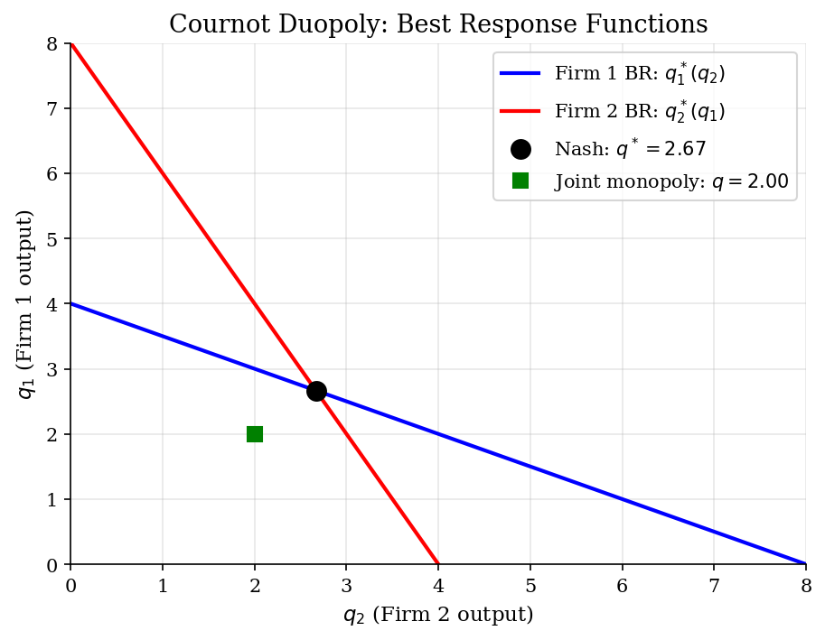
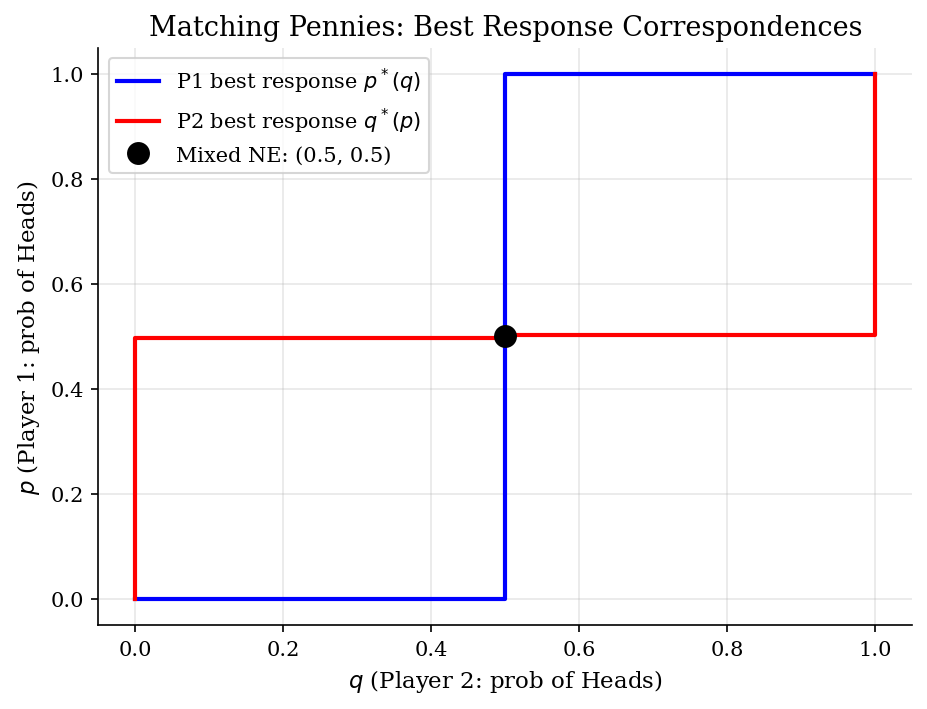
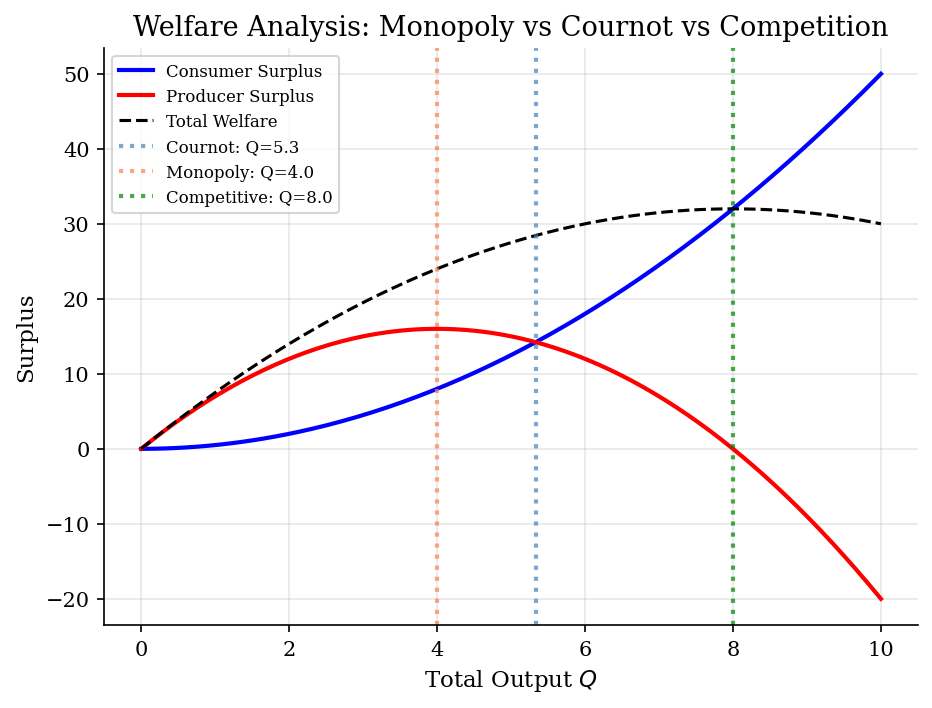

# Static Games and Nash Equilibrium

> Pure and mixed strategy Nash equilibria in normal-form games with applications to IO.

## Overview

Static (simultaneous-move) games are the foundation of strategic analysis in industrial organization. Players choose strategies simultaneously, and the outcome depends on the combination of all players' choices. A Nash equilibrium is a strategy profile where no player can improve their payoff by unilaterally deviating.

This module covers: classic 2x2 games (Prisoner's Dilemma, Matching Pennies, Battle of the Sexes), Cournot duopoly with best-response functions, and a tennis serve application of mixed strategy equilibrium.

## Equations

**Nash Equilibrium:** A strategy profile $(s_1^*, s_2^*)$ is a NE if:
$$u_1(s_1^*, s_2^*) \geq u_1(s_1, s_2^*) \quad \forall s_1, \qquad u_2(s_1^*, s_2^*) \geq u_2(s_1^*, s_2) \quad \forall s_2$$

**Mixed Strategy NE (2x2):** Player 2 mixes with probability $q$ on action 0 to make Player 1 indifferent:
$$q = \frac{A_{11} - A_{01}}{(A_{00} - A_{10}) - (A_{01} - A_{11})}$$

**Cournot Best Response:** Given linear demand $P = a - bQ$ and constant MC $c$:
$$q_i^*(q_j) = \frac{a - c - bq_j}{2b}, \qquad q^{NE} = \frac{a-c}{3b}$$

## Model Setup

**Cournot parameters:** $a = 10$ (demand intercept), $b = 1$ (slope), $c = 2$ (marginal cost)

**Tennis serve game:** Server wins with probabilities:

| | Receiver Left | Receiver Right |
|---|---|---|
| **Server Left** | 0.30 | 0.80 |
| **Server Right** | 0.90 | 0.20 |

## Solution Method

**Pure NE:** Enumerate all strategy profiles and check mutual best response.

**Mixed NE (2x2):** Solve the indifference conditions analytically.

**Cournot:** Find the intersection of best-response functions.

**Tennis NE:** Server plays Left with probability 0.58, Receiver plays Left with probability 0.50.

## Results


*Cournot best responses intersect at Nash equilibrium*


*Matching Pennies: only equilibrium is mixed (0.5, 0.5)*


*Cournot output lies between monopoly and competitive levels*

**Nash Equilibria in Classic 2x2 Games**

| Game                | Pure NE                              | Mixed NE       |
|:--------------------|:-------------------------------------|:---------------|
| Prisoner's Dilemma  | (Defect, Defect)                     | None           |
| Matching Pennies    | None                                 | p=0.50, q=0.50 |
| Battle of the Sexes | (Opera, Opera), (Football, Football) | p=0.60, q=0.40 |

**Cournot vs Monopoly vs Competition**

| Market Structure    |   Total Output Q |   Price |   Profit per firm |
|:--------------------|-----------------:|--------:|------------------:|
| Monopoly            |             4    |    6    |             16    |
| Cournot Duopoly     |             5.33 |    4.67 |              7.11 |
| Perfect Competition |             8    |    2    |              0    |

## Economic Takeaway

Static games provide the micro-foundations for industrial organization:

**Key insights:**
- **Prisoner's Dilemma**: Both firms defect (compete aggressively) even though cooperation would be mutually beneficial — this is why cartels are unstable.
- **Mixed strategies**: In games with no pure NE (like Matching Pennies or tennis serves), players randomize to keep opponents indifferent. The mixing probabilities depend on the OTHER player's payoffs, not your own.
- **Cournot**: Duopoly output lies between monopoly and competition. As the number of firms increases, output approaches the competitive level Q=8.
- **Welfare**: Cournot creates deadweight loss relative to perfect competition, but less than monopoly. This is the quantitative basis for antitrust policy.

## Reproduce

```bash
python run.py
```

## References

- Nash, J. (1950). "Equilibrium Points in N-Person Games." *Proceedings of the National Academy of Sciences*, 36(1).
- Osborne, M. and Rubinstein, A. (1994). *A Course in Game Theory*. MIT Press.
- Tirole, J. (1988). *The Theory of Industrial Organization*. MIT Press, Ch. 5.
