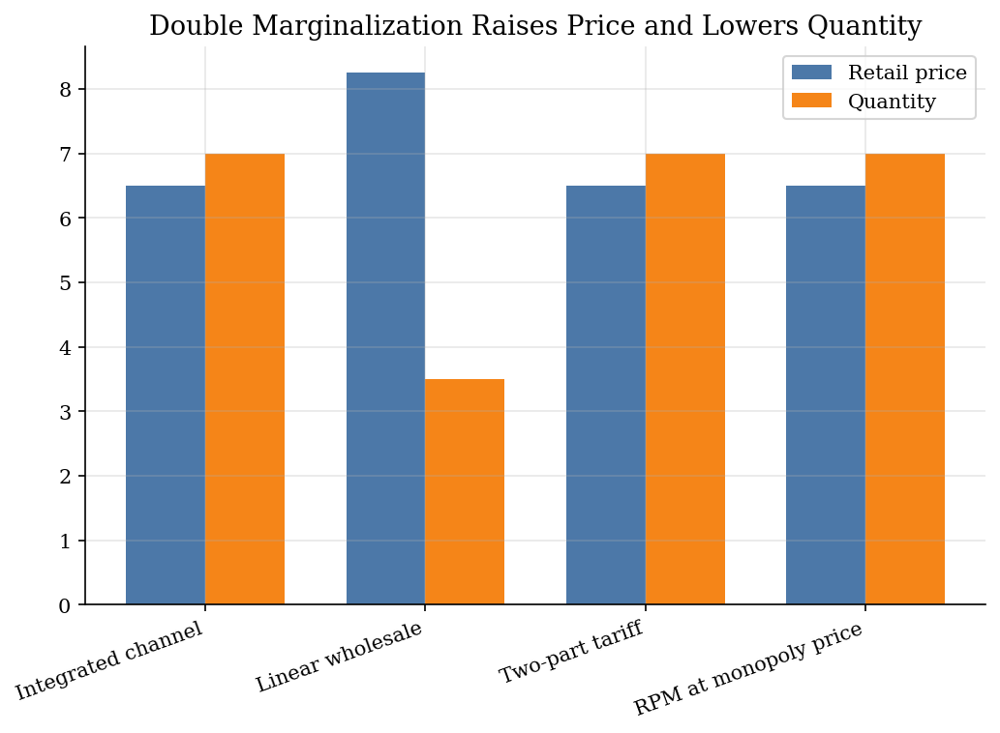
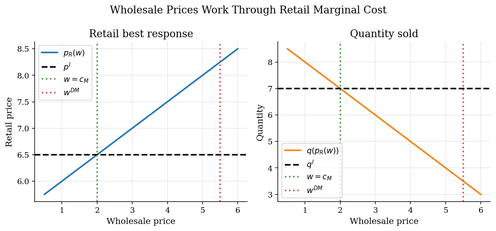

# Double Marginalization in Vertical Supply Chains

## Overview

A manufacturer sells through an independent retailer. The manufacturer sets wholesale terms. The retailer sets the shelf price. Consumers buy from the retailer.

The object is double marginalization. A linear wholesale price makes the retailer treat the upstream markup as marginal cost. The retailer then adds its own markup, so the channel charges too much and sells too little.

The computation solves the integrated channel and the separated game. Backward induction gives the wholesale price, retail price, quantity, and profits under each contract.

## Equations

Demand follows

```math
q(p)=a-bp,\qquad p\leq \bar p\equiv a/b,
```

where $`p`$ is the retail price. The choke price is $`\bar p`$. Costs are $`c_M`$
upstream and $`c_R`$ downstream.

The integrated channel solves

```math
\Pi^I(p)=(p-c_M-c_R)q(p),
```

so the joint-profit price is

```math
p^I=\frac{\bar p+c_M+c_R}{2}.
```

Under a linear wholesale price $`w`$, the retailer solves

```math
\max_p\ (p-w-c_R)q(p).
```

Its best response is

```math
p_R(w)=\frac{\bar p+w+c_R}{2}.
```

The manufacturer chooses $`w`$ while anticipating that response:

```math
\max_w\ (w-c_M)q(p_R(w)),
```

which gives

```math
w^{DM}=\frac{\bar p-c_R+c_M}{2}.
```

Because $`w^{DM}>c_M`$, the retailer acts as if marginal cost is too high.

A two-part tariff sets

```math
w^{TPT}=c_M
```

and uses the fixed fee

```math
F=(p^I-c_M-c_R)q(p^I)
```

to transfer operating profit upstream.

The fee changes the profit split without changing the retailer's margin.

## Worked Numerical Example

To see double marginalization in one step, take a simple linear-demand channel with $`b = 1`$ and $`c_R = 0`$, so $`q = a - p`$, and solve both regimes by hand.

Set $`a = 10`$ and $`c_M = 2`$, giving choke price $`\bar p = 10`$.

Start with the decentralized channel and work backward from the retailer's problem. The retailer takes $`w`$ as given and solves

```math
\max_p\ (p - w)\,(10 - p).
```

The first-order condition is

```math
10 - p - (p - w) = 0 \implies \boxed{p_R(w) = \frac{10 + w}{2}},
```

which matches the general best-response $`p_R(w) = (\bar p + w + c_R)/2`$ at $`\bar p = 10`$, $`c_R = 0`$.

The manufacturer anticipates this response and solves

```math
\max_w\ (w - 2)\,\left(10 - \frac{10 + w}{2}\right) = (w - 2)\,\frac{10 - w}{2}.
```

The first-order condition is

```math
\frac{d}{dw}\left[\frac{(w-2)(10-w)}{2}\right]
  = \frac{(10 - w) - (w - 2)}{2}
  = \frac{12 - 2w}{2} = 0
\implies \boxed{w^{DM} = 6}.
```

Substituting back: $`p_R = (10 + 6)/2 = 8`$, quantity $`q = 10 - 8 = 2`$, manufacturer profit $`(6 - 2)(2) = 8`$, retailer profit $`(8 - 6)(2) = 4`$, channel profit $`8 + 4 = 12`$.

Now compare the integrated channel. A single owner sets $`p`$ to maximize

```math
(p - c_M)\,q(p) = (p - 2)(10 - p).
```

The first-order condition gives

```math
p^I = \frac{10 + 2}{2} = 6, \qquad q^I = 10 - 6 = 4, \qquad \Pi^I = (6 - 2)(4) = 16.
```

The two regimes compare as follows:

| Regime | $`w`$ | $`p`$ | $`q`$ | Channel profit |
|--------|-------|-------|-------|----------------|
| Integrated | $`-`$ | $`6`$ | $`4`$ | $`16`$ |
| Decentralized | $`6`$ | $`8`$ | $`2`$ | $`12`$ |

Double marginalization raises the retail price by $`(8 - 6)/6 \approx 33\%`$ and destroys $`16 - 12 = 4`$ units of channel profit. The mechanism is visible in the manufacturer's FOC: because $`w^{DM} = 6 > c_M = 2`$, the retailer treats the manufacturer's markup as marginal cost and marks up again, pricing too high and selling too little.

## Model Setup

The calibration is small enough to solve analytically. Each number uses the same unit. The integrated channel is a benchmark, not an ownership assumption.

| Parameter | Value | Description |
|-----------|-------|-------------|
| $`a`$ | 20.0 | Demand intercept |
| $`b`$ | 2.0 | Demand slope |
| $`\bar p=a/b`$ | 10.0 | Choke price |
| $`c_M`$ | 2.0 | Manufacturer marginal cost |
| $`c_R`$ | 1.0 | Retail service cost |
| Contracts | 3 | Integrated benchmark, linear wholesale, two-part tariff |

## Solution Method

The solution follows the order of moves. Each step uses the same demand curve, so price and quantity are comparable across contracts.

```text
Inputs: demand q(p)=a-bp, costs c_M and c_R

1. Integrated channel
    p_I = (a/b + c_M + c_R) / 2
    q_I = q(p_I)

2. Linear wholesale game
    Retailer best response: p_R(w) = (a/b + w + c_R) / 2
    Manufacturer FOC for max (w-c_M) q(p_R(w)) has the closed-form
        solution w_DM = (a/b - c_R + c_M) / 2, evaluated directly
    Evaluate p_R(w_DM), q(p_R(w_DM)), profits, and surplus

3. Two-part tariff
    Two-part tariff: set w=c_M, p=p_I, and fixed fee F=(p_I-c_M-c_R)q_I

Outputs: contract outcomes and pass-through curve p_R(w)
```

The comparison treats the fixed fee as a transfer. It changes the profit split, not the retailer's marginal cost.

## Results

The integrated channel charges $`6.50`$ and sells 7.0 units. Linear wholesale pricing raises the retail price to $`8.25`$ and cuts quantity to 3.5. The two-part tariff returns price and quantity to the integrated line.



The wholesale-price sweep varies only $`w`$. The retailer's best response price rises with $`w`$. At $`w^{DM}`$, quantity falls below the integrated benchmark.



The table reports the same comparison in numbers. Channel profit and consumer surplus fall only when quantity falls. The fixed fee moves operating profit upstream.

**Contract outcomes**

| Contract             |   Retail price |   Wholesale price |   Fixed fee |   Quantity |   Channel profit |   Consumer surplus |   Total surplus |   Manufacturer profit |   Retailer profit |
|:---------------------|---------------:|------------------:|------------:|-----------:|-----------------:|-------------------:|----------------:|----------------------:|------------------:|
| Integrated benchmark |           6.5  |               2   |         0   |        7   |            24.5  |              12.25 |           36.75 |                  0    |             24.5  |
| Linear wholesale     |           8.25 |               5.5 |         0   |        3.5 |            18.38 |               3.06 |           21.44 |                 12.25 |              6.12 |
| Two-part tariff      |           6.5  |               2   |        24.5 |        7   |            24.5  |              12.25 |           36.75 |                 24.5  |              0    |

## Takeaway

Double marginalization comes from the retailer's perceived marginal cost. A high wholesale price raises that cost and lowers quantity. A two-part tariff sets $`w=c_M`$, so the retailer chooses the integrated price. The fixed fee then allocates profit.

## References

- Tirole, J. (1988). *The Theory of Industrial Organization*. MIT Press.
