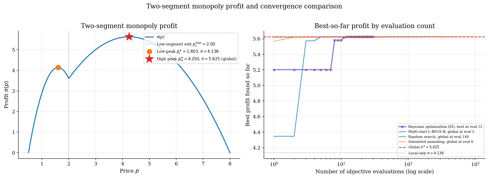

# Bayesian Optimization with a Gaussian-Process Surrogate

## Overview

Before Mockus (1978), global optimization of expensive black-box functions had no principled way to use information already collected when choosing where to evaluate next. Multi-start gradient methods and random search treated each evaluation as independent, spending hundreds to thousands of queries on objectives that cost seconds to minutes per call. Mockus filled that gap by placing a Gaussian-process prior on the unknown objective, deriving the *Expected Improvement* integral in closed form, and proposing the sequential fit-then-query loop that defines Bayesian optimization today. Jones, Schonlau, and Welch (1998) then packaged these ideas into the EGO algorithm, adding a kriging surrogate familiar to engineers and a principled stopping rule, and validating the approach against gradient methods on hard benchmarks.

Bayesian optimization chooses each next evaluation by maximizing an acquisition function that trades off exploration of uncertain regions against exploitation of high-mean regions. On problems with a few tens of dimensions and expensive black-box evaluations, this loop typically finds the global optimum in tens of evaluations rather than thousands.

The objective here is the same two-segment monopoly profit used in [`numerical-methods/global-search-multistart/`](../../numerical-methods/global-search-multistart/). It is cheap to evaluate, which makes it a poor production target for Bayesian optimization. It is a good teaching target. The two local peaks are well separated, the global is known analytically, and the head-to-head budget is directly comparable to multi-start, random search, and simulated annealing on the same problem.

## Read before

- [`numerical-methods/gaussian-processes/`](../../numerical-methods/gaussian-processes/)
- [`numerical-methods/global-search-multistart/`](../../numerical-methods/global-search-multistart/)
- [`bayesian-methods/bayesian-foundations/`](../../bayesian-methods/bayesian-foundations/)

## Equations

A monopolist faces a population of consumers split between two segments.
Segment $`L`$ has linear demand with intercept $`A_L > 0`$ and slope $`b_L > 0`$.
Segment $`H`$ has linear demand with intercept $`A_H > 0`$ and slope $`b_H > 0`$.

```math
D_L(p) = \max\lbrace 0,  A_L - b_L p \rbrace
```

```math
D_H(p) = \max\lbrace 0,  A_H - b_H p \rbrace
```

With low-segment share $`\lambda \in (0, 1)`$ and constant marginal cost $`c \ge 0`$, the mixture profit is

```math
\pi(p) = (p - c) \left[\lambda D_L(p) + (1 - \lambda)  D_H(p)\right].
```

The objective is piecewise quadratic in $`p`$ with a strict local maximum at the both-segments peak $`p_L^{\ast}`$ and a global maximum at the high-only peak $`p_H^{\ast}`$.
On the calibration used here, $`p_L^{\ast} \approx 1.603`$ with $`\pi \approx 4.14`$, and $`p_H^{\ast} = 4.25`$ with $`\pi \approx 5.625`$.

Bayesian optimization treats $`\pi`$ as an unknown function on a bracket $`\mathcal{X} = [p_{\mathrm{lo}}, p_{\mathrm{hi}}]`$.
It places a probabilistic prior on $`\pi`$, updates that prior to a posterior conditional on the evaluations collected so far, and selects the next evaluation by maximizing an acquisition function on the posterior.

The GP prior, the squared-exponential kernel, and the closed-form posterior mean $`\mu(x_\ast)`$ and variance $`\sigma^2(x_\ast)`$ are derived in [`numerical-methods/gaussian-processes/`](../../numerical-methods/gaussian-processes/). Here the prior is over the unknown profit function on the bracket $`\mathcal{X}`$, the mean is fixed at the sample mean of the observed targets, and the kernel is the squared-exponential with length scale $`\ell`$ and signal scale $`\sigma_f`$. The posterior variance collapses to zero at evaluated points, which is why Expected Improvement never re-queries the same input.

Let $`f^{\ast} = \max_{i \le n} y_i`$ denote the best observed value so far.
Expected Improvement scores a candidate $`x \in \mathcal{X}`$ by the expected positive gain over $`f^{\ast}`$, with expectation taken under the GP posterior at $`x`$:

```math
\mathrm{EI}(x) = \mathbb{E}\left[\max\lbrace f(x) - f^{\ast} - \xi,  0 \rbrace \mid X, y \right].
```

The parameter $`\xi \ge 0`$ is an exploration tilt, in units of the objective.
Since $`f(x) \mid X, y \sim \mathcal{N}(\mu(x), \sigma^2(x))`$, the expectation is a truncated-Gaussian integral with the closed form

```math
\mathrm{EI}(x) = (\mu(x) - f^{\ast} - \xi)  \Phi(z) + \sigma(x)  \phi(z),
```

```math
z = \frac{\mu(x) - f^{\ast} - \xi}{\sigma(x)},
```

valid whenever $`\sigma(x) > 0`$.
Here $`\Phi`$ and $`\phi`$ denote the cumulative distribution function and probability density function of the standard normal distribution $`\mathcal{N}(0, 1)`$.

## Worked Numerical Example

After a handful of evaluations the GP has been conditioned on the observed prices and profits. Suppose that at a candidate price $`x`$ the posterior mean is $`\mu(x) = 5.2`$ and the posterior standard deviation is $`\sigma(x) = 0.5`$, and the best profit observed so far is $`f^{\ast} = 4.5`$. With exploration tilt $`\xi = 0`$, the *standardized improvement* is

```math
z = \frac{\mu(x) - f^{\ast}}{\sigma(x)} = \frac{5.2 - 4.5}{0.5} = 1.4.
```

Substituting into the closed-form EI expression with $`\Phi(1.4) = 0.9192`$ and $`\phi(1.4) = 0.1497`$:

```math
\mathrm{EI}(x)
  = (\mu(x) - f^{\ast})\,\Phi(z) + \sigma(x)\,\phi(z)
  = (0.7)(0.9192) + (0.5)(0.1497)
  = \boxed{0.718}.
```

The exploitation term contributes $`0.643`$ and the exploration term $`0.075`$: the posterior mean already sits well above $`f^{\ast}`$, so the candidate is mostly an exploit pick. If instead the posterior mean were $`\mu(x) = 4.5`$ (no expected gain), then $`z = 0`$, and EI reduces to $`\sigma(x)\,\phi(0) = 0.5 \times 0.399 = 0.199`$, which is pure exploration. At an already-evaluated point, $`\sigma(x) = 0`$ and EI collapses to zero, which is why the loop never re-queries the same input.

## Model Setup

| Symbol | Value | Symbol | Value |
|--------|------:|--------|------:|
| $`A_L`$, $`b_L`$ | 10.0, 5.0 | $`A_H`$, $`b_H`$ | 8.0, 1.0 |
| Marginal cost $`c`$ | 0.5 | Low-segment share $`\lambda`$ | 0.6 |
| Search bracket | $`[0.501,  8.0]`$ | Local peak $`p_L^{\ast}`$ | 1.6029, $`\pi = 4.136`$ |
| Global peak $`p_H^{\ast}`$ | 4.25, $`\pi = 5.625`$ | Initial design | 5 uniform, seed 0 |
| BO iterations | 25 | Total BO budget | 30 |
| Kernel signal std $`\sigma_f`$ | 2.00 | Kernel noise std $`\sigma_n`$ | 1e-03 |
| Length-scale grid | $`[0.30,  2.50]`$, 12 pts | EI tilt $`\xi`$ | 0.00 |

## Solution Method

Bayesian optimization is a single loop. Fit a Gaussian-process surrogate to the evaluations collected so far, maximize an acquisition function on the surrogate to pick the next point, evaluate the true objective there, and repeat. The length scale $`\ell`$ is refit at each step by maximizing the log marginal likelihood over a coarse grid, which avoids the optimizer-inside-optimizer problem of joint hyperparameter and acquisition maximization.

```
            prior GP, acquisition function, budget n
                              |
                              v
    +---------- BO loop ----------+
    |  GP --> [ acquisition max ] --> x_new  |
    |  x_new --> [ GP update ] --> GP        |
    +-------- n queries remain: repeat ------+
                              |
                       budget exhausted
                              v
                    x*, f(x*), posterior GP
```

```python
# Outer loop: fit GP and pick next point by Expected Improvement.
def bo_step(X, y, acq_grid, sigma_f, sigma_n, length_grid, xi=0.0):
    f_best = float(np.max(y))

    # refit length scale by log marginal likelihood grid search
    ell = fit_length_scale(X, y, sigma_f, sigma_n, length_grid)
    gp = GaussianProcess(length_scale=ell, sigma_f=sigma_f, sigma_n=sigma_n).fit(X, y)

    # posterior mean and std on candidate grid
    mu, sd = gp.predict(acq_grid)

    # EI(x) = (mu - f_best - xi) * Phi(z) + sd * phi(z)
    ei = expected_improvement(mu, sd, f_best, xi=xi)

    # x_new = argmax EI on grid
    x_new = float(acq_grid[int(np.argmax(ei))])
    return x_new, gp
```

On this calibration the loop locates the global peak well before the thirty-evaluation budget is exhausted. When evaluations are cheap, multi-start L-BFGS-B or simulated annealing dominates on wall-clock time even though it uses far more evaluations.

## Results

The profit surface is reproduced from [`numerical-methods/global-search-multistart/`](../../numerical-methods/global-search-multistart/). It has a local peak at $`p_L^{\ast} = 1.603`$ with profit $`\pi = 4.136`$. Above the kink at $`p_L^{\max} = 2.00`$ only the high-valuation segment is active. The high-only regime has its own peak at $`p_H^{\ast} = 4.25`$ with profit $`\pi = 5.625`$, which is the global maximum on this calibration. Bayesian optimization with Expected Improvement finds the global at evaluation 12 and converges sharply within its budget of 30 evaluations. Random search needs 140 draws before luck delivers an above-global point. Multi-start L-BFGS-B spends 312 gradient calls in total across 50 starts. Simulated annealing locates the global early in this run but burns roughly 1007 evaluations on its cooling schedule. The right comparison is total budget, not first discovery.



The four panels show the Gaussian-process posterior at 5, 10, 20, and 30 evaluations. With 5 uniform draws the posterior mean is flat between observations and the uncertainty band is wide. Expected Improvement immediately probes regions of high mean and high variance, which on this surface means evaluating points near the high-price peak. By iteration 20 the posterior mean tracks the true profit closely in both basins, and by iteration 30 Expected Improvement has localized around $`p_H^{\ast} = 4.25`$ with very small posterior variance.


The comparison table is normalized on the same objective and bracket. All four methods recover the global peak.

### Method comparison at $`\lambda = 0.6`$, $`c = 0.5`$, segment intercepts $`(10, 8)`$

| Method | Setting | Estimated optimum | Profit | Function evaluations | Evaluations to global |
|:-------|:--------|------------------:|-------:|---------------------:|----------------------:|
| Bayesian optimization (EI) | 5 initial + 25 EI steps, seed 0 | 4.2505 | 5.625 | 30 | 12 |
| Multi-start L-BFGS-B | 50 starts, seed 2 | 4.25 | 5.625 | 312 | 5 |
| Random search | 500 draws, seed 1 | 4.2532 | 5.625 | 500 | 140 |
| Simulated annealing | max iterations 500, seed 3 | 4.25 | 5.625 | 1007 | 6 |

The iteration log records every Bayesian-optimization evaluation with Expected Improvement. The first 5 rows are the initial uniform design. The remaining 25 rows are EI-chosen evaluations. The best-so-far column converges to the global peak well before the 30-evaluation budget is exhausted.

### Per-iteration log of the EI-driven Bayesian-optimization run

| Iteration | Phase | Price evaluated | Profit observed | Best profit so far |
|----------:|:------|----------------:|----------------:|-------------------:|
| 1 | initial | 5.2776 | 5.2026 | 5.2026 |
| 2 | initial | 2.5241 | 4.4335 | 5.2026 |
| 3 | initial | 0.8083 | 1.9889 | 5.2026 |
| 4 | initial | 0.6249 | 0.884 | 5.2026 |
| 5 | initial | 6.5997 | 3.4165 | 5.2026 |
| 6 | EI-guided | 5.5403 | 4.959 | 5.2026 |
| 7 | EI-guided | 1.6633 | 4.1236 | 5.2026 |
| 8 | EI-guided | 4.5805 | 5.5813 | 5.5813 |
| 9 | EI-guided | 3.6356 | 5.474 | 5.5813 |
| 10 | EI-guided | 8 | 0 | 5.5813 |
| 11 | EI-guided | 4.1005 | 5.6161 | 5.6161 |
| 12 | EI-guided | 4.258 | 5.625 | 5.625 |
| 13 | EI-guided | 4.2505 | 5.625 | 5.625 |
| 14 | EI-guided | 4.2505 | 5.625 | 5.625 |
| 15 | EI-guided | 4.2505 | 5.625 | 5.625 |
| 16 | EI-guided | 4.2505 | 5.625 | 5.625 |
| 17 | EI-guided | 4.2505 | 5.625 | 5.625 |
| 18 | EI-guided | 4.2505 | 5.625 | 5.625 |
| 19 | EI-guided | 4.2505 | 5.625 | 5.625 |
| 20 | EI-guided | 4.2505 | 5.625 | 5.625 |
| 21 | EI-guided | 4.2505 | 5.625 | 5.625 |
| 22 | EI-guided | 4.2505 | 5.625 | 5.625 |
| 23 | EI-guided | 4.2505 | 5.625 | 5.625 |
| 24 | EI-guided | 4.2505 | 5.625 | 5.625 |
| 25 | EI-guided | 4.2505 | 5.625 | 5.625 |
| 26 | EI-guided | 4.2505 | 5.625 | 5.625 |
| 27 | EI-guided | 4.2505 | 5.625 | 5.625 |
| 28 | EI-guided | 4.2505 | 5.625 | 5.625 |
| 29 | EI-guided | 4.2505 | 5.625 | 5.625 |
| 30 | EI-guided | 4.2505 | 5.625 | 5.625 |

## Takeaway

*Precautionary querying* is the entire pitch. Bayesian optimization pays for sample efficiency with stronger assumptions on the objective. The Expected Improvement derivation that Mockus published in 1978 turned out to be remarkably durable: Jones et al. (1998) showed it transfers directly from abstract Bayesian theory to practical engineering optimization, and the same closed form still drives modern hyperparameter tuning for neural networks decades later. That durability was the paper's quantitative surprise. The framework went on to anchor surrogate-based optimization across disciplines, from drug discovery to materials design to automated machine learning.

Bayesian optimization is the wrong tool when evaluations are cheap. The Gaussian-process posterior costs cubic time in the number of evaluations. On a problem where one evaluation takes milliseconds, multi-start gradient descent dominates on wall-clock time. Bayesian optimization is also fragile in high dimensions. The squared-exponential kernel assumes a single length scale across the whole input space. Beyond about twenty dimensions the curse of dimensionality erodes the sample-efficiency gain, and the right tool is a structured surrogate or a trust-region method.

## See also

- [`numerical-methods/gaussian-processes/`](../../numerical-methods/gaussian-processes/)
- [`computational-methods/metropolis-hastings/`](../../computational-methods/metropolis-hastings/)
- [`computational-methods/hamiltonian-monte-carlo/`](../../computational-methods/hamiltonian-monte-carlo/)

## References

- Mockus, J., Tiesis, V., and Zilinskas, A. (1978). The application of Bayesian methods for seeking the extremum. In *Towards Global Optimization*, vol. 2, North-Holland, 117-129.
- Jones, D. R., Schonlau, M., and Welch, W. J. (1998). Efficient Global Optimization of Expensive Black-Box Functions. *Journal of Global Optimization*, 13, 455-492.
- Snoek, J., Larochelle, H., and Adams, R. P. (2012). Practical Bayesian Optimization of Machine Learning Algorithms. *NIPS*.
- Frazier, P. I. (2018). A Tutorial on Bayesian Optimization. arXiv:1807.02811.
- Rasmussen, C. E. and Williams, C. K. I. (2006). *Gaussian Processes for Machine Learning*. MIT Press, Ch. 2 and 5.
