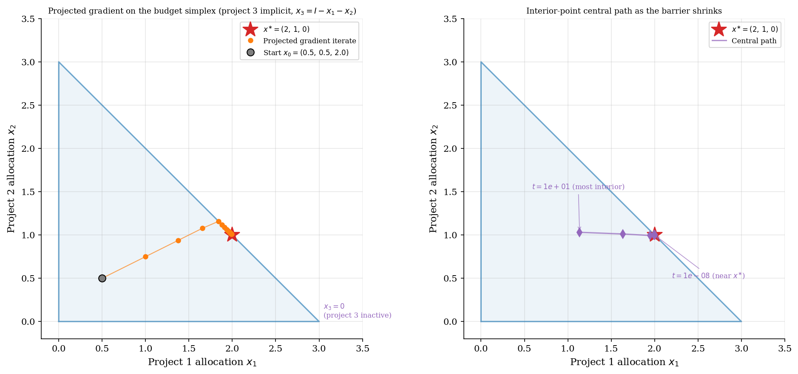
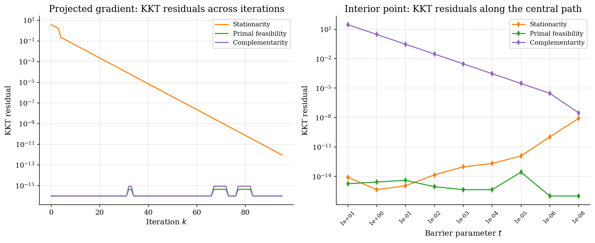
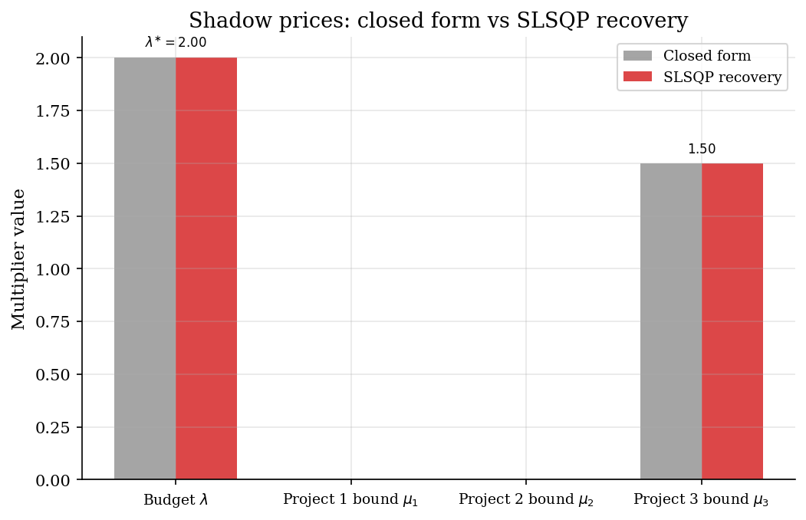

# Constrained Optimization and KKT Conditions

## Overview

A planner has a fixed budget and three projects to fund. Each project has diminishing returns. Allocations cannot be negative. The question is how the planner should split the budget when one of the projects is too weak to fund at all.

Lagrange multipliers for inequality constraints were known informally before 1939. Karush (1939) derived the necessary conditions in his master's thesis. Kuhn and Tucker (1951) independently published the same conditions and attached a rigorous proof of sufficiency under convexity. The surprise was that the multipliers are not auxiliary algebra: they are *shadow prices* that the economist reads to learn the cost of each binding constraint. That dual interpretation, absent from earlier Lagrangian analysis, is the lasting contribution.

This tutorial compares three methods that solve the constrained problem. Before the methods, a baseline ignores the non-negativity bounds. The baseline returns a negative allocation, which is the failure mode that motivates the rest of the tutorial. The three methods are projected gradient, an interior-point log barrier, and SLSQP. All three return the correct allocation. They differ in how they keep iterates feasible and in how they recover the multipliers.

## Read before

- [`numerical-methods/scalar-optimization-monopoly-pricing/`](../../numerical-methods/scalar-optimization-monopoly-pricing/)
- [`numerical-methods/root-finding/`](../../numerical-methods/root-finding/)

## Equations

The planner picks an allocation vector $`x \in \mathbb{R}^3`$.
Each entry $`x_j`$ is the budget share assigned to project $`j`$.
Utility is quadratic in $`x`$.

```math
u(x) = a^\top x - \tfrac{1}{2}  x^\top B x.
```

$`a \in \mathbb{R}^3`$ is the vector of marginal returns at zero allocation.
$`B`$ is a symmetric positive-definite matrix.
A positive-definite $`B`$ makes $`u`$ strictly concave, so the constrained maximum is unique.
The diagonal entries of $`B`$ measure each project's curvature.

Two constraints bind the choice.
The first is a budget cap on total spending.

```math
\sum_{j=1}^{3} x_j \leq I.
```

The second is a non-negativity bound on each project.

```math
x_j \geq 0, \quad j = 1, 2, 3.
```

The *Lagrangian* builds in both constraints.
$`\lambda`$ is the multiplier on the budget cap.
$`\mu = (\mu_1, \mu_2, \mu_3)`$ are the multipliers on the three non-negativity bounds.

```math
\mathcal{L}(x, \lambda, \mu) = a^\top x - \tfrac{1}{2}  x^\top B x - \lambda \left(\sum_j x_j - I \right) + \mu^\top x.
```

A KKT point is the constrained optimum when the problem is convex.
The KKT conditions split into four blocks.
Each block has a clean economic reading.

The first block is stationarity.
It equates the gradient of utility with the shadow-price vector.

```math
a - B x - \lambda \mathbf{1} + \mu = 0.
```

The second block is primal feasibility.
It is just the constraint set written out again.

```math
\sum_j x_j \leq I, \qquad x_j \geq 0.
```

The third block is dual feasibility.
It says every shadow price is non-negative.

```math
\lambda \geq 0, \qquad \mu_j \geq 0.
```

The fourth block is complementary slackness.
It says either a constraint binds or its multiplier is zero, never both simultaneously.

```math
\lambda \left(I - \sum_j x_j \right) = 0, \qquad \mu_j x_j = 0.
```

The baseline calibration is $`a = (4, 3, 0.5)`$, $`B = I_3`$, and $`I = 3`$.
The unconstrained maximum is $`a`$ itself.
Its sum exceeds the budget of $`3`$.
The budget therefore binds at the constrained optimum.
An active-set check shows that project 3 also hits its non-negativity bound.
With those two constraints active, the closed form is direct.

```math
x^{\ast} = (2,  1,  0),
\qquad
\lambda^{\ast} = 2,
\qquad
\mu^{\ast} = (0,  0,  1.5).
```

The non-zero multiplier $`\mu_3^{\ast} = 1.5`$ is the shadow price of the non-negativity bound on project 3.
It is the utility a vanishingly small relaxation of $`x_3 \geq 0`$ would buy.

## Worked Numerical Example

To see how the four KKT blocks pin down the answer, solve the baseline calibration $`a = (4, 3, 0.5)`$, $`B = I_3`$, $`I = 3`$ by hand. With $`B`$ diagonal the stationarity block collapses to one scalar equation per project.

```math
a_j - x_j - \lambda + \mu_j = 0 \quad \text{for } j = 1, 2, 3.
```

Drop all bound multipliers as a first guess, so $`\mu = 0`$. Stationarity then gives $`x_j = a_j - \lambda`$. Imposing the budget $`\sum_j x_j = I`$:

```math
\sum_j (a_j - \lambda) = I \implies \lambda = \frac{\sum_j a_j - I}{n} = \frac{7.5 - 3}{3} = 1.5.
```

That yields $`x = (2.5, 1.5, -1.0)`$, which violates $`x_3 \geq 0`$. The *active set* is wrong: project 3's bound must bind. Set $`x_3 = 0`$ and reactivate $`\mu_3 \geq 0`$, keeping $`\mu_1 = \mu_2 = 0`$. The budget reduces to $`x_1 + x_2 = I = 3`$ and stationarity on the first two coordinates gives $`x_j = a_j - \lambda`$.

```math
(a_1 - \lambda) + (a_2 - \lambda) = 3 \implies \lambda = \tfrac{1}{2}(a_1 + a_2 - 3) = \tfrac{1}{2}(4 + 3 - 3) = 2.
```

Hence $`x_1 = 4 - 2 = 2`$ and $`x_2 = 3 - 2 = 1`$. Project 3's stationarity equation recovers its multiplier.

```math
\mu_3 = \lambda - a_3 = 2 - 0.5 = 1.5.
```

Dual feasibility holds since $`\lambda = 2 > 0`$ and $`\mu_3 = 1.5 > 0`$. Complementary slackness holds because the budget binds with $`\lambda > 0`$, the project 3 bound binds with $`\mu_3 > 0`$, and the slack bounds carry zero multipliers.

```math
\boxed{x^{\ast} = (2, 1, 0), \quad \lambda^{\ast} = 2, \quad \mu^{\ast} = (0, 0, 1.5).}
```

The wedge $`\mu_3^{\ast} = \lambda^{\ast} - a_3 = 1.5`$ is the gap between the budget shadow price and project 3's marginal return at zero. That gap is exactly what makes the bound bite. The numerical methods below all rediscover this active set by enforcing primal feasibility throughout iteration rather than dropping it as the failed first guess did.

## Model Setup

| Symbol | Value | Symbol | Value |
|--------|------:|--------|------:|
| $`a`$ | $`(4.0,\;3.0,\;0.5)`$ | $`x^{\ast}`$ (closed form) | $`(2.0,\;1.0,\;0.0)`$ |
| $`B`$ | $`I_3`$ | $`\lambda^{\ast}`$ (closed form) | $`2.0`$ |
| $`I`$ (budget) | $`3.0`$ | $`\mu^{\ast}`$ (closed form) | $`(0.0,\;0.0,\;1.5)`$ |
| $`n`$ (projects) | $`3`$ | $`u^{\ast}`$ (utility at optimum) | $`8.5`$ |
| Step $`\alpha`$ (proj. gradient) | $`0.25`$ | Tolerance $`\eta`$ (iterate change) | $`10^{-12}`$ |
| Barrier sequence | $`10`$ down to $`10^{-8}`$ | Barrier values | $`9`$ |

## Solution Method

Three methods solve the constrained allocation problem: projected gradient, interior-point log barrier, and SLSQP. Before them comes a baseline that ignores the non-negativity bounds and returns the wrong answer, included only to make the failure mode concrete. Each method keeps iterates feasible by a different mechanism; all recover the same KKT multipliers at convergence.

```
        objective u, constraints (budget, bounds), x_0
                              |
                              v
    +----- projected gradient -----+   +----- log barrier -----+   +----- SLSQP -----+
    |                              |   |                       |   |                 |
    |  x_k --> [ gradient step ]   |   |  t_k --> [ barrier    |   |  x_k --> [ QP   |
    |       --> [ simplex proj. ]  |   |           subproblem ]|   |           step ]|
    |       --> x_{k+1}            |   |       --> x(t_k)      |   |       --> x_{k+1}|
    |                              |   |                       |   |                 |
    +-- ||x_{k+1} - x_k|| >= eta: -+   +-- t_k > t_min: next t +   +-- not converged -+
                  repeat                       repeat                    repeat
                              |
                          converged
                              v
                   x*, lambda*, mu*, active set
```

Projected gradient takes a gradient step on $`u`$ and then projects the result onto the simplex.

```python
def projected_gradient(a, B, I_total, step, tol):
    x = np.array([0.5, 0.5, 2.0])          # interior feasible start
    while True:
        grad = a - B @ x                    # gradient of u at current x
        y = x + step * grad                 # unconstrained gradient step
        x_new = project_simplex(y, I_total) # snap back to budget simplex
        if np.linalg.norm(x_new - x) < tol:
            return x_new
        x = x_new
```

Log barrier replaces non-negativity bounds with a smooth penalty, then shrinks the barrier parameter $`t`$ along a decreasing schedule.

```python
def log_barrier(a, I_total, barriers):
    for t in barriers:                      # decreasing barrier sequence
        # first-order condition for project j is quadratic in x_j given lambda
        lam = brentq(lambda lam: x_of_lambda(lam, t).sum() - I_total,
                     -100.0, 100.0)         # one scalar root per barrier value
        x = x_of_lambda(lam, t)            # closed form per project
    return x, lam
```

SLSQP calls `scipy.optimize.minimize`, which builds a quadratic-programming subproblem at each iterate. Convergence is locally quadratic. Multipliers are recovered from the stationarity equation after the final iterate.

Projected gradient converges in 95 iterations. The log barrier reaches the same answer in 9 barrier values. SLSQP converges in 2 QP solves.

## Results

Projected gradient starts at $`x_0 = (0.5,\;0.5,\;2.0)`$, where project 3 is heavily over-funded. The first projection lands on the budget hyperplane and subsequent steps slide along it toward $`x^{\ast}`$. Every iterate is feasible. The barrier path enters the feasible region from the centre and bends toward $`x^{\ast}`$ as $`t`$ decreases. Each diamond is the optimum of the barrier subproblem at one $`t`$. The path stays strictly interior at every $`t > 0`$.



Each method drives different KKT residuals to zero in different orders. Projected gradient has primal feasibility at machine precision from the first iterate because the projection enforces it. Stationarity falls steadily as the iterate approaches the active-set boundary. The interior-point method reduces all three residuals together as the barrier shrinks. The complementarity curve uses the exact barrier multipliers, so it equals $`n \cdot t`$ at every point on the central path.



The budget multiplier is positive because the budget binds. The bound multipliers on projects 1 and 2 are zero because those projects receive strictly positive allocation. The bound multiplier on project 3 is positive because the non-negativity constraint binds. SLSQP recovers the same multipliers as the closed form to several digits.



The table collects the baseline failure and the three constrained methods alongside the closed form. The budget-only baseline reports a higher utility than the feasible optimum. All three constrained methods reach the closed-form allocation.

### Solution comparison at $`a = (4, 3, 0.5)`$, $`B = I_3`$, $`I = 3`$

| Method | Project 1 | Project 2 | Project 3 | Total spend | Utility | Iterations | Feasible? |
|:-------|----------:|----------:|----------:|------------:|--------:|:-----------|:----------|
| Baseline failure: Lagrangian, budget only | 2.5 | 1.5 | -1 | 3 | 9.25 | 1 (closed form) | no, x_3 < 0 |
| Method 1: Projected gradient | 2 | 1 | 0 | 3 | 8.5 | 95 | yes |
| Method 2: Interior-point log barrier | 2 | 1 | 0 | 3 | 8.5 | 9 barrier values | yes |
| Method 3: SLSQP | 2 | 1 | 0 | 3 | 8.5 | 2 | yes |
| Closed form | 2 | 1 | 0 | 3 | 8.5 | n/a | yes |

The KKT diagnostic table separates four kinds of error. Stationarity is small for every method including the baseline because each method satisfies the first-order conditions of the problem it actually solved. Primal feasibility flags the baseline immediately. Complementarity hits machine precision once the active set is recovered correctly.

### KKT residuals and active set recovered by each method

| Method | Stationarity | Feasibility | Dual feasibility | Complementarity | Active constraints |
|:-------|-------------:|------------:|-----------------:|----------------:|:-------------------|
| Baseline failure: Lagrangian, budget only | 0 | 1 | 0 | 0 | budget only (mis-recovered) |
| Method 1: Projected gradient | 9.56e-13 | 0 | 0 | 0 | budget; project 3 bound |
| Method 2: Interior-point log barrier | 3.54e-09 | 0 | 0 | 1e-08 | budget; project 3 bound |
| Method 3: SLSQP | 4.44e-16 | 0 | 0 | 9.99e-16 | budget; project 3 bound |

The shadow-price table lists the binding and slack constraints with their multipliers and economic meaning. Two constraints bind at the optimum.

### Closed-form shadow prices and constraint status at the optimum

| Constraint | Multiplier | Status | Economic interpretation |
|:-----------|----------:|:-------|:------------------------|
| Budget $`\sum_j x_j \leq I`$ | 2.0 | binding | Utility gain from one extra unit of budget |
| Project 1 bound $`x_1 \geq 0`$ | 0 | slack | Project 1 receives interior allocation; bound has no value |
| Project 2 bound $`x_2 \geq 0`$ | 0 | slack | Project 2 receives interior allocation; bound has no value |
| Project 3 bound $`x_3 \geq 0`$ | 1.5 | binding | Utility loss avoided by holding project 3 at zero |

## Takeaway

*Shadow prices* are the economic part of the answer. A high objective value is not enough to declare a constrained problem solved. The budget-only Lagrangian beats the true optimum on utility yet assigns a negative allocation to one project. Primal feasibility catches the failure. Stationarity does not.

The binding budget multiplier measures the marginal utility of an extra unit of budget. The binding bound multiplier on project 3 measures the utility loss avoided by holding that project at zero. It equals the wedge between project 3's marginal return and the budget shadow price. That wedge is what makes the bound bite: the project simply cannot pay its way given the competition for the budget.

Karush's conditions were rediscovered by Kuhn and Tucker more than a decade later. The recognition that inequality constraints carry non-negative multipliers with an economic meaning had immediate impact in operations research, optimal control, and eventually heterogeneous-agent macroeconomics, wherever binding constraints generate shadow prices that summarize resource scarcity.

## See also

- [`numerical-methods/scalar-optimization-monopoly-pricing/`](../../numerical-methods/scalar-optimization-monopoly-pricing/)
- [`numerical-methods/root-finding/`](../../numerical-methods/root-finding/)

## References

- Karush, W. (1939). Minima of Functions of Several Variables with Inequalities as Side Conditions. M.Sc. dissertation, University of Chicago.
- Kuhn, H. W. and Tucker, A. W. (1951). Nonlinear Programming. *Proceedings of the Second Berkeley Symposium on Mathematical Statistics and Probability*, University of California Press, 481-492.
- Boyd, S. and Vandenberghe, L. (2004). *Convex Optimization*. Cambridge University Press, Ch. 5 and 11.
- Nocedal, J. and Wright, S. J. (2006). *Numerical Optimization*. Springer, 2nd edition, Ch. 12, 17, 19.
- Bertsekas, D. P. (1999). *Nonlinear Programming*. Athena Scientific, 2nd edition, Ch. 2-3.
- Wang, W. and Carreira-Perpinan, M. A. (2013). Projection onto the probability simplex: An efficient algorithm with a simple proof, and an application. arXiv:1309.1541.
