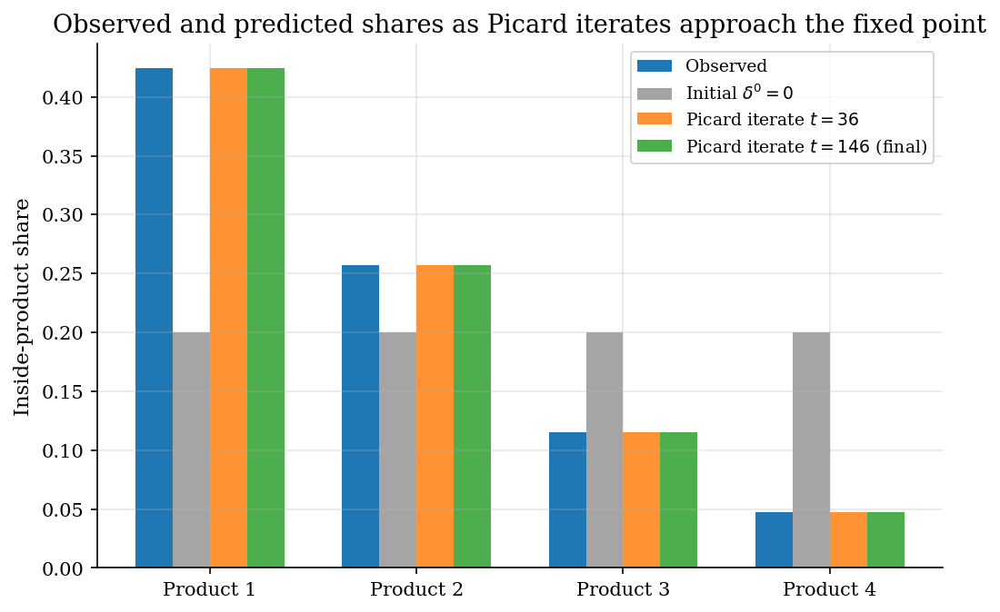
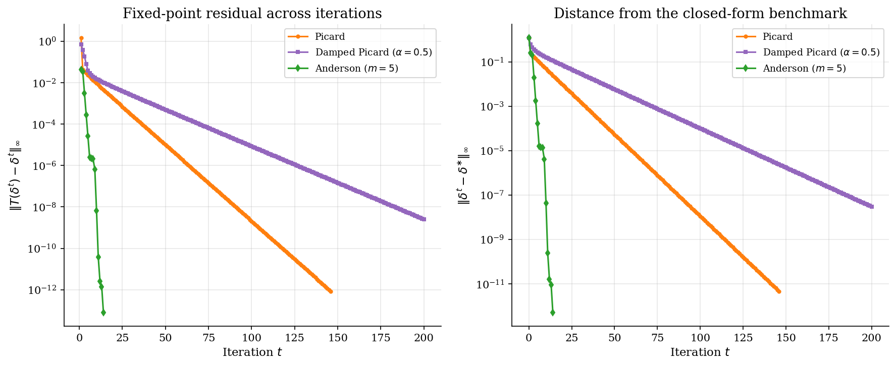
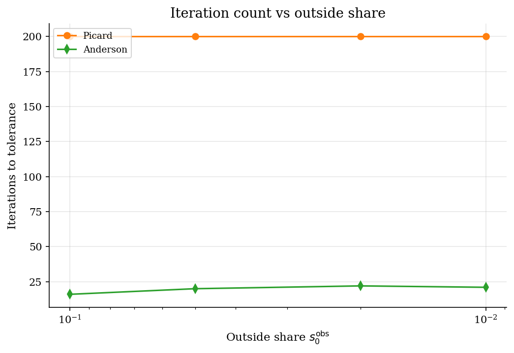
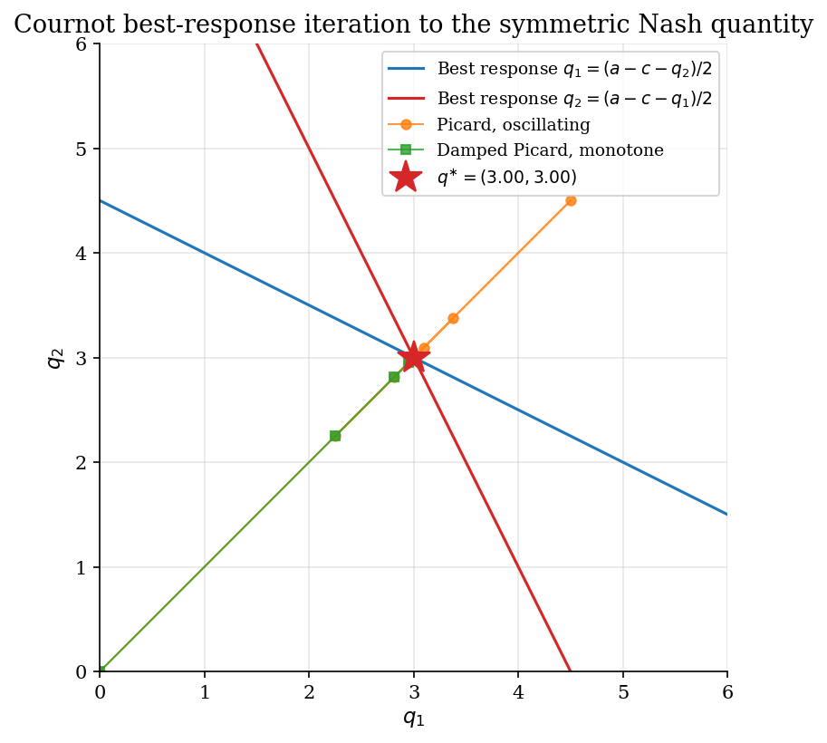

# Fixed-Point Iteration and Acceleration

## Overview

A fixed-point problem asks for a vector satisfying the condition that itself equals the transformation applied to itself. This is a functional equation. The numerical question is how to solve it when the transformation is a contraction.

One concrete instance serves as the test bed. Observed market shares are inverted to recover the mean utilities that generated them under a plain-logit choice model. Plain logit admits a closed-form benchmark, which makes every method's accuracy verifiable. Three fixed-point methods are compared: vanilla Picard iteration, a damped variant, and Anderson acceleration with five-step memory.

The lesson is about iteration speed and reliability. Vanilla iteration always converges under contraction but can be slow. Anderson is often dramatically faster. It can also extrapolate unstably without a residual safeguard. A small Cournot best-response example at the end applies the same methods to a static game, where the fixed point is a Nash equilibrium.

Before Anderson (1965), practitioners using Picard iteration on high-dimensional integral equations had no principled way to borrow information across prior iterates. The gap was a method that could exploit residual history without requiring a Jacobian or a derivative.

## Read before

- [`game-theory/static-games/`](../../game-theory/static-games/)

## Equations

The general problem is to find $`x \in \mathbb{R}^d`$ satisfying $`x = T(x)`$ for a given map $`T : \mathbb{R}^d \to \mathbb{R}^d`$.
A fixed point exists and is unique whenever $`T`$ is a contraction in some norm.
The methods below iteratively construct a sequence $`\lbrace x^t\rbrace`$ that converges to the fixed point $`x^{\ast}`$.

### The test instance

The test instance is plain-logit share inversion.
A representative consumer chooses among $`J`$ inside products and one outside option indexed by $`0`$.
Each inside product $`j`$ delivers a mean utility $`\delta_j`$ and an idiosyncratic Type-1 extreme-value taste shock.
The outside option is normalised to mean utility zero.
Choice probabilities give predicted market shares as functions of the mean-utility vector $`\delta = (\delta_1, \ldots, \delta_J)`$.

```math
s_j(\delta) = \frac{\exp(\delta_j)}{1 + \sum_{k=1}^{J} \exp(\delta_k)},
\qquad
s_0(\delta) = \frac{1}{1 + \sum_{k=1}^{J} \exp(\delta_k)}.
```

Observed shares $`s_j^{\mathrm{obs}}`$ are given.
The unknown is the mean-utility vector $`\delta^{\ast}`$ that generates them.
For plain logit the inversion has a closed form.
This closed form is the benchmark for every iterative method below.

```math
\delta_j^{\ast} = \log s_j^{\mathrm{obs}} - \log s_0^{\mathrm{obs}}.
```

The fixed-point map for this instance adds the log-share residual to the current guess.

```math
T_j(\delta) = \delta_j + \log s_j^{\mathrm{obs}} - \log s_j(\delta),
\qquad
\delta^{\ast} \text{ solves } T(\delta^{\ast}) = \delta^{\ast}.
```

A guess that under-predicts the share of product $`j`$ pushes $`\delta_j`$ up.
A guess that over-predicts pushes it down.

The next three subsections describe one method at a time.

### Method 1: Picard iteration

Picard iteration applies the fixed-point map directly at every step.

```math
\delta^{t+1} = T(\delta^t).
```

Convergence is linear with rate equal to the contraction modulus of $`T`$.
For the test instance this rate is bounded below one and convergence is monotone.

### Method 2: Damped Picard

Damped Picard mixes the current iterate with the Picard image using a damping factor $`\alpha \in (0, 1]`$.

```math
\delta^{t+1} = (1 - \alpha)  \delta^t + \alpha T(\delta^t)
= \delta^t + \alpha \left[\log s^{\mathrm{obs}} - \log s(\delta^t)\right].
```

A smaller $`\alpha`$ stabilises iteration when the map oscillates near the boundary of contractiveness.
The cost is a slower asymptotic rate.

### Method 3: Anderson acceleration

Anderson acceleration with memory $`m`$ uses the last $`m + 1`$ iterates and residuals to extrapolate a better step than Picard.
Define the residual $`f_t = g_t - \delta^t`$ with $`g_t = T(\delta^t)`$, the residual differences $`\Delta f_t^{(i)} = f_t - f_{t-i}`$, and the analogous $`\Delta g_t^{(i)}`$.
Stack the differences as columns of $`F_t \in \mathbb{R}^{J \times m_t}`$ and $`G_t \in \mathbb{R}^{J \times m_t}`$, where $`m_t = \min(m, t)`$ is the effective memory at step $`t`$.

The least-squares step solves for combination weights.

```math
\gamma_t = \arg\min_\gamma \lVert f_t - F_t \gamma \rVert_2.
```

The next iterate combines the most recent fixed-point image with a residual-history correction.

```math
\delta^{t+1} = g_t - G_t \gamma_t.
```

Anderson reduces to Picard when $`m = 0`$.
For $`m \geq 1`$ it can be quadratically faster on contractions.
The cost is one small least-squares solve per step.
A safeguard monitors the residual after each Anderson step.
If the residual more than doubles, the algorithm reverts to one damped-Picard step before resuming Anderson.

### A second test instance: Cournot best response

The Cournot mini extension uses the same machinery on a duopoly best-response system.
Two firms set quantities $`q_1, q_2`$ to maximise profit on linear inverse demand $`P(Q) = a - Q`$ with $`Q = q_1 + q_2`$ and constant marginal cost $`c`$.

```math
\mathrm{BR}_i(q_{-i}) = \frac{a - c - q_{-i}}{2},
\qquad
q^{\ast} = \frac{a - c}{3}  \text{ for both firms.}
```

The fixed-point map is $`T(q_1, q_2) = (\mathrm{BR}_1(q_2), \mathrm{BR}_2(q_1))`$.
Vanilla Picard on this map oscillates around $`q^{\ast}`$ with damping factor $`1/2`$.
Damped Picard with $`\alpha = 1/2`$ removes the oscillation.

## Worked Numerical Example

Take a single product, $`J = 1`$, with observed share $`s_1^{\mathrm{obs}} = 0.4`$, so the outside share is $`s_0^{\mathrm{obs}} = 0.6`$.
The closed-form mean utility is $`\delta^{\ast} = \log(0.4) - \log(0.6) = \log(2/3) \approx -0.4055`$.

Start at $`\delta^0 = 0`$. The predicted share at the initial guess is

```math
s_1(\delta^0) = \frac{e^0}{1 + e^0} = \frac{1}{2} = 0.5000.
```

Picard step 1 adds the log-share residual to correct the over-prediction:

```math
\delta^1 = T(\delta^0) = 0 + \log(0.4) - \log(0.5)
         = \log\!\left(\frac{0.4}{0.5}\right) = \log(0.8) \approx -0.2231.
```

The updated predicted share is $`s_1(\delta^1) = 0.8 / (1 + 0.8) = 4/9 \approx 0.4444`$, still above 0.4, so the next step pushes $`\delta`$ further down.

Picard step 2:

```math
\delta^2 = \delta^1 + \log(0.4) - \log(4/9)
         = \log(0.8) + \log(0.9)
         = \log(0.72) \approx -0.3285.
```

The residual sequence is

```math
|\delta^1 - \delta^{\ast}| \approx 0.1823,
\qquad
|\delta^2 - \delta^{\ast}| \approx 0.0770,
\qquad
|\delta^3 - \delta^{\ast}| \approx 0.0315,
```

shrinking by a factor of roughly $`0.42`$ each step, confirming linear convergence with rate equal to the contraction modulus.
The fixed point satisfies

```math
\boxed{\delta^{\ast} = \log(2/3) \approx -0.4055}.
```

A starting guess of $`\delta = 0`$ corresponds to equal shares everywhere; the map corrects toward the data monotonically. Anderson acceleration with memory $`m = 5`$ would extrapolate from the residual history after the first few steps and reach the same answer in far fewer iterations.

## Model Setup

| Symbol | Value | Role |
|--------|-------|------|
| $`J`$ | 4 | Number of inside products |
| $`\delta^{\ast}`$ | $`(1.0,  0.5,  -0.3,  -1.2)`$ | True mean utilities used to generate $`s^{\mathrm{obs}}`$ |
| $`s_0^{\mathrm{obs}}`$ | 0.1560 | Outside option share |
| Inside shares $`s^{\mathrm{obs}}`$ | $`(0.4241,  0.2573,  0.1156,  0.0470)`$ | Observed market shares |
| Damping factor $`\alpha`$ | 0.5 | Used by damped Picard |
| Anderson memory $`m`$ | 5 | Length of residual history |
| Tolerance $`\eta`$ | 1e-12 | Sup-norm stopping rule on $`T(\delta) - \delta`$ |
| Cournot demand intercept $`a`$ | 10.0 | Linear inverse-demand parameter |
| Cournot marginal cost $`c`$ | 1.0 | Symmetric across firms |
| Cournot symmetric Nash $`q^{\ast}`$ | 3.0000 | Closed-form duopoly equilibrium quantity |

## Solution Method

All three methods solve the same fixed-point equation. They differ in how aggressively they use past iterates to form the next step. The diagram below names each loop; all loops share the same stopping rule.

```
   delta_0, T              delta_0, T, alpha          delta_0, T, m
        |                        |                          |
        v                        v                          v
+-- Picard loop --+    +-- damped Picard loop --+    +-- Anderson loop --+
| delta --> [ T ] |    | delta --> [ mix ] -->  |    | delta --> [ mix ] |
|    --> delta_new|    |          delta_new      |    |    --> delta_new  |
+- err>=tol:rep  -+    +-- err>=tol: repeat ----+    +- err>=tol: rep  --+
        |                        |                          |
   converged                converged                  converged
        v                        v                          v
       x*                       x*                         x*
```

### Method 1: Picard iteration

Picard applies the fixed-point map directly at every step. Each application pushes $`\delta_j`$ toward the data by adding the log-share residual. Convergence is linear with rate equal to the contraction modulus of $`T`$. When the modulus approaches one, convergence becomes prohibitively slow.

### Method 2: Damped Picard

Damped Picard mixes the current iterate with the Picard image by weight $`\alpha \in (0, 1]`$. The damping does not change the fixed point, but it can stabilise oscillating iterates by reducing the effective step size. On a smooth contraction, smaller $`\alpha`$ slows asymptotic convergence without adding stability benefit.

### Method 3: Anderson acceleration

Anderson acceleration uses the last $`m + 1`$ residuals to extrapolate a better step than plain Picard. The method fits a least-squares combination of past residual differences and applies the corresponding correction to the most recent fixed-point image. A safeguard monitors the residual after each Anderson step and reverts to one damped-Picard step whenever the residual more than doubles, then resumes Anderson with a refreshed history.

## Results

At the trivial start $`\delta^0 = 0`$, every inside product is predicted to take the same share. The first Picard step closes most of the gap to the observed shares. By iterate 36 the predictions are visually indistinguishable from the observed bars. At convergence the residual is at machine precision and the recovered $`\delta`$ matches the closed form to 4.57e-12.



Picard reaches tolerance in 146 iterations on this calibration. Damped Picard at $`\alpha = 0.5`$ exhausts the 200-iteration budget without crossing the tolerance. The damping slows asymptotic convergence enough that its residual is still 2.51e-09, above the 1e-12 tolerance, when the loop stops. Anderson at $`m = 5`$ converges in 14 iterations, faster than Picard by roughly a factor of ten.

Both panels show the same story on log scale. Anderson sits below Picard for almost every iteration. The damped variant is parallel to Picard with a slight vertical offset and has not yet reached tolerance at the iteration cap.



The stress test sweeps the outside share from 0.1 down to 0.01. A small outside share pushes mean utilities out to large values where the contraction modulus approaches one. Picard iteration counts grow steeply on the small-$`s_0`$ end. Anderson stays much flatter because the residual history compensates for the slow contraction. The safeguard reverts to damped Picard whenever an Anderson step doubles the residual.



The Cournot example replaces the Berry contraction with a best-response map. Vanilla Picard from $`(0, 0)`$ overshoots to $`(4.5, 4.5)`$ on the first step and oscillates around the symmetric Nash quantity $`q^{\ast} = 3.00`$ with damping factor $`1/2`$. Damped Picard with $`\alpha = 1/2`$ removes the oscillation and converges monotonically. The same fixed-point machinery covers structural demand inversion and static-game best-response dynamics.



The table compares the three methods on the same calibration and the same starting point. Anderson cuts the iteration count to a small fraction of Picard. Picard and Anderson reach the sup-norm tolerance; damped Picard at this damping factor exhausts the iteration budget before the residual crosses the tolerance, so its status reports the max-iteration stop rather than convergence. The Status column reports the actual termination condition: a method reads as converged only when its final residual met the tolerance.

Method comparison on the baseline four-product calibration

| Method           | Setting                          |   Iterations |   Final residual |   Distance to closed form | Status                    |
|:-----------------|:---------------------------------|-------------:|-----------------:|--------------------------:|:--------------------------|
| Picard           | no damping                       |          146 |         8.44e-13 |                  4.57e-12 | converged                 |
| Damped Picard    | damping alpha = 0.5              |          200 |         2.51e-09 |                  2.97e-08 | stopped at max_iter = 200 |
| Anderson (m = 5) | memory 5 with residual safeguard |           14 |         7.95e-14 |                  5.08e-13 | converged                 |

The stress test makes the contraction harder by shrinking the outside share. A small outside share pushes mean utilities out to large values, where the contraction modulus approaches one. Picard slows down sharply once the outside share falls below five percent. Anderson stays competitive across the range. This is the regime where acceleration matters most: an inner contraction solved many times inside an outer search pays the iteration savings many times over.

Iteration count and final residual as the outside share shrinks

|   Outside share |   Picard iterations |   Picard residual |   Anderson iterations |   Anderson residual |
|----------------:|--------------------:|------------------:|----------------------:|--------------------:|
|            0.1  |                 200 |          3.92e-11 |                    16 |            9.6e-14  |
|            0.05 |                 200 |          1.38e-06 |                    20 |            4.11e-15 |
|            0.02 |                 200 |          0.000328 |                    22 |            1.33e-15 |
|            0.01 |                 200 |          0.00147  |                    21 |            1.47e-13 |

On the Cournot game vanilla Picard converges in 44 steps despite the oscillation. Damped Picard takes 22 steps with monotone improvement. The closed-form symmetric Nash quantity is $`q^{\ast} = 3.0000`$ for both firms.

Cournot best-response iteration to the symmetric Nash equilibrium

| Method         |   Quantity firm 1 |   Quantity firm 2 |   Iterations |   Final residual |
|:---------------|------------------:|------------------:|-------------:|-----------------:|
| Vanilla Picard |                 3 |                 3 |           44 |         5.12e-13 |
| Damped Picard  |                 3 |                 3 |           22 |         5.12e-13 |

## Takeaway

Picard iteration is the simplest reliable fixed-point method. On a contraction it converges monotonically and predictably. Its weakness is speed when the contraction modulus approaches one.

Damped Picard trades asymptotic speed for stability. It is the right default when the iterates oscillate or the modulus is uncertain. On a smooth contraction like the test instance here, damping is unnecessary and slows things down.

Anderson acceleration is dramatically faster than Picard on contractions but needs a safeguard. The least-squares step can extrapolate unstably when the residual history is nearly collinear. A simple residual-monotonicity check that reverts to damped Picard when an Anderson step doubles the residual recovers stability with very little overhead.

The methods are not specific to demand inversion. Any problem of the form $`x = T(x)`$ with a contractive $`T`$ admits the same three-method ladder: Picard, damped Picard, Anderson. What changes between problems is the map, not the iteration.

Anderson (1965) appeared in the integral-equations literature and was largely unknown in economics until Walker and Ni (2011) showed it accelerated a wide class of fixed-point problems by a large multiple. The surprise was that a least-squares combination of just five residual differences could substitute for a full Jacobian. The legacy is visible in BLP demand estimation, where the inner share-inversion loop runs thousands of times inside an outer estimator, and every iteration saved there compounds.

## See also

- [Root finding for equilibrium rates](../root-finding/README.md)
- [Aiyagari saving and capital-market clearing](../../dynamic-programming/aiyagari/README.md)
- [Static games](../../game-theory/static-games/README.md)

## References

- Berry, S. (1994). *Estimating Discrete-Choice Models of Product Differentiation*. RAND Journal of Economics 25(2), 242-262.
- Berry, S., Levinsohn, J., and Pakes, A. (1995). *Automobile Prices in Market Equilibrium*. Econometrica 63(4), 841-890.
- Anderson, D. G. (1965). *Iterative Procedures for Nonlinear Integral Equations*. Journal of the ACM 12(4), 547-560.
- Walker, H. F. and Ni, P. (2011). *Anderson Acceleration for Fixed-Point Iterations*. SIAM Journal on Numerical Analysis 49(4), 1715-1735.
- Reynaerts, J., Varadhan, R., and Nash, J. C. (2012). *Enhancing the Convergence Properties of the BLP Estimator*. (working paper).
