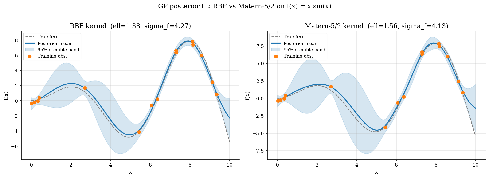
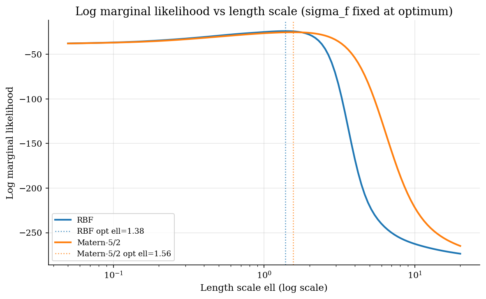
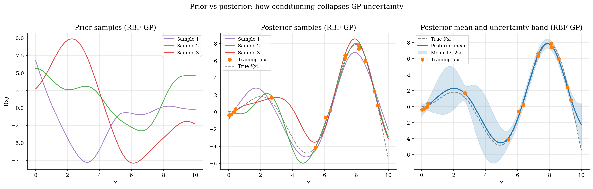

# Gaussian Process Regression and Uncertainty Quantification

## Overview

A Gaussian process (GP) is a probability distribution over functions. Sampling from a GP returns a whole function $`f`$, not a finite vector of parameters. Conditioning a GP prior on a finite set of noisy observations returns another GP, the posterior, with a closed-form mean function and a closed-form variance function. There is no MCMC inside the conditioning step; everything is linear algebra against the kernel matrix.

This makes GPs the natural surrogate model in two settings. The first is regression with uncertainty quantification: fit a smooth function from sparse, noisy data, and report a credible band rather than a single point estimate. The second is sequential optimisation of an expensive function (Bayesian optimisation), where the GP posterior over the unknown objective guides which point to evaluate next. Both settings need three things: a kernel, a posterior, and a way to choose the kernel's hyperparameters from data.

This prelim builds those three pieces on a one-dimensional toy target ($`f(x) = x \sin x`$ on $`[0, 10]`$ with Gaussian observation noise), compares the squared-exponential (RBF) kernel against the Matern-5/2 kernel, and tunes the length-scale by maximising the log marginal likelihood. The closed-form posterior, the kernel choice, and the marginal-likelihood tuning are the same three ingredients that the GP surrogate uses in [`numerical-methods/bayesian-optimization/`](../../numerical-methods/bayesian-optimization/) inside its acquisition loop.

## Equations

We need notation for the prior distribution over functions and the kernel that defines it. A Gaussian process is a collection of random variables, any finite subset of which is jointly Gaussian. A GP is fully specified by its mean function $`\mu(x)`$ and its covariance kernel $`k(x, x')`$. The shorthand is:

```math
f \sim \mathcal{GP}(\mu, k),
\qquad
\mu(x) = \mathbb{E}[f(x)],
\quad
k(x, x') = \mathrm{Cov}[f(x), f(x')].
```

For any finite set of inputs $`\{x_1, \ldots, x_n\}`$, the vector $`(f(x_1), \ldots, f(x_n))^{\top}`$ is multivariate Gaussian with mean $`(\mu(x_1), \ldots, \mu(x_n))^{\top}`$ and covariance matrix $`K_{ij} = k(x_i, x_j)`$. Throughout this tutorial $`\mu \equiv 0`$ (constant zero mean); the kernel does all the work.

We need a kernel that encodes our smoothness assumptions about $`f`$. The squared-exponential (or radial basis function, RBF) kernel parametrises function smoothness through a length scale $`\ell > 0`$ and an output scale $`\sigma_f`$:

```math
k_{\mathrm{RBF}}(x, x') = \sigma_f^2  \exp\left(-\frac{\|x - x'\|^2}{2  \ell^2}\right).
```

Two inputs that are within roughly $`\ell`$ of each other have positive prior covariance close to $`\sigma_f^2`$. Inputs far apart have near-zero covariance. The RBF kernel produces sample functions that are infinitely differentiable, which can be too smooth for functions with sharp features. The Matern-5/2 kernel is an intermediate choice that allows for less-than-infinite differentiability while staying twice continuously differentiable: $`k_{5/2}(x, x') = \sigma_f^2  (1 + \sqrt{5} d / \ell + 5 d^2 / (3 \ell^2))  \exp(-\sqrt{5} d / \ell)`$ with $`d = \|x - x'\|`$.

We need a closed-form rule for updating the prior to a posterior. Suppose we observe noisy data $`y_i = f(x_i) + \varepsilon_i`$ with $`\varepsilon_i \sim N(0, \sigma_n^2)`$ i.i.d. The posterior over $`f`$ at a new input $`x_{\ast}`$ is again Gaussian with mean and variance:

```math
\mu_{\ast}(x_{\ast}) = k_{\ast}^{\top}  (K + \sigma_n^2  I)^{-1}  y,
\qquad
\sigma_{\ast}^2(x_{\ast}) = k(x_{\ast}, x_{\ast}) - k_{\ast}^{\top}  (K + \sigma_n^2  I)^{-1}  k_{\ast},
```

where $`K_{ij} = k(x_i, x_j)`$ is the training covariance matrix, $`k_{\ast}`$ is the vector $`(k(x_{\ast}, x_1), \ldots, k(x_{\ast}, x_n))^{\top}`$ of train-test covariances, and $`y = (y_1, \ldots, y_n)^{\top}`$ is the observation vector. The implementation factors $`K + \sigma_n^2 I`$ once by Cholesky and reuses the factor to compute both the posterior mean and the variance.

We need a way to choose the kernel hyperparameters $`(\ell, \sigma_f, \sigma_n)`$ from data. The log marginal likelihood integrates the posterior over $`f`$ to give a function of the hyperparameters alone:

```math
\log p(y \mid X, \theta) = -\frac{1}{2}  y^{\top}  (K + \sigma_n^2 I)^{-1}  y - \frac{1}{2}  \log \det(K + \sigma_n^2 I) - \frac{n}{2}  \log(2\pi).
```

The three terms balance data fit (the quadratic in $`y`$), model complexity (the log determinant penalises kernel matrices that imply low-noise prior covariance), and a constant. Maximising the log marginal likelihood is called marginal-likelihood-II or empirical Bayes, and it produces a data-adaptive smoothness scale: too short a length scale fits noise (low log-det penalty, large quadratic term), too long a length scale underfits (small quadratic term, large determinant penalty).

## Model Setup

| Object | Symbol | Role |
|---|---|---|
| Input | $`x`$ | Scalar in $`[0, 10]`$ |
| True function | $`f(x) = x \sin x`$ | The simulated target |
| Observation noise sd | $`\sigma_n`$ | Set to 0.5 |
| Training size | $`n`$ | 15 random points |
| Mean function | $`\mu`$ | Constant zero |
| Kernel | $`k`$ | RBF or Matern-5/2 [from `bayesian-optimization/`] |
| Length scale | $`\ell`$ | Tuned by marginal-likelihood maximisation [from `bayesian-optimization/`] |
| Output scale | $`\sigma_f`$ | Tuned jointly [from `bayesian-optimization/`] |
| Training covariance | $`K`$ | $`n \times n`$ matrix with $`K_{ij} = k(x_i, x_j)`$ [from `bayesian-optimization/`] |
| Posterior mean | $`\mu_{\ast}`$ | Function of test input $`x_{\ast}`$ [from `bayesian-optimization/`] |
| Posterior variance | $`\sigma_{\ast}^2`$ | Function of test input $`x_{\ast}`$ [from `bayesian-optimization/`] |
| Log marginal likelihood | $`\log p(y \mid X, \theta)`$ | Objective for hyperparameter tuning |

The annotations record which symbols are shared with the dense tutorial that adopts this prelim.

## Solution Method

The procedure has three stages: build the kernel, tune the hyperparameters, and condition on data.

```text
Procedure: Gaussian process regression with marginal-likelihood tuning
Inputs : training data (X, y); kernel family (RBF or Matern-5/2); noise scale.
Outputs: optimised hyperparameters, posterior mean and variance, log ML.

1. Build the kernel matrix K at the training inputs as a function of (ell, sigma_f).

2. Factor K + sigma_n^2 I = L L'  by Cholesky (with small jitter for stability).

3. Define the log-marginal-likelihood objective:
     log_ml(ell, sigma_f) = -0.5 y' (K + sigma_n^2 I)^-1 y
                            - sum over i of log L[i, i] - (n/2) log(2 pi).

4. Maximise log_ml over (log ell, log sigma_f) via L-BFGS-B with several
   random restarts. Use log-parameters because both must stay positive.

5. With the optimised hyperparameters, compute the posterior mean and
   variance at every test point in one Cholesky-based solve.
```

Deep kernels, sparse / inducing-point GPs, scalable variational inference, and GP classification build on this base and are out of scope.

## Results

The first figure compares the RBF and Matern-5/2 posterior fits on $`f(x) = x \sin x`$ with 15 noisy observations.



Both kernels recover the underlying $`x \sin x`$ shape inside the interpolation region (between the leftmost and rightmost training points). The credible band is narrowest where training points are dense and widest where they are sparse. The RBF kernel produces a smoother fit and a slightly narrower band overall, because its sample functions are infinitely differentiable; the Matern-5/2 fit is more responsive to local fluctuations because its sample functions are twice but not three times continuously differentiable.

The second figure traces the log marginal likelihood as a function of the length scale, with the output scale held at its optimum for each kernel.



Both curves have a clear single maximum around $`\ell \approx 1.5`$. Below $`\ell = 0.5`$ the kernel becomes wiggly, fitting noise; the quadratic in $`y`$ shrinks but the log determinant penalty grows. Above $`\ell = 5`$ the kernel is nearly constant, underfitting the data; the log determinant shrinks but the quadratic in $`y`$ explodes. The trade-off between the two terms is what gives marginal-likelihood-II its data-adaptive smoothness scale.

The third figure illustrates what conditioning on data buys us, by drawing samples from the prior and the posterior.



The prior samples are wiggly and unconstrained; they only respect the RBF length scale, nothing else. The posterior samples thread the training points and follow the true function shape inside the interpolation region while spreading out near the boundaries. The posterior mean with its $`\pm 2  \sigma_{\ast}`$ band shows the same picture as a single expected curve plus uncertainty bounds. On a held-out grid, the RBF kernel achieves $`\mathrm{RMSE} = 0.59`$ against the Matern-5/2 kernel's $`0.73`$; the RBF advantage here reflects the infinite smoothness of the target $`x \sin x`$.

## Takeaway

A Gaussian process gives a closed-form posterior over functions: a mean function and a variance function that come out of one Cholesky solve. The kernel encodes the smoothness assumption; marginal-likelihood maximisation chooses the smoothness scale from the data. The two pieces together are enough to do uncertainty-quantified regression in one dimension, and they are the surrogate model that drives Bayesian optimisation when sequential decision-making is added on top.

The same construction shows up in [`numerical-methods/bayesian-optimization/`](../../numerical-methods/bayesian-optimization/), which uses the GP posterior to define the Expected-Improvement acquisition function and runs the resulting acquisition loop on an expensive objective.

## References

- Rasmussen, C. E. and Williams, C. K. I. (2006). *Gaussian Processes for Machine Learning*. MIT Press. Chapter 2 (regression) and Chapter 5 (model selection / marginal likelihood). Freely available online.
- Bishop, C. M. (2006). *Pattern Recognition and Machine Learning*. Springer, §6.4. Kernel-methods framing.
- Kennedy, M. C. and O'Hagan, A. (2001). "Bayesian Calibration of Computer Models." *Journal of the Royal Statistical Society B*, 63(3), 425-464. GP as a surrogate or emulator for expensive evaluations.
- Snoek, J., Larochelle, H., and Adams, R. P. (2012). "Practical Bayesian Optimization of Machine Learning Algorithms." *Advances in Neural Information Processing Systems*, 25. Bridge to the Bayesian-optimisation consumer tutorial.
- **See also.** The Bayesian-optimisation tutorial in [`numerical-methods/bayesian-optimization/`](../../numerical-methods/bayesian-optimization/) plugs the GP posterior here into the Expected-Improvement acquisition function and runs the resulting sequential optimisation loop.
