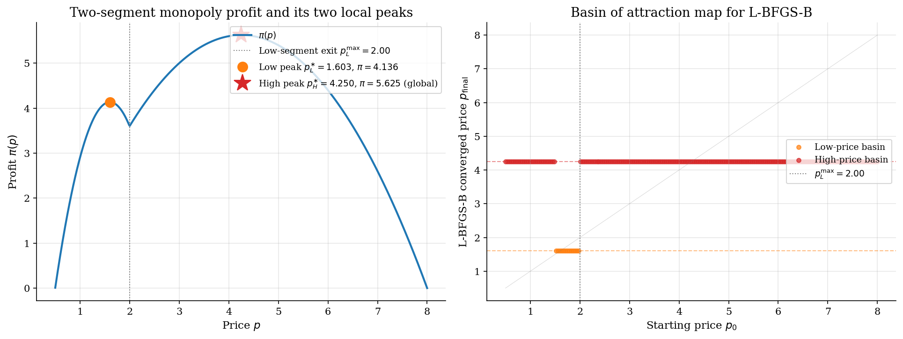
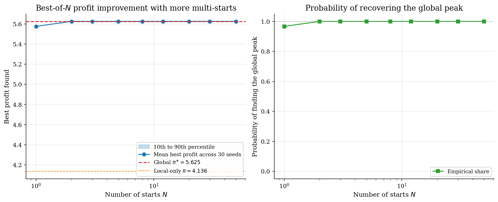
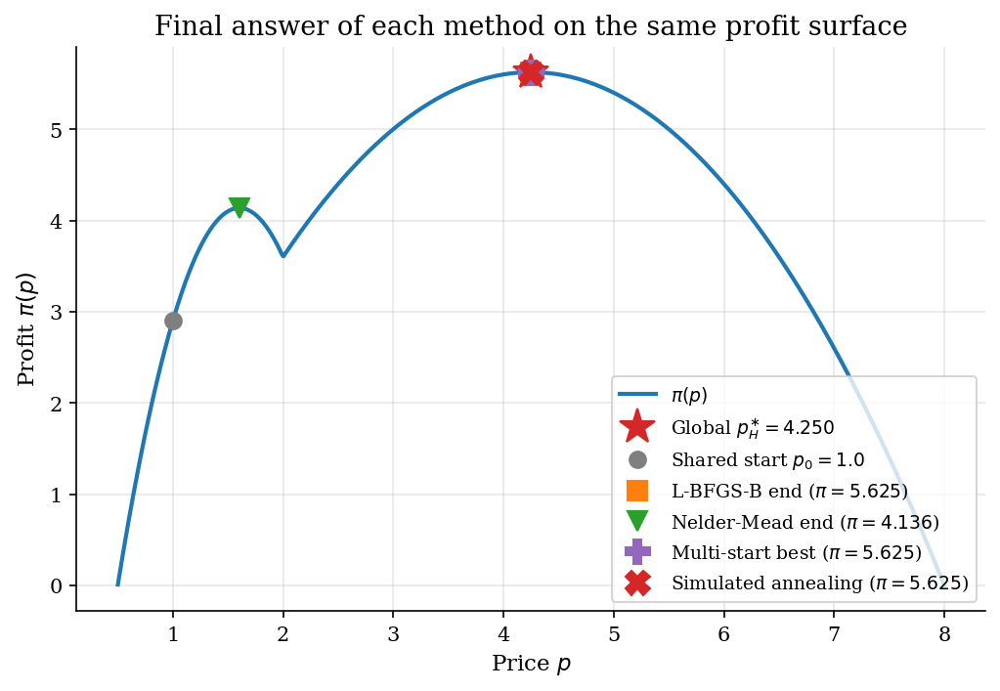

# Global Search and Multi-Start Diagnostics

## Overview

A monopolist sells to two consumer segments with very different demand schedules. The low-valuation segment is large but quits the market at a low price. The high-valuation segment is small but willing to pay much more. Profit is the share-weighted sum of revenue from both segments minus the marginal-cost wedge.

The mixture profit function has two local maxima. A low-price peak serves both segments. A higher-price peak serves only the high-valuation segment and earns more in this calibration. Different optimization methods land in different peaks depending on where they start.

Torn and Zilinskas (1989) documented that local methods applied to multimodal objectives produce results that depend entirely on the starting point, with no internal signal that a better basin exists. Multi-start and stochastic global search are the practical diagnostics that bound the gap between local and global optimality. The same reporting discipline transfers to structural likelihoods, simulated moments, mixture models, and dynamic games.

## Read before

- [`numerical-methods/scalar-optimization-monopoly-pricing/`](../../numerical-methods/scalar-optimization-monopoly-pricing/)

## Equations

A monopolist faces a population of consumers split between two segments.
Segment $`L`$ has linear demand with intercept $`A_L`$ and slope $`b_L`$.
Segment $`H`$ has linear demand with intercept $`A_H`$ and slope $`b_H`$.

```math
D_L(p) = \max\lbrace 0,  A_L - b_L p \rbrace,
\qquad
D_H(p) = \max\lbrace 0,  A_H - b_H p \rbrace.
```

Each segment quits the market at its own choke price.
The low-valuation segment exits at $`p_L^{\max} = A_L / b_L`$.
The high-valuation segment exits at the larger price $`p_H^{\max} = A_H / b_H`$.

The population mixture weight $`\lambda \in (0, 1)`$ records the share of low-valuation consumers.
Profit is the weighted sum of segment revenues minus the marginal-cost wedge.

```math
\pi(p) = (p - c) \left[\lambda D_L(p) + (1 - \lambda)  D_H(p)\right].
```

The *piecewise-quadratic* objective has two regimes.
On $`[c,  p_L^{\max}]`$ both segments are active.
On $`(p_L^{\max},  p_H^{\max}]`$ only the high-valuation segment is active.
The two regimes are smoothly stitched at the kink $`p_L^{\max}`$.

In the both-segments regime the first-order condition is linear in $`p`$.

```math
\pi'(p) = \lambda (A_L - 2 b_L p) + (1 - \lambda)(A_H - 2 b_H p) + (\lambda b_L + (1 - \lambda) b_H)  c.
```

In the high-only regime profit is the standard quadratic with a single interior maximizer.

```math
p_H^{\ast} = \frac{A_H + b_H c}{2 b_H}.
```

At the calibration $`A_L = 10`$, $`b_L = 5`$, $`A_H = 8`$, $`b_H = 1`$, $`c = 0.5`$, $`\lambda = 0.6`$, both regimes have an interior maximizer.

```math
p_L^{\ast} \approx 1.603,
\qquad
\pi(p_L^{\ast}) \approx 4.14.
```

```math
p_H^{\ast} = 4.25,
\qquad
\pi(p_H^{\ast}) \approx 5.625.
```

The high-price peak is global on this calibration.
The low-price peak is a strict local maximum.
The two basins of attraction do not split at the kink.
A quasi-Newton step from a low starting price has a strongly positive gradient and overshoots the low peak, so only starts in a narrow window just below the kink actually converge to the low peak; lower starts reach the high peak.
This makes the low peak the harder one to discover and is exactly why a single start is unreliable.

The next four subsections describe one method at a time.

### Multi-start L-BFGS-B

Multi-start L-BFGS-B draws $`N`$ initial prices uniformly on the bracket and runs the local optimiser from each.

```math
\hat p_{\mathrm{multi}}^{(N)} = \arg\max_{k \in \lbrace 1, \ldots, N\rbrace} \pi\left(\mathrm{LBFGSB}(p_0^{(k)})\right),
\qquad p_0^{(k)} \sim \mathrm{Uniform}[p_{\mathrm{lo}}, p_{\mathrm{hi}}].
```

The probability of finding the global optimum is one minus the probability that all $`N`$ starts land in the low basin.
Reporting that probability is the diagnostic for whether the start budget is large enough.

### Random search

Random search drops the local optimiser entirely and uses a single sample of $`N`$ uniform draws.

```math
\hat p_{\mathrm{rand}}^{(N)} = \arg\max_{k \in \lbrace 1, \ldots, N\rbrace} \pi(p^{(k)}),
\qquad p^{(k)} \sim \mathrm{Uniform}[p_{\mathrm{lo}}, p_{\mathrm{hi}}].
```

Random search is cheaper per evaluation than multi-start L-BFGS-B but converges only at rate $`1/\sqrt{N}`$.

### Nelder-Mead

Nelder-Mead is a derivative-free local search.
It maintains a simplex of candidate points and reflects, expands, contracts, or shrinks it based on the ranks of the function values at the vertices.
Convergence is local; basin dependence is the same as L-BFGS-B, so a single Nelder-Mead start with a poor initial point misses the global maximum on this problem.

### Simulated annealing

Simulated annealing samples a Markov chain that proposes random moves and accepts them with a probability that depends on the change in objective and a slowly decreasing temperature.
SciPy's `dual_annealing` combines a generalised-simulated-annealing global search with local refinement at each accepted move.
The result is a stochastic global search that does not need a starting point inside the global basin.

## Worked Numerical Example

The calibration has two peaks separated by a kink at $`p_L^{\max} = 2.00`$. Below the kink both segments are active and profit is $`\pi(p) = (p - 0.5)(9.2 - 3.4p)`$. Above the kink only the high-valuation segment is active and profit is $`\pi(p) = (p - 0.5)(3.2 - 0.4p)`$. Each regime is quadratic, so Newton's method finds the interior peak in a single step from any starting price inside the regime.

Regime below the kink has $`\pi'(p) = 10.9 - 6.8p`$ and $`\pi''(p) = -6.8`$. Starting at $`p_0 = 1.7`$:

```math
\pi'(1.7) = 10.9 - 6.8 \times 1.7 = -0.66.
```

The Newton step is $`-\pi'(p_0)/\pi''(p_0)`$, giving

```math
p_1 = 1.7 - \frac{-0.66}{-6.8} = 1.7 - 0.097 \approx \boxed{1.603}.
```

The update lands at the local peak with $`\pi(1.603) \approx 4.136`$.

Regime above the kink has $`\pi'(p) = 3.4 - 0.8p`$ and $`\pi''(p) = -0.8`$. Starting at $`p_0 = 3.0`$:

```math
\pi'(3.0) = 3.4 - 0.8 \times 3.0 = 1.0.
```

The Newton step is

```math
p_1 = 3.0 - \frac{1.0}{-0.8} = 3.0 + 1.25 = \boxed{4.25}.
```

The update lands at the global peak in one step, with $`\pi(4.25) = 5.625`$.

The two starts converge to opposite peaks. The profit gap is $`5.625 - 4.136 = 1.489`$. Neither run has any information about the other peak. A routine that returns after a single Newton convergence reports the right answer to the wrong question unless the starting price happened to fall inside the global basin.

## Model Setup

| Parameter | Value | Parameter | Value |
|---|---:|---|---:|
| $`A_L`$, $`b_L`$ | 10.0, 5.0 | $`A_H`$, $`b_H`$ | 8.0, 1.0 |
| Marginal cost $`c`$ | 0.5 | Low-segment share $`\lambda`$ | 0.6 |
| Search bracket | $`[0.501, 8.0]`$ | Low choke price $`p_L^{\max}`$ | 2.00 |
| Low peak $`p_L^{\ast}`$ | 1.6029 | Low-peak profit | 4.1360 |
| High peak $`p_H^{\ast}`$ | 4.2500 | High-peak profit | 5.6250 |
| Multi-start budget $`N`$ | 50 | Random-search budget $`N`$ | 500 |
| Random seed | 42 | Single-start $`p_0`$ | 1.7 |

## Solution Method

All five methods explore the same one-dimensional bracket and differ in how they balance local refinement against global exploration. Single-start L-BFGS-B and Nelder-Mead are local optimizers whose outcome depends entirely on which basin contains the starting point. Multi-start, random search, and simulated annealing all add global coverage at the cost of more function evaluations.

```
      N starts uniform on [p_lo, p_hi]         500 draws uniform on [p_lo, p_hi]
                    |                                         |
                    v                                         v
    +------- multistart loop ---------+        +-------- random search ----------+
    |  x_0 --> [ L-BFGS-B ] --> x*_i |        |  p_k --> [ eval pi ] --> pi_k  |
    +------ N starts remain: repeat --+        +------- N draws remain: repeat --+
                    |                                         |
              all starts done                           all draws done
                    |                                         |
                    v                                         v
             x* = best x*_i                          x* = argmax pi_k
```

The new logic in multi-start is the basin accounting. Each converged price is labelled by which peak it is closest to, and the run reports basin counts alongside the best value found.

```python
def run_multistart(profit, p_lo, p_hi, n_starts, seed):
    rng = np.random.default_rng(seed)
    starts = rng.uniform(p_lo, p_hi, n_starts)    # uniform coverage of bracket
    records = []
    for p0 in starts:
        res = minimize(lambda p: -profit(p[0]), [p0],
                       method='L-BFGS-B', bounds=[(p_lo, p_hi)])
        p_star = res.x[0]
        records.append({"p_start": p0, "p_star": p_star,
                        "profit": profit(p_star), "nfev": res.nfev})
    df = pd.DataFrame(records)
    midpoint = (P_LOW_PEAK + P_HIGH_PEAK) / 2    # label by nearest peak
    df["basin"] = np.where(df["p_star"] < midpoint, "low-price", "high-price")
    return df
```

Simulated annealing via `scipy.optimize.dual_annealing` wraps a generalised Markov chain with local refinement; it needs only the bounds and a seed, with no starting point.

## Results

The profit surface has a local peak at $`p_L^{\ast} = 1.603`$ where both segments are active. Above the kink at $`p_L^{\max} = 2.00`$ only the high-valuation segment is active. The high-only regime has its own peak at $`p_H^{\ast} = 4.25`$, which is the global maximum on this calibration. The gap between the two peaks is $`1.489`$ in profit. The left panel shows the surface with both peaks marked. The right panel sweeps 200 evenly spaced starting prices and records where each L-BFGS-B run lands. Only starts in the narrow window $`[1.52, 1.97]`$ converge to the low peak. Every start below that window also converges to the high peak: the gradient at a low price is strongly positive, so the quasi-Newton step overshoots the low peak and descends into the global basin. The L-BFGS-B basin boundary near $`p \approx 1.52`$ sits below the economic kink $`p_L^{\max} = 2.00`$, not at it. The basin volumes are 6.5 percent low and 93.5 percent high on this bracket.



The left panel plots the best profit across $`N`$ multi-start runs, averaged over 30 seeds. With one start the mean best profit is between the local and global peaks, reflecting that some seeds find the wrong basin. As $`N`$ grows the mean best converges to the global peak and the percentile band collapses. The right panel records the empirical probability that at least one of the $`N`$ starts lands in the global basin. At $`N = 50`$ that probability is essentially one and the diagnostic is trustworthy.



All four method outputs are plotted on the same profit surface. Both single-start methods land at the low-price local peak from $`p_0 = 1.7`$. Multi-start L-BFGS-B and simulated annealing both find the global peak at $`p_H^{\ast} = 4.250`$ with profit $`\pi = 5.625`$. The gap between local and global on this calibration is $`1.489`$, a 36 percent profit improvement that single-start methods miss silently.



The table compares the five methods on the same calibration. Single-start L-BFGS-B and Nelder-Mead converge to the local peak at $`p \approx 1.603`$ from $`p_0 = 1.7`$ and miss the global. Multi-start L-BFGS-B, random search, and simulated annealing all return the global peak. Function evaluations differ by orders of magnitude: simulated annealing is the most expensive, multi-start scales linearly with the number of starts, and a single L-BFGS-B run is by far the cheapest, but cheapest is not the same as right.

### Method comparison

| Method | Setting | Estimated optimum | Profit | Function evaluations | Found global? |
|:---|:---|---:|---:|---:|:---|
| Single-start L-BFGS-B | Starting price 1.7 | 1.6029 | 4.136 | 6 | no |
| Multi-start L-BFGS-B | 50 starts, seed 42 | 4.25 | 5.625 | 310 | yes |
| Random search | 500 draws, seed 43 | 4.2548 | 5.625 | 500 | yes |
| Nelder-Mead | Starting price 1.7 | 1.6029 | 4.136 | 52 | no |
| Simulated annealing | max iterations 500, seed 44 | 4.25 | 5.625 | 1007 | yes |

The multi-start log records every L-BFGS-B run individually. It is the bookkeeping a reproducible structural estimation should publish: every start, every converged value, and the basin label. On this calibration 4 of 50 starts landed in the low basin and the rest in the high basin.

### Per-start log of multi-start L-BFGS-B runs

|   Start id |   Starting price |   Converged price |   Converged profit |   Function evaluations | Basin      |
|-----------:|-----------------:|------------------:|-------------------:|-----------------------:|:-----------|
|          0 |           6.3049 |            4.25   |              5.625 |                      6 | high-price |
|          1 |           3.7921 |            4.25   |              5.625 |                      6 | high-price |
|          2 |           6.9396 |            4.25   |              5.625 |                      6 | high-price |
|          3 |           5.7306 |            4.25   |              5.625 |                      6 | high-price |
|          4 |           1.2072 |            4.25   |              5.625 |                      8 | high-price |
|          5 |           7.8172 |            4.25   |              5.625 |                      6 | high-price |
|          6 |           6.2088 |            4.25   |              5.625 |                      6 | high-price |
|          7 |           6.3957 |            4.25   |              5.625 |                      6 | high-price |
|          8 |           1.4617 |            4.25   |              5.625 |                      8 | high-price |
|          9 |           3.8784 |            4.25   |              5.625 |                      6 | high-price |
|         10 |           3.2816 |            4.25   |              5.625 |                      6 | high-price |
|         11 |           7.4508 |            4.25   |              5.625 |                      6 | high-price |
|         12 |           5.3293 |            4.25   |              5.625 |                      6 | high-price |
|         13 |           6.6709 |            4.25   |              5.625 |                      6 | high-price |
|         14 |           3.8262 |            4.25   |              5.625 |                      6 | high-price |
|         15 |           2.2051 |            4.25   |              5.625 |                      6 | high-price |
|         16 |           4.6598 |            4.25   |              5.625 |                      6 | high-price |
|         17 |           0.9796 |            4.25   |              5.625 |                      8 | high-price |
|         18 |           6.7074 |            4.25   |              5.625 |                      6 | high-price |
|         19 |           5.2379 |            4.25   |              5.625 |                      6 | high-price |
|         20 |           6.1859 |            4.25   |              5.625 |                      6 | high-price |
|         21 |           3.1596 |            4.25   |              5.625 |                      6 | high-price |
|         22 |           7.7803 |            4.25   |              5.625 |                      6 | high-price |
|         23 |           7.1985 |            4.25   |              5.625 |                      6 | high-price |
|         24 |           6.3381 |            4.25   |              5.625 |                      6 | high-price |
|         25 |           1.9606 |            1.6029 |              4.136 |                      6 | low-price  |
|         26 |           4.0009 |            4.25   |              5.625 |                      6 | high-price |
|         27 |           0.8295 |            4.25   |              5.625 |                      8 | high-price |
|         28 |           1.658  |            1.6029 |              4.136 |                      6 | low-price  |
|         29 |           5.6232 |            4.25   |              5.625 |                      6 | high-price |
|         30 |           6.086  |            4.25   |              5.625 |                      6 | high-price |
|         31 |           7.7564 |            4.25   |              5.625 |                      6 | high-price |
|         32 |           2.9444 |            4.25   |              5.625 |                      6 | high-price |
|         33 |           3.2791 |            4.25   |              5.625 |                      6 | high-price |
|         34 |           4.0222 |            4.25   |              5.625 |                      6 | high-price |
|         35 |           1.9218 |            1.6029 |              4.136 |                      6 | low-price  |
|         36 |           1.4753 |            4.25   |              5.625 |                      8 | high-price |
|         37 |           4.0683 |            4.25   |              5.625 |                      6 | high-price |
|         38 |           2.2026 |            4.25   |              5.625 |                      6 | high-price |
|         39 |           5.5239 |            4.25   |              5.625 |                      6 | high-price |
|         40 |           3.7792 |            4.25   |              5.625 |                      6 | high-price |
|         41 |           6.7453 |            4.25   |              5.625 |                      6 | high-price |
|         42 |           5.7523 |            4.25   |              5.625 |                      6 | high-price |
|         43 |           2.8434 |            4.25   |              5.625 |                      6 | high-price |
|         44 |           6.7421 |            4.25   |              5.625 |                      6 | high-price |
|         45 |           6.5359 |            4.25   |              5.625 |                      6 | high-price |
|         46 |           3.4067 |            4.25   |              5.625 |                      6 | high-price |
|         47 |           2.6632 |            4.25   |              5.625 |                      6 | high-price |
|         48 |           5.619  |            4.25   |              5.625 |                      6 | high-price |
|         49 |           1.549  |            1.6029 |              4.136 |                      6 | low-price  |

The basin summary aggregates the per-start log into the diagnostic that belongs in a paper. Two basins are discovered. The high-price basin is the global. The low-price basin is a strict local. Reporting the basin counts forces a reader to confront the gap between optimization convergence and global optimality.

### Basin summary across multi-start runs

| Basin      |   Start count |   Best profit |   Mean profit |   Representative price |
|:-----------|--------------:|--------------:|--------------:|-----------------------:|
| high-price |            46 |         5.625 |         5.625 |                 4.25   |
| low-price  |             4 |         4.136 |         4.136 |                 1.6029 |

## Takeaway

Optimizer convergence is not the same as global optimality. On a nonconcave profit surface a single-start local optimizer answers a local question. It cannot certify a global one. Reading off the converged value as if it were a global maximum is the easiest way to publish a wrong answer.

*Multi-start* L-BFGS-B is the practical default for nonconcave problems with smooth interiors. Drawing fifty starts uniformly across the search bracket maps out the basins of attraction. The basin counts and the gap between the best basin and the runner-up are the diagnostic.

Random search is the cheapest sanity check. It cannot certify a global optimum either, but it bounds it from below. When random search and multi-start agree, the answer is more credible.

Simulated annealing trades cost for global guarantees. It is the right tool when the objective is rough or has many basins. Different seeds can disagree, and the discipline is to report the worst seed alongside the best.

The reporting habit transfers directly to structural estimation. Latent-regime likelihoods, simulated moments, and dynamic-game equilibria all live on nonconcave surfaces. Showing how many starts were attempted and how many basins were discovered is the difference between an opinion and a result.

## See also

- [Scalar optimization: monopoly pricing](../scalar-optimization-monopoly-pricing/README.md)
- [Bayesian optimization](../bayesian-optimization/README.md)

## References

- Torn, A. and Zilinskas, A. (1989). *Global Optimization*. Springer. Foundational treatment of multi-start and basin-hopping as global search diagnostics.
- Nocedal, J. and Wright, S. J. (2006). *Numerical Optimization*. Springer, 2nd edition, Ch. 6 and 9.
- Press, W. H., Teukolsky, S. A., Vetterling, W. T., and Flannery, B. P. (2007). *Numerical Recipes*. Cambridge University Press, 3rd edition, Ch. 10.
- Tirole, J. (1988). *The Theory of Industrial Organization*. MIT Press, Ch. 3 on segmented markets.
- Xiang, Y., Sun, D. Y., Fan, W., and Gong, X. G. (1997). *Generalized simulated annealing algorithm and its application to the Thomson model*. Physics Letters A 233, 216-220.
- Bergstra, J. and Bengio, Y. (2012). *Random Search for Hyper-Parameter Optimization*. Journal of Machine Learning Research, 13, 281-305.
