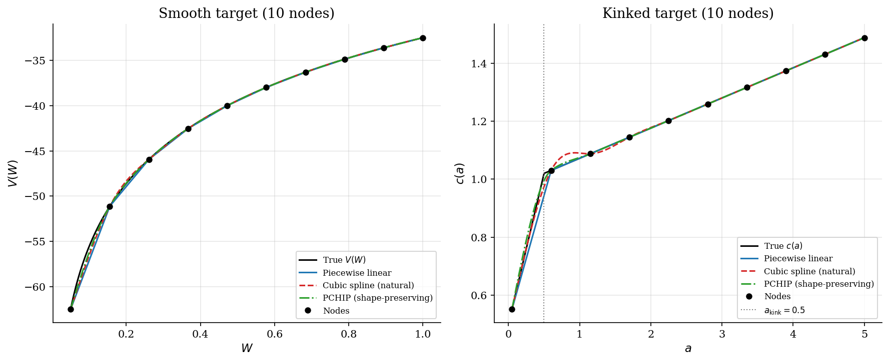
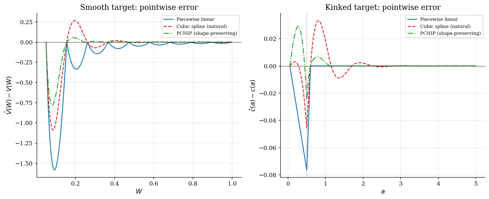
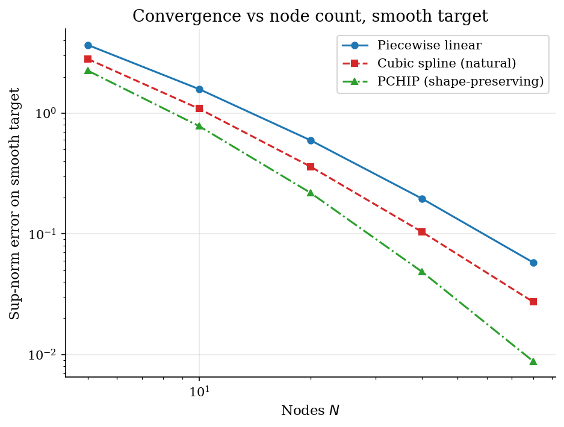

# Off-Grid Function Approximation by Interpolation

## Overview

Value function iteration stores the value function at a finite grid and reads it off-grid every step. Three classical interpolators are the workhorses: piecewise linear, natural cubic spline, and PCHIP (piecewise cubic Hermite interpolating polynomial).

This tutorial fits each one to two targets. The first target is the closed-form cake-eating value function, which is smooth and monotone. The second is a stylized consumption policy with a borrowing-constraint kink. The level is continuous but the slope drops sharply at the constraint boundary.

Spline theory originates with Schoenberg (1946), who proved that the natural cubic spline minimizes integrated squared curvature among all interpolants through the same nodes. That optimality is exactly what causes ringing near kinks: the spline is forced to be smooth where the true function is not. Piecewise linear interpolation and PCHIP avoid the ringing at the cost of curvature accuracy.

## Read before

- [Root finding for equilibrium rates](../root-finding/README.md)
- [Optimal growth model](../../dynamic-programming/optimal-growth/README.md)

## Equations

The general problem is to recover an unknown function $`f : [x_0, x_N] \to \mathbb{R}`$ from values $`\lbrace(x_i, y_i)\rbrace_{i=0}^{N}`$ at a finite set of nodes.
An interpolant $`\hat f`$ matches the data ($`\hat f(x_i) = y_i`$ for every $`i`$) and provides a rule for evaluating $`\hat f(x)`$ at any $`x`$ between nodes.

### The test instances

Two targets stress different smoothness regimes.
The first target is the closed-form log-utility cake-eating value function on a smooth interior.

```math
V(W) = \frac{\log((1-\beta) W)}{1-\beta} + \frac{\beta \log \beta}{(1-\beta)^2}.
```

The second target is a stylised consumption policy with a borrowing constraint at $`a_{\text{kink}}`$.

```math
c(a) =
\begin{cases}
(1 + r)  a + y, & a \leq a_{\text{kink}} \\
c(a_{\text{kink}}) + (1 + r)  \mathrm{MPC}  (a - a_{\text{kink}}), & a > a_{\text{kink}}.
\end{cases}
```

Below the kink the agent is constrained and consumes everything.
Above the kink they save with marginal propensity to consume $`\mathrm{MPC} < 1`$.
The function is continuous in level.
The slope drops from $`(1 + r)`$ to $`(1 + r) \mathrm{MPC}`$ at $`a_{\text{kink}}`$.

The next three subsections describe one method at a time.

### Method 1: Piecewise linear

Piecewise linear interpolation connects adjacent nodes with straight segments.
For a query $`x`$ in $`[x_i, x_{i+1}]`$ the interpolant is the convex combination of the bracketing values.

```math
\hat{f}(x) = \frac{x_{i+1} - x}{x_{i+1} - x_i}  f(x_i) + \frac{x - x_i}{x_{i+1} - x_i}  f(x_{i+1}).
```

The interpolant is $`C^0`$ but generally not differentiable at the nodes.

### Method 2: Natural cubic spline

The natural cubic spline fits a piecewise cubic with $`\hat{f}, \hat{f}', \hat{f}''`$ continuous everywhere and $`\hat{f}''(x_0) = \hat{f}''(x_N) = 0`$.
The coefficients solve a tridiagonal linear system for the second derivatives at interior nodes.
The result is $`C^2`$ and is the smoothest interpolant in the integrated-squared-second-derivative sense.

### Method 3: PCHIP

PCHIP fits a piecewise cubic Hermite polynomial whose endpoint slopes are chosen by a monotonicity-preserving rule (Fritsch-Carlson 1980).
The result is $`C^1`$ and never overshoots a monotone target.
The trade against the cubic spline is between curvature and shape preservation.
Cubic splines bend smoothly but can ring near a kink.
PCHIP holds the shape but drops one order of smoothness.

## Worked Numerical Example

Three nodes $`(x_0, y_0) = (0, 0)`$, $`(x_1, y_1) = (1, 1)`$, $`(x_2, y_2) = (3, 9)`$ carry the data. These values come from $`f(x) = x^2`$, so the true function is known and all three methods can be scored against it at $`x = 2`$.

The query $`x = 2`$ lies in the interval $`[x_1, x_2] = [1, 3]`$. The piecewise-linear formula applied to this segment weights the two bracketing nodes by their distances from the query:

```math
\hat{f}_{\text{lin}}(2)
= \frac{x_2 - x}{x_2 - x_1} \, f(x_1) + \frac{x - x_1}{x_2 - x_1} \, f(x_2)
= \frac{3 - 2}{3 - 1} (1) + \frac{2 - 1}{3 - 1} (9)
= 0.5 \cdot 1 + 0.5 \cdot 9 = 5.
```

The weight on node $`(1, 1)`$ is 0.5 and the weight on node $`(3, 9)`$ is 0.5 because $`x = 2`$ sits exactly at the midpoint of the segment. The segment is a straight line, and the true function curves upward between the two nodes, so linear interpolation overshoots.

With only three nodes there is a unique polynomial of degree at most two that passes through all three points. That quadratic interpolant recovers $`f(x) = x^2`$ exactly, so

```math
\hat{f}_{\text{quad}}(2) = 2^2 = 4.
```

The comparison isolates what curvature costs. The straight-line segment connecting $`(1,1)`$ and $`(3,9)`$ sits above the parabola on the open interval between them. Linear interpolation overestimates because it cannot track the concave-up shape; the polynomial interpolant has the right curvature and matches the true value:

```math
\boxed{\hat{f}_{\text{lin}}(2) = 5 \quad \text{vs} \quad \hat{f}_{\text{quad}}(2) = 4 \quad \text{(true value)}}.
```

In this tutorial, cubic spline and PCHIP are richer than the three-node quadratic -- they use many nodes and fit piecewise cubics -- but they share the same principle: adding curvature information lets the interpolant track $`f(x)`$ more faithfully between nodes. The sup-norm comparison in Results quantifies how much that extra curvature is worth on the smooth cake-eating target and where it stops helping on the kinked policy.

## Model Setup

| Parameter | Value | Parameter | Value |
|---|---:|---|---:|
| Discount factor $`\beta`$ | 0.9 | Interest rate $`r`$ | 0.04 |
| Smooth domain $`[W_\min, W_\max]`$ | $`[0.05, 1.0]`$ | Kinked domain $`[a_\min, a_\max]`$ | $`[0.05, 5.0]`$ |
| Kink location $`a_{\text{kink}}`$ | 0.5 | Endowment $`y`$ | 0.5 |
| $`\mathrm{MPC}`$ above kink | 0.1 | Display node count $`N`$ | 10 |
| Convergence sweep nodes | 5, 10, 20, 40, 80 | Query density | 2000 pts |

## Solution Method

Each method takes the same node set $`(x_i, y_i)`$ and returns a callable on $`[x_0, x_N]`$. Linear interpolation uses `lib.interpolate.linear_interp`; cubic spline uses `scipy.interpolate.CubicSpline` with `bc_type='natural'`; PCHIP uses `scipy.interpolate.PchipInterpolator`. The three differ in what continuity they enforce and whether they preserve shape.

```
  (x,y) nodes       (x,y) nodes        (x,y) nodes
       |                  |                   |
       v                  v                   v
 +-----------+     +------------+     +--------------+
 |  [ lerp ] |     |  [ spline ]|     |  [ PCHIP ]   |
 +-----------+     +------------+     +--------------+
       |                  |                   |
      y(x*)             y(x*)               y(x*)
   C^0, shape OK      C^2, may ring       C^1, shape OK
```

## Results

At ten nodes the three methods agree closely on the smooth value function.

On the kinked policy the cubic spline rings near $`a_{\text{kink}}`$: $`C^2`$ smoothness forces it to oscillate around the slope discontinuity.

Piecewise linear and PCHIP track the kink without overshoot, at the cost of a corner where the slope changes.



On the smooth target all three errors concentrate near $`W = 0`$, where curvature is largest. PCHIP is uniformly smallest, ahead of the cubic spline at this node count.

On the kinked target the cubic-spline error oscillates above and below zero around $`a_{\text{kink}}`$.

PCHIP eliminates the ringing at the same node count.

Piecewise linear under-shoots in the same interval but stays monotone.



The log-log sup-norm slopes on the smooth target fall short of their textbook asymptotic rates. The cake-eating value function $`V(W)`$ has a logarithmic singularity as $`W \to 0`$, so curvature blows up near the left edge of the domain. That near-singular region keeps every method below its smooth-function rate at these node counts; the cubic spline does not reach the slope a fully smooth target would give.

On a kinked target the smoothness advantage disappears entirely, and PCHIP becomes the right default because it preserves shape.



At a fixed budget of ten nodes the table below summarises sup-norm and L2 errors for each method on both targets. PCHIP is the lowest-error choice on both the smooth and the kinked target.

Sup-norm and L2 errors at N = 10 nodes for each method on the smooth and kinked targets.

| Method | Smooth sup-error | Smooth L2 error | Kinked sup-error | Kinked L2 error |
|:---|---:|---:|---:|---:|
| Piecewise linear | 1.58e+00 | 3.95e-01 | 7.63e-02 | 1.47e-02 |
| Cubic spline (natural) | 1.09e+00 | 2.58e-01 | 4.57e-02 | 9.93e-03 |
| PCHIP (shape-preserving) | 7.81e-01 | 1.71e-01 | 2.90e-02 | 6.49e-03 |

### Error diagnostics

The table rows confirm that PCHIP dominates on the smooth target and eliminates ringing on the kinked one. The cubic spline kinked sup-error is roughly twice the PCHIP value at this node count.

## Takeaway

*Schoenberg's optimality result* is a double-edged sword: the natural cubic spline minimizes integrated curvature, but that same pressure forces oscillations wherever the true function has a slope discontinuity. Piecewise linear interpolation is the safe default for value functions with borrowing constraints -- it preserves shape, never overshoots, and requires no setup. PCHIP gives steeper convergence on smooth targets and eliminates ringing on kinked ones, making it the right upgrade once a tutorial adds off-grid evaluation. The three methods together span the classic accuracy-vs-shape tradeoff that practitioners navigate every time they store a policy function on a grid.

## See also

- [Aiyagari saving and capital-market clearing](../../dynamic-programming/aiyagari/README.md)
- [Consumption savings under income risk](../../dynamic-programming/consumption-savings/README.md)
- [Root finding for equilibrium rates](../root-finding/README.md)

## References

- Schoenberg, I. J. (1946). Contributions to the problem of approximation of equidistant data by analytic functions. *Quarterly of Applied Mathematics*, 4(2), 45-99. Establishes that the natural cubic spline minimizes integrated squared curvature.
- Fritsch, F. N. and Carlson, R. E. (1980). Monotone Piecewise Cubic Interpolation. *SIAM Journal on Numerical Analysis*, 17(2), 238-246.
- Mukoyama, T. (2021). *Basic Numerical Methods*. ECON 606 lecture slides, Georgetown University.
- Press, W. H., Teukolsky, S. A., Vetterling, W. T., and Flannery, B. P. (2007). *Numerical Recipes*. Cambridge University Press, 3rd edition, Ch. 3.
- Judd, K. L. (1998). *Numerical Methods in Economics*. MIT Press, Ch. 6.
