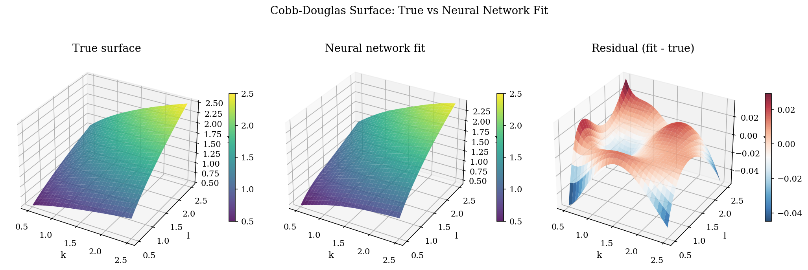
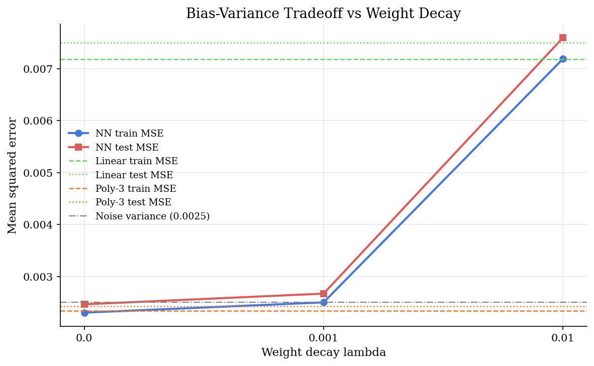
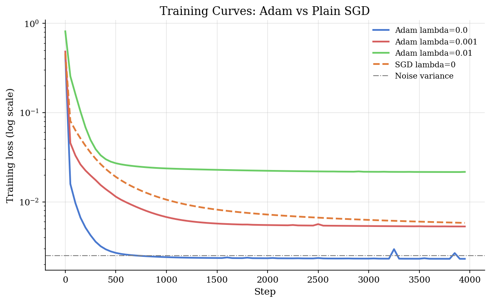

# Feedforward Neural Networks for Regression and Density Approximation

## Overview

Several tutorials in this catalog learn a function from data using a small feedforward neural network. The random utility model in `rum-choice-networks/` bends the utility surface with a tanh layer before the softmax. The adversarial-estimation tutorial trains a shallow tanh discriminator to tell real observations from simulated ones. The deep-optimal-auctions tutorial parameterises an entire mechanism as a differentiable network and trains it by autodiff. All three start from the same primitive: a one-hidden-layer tanh network with a small number of units, a squared-error or cross-entropy loss, weight decay, and an Adam optimiser.

This prelim presents that primitive in isolation. It fits a one-hidden-layer tanh network with sixteen units to a Cobb-Douglas surface (production output as a function of capital and labour with constant returns to scale) observed with Gaussian noise. It compares the fit against a linear baseline and a degree-three polynomial baseline. It sweeps the weight-decay strength to show the bias-variance trade-off. And it overlays training curves for Adam against plain stochastic gradient descent (plain SGD: subtract the gradient times a step size) to motivate adaptive learning rates.

The four moving parts are the forward pass, the squared-error loss with L2 weight decay (penalty on the sum of squared weights, called L2 because it is the squared L2-norm of the weight vector), the gradient of the loss computed by JAX automatic differentiation (autodiff, which builds the chain rule programmatically), and the Adam parameter update. The same four parts show up in every downstream neural tutorial; only the loss and the architecture change.

## Equations

We need notation for the network's input, output, weights, and biases. Let $`x \in \mathbb{R}^{d_{\mathrm{in}}}`$ be the input vector, let $`H`$ be the number of hidden units, and let $`W \in \mathbb{R}^{H \times d_{\mathrm{in}}}`$, $`b \in \mathbb{R}^{H}`$ be the input-to-hidden weights and biases, with $`\widetilde W \in \mathbb{R}^{d_{\mathrm{out}} \times H}`$, $`\widetilde b \in \mathbb{R}^{d_{\mathrm{out}}}`$ for the hidden-to-output layer. A one-hidden-layer feedforward network with tanh activation maps $`x`$ to a prediction $`\widehat y`$ in two steps:

```math
h = \tanh(W x + b),
\qquad
\widehat y = \widetilde W h + \widetilde b.
```

The hidden activation $`h \in \mathbb{R}^{H}`$ is a smooth, bounded transformation of the input. Tanh is bounded in $`(-1, 1)`$ and is symmetric around zero, which keeps the output linear-in-the-tail and stable to train. The output layer is linear in $`h`$; for regression problems it returns a real number, for binary classification it is composed with a sigmoid to return a probability.

We need a loss that combines fit and a complexity penalty. The squared-error loss with L2 weight decay sums a mean-squared error over $`n`$ training points and a quadratic penalty on the weight matrices:

```math
\mathcal{L}(\theta) = \frac{1}{n} \sum_{i=1}^{n} \left(y_i - \widehat y_i\right)^2 + \lambda  \left(\|W\|_F^2 + \|\widetilde W\|_F^2\right),
\qquad
\theta = (W, b, \widetilde W, \widetilde b).
```

The Frobenius norm $`\|W\|_F^2 = \sum_{ij} W_{ij}^2`$ penalises large entries in the weight matrices but leaves the biases unregularised, which is standard. The scalar $`\lambda \geq 0`$ trades fit against simplicity. At $`\lambda = 0`$, the network is free to interpolate noise. As $`\lambda`$ grows, the optimal $`W`$ shrinks toward zero and the network's output collapses toward its bias, recovering the constant-mean predictor.

We need the gradient of $`\mathcal{L}`$ with respect to $`\theta`$ to run a first-order optimiser. The chain rule decomposes that gradient through the network's layers. Writing the loss as a function of intermediate activations, with $`r_i = y_i - \widehat y_i`$ the residual and $`\odot`$ the elementwise product, the gradient components are:

```math
\begin{aligned}
\nabla_{\widetilde W} \mathcal{L} &= -\tfrac{2}{n} \sum_{i} r_i  h_i^{\top} + 2\lambda  \widetilde W, \\
\nabla_{W} \mathcal{L} &= -\tfrac{2}{n} \sum_{i} \big(\widetilde W^{\top} r_i \odot (1 - h_i \odot h_i)\big)  x_i^{\top} + 2\lambda  W,
\end{aligned}
```

with analogous expressions for $`\widetilde b`$ and $`b`$. The hand derivation is mechanical and brittle to write out, which is exactly the use case for automatic differentiation. JAX builds the computational graph at trace time and returns the gradient of any scalar-valued function automatically via `jax.grad`. The implementation calls `grad(loss_fn)` and treats the returned function as a black-box gradient oracle.

We need a parameter-update rule that adapts the step size per coordinate. Plain SGD subtracts a fixed step size times the gradient; Adam adds two running averages (a first moment that tracks the mean gradient and a second moment that tracks the variance of the gradient) and divides the update by the square root of the second moment, so steep coordinates step less and shallow coordinates step more. At iteration $`t`$ with hyperparameters $`\beta_1, \beta_2 \in (0, 1)`$, $`\varepsilon > 0`$, and learning rate $`\eta`$:

```math
\begin{aligned}
m_t &= \beta_1  m_{t-1} + (1 - \beta_1)  g_t, \\
v_t &= \beta_2  v_{t-1} + (1 - \beta_2)  g_t \odot g_t, \\
\widehat m_t &= \frac{m_t}{1 - \beta_1^{t}}, \qquad \widehat v_t = \frac{v_t}{1 - \beta_2^{t}}, \\
\theta_t &= \theta_{t-1} - \eta  \frac{\widehat m_t}{\sqrt{\widehat v_t} + \varepsilon}.
\end{aligned}
```

The bias-corrected estimates $`\widehat m_t, \widehat v_t`$ compensate for the running averages being initialised at zero. The element-wise denominator $`\sqrt{\widehat v_t} + \varepsilon`$ is the per-coordinate adaptive step size that gives Adam its name (adaptive moment estimation). In practice Adam reaches a good fit in several hundred to a few thousand updates on small networks, where plain SGD with the same learning rate is several times slower.

## Model Setup

| Object | Symbol | Role |
|---|---|---|
| Input dimension | $`d_{\mathrm{in}}`$ | 2 (capital, labour) |
| Output dimension | $`d_{\mathrm{out}}`$ | 1 (predicted output) |
| Hidden units | $`H`$ | 16 [prelim introduces] |
| Input weights | $`W`$ | $`H \times d_{\mathrm{in}}`$ matrix [from `adversarial-estimation/`; `rum-choice-networks/` uses the transpose convention $`W^{\top} x`$] |
| Hidden biases | $`b`$ | $`H`$-vector [prelim introduces] |
| Output weights | $`\widetilde W`$ | $`d_{\mathrm{out}} \times H`$ matrix [prelim introduces] |
| Output bias | $`\widetilde b`$ | scalar [prelim introduces] |
| Hidden activation | $`h`$ | $`\tanh(W x + b)`$ |
| Prediction | $`\widehat y`$ | $`\widetilde W h + \widetilde b`$ |
| Weight-decay strength | $`\lambda`$ | 0, 1e-3, or 1e-2 in the sweep |
| Adam learning rate | $`\eta`$ | 0.01 |
| Adam moment decays | $`\beta_1, \beta_2`$ | 0.9, 0.999 |
| Training points | $`n`$ | 400 |
| Test points | 1000 | Out-of-sample MSE |
| Training steps | 4000 | Full-batch Adam updates |
| Cobb-Douglas TFP | $`A`$ | 1.0 |
| Cobb-Douglas exponent | $`\alpha`$ | 0.4 |
| Noise scale | $`\sigma_\varepsilon`$ | 0.05 |

The annotations record which symbols are shared with the dense tutorials that adopt this prelim.

## Solution Method

The procedure has three stages: initialise the parameters, run Adam for a fixed number of steps, and evaluate.

```text
Procedure: One-hidden-layer tanh regression with weight decay and Adam
Inputs : training pairs (x_i, y_i) for i = 1, ..., n; hidden width H;
         weight decay lambda; learning rate eta; step count T.
Outputs: trained parameter tuple theta = (W, b, W_tilde, b_tilde) and
         loss history.

1. Initialise weights with He (Kaiming) scaling:
     W      ~ Normal(0, sqrt(2 / d_in)) of shape (H, d_in)
     W_tilde ~ Normal(0, sqrt(2 / H)) of shape (d_out, H)
     b, b_tilde initialised to zero.
   (He is the ReLU-tuned variance; for tanh, classical Xavier with 1/fan_in
   is the textbook choice, but He is close enough on this small problem.)

2. Build the gradient oracle once:
     grad_fn = jax.jit(jax.grad(loss_fn))

3. Initialise Adam state (m, v zeros, step counter t = 0).

4. For step = 1 to T:
     g     <- grad_fn(theta, x, y, lambda)
     theta <- adam_step(theta, g, state, eta, beta1, beta2, eps)
     periodically log the loss.

5. Evaluate trained theta on held-out test points; report train and test MSE.
```

Plain SGD with the same learning rate replaces step 4's `adam_step` with a single subtraction $`\theta \leftarrow \theta - \eta g`$. The bias-variance sweep loops the whole procedure across $`\lambda \in \{0, 10^{-3}, 10^{-2}\}`$ with the same data and the same random initialisation.

Deeper architectures, convolutional and attention layers, normalising flows, and meta-learning are out of scope. Architecture choices specific to consumer tutorials (RUMnet structure, GAN discriminator design, mechanism heads) live in those tutorials.

## Results

The network fits the Cobb-Douglas surface closely. The first figure compares the truth, the trained network's prediction, and the residual on the $`30 \times 30`$ plotting grid.



The middle panel is visually indistinguishable from the truth at the plotting scale. The residual panel shows a maximum absolute error of about $`0.04`$ across the domain, with the largest deviations concentrated near the corners where the surface curvature is largest. There is no systematic bias along either axis.

The second figure sweeps $`\lambda`$ and reports the bias-variance trade-off.



At $`\lambda = 0`$ the network achieves train MSE $`0.0023`$ (just below the noise variance $`0.0025`$, as expected with $`n = 400`$ degrees of freedom on a smooth target) and test MSE $`0.0025`$, matching the noise floor. At $`\lambda = 10^{-3}`$ both errors are within rounding distance of $`\lambda = 0`$. At $`\lambda = 10^{-2}`$ the network collapses back toward the linear baseline ($`0.0072 / 0.0075`$), an "over-regularised" regime where the weight penalty dominates the fit term. The degree-3 polynomial baseline matches the network at small $`\lambda`$; it has enough flexibility to express a Cobb-Douglas surface on this domain and serves as a natural ceiling on what shallow flexibility buys.

The third figure compares Adam against plain SGD with the same learning rate.



Adam at $`\lambda = 0`$ reaches the noise floor in roughly $`500`$ steps and stays there. Plain SGD at the same learning rate is still above $`0.005`$ at $`4000`$ steps. The Adam curve at $`\lambda = 10^{-3}`$ plateaus slightly above the noise floor because the weight-decay term contributes to the loss; the Adam curve at $`\lambda = 10^{-2}`$ plateaus around $`0.02`$. The per-coordinate step size is the entire reason Adam wins here: the loss landscape has coordinates with very different curvatures, and a single global learning rate compromises between them. Adam takes a different effective step on each coordinate.

## Takeaway

A one-hidden-layer tanh network is enough to fit a smooth two-input target like the Cobb-Douglas surface to noise. The four moving parts (forward pass, squared-error loss with L2 weight decay, JAX autodiff for the gradient, Adam optimiser) are general; downstream tutorials reuse the same code with different loss functions and different architectures.

Weight decay trades fit for simplicity. Set $`\lambda`$ too small and the network can interpolate noise; set $`\lambda`$ too large and it collapses to a constant. The middle range ($`\lambda = 10^{-3}`$ here) is where the test error is robust to the noise realisation, which is the practical reason to regularise.

## References

- Goodfellow, I., Bengio, Y., and Courville, A. (2016). *Deep Learning*. MIT Press, Chapters 6-7. Feedforward networks and regularisation.
- Bishop, C. M. (2006). *Pattern Recognition and Machine Learning*. Springer, Chapter 5. Classical neural networks with Bayesian regularisation framing.
- Kingma, D. P. and Ba, J. (2015). "Adam: A Method for Stochastic Optimization." *International Conference on Learning Representations*. The optimiser used everywhere in the consumer tutorials.
- Athey, S. and Imbens, G. W. (2019). "Machine Learning Methods That Economists Should Know About." *Annual Review of Economics*, 11, 685-725. Positioning for economist readers.
- **See also.** The neural utility layer in [`structural-econometrics/rum-choice-networks/`](../../structural-econometrics/rum-choice-networks/) reuses this tanh primitive inside a logit choice probability. The shallow discriminator in [`structural-econometrics/adversarial-estimation/`](../../structural-econometrics/adversarial-estimation/) reuses it with a sigmoid output and a cross-entropy loss to tell real observations from simulated ones. The differentiable mechanism in [`game-theory/deep-optimal-auctions/`](../../game-theory/deep-optimal-auctions/) reuses it as the parameterisation of an allocation and payment rule trained by autodiff against a regret penalty.
