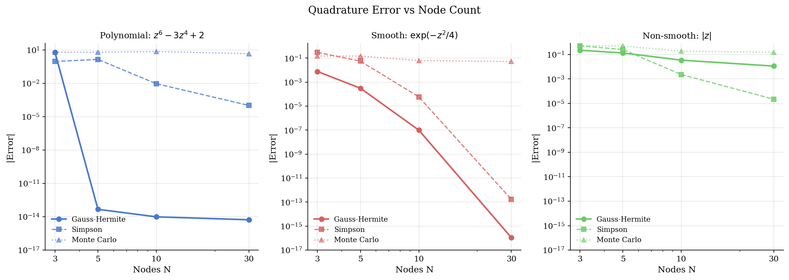
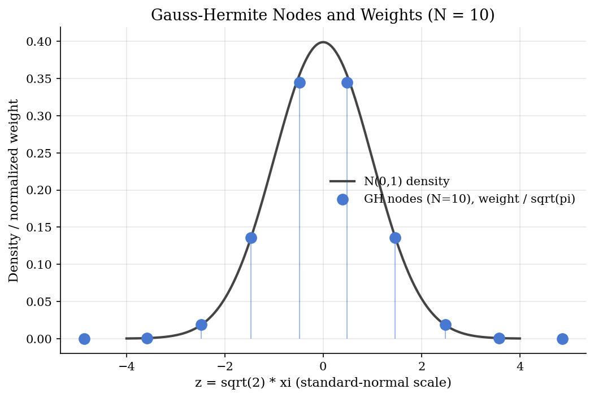
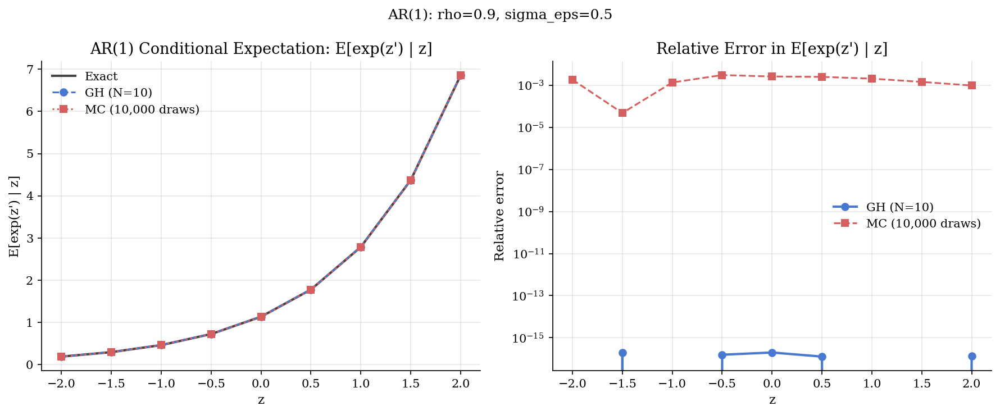

# Numerical Quadrature: Gauss-Hermite Nodes for Conditional Expectations

## Overview

Many economic objects are expectations of a function against a Gaussian density. The Euler equation in a dynamic-programming problem with an AR(1) productivity shock, the bid-shading integral in a Bayes-Nash auction, and the acquisition integral in Bayesian optimisation all sit on the same template: take the expected value of some smooth function when its argument is a normally distributed random variable. Monte Carlo can do this, but it converges at the square-root-of-draws rate, which is slow whenever the integrand is smooth.

Gauss-Hermite quadrature exploits the smoothness. It picks a small number of carefully placed nodes (the roots of the Hermite polynomials) and weights (derived from the same polynomials by the Christoffel-Darboux formula), so that the resulting weighted sum reproduces the integral exactly whenever the integrand is a polynomial of degree at most twice the node count minus one. For smooth non-polynomial integrands, the error decays geometrically in the node count. Three nodes already integrate a fourth-degree polynomial exactly. Ten nodes integrate a smooth Gaussian-decay integrand to machine precision.

This prelim presents the Gauss-Hermite identity, the change of variables that turns an AR(1) conditional expectation into a Gauss-Hermite sum, and a node-count-versus-error comparison against Simpson's rule and Monte Carlo on three test integrands. The same machinery is used in the inner expectation loop of [`computational-methods/smolyak-sparse-grids/`](../../computational-methods/smolyak-sparse-grids/), and underpins the AR(1) discretisation in [`dynamic-programming/shock-discretization/`](../../dynamic-programming/shock-discretization/) (Tauchen-Hussey), the acquisition integral in [`numerical-methods/bayesian-optimization/`](../../numerical-methods/bayesian-optimization/), and the likelihood approximation in [`structural-econometrics/bayesian-dsge-hmc/`](../../structural-econometrics/bayesian-dsge-hmc/).

## Equations

We need an integration rule that is exact on polynomials of degree up to $`2N - 1`$ in $`N`$ nodes. The Gauss-Hermite identity says that for any function $`f`$ that grows no faster than the Gaussian weight decays:

```math
\int_{-\infty}^{\infty} f(x)  e^{-x^2}  dx \approx \sum_{n=1}^{N} w_n  f(\xi_n),
```

where $`\{\xi_n\}_{n=1}^{N}`$ are the roots of the $`N`$-th physicists' Hermite polynomial $`H_N`$ and $`\{w_n\}`$ are the associated weights, given by $`w_n = 2^{N-1} N! \sqrt{\pi} / (N^2  H_{N-1}(\xi_n)^2)`$. The approximation is exact whenever $`f`$ is a polynomial of degree at most $`2N - 1`$, and the error for smooth $`f`$ decays geometrically in $`N`$.

We need a version that integrates against the standard-normal density $`\phi`$ rather than the physicists' weight $`e^{-x^2}`$. The change of variables $`x = z / \sqrt{2}`$ in the Gauss-Hermite identity gives:

```math
\mathbb{E}_{Z \sim \phi}[g(Z)] = \int_{-\infty}^{\infty} g(z)  \phi(z)  dz = \frac{1}{\sqrt{\pi}} \sum_{n=1}^{N} w_n  g(\sqrt{2}  \xi_n).
```

The factor $`1 / \sqrt{\pi}`$ normalises the physicists' weight to the standard-normal density. The transformed nodes $`\sqrt{2}  \xi_n`$ are concentrated around zero, with weights largest at the origin and falling away from it. This is the form most useful in economics, where standard-normal shocks appear directly.

We need to handle the AR(1) conditional expectation. Suppose $`z_{t+1} = \rho  z_t + \sigma_\varepsilon  \eta_{t+1}`$ with $`\eta_{t+1} \sim N(0, 1)`$. The conditional expectation $`\mathbb{E}[f(z_{t+1}) \mid z_t]`$ is an integral against the standard-normal density of the shifted-and-scaled argument. Substituting $`\eta = \sqrt{2}  \xi`$ into the AR(1) recursion gives the Gauss-Hermite estimator:

```math
\mathbb{E}[f(z_{t+1}) \mid z_t] \approx \frac{1}{\sqrt{\pi}} \sum_{n=1}^{N} w_n  f\big(\rho  z_t + \sigma_\varepsilon \sqrt{2}  \xi_n\big).
```

This converts the AR(1) conditional expectation into a weighted sum of $`f`$ evaluated at $`N`$ shifted, scaled nodes. The Tauchen-Hussey approximation of the AR(1) process discretises the state space with exactly these nodes and assigns transition probabilities from the same weights.

We need a statement on convergence. Stroud-Secrest establish that for an integrand in $`C^{2k}`$ (continuously differentiable $`2k`$ times), the Gauss-Hermite error decays at rate $`O(N^{-2k})`$, which is faster than any polynomial in $`N`$ when $`f`$ is smooth. For non-smooth integrands (kinked functions, indicators) the error decays slowly and Simpson's rule on a finite truncation can outperform Gauss-Hermite.

## Model Setup

| Object | Symbol | Role |
|---|---|---|
| Number of nodes | $`N`$ | 3, 5, 10, or 30 in the sweep |
| Hermite roots | $`\xi_n`$ | Computed by `scipy.special.roots_hermite` |
| Hermite weights | $`w_n`$ | Computed by `scipy.special.roots_hermite` |
| Test integrand 1 | $`f_1(z) = z^6 - 3 z^4 + 2`$ | Polynomial; GH exact at $`N \geq 4`$ |
| Test integrand 2 | $`f_2(z) = \exp(-z^2 / 4)`$ | Smooth, non-polynomial |
| Test integrand 3 | $`f_3(z) = \lvert z \rvert`$ | Non-smooth (kink at $`0`$) |
| AR(1) persistence | $`\rho`$ | 0.9 in the example |
| AR(1) innovation sd | $`\sigma_\varepsilon`$ | 0.5 in the example |
| AR(1) test function | $`f(z') = \exp(z')`$ | Closed-form expectation $`\exp(\rho z + \sigma_\varepsilon^2 / 2)`$ |

The annotations record which symbols are shared with the dense tutorials that adopt this prelim.

## Solution Method

The procedure has three stages: build the Gauss-Hermite rule, integrate the test functions, and apply the AR(1) change of variables.

```text
Procedure: Gauss-Hermite quadrature for Gaussian-weighted expectations
Inputs : node count N; integrand f; standard-normal density phi (implicit).
Outputs: approximation of E_phi[f(z)] and (separately) E[f(z')|z_t] for AR(1).

1. Compute nodes and weights once:
     xi_n, w_n = scipy.special.roots_hermite(N).

2. Standard-normal expectation:
     I_GH(N) = (1 / sqrt(pi)) * sum_n w_n * f(sqrt(2) * xi_n).

3. AR(1) conditional expectation at state z_t:
     z_prime_n = rho * z_t + sigma_eps * sqrt(2) * xi_n
     E_GH(N)   = (1 / sqrt(pi)) * sum_n w_n * f(z_prime_n).
```

Two practical caveats. First, smoothness matters: when $`f`$ is differentiable up to high order, Gauss-Hermite converges fast; when $`f`$ has a kink or discontinuity, Simpson's rule on a finite truncation can be more accurate at the same evaluation count. Second, the change of variables relies on the innovation being Gaussian. Non-Gaussian innovations need a different node set (Gauss-Legendre for uniform, Gauss-Laguerre for exponential, and so on).

Adaptive quadrature, sparse-grid quadrature (the Smolyak product of Gauss-Hermite rules), and high-dimensional quasi-Monte Carlo build on this base and are out of scope.

## Results

The error-versus-nodes curve compares Gauss-Hermite against Simpson's rule and Monte Carlo on the three test integrands.



For the polynomial $`f_1`$, Gauss-Hermite is exact to machine precision at $`N = 5`$. Simpson's rule still has an error of $`1.4`$ at $`N = 5`$ and only catches up at $`N = 30`$. For the smooth non-polynomial $`f_2`$, Gauss-Hermite reaches machine precision at $`N = 30`$, with Simpson within a factor of two and Monte Carlo lagging by orders of magnitude (a Monte Carlo sample of $`30`$ has very high relative variance). For the non-smooth $`f_3`$, Gauss-Hermite's convergence slows substantially. Its error sits at $`1.1 \times 10^{-2}`$ at $`N = 30`$, while Simpson's rule (which does not require smoothness in the same way) achieves $`2.2 \times 10^{-5}`$ at the same evaluation count, a three-order-of-magnitude advantage on this integrand. The mainline takeaway is that Gauss-Hermite's advantage is smoothness-dependent.

The node and weight visualisation makes the geometry of the rule concrete.



The transformed nodes $`\sqrt{2}  \xi_n`$ concentrate around the origin where the standard-normal density is largest. The weights, scaled by $`1/\sqrt{\pi}`$ to integrate against $`\phi`$, are also largest near the origin. At $`N = 10`$ the nodes span roughly $`\pm 4`$ standard deviations, which is enough to integrate against the full Gaussian density with negligible truncation error.

The AR(1) conditional expectation example uses $`f(z') = \exp(z')`$ and compares the Gauss-Hermite estimate against a Monte Carlo benchmark.



At $`N = 10`$, Gauss-Hermite recovers the closed-form expectation $`\exp(\rho  z + \sigma_\varepsilon^2 / 2)`$ to machine precision across the entire $`z`$ grid. Monte Carlo with $`10^4`$ draws sits at relative error $`10^{-3}`$. For dynamic-programming problems that compute conditional expectations many times inside an outer loop, the speed-up from replacing $`10^4`$ Monte Carlo draws with $`10`$ Gauss-Hermite nodes is three orders of magnitude per evaluation.

## Takeaway

Gauss-Hermite quadrature replaces a Gaussian-weighted integral with a small weighted sum at the roots of the Hermite polynomials. For smooth integrands the convergence is geometric in the node count; for kinked or indicator integrands it slows toward the rates that Simpson's rule and Monte Carlo achieve. The change of variables $`z' = \rho z + \sigma_\varepsilon \sqrt{2}  \xi_n`$ turns AR(1) conditional expectations into a few-node sum that converges far faster than Monte Carlo on the same compute budget. This is the inner-loop primitive in sparse-grid solvers, in Tauchen-Hussey discretisation, and in the acquisition integrals of Bayesian optimisation.

## References

- Stroud, A. H. and Secrest, D. (1966). *Gaussian Quadrature Formulas*. Prentice-Hall. Tabulated nodes and weights for the Hermite weight.
- Judd, K. L. (1998). *Numerical Methods in Economics*. MIT Press, Chapter 7. Gaussian quadrature for economic applications.
- Heer, B. and Maußner, A. (2009). *Dynamic General Equilibrium Modeling*, 2nd edition. Springer, Chapter 6. GH inside parametric-expectations and projection methods.
- Tauchen, G. and Hussey, R. (1991). "Quadrature-Based Methods for Obtaining Approximate Solutions to Nonlinear Asset Pricing Models." *Econometrica*, 59(2), 371-396. GH nodes for AR(1) Markov-chain approximation.
- **See also.** The Smolyak-sparse-grids solver in [`computational-methods/smolyak-sparse-grids/`](../../computational-methods/smolyak-sparse-grids/) uses Gauss-Hermite rules in each dimension and combines them via the Smolyak product. The Tauchen-Hussey AR(1) discretisation in [`dynamic-programming/shock-discretization/`](../../dynamic-programming/shock-discretization/) is built on the change-of-variables identity here. The Bayesian-optimisation acquisition integral in [`numerical-methods/bayesian-optimization/`](../../numerical-methods/bayesian-optimization/) uses Gauss-Hermite for the expected-improvement integral when needed. The likelihood approximation in [`structural-econometrics/bayesian-dsge-hmc/`](../../structural-econometrics/bayesian-dsge-hmc/) uses Gauss-Hermite for the inner shock integrals.
