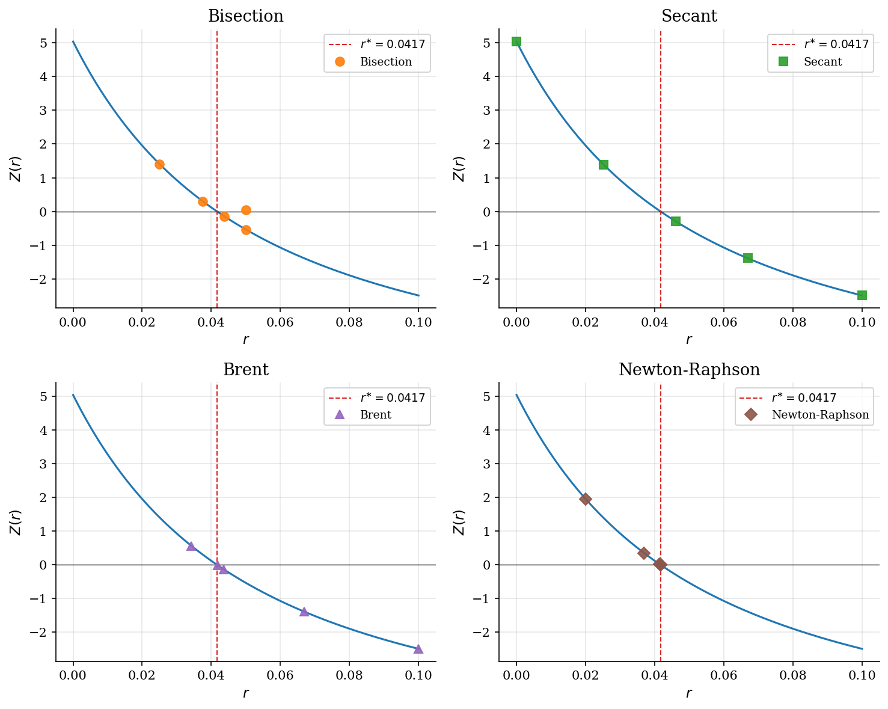
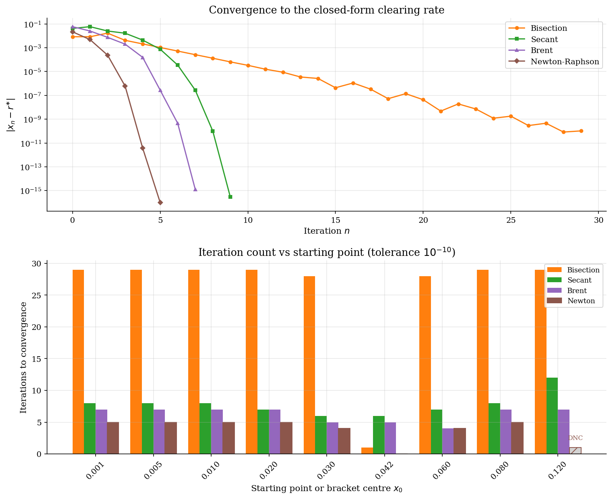

# Scalar Root Finding for Equilibrium Rates

## Overview

The general problem is to find $`r`$ satisfying $`Z(r) = 0`$ for a continuous scalar function. The intermediate value theorem guarantees that a sign-change bracket always contains a root. Bisection exploits that guarantee directly, halving the bracket at every step. Newton uses the derivative to converge quadratically from a nearby starting point. Brent (1973) combines bisection's bracket safety with inverse quadratic interpolation's speed.

The test instance is the interest rate that clears a stylized Cobb-Douglas capital market. The root has a closed form, so every method's accuracy is measurable exactly. The four solvers here are the same ones behind `scipy.optimize.brentq` and the outer loops in Aiyagari and Huggett.

The *intermediate value theorem* is the guarantee that makes bracket-based methods work. If $`Z`$ is continuous on $`[a, b]`$ and $`Z(a) Z(b) < 0`$, then a root $`r^{\ast} \in (a, b)`$ exists.

## Read before

- [Fixed-point acceleration](../fixed-point-acceleration/README.md)
- [Scalar optimization: monopoly pricing](../scalar-optimization-monopoly-pricing/README.md)

## Equations

The general *excess-demand function* maps the interest rate to the difference between capital supply and capital demand. The problem is to find

```math
Z(r) = 0, \qquad Z : \mathbb{R} \to \mathbb{R}.
```

The methods below produce a sequence $`\{r_n\}_{n \geq 0}`$ converging to a root $`r^{\ast}`$.

### The test instance

Aggregate capital demand from the firm-side first-order condition is

```math
K_d(r) = \left( \frac{\alpha}{r + \delta} \right)^{\frac{1}{1 - \alpha}}.
```

Target supply is $`K^{\ast} \equiv K_d(r^{\ast})`$ at the closed-form rate $`r^{\ast} = 1/\beta - 1`$. Excess demand is then

```math
Z(r) = K_d(r) - K^{\ast}, \qquad Z(r^{\ast}) = 0.
```

The derivative used by Newton is

```math
Z'(r) = -\frac{1}{1 - \alpha} \frac{K_d(r)}{r + \delta} < 0.
```

### Method 1: Bisection

Bisection halves a sign-change bracket at every iteration. The midpoint is

```math
m_n = \frac{a_n + b_n}{2}, \qquad b_{n+1} - a_{n+1} = \frac{1}{2}(b_n - a_n).
```

The sub-bracket containing the sign change is kept and the rest is discarded. Convergence is guaranteed under continuity alone, with linear rate one-half regardless of curvature.

### Method 2: Secant

The secant method fits a chord through the last two iterates and steps to the chord's zero,

```math
x_{n+1} = x_n - Z(x_n) \frac{x_n - x_{n-1}}{Z(x_n) - Z(x_{n-1})}.
```

The method needs two starting points but no derivative. Local convergence is superlinear with order $`(1 + \sqrt{5})/2 \approx 1.618`$.

### Method 3: Brent

Brent's method tries inverse quadratic interpolation through the last three ordinates. It falls back to secant when ordinates coincide. It falls back to bisection when the proposed step would leave the bracket or fails to halve the previous step. The bracket invariant is maintained at every iteration. Brent therefore inherits the global guarantee of bisection together with the asymptotic speed of secant or interpolation when the local problem is well behaved.

### Method 4: Newton-Raphson

Newton-Raphson follows the tangent of $`Z`$ at the current iterate,

```math
x_{n+1} = x_n - \frac{Z(x_n)}{Z'(x_n)}.
```

The method needs a derivative and one starting point. Local convergence is quadratic when $`Z'(r^{\ast}) \neq 0`$ and the iterate starts near the root.

## Worked Numerical Example

Take $`f(r) = r^3 - 2r - 5`$ as the test function. We need $`r^{\ast}`$ such that $`f(r^{\ast}) = 0`$.

Evaluation at the bracket endpoints checks the sign-change condition: $`f(2) = 8 - 4 - 5 = -1 < 0`$ and $`f(3) = 27 - 6 - 5 = 16 > 0`$, so a root lies in $`(2, 3)`$.

The *bisection bracket* narrows by half each step.

```math
\begin{array}{c|c|c|c|c}
n & a_n & b_n & m_n & f(m_n) \\ \hline
1 & 2.000 & 3.000 & 2.500 & +5.625 \\
2 & 2.000 & 2.500 & 2.250 & +1.891 \\
3 & 2.000 & 2.250 & 2.125 & +0.346 \\
4 & 2.000 & 2.125 & 2.063 & -0.351 \\
\end{array}
```

After step 4 the root is bracketed in $`(2.063, 2.125)`$. Each step halves the interval. After 30 steps the width is $`(3 - 2)/2^{30} \approx 10^{-9}`$, below the $`10^{-10}`$ tolerance. The true root is $`r^{\ast} \approx 2.0946`$.

Newton from $`r_0 = 2.5`$ uses the derivative $`f'(r) = 3r^2 - 2`$,

```math
r_1 = 2.5 - \frac{f(2.5)}{f'(2.5)} = 2.5 - \frac{5.625}{16.75} = 2.164.
```

```math
r_2 = 2.164 - \frac{f(2.164)}{f'(2.164)} = 2.164 - \frac{0.885}{11.059} = 2.084.
```

```math
r_3 = 2.084 - \frac{f(2.084)}{f'(2.084)} \approx 2.094.
```

Three Newton steps reach the same neighborhood that bisection reaches after roughly 20 steps. Bisection maintains a sign-change bracket at every step. Newton does not. In the equilibrium application, $`Z(r) = K_d(r) - K^{\ast}`$ plays the role of $`f(r)`$ here, and the same four methods are compared on that function in the Results below.

## Model Setup

| Parameter | Value | Parameter | Value |
|---|---:|---|---:|
| Capital share $`\alpha`$ | 0.36 | Discount factor $`\beta`$ | 0.96 |
| Depreciation $`\delta`$ | 0.08 | Closed-form rate $`r^{\ast} = 1/\beta - 1`$ | 0.041667 |
| Target capital $`K^{\ast}`$ | 5.4468 | Tolerance $`\varepsilon`$ | 1e-10 |
| Bracket $`[a_0, b_0]`$ (bisection, Brent) | $`[10^{-6},\ 0.1]`$ | Secant seeds $`[x_0, x_1]`$ | $`[10^{-6},\ 0.1]`$ |
| Newton start $`x_0`$ | 0.02 | | |

## Solution Method

Each of the four methods solves $`Z(r) = 0`$ with a different input requirement. Bisection and Brent need only a sign-change bracket. Secant needs two starting points. Newton needs both a starting point and the derivative $`Z'`$.

The *bisection loop* is the foundational case. It maintains the bracket invariant at every step.

```
              f, bracket [a, b] with f(a)·f(b) < 0
                                |
                                v
              +-- [ bisection step ] --+
              |                        |
              +-- |b - a| > ε: repeat -+
                                |
                            converged
                                v
                                x*
```

Real Python for all four methods. Each comment names the step it implements.

```python
def bisection(f, a, b, tol):
    fa = f(a)
    while (b - a) / 2 > tol:
        c = (a + b) / 2          # midpoint of current bracket
        fc = f(c)
        if abs(fc) < tol:        # root hit exactly
            return c
        if fa * fc < 0:          # sign change in left half
            b = c
        else:                    # sign change in right half
            a, fa = c, fc
    return (a + b) / 2


def secant(f, x0, x1, tol):
    f0, f1 = f(x0), f(x1)
    while abs(f1) > tol:
        x2 = x1 - f1 * (x1 - x0) / (f1 - f0)   # chord zero
        x0, f0 = x1, f1
        x1, f1 = x2, f(x2)
    return x1


def newton(f, fprime, x0, tol):
    x = x0
    while abs(f(x)) > tol:
        x = x - f(x) / fprime(x)    # tangent step: x_{n+1} = x_n - f/f'
    return x
```

Brent's method wraps the same bisection fallback around inverse quadratic interpolation. The production implementation is `scipy.optimize.brentq`.

On this calibration bisection uses 29 iterations, secant 9, Brent 7, and Newton 5.

## Results

Each trajectory panel plots $`Z(r)`$ with the first four iterates of one method overlaid. Bisection steps to the midpoint and halves the bracket. Secant draws chords through the last two iterates and accelerates near the root. Brent steps like secant but falls back to bisection whenever the fast extrapolation would leave the *bracket invariant*. Newton follows the tangent, so its iterates can reach further in a single step.



The upper panel plots $`|x_n - r^{\ast}|`$ on a log scale. Bisection falls linearly. Secant and Brent accelerate once the iterates settle near the root. Newton's error drops quadratically: the curve bends sharply downward after the first step. The lower panel holds the bracket or starting point fixed and sweeps over nine different starting points. Bracket methods (bisection, Brent) are insensitive to where the bracket sits. Secant and Newton iteration counts depend on proximity to the root. One of the nine Newton starts steps outside the feasible range and is marked DNC.



### Method comparison

| Method | Inputs | Iterations | Final residual | Error in $`r`$ | Convergence rate |
|:---|:---|---:|---:|---:|:---|
| Bisection | sign-change bracket | 29 | 7.23e-09 | 1.03e-10 | linear (1/2) |
| Secant | two starting points | 9 | 2.04e-14 | 2.91e-16 | superlinear (~1.618) |
| Brent | sign-change bracket | 7 | 9.06e-14 | 1.28e-15 | superlinear |
| Newton-Raphson | $`x_0`$ and $`Z'`$ | 5 | 8.88e-16 | 6.94e-18 | quadratic |

## Takeaway

The four methods span the space of what information the solver can use. *Bisection* requires only a sign-change bracket and continuity, making it the reliable baseline. Newton uses the derivative and achieves quadratic convergence, trading the global guarantee for speed near the root. Secant approximates the derivative from two function values, recovering most of Newton's speed without requiring an analytic expression. Brent combines the bracket safety of bisection with the asymptotic speed of interpolation, which is why it became the standard default in scientific computing. The progression from bisection to Brent is the historical arc of scalar root-finding: each method addressed the limitation of its predecessor without discarding what worked.

## See also

- [Aiyagari saving and capital-market clearing](../../dynamic-programming/aiyagari/README.md)
- [Fixed-point acceleration](../fixed-point-acceleration/README.md)
- [Scalar optimization: monopoly pricing](../scalar-optimization-monopoly-pricing/README.md)

## References

- Bolzano, B. (1817). *Rein analytischer Beweis des Lehrsatzes, dass zwischen je zwey Werthen...* Prague. (English translation by S. B. Russ in *Historia Mathematica*, 7, 1980, pp. 156–185.) Foundation of the intermediate value theorem and the sign-change bracket.
- Brent, R. P. (1973). *Algorithms for Minimization without Derivatives*. Prentice-Hall, Ch. 4. Original description of the combined bisection–secant–inverse-quadratic method.
- Burden, R. L. and Faires, J. D. (2010). *Numerical Analysis*. Brooks/Cole, 9th edition, Ch. 2. Canonical textbook treatment of bisection, secant, and Newton.
- Press, W. H., Teukolsky, S. A., Vetterling, W. T., and Flannery, B. P. (2007). *Numerical Recipes*. Cambridge University Press, 3rd edition, Ch. 9.
- Judd, K. L. (1998). *Numerical Methods in Economics*. MIT Press, Ch. 5.
