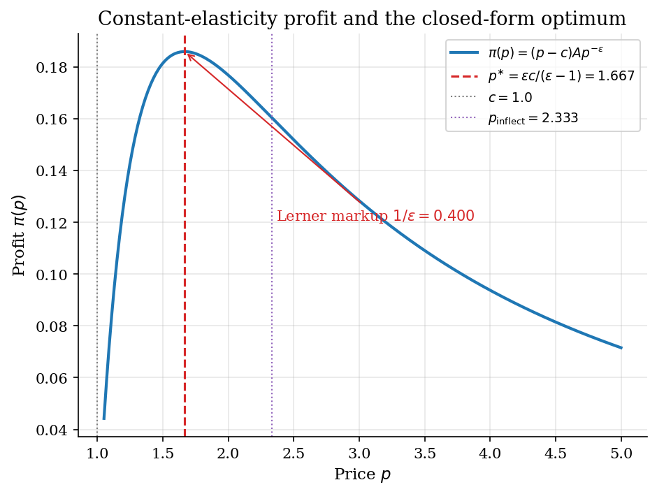
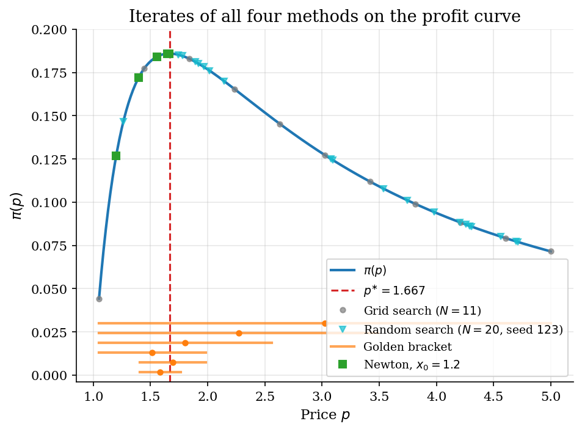
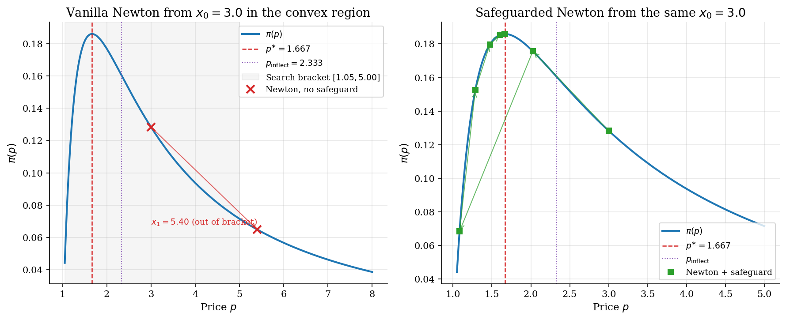
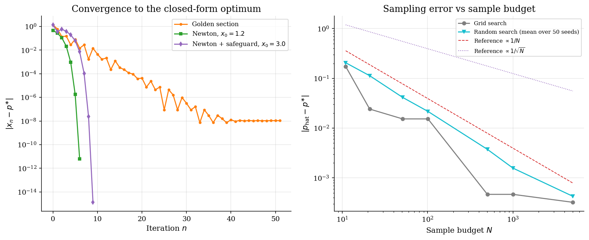

# Scalar Optimization for Monopoly Pricing

## Overview

Kiefer (1953) introduced golden-section search as the minimax-optimal method for locating the maximum of a unimodal function on an interval. The question it left open was how to handle objective functions where derivatives are available and the starting point may fall in a non-concave region. Monopoly pricing under constant-elasticity demand is the textbook test case: the profit-maximizing price has a closed form via the *Lerner markup*, which pins down what every method should agree on.

Four paradigms are compared on the same profit curve: deterministic sampling on a uniform mesh, stochastic sampling by uniform draws, derivative-free contraction of a unimodal bracket, and derivative-based local extrapolation. Each paradigm is the canonical entry point to a wider family used elsewhere in the catalog. Solving the first-order condition is not automatically safer than maximizing the objective directly. A starting price in the convex region of profit produces a Newton step that points away from the maximum. Adding a bracket safeguard recovers convergence at negligible cost, which is the enduring lesson from bracket-guarded Newton methods.

## Read before

- [Scalar root finding for equilibrium rates](../root-finding/README.md)

## Equations

The general problem is to maximise a scalar profit function $`\pi : [p_{\mathrm{lo}}, p_{\mathrm{hi}}] \to \mathbb{R}`$ on a bounded interval. The methods below differ in what they evaluate (the function, its derivative, both) and in how they update the candidate optimum.

### The test instance

The test instance is monopoly pricing under *constant-elasticity demand*. Three constants pin down the demand curve. $`A`$ is a scale parameter that absorbs market size. $`\epsilon`$ is the demand elasticity, and $`\epsilon > 1`$ is required for the optimum to exist. $`c`$ is the constant marginal cost.

```math
D(p) = A p^{-\epsilon}.
```

Profit is the price-cost margin times the quantity sold.

```math
\pi(p) = (p - c)  D(p) = A (p - c)  p^{-\epsilon}.
```

The first-order condition $`\pi'(p) = 0`$ has a closed-form root that pins down what every method should return.

```math
\pi'(p) = A p^{-(\epsilon + 1)} \left[(1 - \epsilon)  p + \epsilon c\right].
```

```math
p^{\ast} = \frac{\epsilon}{\epsilon - 1}  c.
```

Rearranging the optimum gives the Lerner price-cost margin.

```math
\frac{p^{\ast} - c}{p^{\ast}} = \frac{1}{\epsilon}.
```

At the baseline calibration $`\epsilon = 2.5`$ and $`c = 1`$ the closed form gives $`p^{\ast} = 5/3 \approx 1.667`$ and Lerner markup $`1/2.5 = 0.4`$.

The second derivative is needed by Newton and to identify the inflection point of $`\pi`$.

```math
\pi''(p) = -A \epsilon p^{-(\epsilon + 2)} \left[(1 - \epsilon)  p + (\epsilon + 1)  c\right].
```

```math
p_{\mathrm{inflect}} = \frac{\epsilon + 1}{\epsilon - 1}  c.
```

Profit is concave on $`(0, p_{\mathrm{inflect}})`$ and convex on $`(p_{\mathrm{inflect}}, \infty)`$. The optimum sits strictly inside the concave region, with $`p^{\ast} < p_{\mathrm{inflect}}`$.

### Method 1: Grid search

Grid search covers the bracket with a uniform mesh of $`N`$ nodes and returns the argmax over the mesh.

```math
\hat p_{\mathrm{grid}} = \arg\max_{i \in \lbrace 1, \ldots, N\rbrace} \pi(p_i),
\qquad p_i = p_{\mathrm{lo}} + \frac{(i - 1) (p_{\mathrm{hi}} - p_{\mathrm{lo}})}{N - 1}.
```

The distance from the nearest mesh point to $`p^{\ast}`$ is at most half the spacing, so the error scales as $`1/N`$.

### Method 2: Random search

Random search draws $`N`$ prices uniformly on the bracket and returns the argmax of the sampled profits.

```math
\hat p_{\mathrm{rand}} = \arg\max_{i \in \lbrace 1, \ldots, N\rbrace} \pi(p_i),
\qquad p_i \stackrel{\mathrm{iid}}{\sim} \mathrm{Uniform}[p_{\mathrm{lo}}, p_{\mathrm{hi}}].
```

The expected error scales as $`1/\sqrt{N}`$ in one dimension, slower than the deterministic grid but with a rate that does not degrade as price dimensions are added.

### Method 3: Golden-section search

Golden-section search contracts a unimodal bracket $`[a_n, b_n]`$ using the golden ratio. Two interior probes split the bracket so that one is reused after each shrink.

```math
\phi = \frac{\sqrt{5} - 1}{2} \approx 0.618.
```

```math
p_n = b_n - \phi (b_n - a_n), \qquad q_n = a_n + \phi (b_n - a_n).
```

Here $`p_n`$ and $`q_n`$ are the left and right probe prices at iteration $`n`$, distinct from the price control $`p`$. The bracket shrinks by a constant factor $`\phi`$ each step, giving linear convergence.

### Method 4: Newton on the FOC

Newton follows the tangent of $`\pi'`$ at the current iterate.

```math
x_{n+1} = x_n - \frac{\pi'(x_n)}{\pi''(x_n)}.
```

Newton is equivalent to maximising a parabolic surrogate that matches $`\pi`$ in value, slope, and curvature at $`x_n`$. The surrogate is concave only when $`\pi''(x_n)`$ is negative, which holds only when $`x_n`$ lies below $`p_{\mathrm{inflect}}`$. A start in the convex region drives the iterates away from $`p^{\ast}`$.

## Worked Numerical Example

Set $`\epsilon = 2.5`$ and $`c = 1`$. Plugging into the FOC derivation gives the closed-form price in one step.

The profit function is

```math
\pi(p) = A(p - 1) \, p^{-2.5}.
```

Differentiating and setting to zero:

```math
\pi'(p) = A p^{-3.5} \left[(1 - 2.5) \, p + 2.5 \cdot 1\right] = 0
\implies -1.5 \, p + 2.5 = 0
\implies \boxed{p^{\ast} = \frac{2.5}{1.5} = \frac{5}{3} \approx 1.667}.
```

The Lerner markup follows immediately from the *Lerner identity*:

```math
\frac{p^{\ast} - c}{p^{\ast}} = \frac{1}{\epsilon} = \frac{1}{2.5} = \boxed{0.4}.
```

The monopolist marks up price 40 percent above marginal cost.

The second-order condition requires $`\epsilon > 1`$. With $`\epsilon = 2.5`$ the profit function is concave at $`p^{\ast}`$, so the FOC root is indeed a maximum, not a minimum. The inflection point sits at $`p_{\mathrm{inflect}} = (2.5 + 1)/(2.5 - 1) \cdot 1 = 3.5/1.5 \approx 2.333`$, strictly above $`p^{\ast}`$, confirming that the optimum lies in the concave region.

## Model Setup

| Symbol | Value | Symbol | Value |
|--------|------:|--------|------:|
| $`A`$ | 1.0 | $`p^{\ast} = \epsilon c / (\epsilon - 1)`$ | 1.6667 |
| $`\epsilon`$ | 2.5 | Lerner markup $`1/\epsilon`$ | 0.4000 |
| $`c`$ | 1.0 | $`p_{\mathrm{inflect}} = (\epsilon+1) c / (\epsilon-1)`$ | 2.3333 |
| Bracket $`[p_{\mathrm{lo}}, p_{\mathrm{hi}}]`$ | [1.05, 5.00] | Sample budget $`N`$ at headline run | 1001 |
| Random seed | 42 | Replications across $`N`$ | 50 |
| Newton good start $`x_0`$ | 1.2 | Newton bad start $`x_0`$ | 3.0 |
| Tolerance $`\eta`$ | 1e-10 | | |

## Solution Method

All four methods solve the same maximization on the bounded interval. They differ in what they evaluate and in how they update. Grid and random search sample the bracket exhaustively. Golden-section search exploits unimodality to contract a *unimodal bracket*. Newton uses first and second derivatives to jump directly to the argmax of a local parabolic surrogate.

```
 [p_lo,p_hi], N    [p_lo,p_hi], N    [a,b], phi, eta    x_0, pi', pi''
       |                  |                  |                  |
       v                  v                  v                  v
  +-- grid --+      +-- random --+    +-- golden --+     +-- Newton --+
  | [ mesh  ]|      | [ draws  ] |    | [ bracket] |     | [ tangent] |
  +- pick max+      +- pick max -+    +- shrink:rpt+     +- step: rpt-+
       |                  |                  |                  |
      p*                 p*                 p*                 p*
```

```python
def grid_search(profit, p_lo, p_hi, N):
    prices = np.linspace(p_lo, p_hi, N)   # uniform mesh over bracket
    return prices[np.argmax(profit(prices))]


def golden_section(profit, a, b, tol):
    phi = (math.sqrt(5.0) - 1.0) / 2.0
    pL = b - phi * (b - a)                # left interior probe
    pR = a + phi * (b - a)                # right interior probe
    fL, fR = profit(pL), profit(pR)
    while b - a > tol:
        if fL > fR:                        # maximum in left sub-bracket
            b, pR, fR = pR, pL, fL
            pL = b - phi * (b - a)
            fL = profit(pL)
        else:                              # maximum in right sub-bracket
            a, pL, fL = pL, pR, fR
            pR = a + phi * (b - a)
            fR = profit(pR)
    return 0.5 * (a + b)


def newton_safeguarded(x0, profit_prime, profit_double_prime, a, b, tol):
    x = float(x0)
    while abs(profit_prime(x)) > tol:
        fp, fpp = profit_prime(x), profit_double_prime(x)
        if fpp >= 0.0:                     # convex region: bisect uphill
            x = 0.5 * (b + x) if fp > 0.0 else 0.5 * (a + x)
        else:
            x_new = x - fp / fpp           # standard Newton step on FOC
            x = float(np.clip(x_new, a, b))
    return x
```

Golden section reaches tolerance in about 50 iterations regardless of where $`p^{\ast}`$ sits inside the bracket. Newton from a concave-region start converges in fewer than ten steps; the safeguard adds one bisection step when the start falls in the convex region and then lets quadratic convergence take over.

## Results

At baseline the closed-form price is $`p^{\ast} = 1.667`$ and the Lerner markup is $`1/\epsilon = 0.400`$. Profit is concave below $`p_{\mathrm{inflect}} = 2.333`$ and convex above it. The maximum sits in the concave region. An iterate that lands above the *inflection point* misreads the local curvature.



Grid search on $`N = 11`$ points pins $`p^{\ast}`$ to the nearest node. Random search on $`N = 20`$ uniform draws scatters across the bracket. Golden section contracts the bracket at the fixed factor $`\phi`$ each step. Newton from $`x_0 = 1.2`$ enters the basin of attraction directly and reaches the tolerance in a handful of steps.



At $`x_0 = 3.0`$ the FOC residual is $`\pi'(x_0) = -4.277 \times 10^{-2}`$. The curvature is $`\pi''(x_0) = 1.782 \times 10^{-2}`$, positive because the start lies in the convex region. The vanilla Newton step is positive and lands at $`x_1 = 5.400`$, which exits the search bracket immediately and is flagged as diverged after one iteration.

The bracket safeguard recovers convergence from the same $`x_0 = 3.0`$. It first takes a bisection step in the direction of profit ascent because $`\pi''(x_0) \geq 0`$. Once back in the concave region the standard quadratic Newton convergence kicks in. Safeguarded Newton converges in 9 iterations with residual below machine precision.



Golden section contracts at a constant factor every step. Newton from $`x_0 = 1.2`$ shows the quadratic regime once inside the basin. The safeguarded run from $`x_0 = 3.0`$ spends its first iteration on the bisection-uphill step and then enters the same quadratic regime once back in the concave region. Grid-search error scales as $`1/N`$ in the right panel. Random-search error scales as $`1/\sqrt{N}`$ on average across seeds. Grid is faster than random in one dimension. The gap closes and reverses as the dimension grows.



The table collects the six headline runs at the baseline calibration. Iterations are sample evaluations for grid and random, bracket halvings for golden section, and Newton steps for the last three rows.

### Method comparison

| Method | Setting | Estimated optimum | Absolute error | Iterations | Status |
|:-------|:--------|------------------:|---------------:|----------:|:-------|
| Grid search | 1001 grid nodes | 1.6662 | 0.000467 | 1001 | converged |
| Random search | 1001 random draws, seed 42 | 1.664 | 0.00267 | 1001 | converged |
| Golden section | Bracket from 1.05 to 5.00 | 1.6667 | 1.08e-08 | 51 | converged |
| Newton (good start) | Starting price 1.20 | 1.6667 | 6.43e-12 | 6 | converged |
| Newton (bad start) | Starting price 3.00 | 5.4 | 3.73 | 1 | diverged |
| Newton with safeguard (bad start) | Starting price 3.00 | 1.6667 | 1.33e-15 | 9 | converged |

Across elasticities the Lerner identity $`1/\epsilon`$ pins down the price-cost margin. The closed-form $`p^{\ast}`$ moves smoothly as the demand becomes more or less elastic. Golden section recovers the closed form to tolerance in every row.

### Elasticity sensitivity

| Elasticity | Closed-form price | Lerner markup | Profit at optimum | Golden-section error |
|-----------:|------------------:|--------------:|------------------:|---------------------:|
| 1.5 | 3.0000 | 0.6667 | 0.3849 | 3.26e-08 |
| 2.0 | 2.0000 | 0.5000 | 0.2500 | 1.29e-08 |
| 2.5 | 1.6667 | 0.4000 | 0.1859 | 1.08e-08 |
| 3.0 | 1.5000 | 0.3333 | 0.1481 | 7.35e-09 |
| 5.0 | 1.2500 | 0.2000 | 0.0819 | 2.56e-09 |
| 10.0 | 1.1111 | 0.1000 | 0.0387 | 1.99e-09 |

The vanilla-Newton sweep across nine starting points makes the basin of attraction visible. Starts below $`p_{\mathrm{inflect}} = 2.333`$ converge in a handful of steps. Starts above the inflection point land in the convex region. The first Newton step from those starts exits the search bracket.

### Newton sensitivity

| Starting price | Iterations | Status | Above inflection point |
|---------------:|-----------:|:-------|:-----------------------|
| 1.05 | 7 | converged | no |
| 1.20 | 6 | converged | no |
| 1.40 | 5 | converged | no |
| 1.60 | 4 | converged | no |
| 1.80 | 5 | converged | no |
| 2.00 | 7 | converged | no |
| 2.50 | 1 | diverged | yes |
| 3.50 | 1 | diverged | yes |
| 4.50 | 1 | diverged | yes |

## Takeaway

Grid search bounds the answer with a discretization error that shrinks at rate one over the sample size. It is the cheapest method to reason about and the slowest to high accuracy.

Random search trades the deterministic mesh for stochastic error that shrinks at the square-root rate. It is slower than grid in one dimension. Its rate is dimension-free, which is why it dominates in higher dimensions.

*Golden-section search* is the practical default in one dimension when the objective is unimodal. Kiefer (1953) proved it is minimax-optimal: no fixed-evaluation strategy contracts a unimodal bracket faster per function call. It contracts at a fixed factor regardless of where the optimum sits inside the bracket.

Newton on the FOC is the fastest method when the start is in the concave region. A start above the inflection point flips the sign of the second derivative and the vanilla step moves away from the maximum. Adding a bracket safeguard recovers convergence at negligible cost, and this bisection-fallback design is the enduring contribution of bracket-guarded Newton methods to scientific computing.

## See also

- [Scalar root finding for equilibrium rates](../root-finding/README.md)
- [Fixed-point acceleration](../fixed-point-acceleration/README.md)

## References

- Kiefer, J. (1953). Sequential Minimax Search for a Maximum. *Proceedings of the American Mathematical Society*, 4(3), 502-506. Original proof that golden-section search is minimax-optimal for unimodal functions.
- Tirole, J. (1988). *The Theory of Industrial Organization*. MIT Press, Ch. 1.
- Press, W. H., Teukolsky, S. A., Vetterling, W. T., and Flannery, B. P. (2007). *Numerical Recipes*. Cambridge University Press, 3rd edition, Ch. 10.
- Judd, K. L. (1998). *Numerical Methods in Economics*. MIT Press, Ch. 4.
- Nocedal, J. and Wright, S. J. (2006). *Numerical Optimization*. Springer, 2nd edition, Ch. 3.
- Bergstra, J. and Bengio, Y. (2012). Random Search for Hyper-Parameter Optimization. *Journal of Machine Learning Research*, 13, 281-305.
