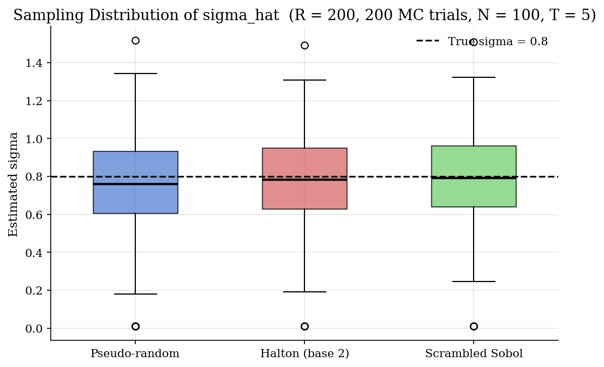
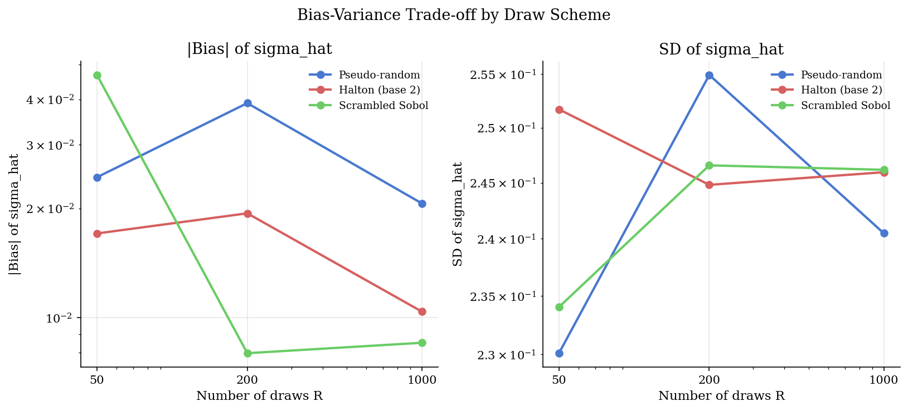
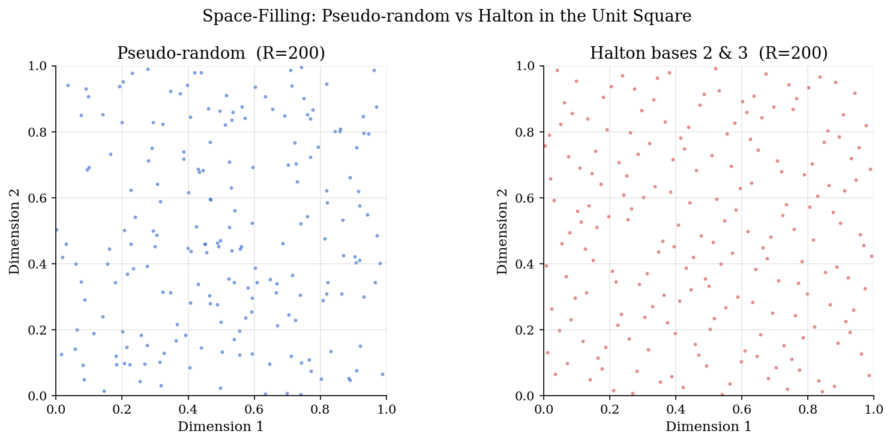

# Simulated Maximum Likelihood, Common Random Numbers, and Halton Sequences

## Overview

Many structural likelihoods are integrals with no closed form. The choice probability in a mixed logit model averages a logit kernel over a distribution of random tastes. The market share in a random-coefficients demand model averages over a distribution of consumer types. The likelihood under a stochastic transformation model averages over a distribution of shocks. In each case the analyst observes data but does not observe the random object that the likelihood integrates out.

The standard response is to replace the integral with a finite average over simulation draws. The draws come from the integrating density and stay fixed across parameter values. Holding the draws fixed is the trick called common random numbers (CRN). It is essential, because resampling at every candidate parameter would add Monte Carlo noise to the objective and turn a smooth optimization problem into a noisy one.

Two questions remain. How big does the draw count need to be before the simulated estimator is close to the true integrated object? And do quasi-random draws (low-discrepancy sequences that fill space more uniformly than pseudo-random points) beat pseudo-random ones at the same draw count? This prelim runs a Monte Carlo experiment on a mixed binary logit panel and answers both. The same machinery is the integral-approximation engine in [`choice/mixed-logit-simulation/`](../../choice/mixed-logit-simulation/), in the simulated shares of [`industrial-organization/blp-random-coefficients/`](../../industrial-organization/blp-random-coefficients/), in the latent draws of [`structural-econometrics/rum-choice-networks/`](../../structural-econometrics/rum-choice-networks/), and in the smooth outer objective of [`structural-econometrics/adversarial-estimation/`](../../structural-econometrics/adversarial-estimation/).

## Equations

We need a notation that separates the parameter we estimate from the latent variable we integrate out. Let $`\theta`$ be the parameter of interest, let $`\xi`$ be a latent variable distributed according to a known density $`F`$, and let $`f(\theta; \xi)`$ be a tractable kernel (often a likelihood contribution or a market share). The exact integrated object is:

```math
P(\theta) = \int f(\theta; \xi)  dF(\xi).
```

In the running example, $`\theta = \sigma`$ is the dispersion of a random coefficient, $`\xi \sim N(0, 1)`$ is a standardised taste shock, and $`f(\theta; \xi)`$ is the logit-kernel product of one individual's $`T`$ choice probabilities given the latent draw. The integral has no closed form because the logit probability is a nonlinear function of $`\sigma \xi`$.

We need an estimator for $`P(\theta)`$ that uses a finite number of draws and avoids re-randomising as the optimiser moves. Draw $`R`$ values $`\xi_1, \ldots, \xi_R`$ once from $`F`$ and replace the integral with the sample average evaluated at the same draws across every candidate $`\theta`$:

```math
\widehat P(\theta) = \frac{1}{R} \sum_{r=1}^{R} f(\theta; \xi_r), \qquad \{\xi_r\}_{r=1}^{R} \text{ fixed across } \theta.
```

This is the simulated likelihood (when $`f`$ is a likelihood contribution) or the simulated probability (when $`f`$ is a choice probability). The "fixed across $`\theta`$" clause is what makes the estimator usable inside an optimiser: it is the common-random-numbers (CRN) property.

We need to be explicit about why CRN matters. If a fresh set of draws $`\xi^{(\theta)}_r`$ were drawn for every $`\theta`$, then $`\widehat P(\theta)`$ would inherit the simulation noise as an extra random term that varies with $`\theta`$. The optimiser's gradient information would be polluted by that noise, and the objective surface would become non-smooth. With $`\{\xi_r\}`$ held fixed, $`\widehat P(\theta)`$ is a deterministic function of $`\theta`$ given the draws, and its smoothness inherits the smoothness of $`f(\theta; \xi)`$. Formally, if $`f(\cdot; \xi)`$ is differentiable, so is $`\widehat P(\cdot)`$ with the same Lipschitz behaviour.

We need a way to generate draws that fill the integration region more uniformly than pseudo-random points. Quasi-random sequences (low-discrepancy sequences) are deterministic point sets engineered for that purpose. The Halton sequence in prime base $`b`$ is generated by writing each integer $`k`$ in base $`b`$ and reversing its digits around the radix point:

```math
\phi_b(k) = \sum_{i = 0}^{\infty} \frac{a_i(k)}{b^{i+1}},
\qquad
k = \sum_{i = 0}^{\infty} a_i(k)  b^{i},
\quad
a_i(k) \in \{0, 1, \ldots, b-1\}.
```

The first few Halton-base-2 points are $`1/2, 1/4, 3/4, 1/8, 5/8, 3/8, 7/8, \ldots`$. They are not random; they are arranged so that successive points fall in the largest empty gap. Pushing the $`\phi_b(k)`$ values through the inverse normal cumulative $`\Phi^{-1}`$ converts them into standard-normal draws that retain the space-filling property. Scrambled Sobol sequences play the same role with a more sophisticated digit permutation.

For a mixed-logit choice probability with $`T`$ panel observations per individual and a single random coefficient, the kernel $`f`$ has the closed form $`f(\sigma; \xi) = \prod_{t = 1}^{T} L(y_{it}; (\mu + \sigma \xi)  x_{it})`$, where $`L(y; v) = \exp(yv) / (1 + \exp(v))`$ is the binary-logit likelihood. Plugging this into $`\widehat P(\sigma)`$ and taking logs gives the simulated log-likelihood that the estimator maximises.

## Model Setup

| Object | Symbol | Role |
|---|---|---|
| Parameter of interest | $`\theta`$ | Generic notation; the estimated quantity [from `mixed-logit-simulation/`] |
| Latent variable | $`\xi`$ | Integration variable [prelim introduces; called $`\nu`$ in `mixed-logit-simulation/`] |
| Latent density | $`F`$ | Distribution of $`\xi`$ in the population [prelim introduces] |
| Kernel | $`f(\theta; \xi)`$ | Tractable function whose expectation is the target [prelim introduces] |
| True integrated object | $`P(\theta)`$ | $`= \int f(\theta; \xi)  dF(\xi)`$ |
| Simulated estimator | $`\widehat P(\theta)`$ | $`= (1/R) \sum_r f(\theta; \xi_r)`$ with fixed draws |
| Number of draws | $`R`$ | 50, 200, or 1000 in the experiment |
| Halton radical inverse | $`\phi_b(k)`$ | Base-$`b`$ digit-reversal map [prelim introduces] |
| Inverse normal cdf | $`\Phi^{-1}`$ | Maps $`(0, 1)`$ draws to standard normal |
| Number of individuals | $`N`$ | 100 in the experiment |
| Choices per individual | $`T`$ | 5 panel observations |
| Population mean of $`\beta`$ | $`\mu`$ | Set to 1.0 (known) |
| Population sd of $`\beta`$ | $`\sigma`$ | Set to 0.8 (the parameter to estimate) |
| Monte Carlo trials | 200 | Independent datasets resimulated per trial |

The annotations record which symbols are shared with the dense tutorials that adopt this prelim.

## Solution Method

The procedure has four stages: draw construction, data simulation, simulated-likelihood evaluation, and Monte Carlo aggregation.

```text
Procedure: Simulated maximum likelihood with CRN and quasi-random draws
Inputs : N, T, mu, sigma_true, x (N-vector), R grid, scheme in
         {pseudo, halton, sobol}, MC trial count.
Outputs: sigma_hat for each (scheme, R, trial).

1. Build draws once per (scheme, R).
   - pseudo: standard-normal pseudo-random draws of length R.
   - halton: Halton base-2 radical inverses for k = 1, ..., R; pass through Phi^-1.
   - sobol:  scrambled Sobol of length next power of 2 >= R; trim; pass through Phi^-1.

2. For each Monte Carlo trial:
   a. Simulate beta_i ~ N(mu, sigma_true^2) for i = 1, ..., N.
   b. For each individual i and occasion t = 1, ..., T,
      draw y_it = Bernoulli(logistic(beta_i x_it)) with fresh Gumbel-shock seed.
   c. For each (scheme, R):
        Objective(sigma) = - sum_i log( mean_r prod_t L(y_it; (mu + sigma xi_r) x_it) )
        sigma_hat = bounded scalar minimiser of Objective on a stable interval.

3. Across the MC_TRIALS replications, compute mean, bias, and standard deviation
   of sigma_hat for each (scheme, R).
```

Two implementation notes matter for the numerics. First, the simulated log-likelihood uses `logsumexp` along the draw axis to avoid underflow when $`R`$ is large and the product over $`T`$ shrinks the kernel. Second, the bounded Brent minimiser is preferred over a bracketed search because $`\sigma`$ has a hard lower bound at zero, and unbracketed searches can wander negative.

Maximum simulated moments, importance sampling for rare events, and sequential Monte Carlo build on the same draw-fixing principle but are out of scope. The GMM analogue is in [`structural-econometrics/gmm-foundations/`](../../structural-econometrics/gmm-foundations/), which addresses moment-based estimation with simulation.

## Results

The Monte Carlo experiment runs 200 trials at three draw counts ($`R = 50, 200, 1000`$) under three schemes (pseudo-random, Halton base-2, scrambled Sobol). The panel is $`N = 100`$ individuals with $`T = 5`$ repeated binary choices each. True $`\sigma = 0.8`$.

The first figure shows the sampling distribution of $`\widehat\sigma`$ at $`R = 200`$.



All three schemes are roughly unbiased: the median sits within $`\pm 0.05`$ of the true value $`0.8`$. The interquartile spread is wide because the dominant noise source is the data (100 individuals with 5 choices each), not the simulation. The boxplot is the right place to read the gross magnitude of estimation uncertainty; the bias-variance figure isolates the simulation contribution.

The second figure plots the absolute bias and the standard deviation of $`\widehat\sigma`$ against $`R`$.



The left panel separates the schemes by bias. At $`R = 1000`$, the pseudo-random bias is $`0.021`$, the Halton bias is $`0.010`$, and the scrambled-Sobol bias is $`0.009`$. The quasi-random schemes cut bias roughly in half at the same draw count. Because the same Monte Carlo dataset is used across schemes within each trial, the across-scheme comparison is a paired difference rather than two independent samples, so the precision of the gap is much higher than the standard deviation of each scheme's bias would suggest. The right panel shows that standard deviation is essentially flat across $`R`$ and across schemes, around $`0.24`$. With $`N`$ and $`T`$ fixed, the data variance dominates the simulation variance; in this regime, larger $`R`$ helps bias but does not visibly help variance.

The third figure illustrates why quasi-random schemes have an advantage in the first place.



The pseudo-random panel has visible clumps and gaps. The Halton panel covers the unit square evenly. In higher dimensions, the disparity grows: pseudo-random draws fail to cover the integration region until $`R`$ is large, while Halton and Sobol stay close to uniform. That uniform coverage is what reduces the bias of the simulated estimator at small $`R`$.

Two practical caveats. First, antithetic variates (pair each draw $`\xi_r`$ with its sign-flipped twin $`-\xi_r`$) can match Halton and Sobol on bias for symmetric integrating densities at near-zero implementation cost. Second, scrambled Sobol below its preferred power-of-two sample size can perform worse than Halton; here at $`R = 50`$ Sobol's bias is $`0.047`$ against Halton's $`0.017`$, then both fall and converge at $`R = 200`$ and $`R = 1000`$.

## Takeaway

Simulated maximum likelihood replaces an intractable integral with a finite average over draws that are held fixed across parameter values. The fixed draws are the common-random-numbers property; they make the simulated objective a deterministic, smooth function of the parameter that a standard optimiser can climb. Quasi-random draws (Halton, scrambled Sobol) reduce the bias of the simulated estimator at the same $`R`$ by filling the integration region more uniformly than pseudo-random points, with the advantage growing in the dimension of the integral.

## References

- Train, K. (2009). *Discrete Choice Methods with Simulation*, 2nd edition. Cambridge University Press, Chapter 9 ("Drawing from Densities"). Pedagogical anchor for SML, CRN, and Halton-vs-pseudo comparisons.
- McFadden, D. (1989). "A Method of Simulated Moments for Estimation of Discrete Response Models without Numerical Integration." *Econometrica*, 57(5), 995-1026. Foundational asymptotic theory for simulation-based estimators.
- Bhat, C. R. (2001). "Quasi-random Maximum Simulated Likelihood Estimation of the Mixed Multinomial Logit Model." *Transportation Research Part B*, 35(7), 677-693. Empirical evidence that Halton beats pseudo-random on mixed logit.
- Hess, S., Train, K., and Polak, J. (2006). "On the use of a Modified Latin Hypercube Sampling Method." *Transportation Research Part B*, 40(2), 147-163. Practical comparison of Halton, MLHS, and scrambled Sobol.
- **See also.** The mixed-logit SML estimator built on these draws is in [`choice/mixed-logit-simulation/`](../../choice/mixed-logit-simulation/). The BLP random-coefficients tutorial uses the same simulated-shares construction inside its IV/GMM loop in [`industrial-organization/blp-random-coefficients/`](../../industrial-organization/blp-random-coefficients/). Fixed latent draws drive the deep choice-network estimator in [`structural-econometrics/rum-choice-networks/`](../../structural-econometrics/rum-choice-networks/). The CRN property keeps the outer objective smooth in [`structural-econometrics/adversarial-estimation/`](../../structural-econometrics/adversarial-estimation/). The GMM analogue of simulated likelihood (matching simulated moments rather than likelihoods) is in [`structural-econometrics/gmm-foundations/`](../../structural-econometrics/gmm-foundations/).
