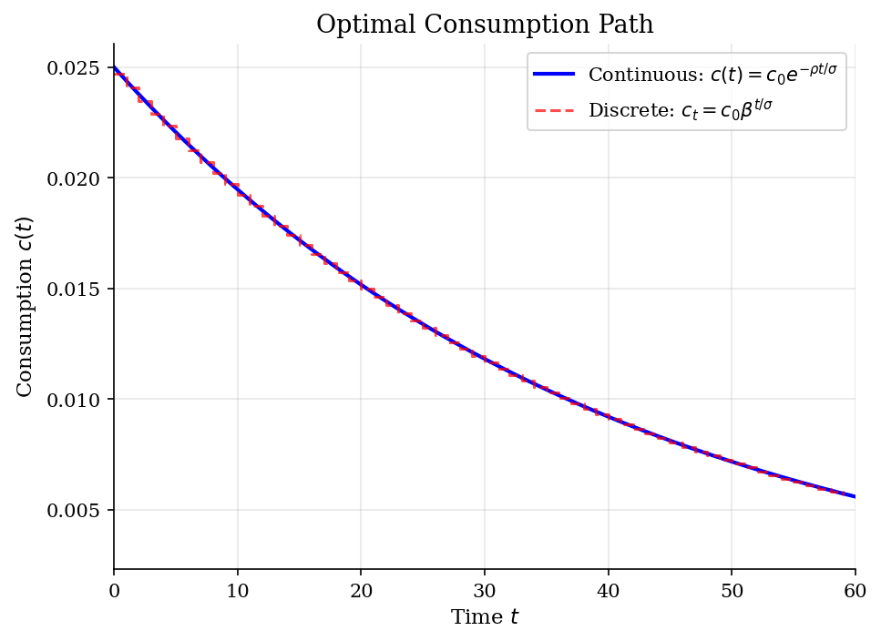
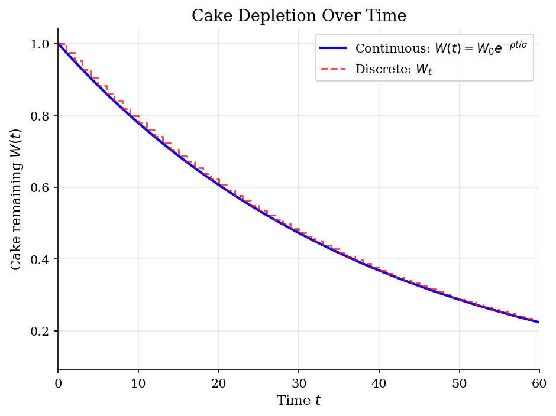
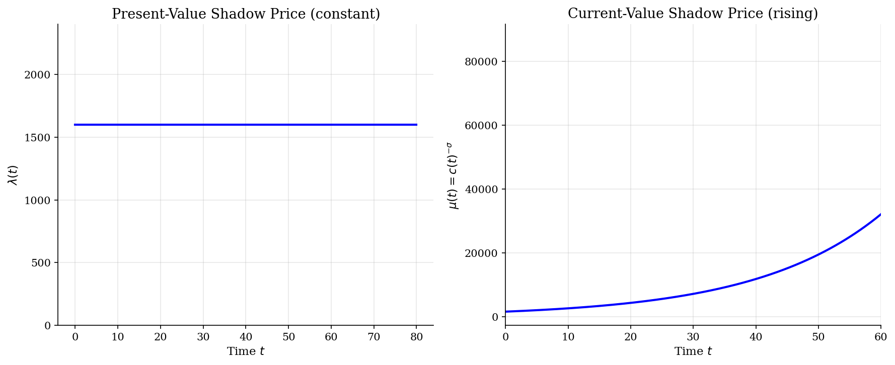

# Continuous-Time Cake Eating

> Optimal consumption of a finite resource in continuous time via Pontryagin's maximum principle.

## Overview

This model extends the classic cake-eating problem to continuous time. Instead of choosing consumption each discrete period, the agent selects a continuous consumption path $c(t)$ to maximize the integral of discounted utility. The solution method uses Pontryagin's maximum principle rather than dynamic programming.

The continuous-time formulation yields a clean analytical solution: consumption declines exponentially at rate $\rho/\sigma$, and the cake is asymptotically depleted.

## Equations

$$\max_{c(t)} \int_0^\infty e^{-\rho t} \, u(c(t)) \, dt$$

subject to $\dot{W}(t) = -c(t)$, $W(0) = W_0$, $W(t) \ge 0$.

**Hamiltonian (present value):**
$$\mathcal{H} = e^{-\rho t} \, u(c) + \lambda \cdot (-c)$$

**First-order conditions:**
$$\frac{\partial \mathcal{H}}{\partial c} = 0 \implies e^{-\rho t} \, c^{-\sigma} = \lambda$$

**Costate equation:** $\dot{\lambda} = -\frac{\partial \mathcal{H}}{\partial W} = 0$ (so $\lambda$ is constant)

**Optimal consumption path:**
$$c(t) = c_0 \, e^{-\rho t / \sigma}, \qquad c_0 = \frac{\rho}{\sigma} \, W_0$$

**Cake remaining:**
$$W(t) = W_0 \, e^{-\rho t / \sigma}$$

## Model Setup

| Parameter | Value | Description |
|-----------|-------|-------------|
| $\rho$    | 0.05 | Continuous discount rate |
| $\sigma$  | 2.0 | CRRA coefficient |
| $W_0$     | 1.0 | Initial cake size |
| $\beta = e^{-\rho}$ | 0.9512 | Equivalent discrete discount factor |
| $T$       | 80.0 | Integration horizon |

## Solution Method

**Pontryagin's Maximum Principle:** The present-value Hamiltonian is formed and optimized pointwise over the control $c(t)$. The first-order condition pins down the consumption rule, and the costate equation confirms $\lambda$ is constant (since cake size $W$ does not appear in the Hamiltonian directly).

The ODE system $\dot{W} = -c$, $\dot{c} = -(\rho/\sigma)c$ is integrated numerically using `scipy.integrate.solve_ivp` (RK45) to verify the analytical solution.

**Verification:** Max absolute error in $W(t)$: 2.64e-11, in $c(t)$: 6.61e-13.

## Results


*Optimal consumption path: continuous vs discrete time*


*Cake depletion: continuous exponential decay vs discrete geometric decay*


*Shadow price of cake: present-value (constant) and current-value (rising as cake becomes scarce)*

**Analytical vs Numerical Solution at Selected Time Points**

|   t |   c(t) analytical |   c(t) numerical |   W(t) analytical |   W(t) numerical |
|----:|------------------:|-----------------:|------------------:|-----------------:|
|   0 |          0.025    |         0.025    |          1        |         1        |
|   5 |          0.021991 |         0.021991 |          0.879628 |         0.879628 |
|  10 |          0.019421 |         0.019421 |          0.776852 |         0.776852 |
|  20 |          0.015148 |         0.015148 |          0.605923 |         0.605923 |
|  30 |          0.011768 |         0.011768 |          0.470713 |         0.470713 |
|  50 |          0.007159 |         0.007159 |          0.286361 |         0.286361 |

## Economic Takeaway

The continuous-time cake-eating problem illustrates the power of Pontryagin's maximum principle as an alternative to dynamic programming.

**Key insights:**
- Consumption declines exponentially at rate $\rho/\sigma$. Higher impatience ($\rho$) speeds depletion; higher risk aversion ($\sigma$) smooths consumption and slows depletion.
- The shadow price $\lambda$ is constant in present value: the marginal value of cake is the same at every instant (once discounted). In current-value terms, the shadow price *rises* over time as the resource becomes scarcer.
- The continuous-time solution converges to the discrete-time solution as the period length shrinks. With $\beta = e^{-\rho}$, both yield the same consumption-to-wealth ratio in the limit.
- Unlike the discrete case, the continuous formulation avoids grid discretization entirely --- the ODE system has a closed-form solution.

## Reproduce

```bash
python run.py
```

## References

- Acemoglu, D. (2009). *Introduction to Modern Economic Growth*. Princeton University Press, Ch. 7.
- Kamien, M. and Schwartz, N. (2012). *Dynamic Optimization*. Dover, 2nd edition.
- Chiang, A. (1992). *Elements of Dynamic Optimization*. Waveland Press.
