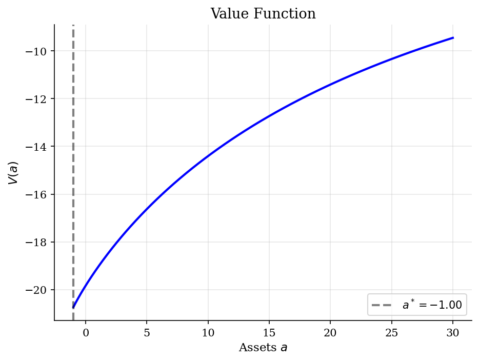
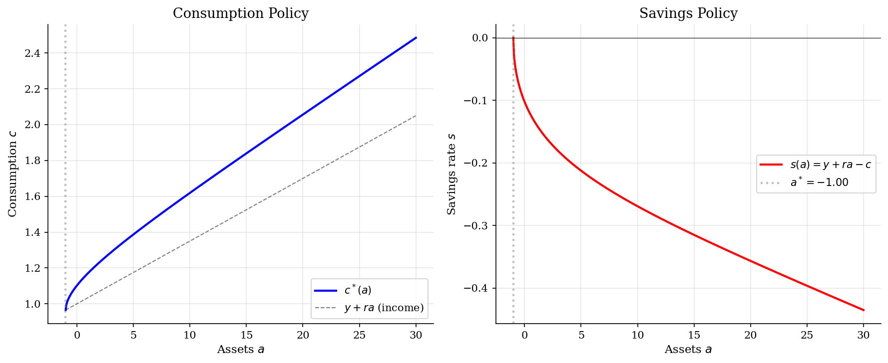
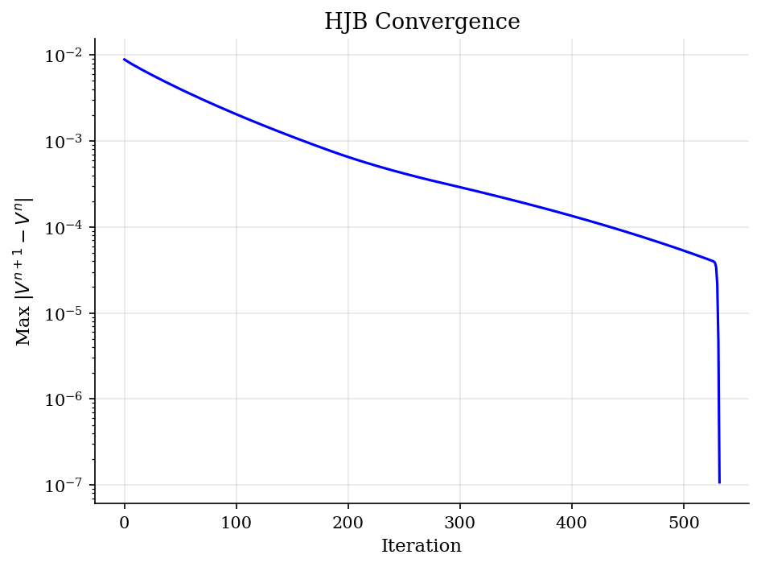

# Finite Difference Methods for HJB Equations

> Upwind finite difference scheme for continuous-time consumption-savings.

## Overview

Finite difference methods are the computational backbone for solving continuous-time heterogeneous agent models. The Hamilton-Jacobi-Bellman (HJB) equation characterizes optimal behavior, and the upwind finite difference scheme provides a stable and convergent numerical solution.

This module demonstrates the method on the simplest problem: a deterministic consumption-savings decision in continuous time. The key numerical insight is the *upwind scheme*: use forward differences when the agent is saving (positive drift) and backward differences when dissaving (negative drift).

## Equations

**HJB equation:**
$$\rho V(a) = \max_c \left\{ u(c) + V'(a)(y + ra - c) \right\}$$

**FOC:** $u'(c) = V'(a)$, so $c^*(a) = (V'(a))^{-1/\sigma}$

**Upwind finite difference:**
$$V'_i \approx \begin{cases} \frac{V_{i+1} - V_i}{\Delta a} & \text{if } s_i > 0 \text{ (saving)} \\ \frac{V_i - V_{i-1}}{\Delta a} & \text{if } s_i < 0 \text{ (dissaving)} \end{cases}$$

**Implicit update:** Solve $\left(\frac{1}{\Delta t} + \rho - A\right) V^{n+1} = u(c^n) + \frac{1}{\Delta t} V^n$

where $A$ is the tridiagonal transition matrix from the upwind scheme.

## Model Setup

| Parameter | Value | Description |
|-----------|-------|-------------|
| $\rho$ | 0.05 | Discount rate |
| $\sigma$ | 2.0 | CRRA coefficient |
| $r$ | 0.035 | Interest rate |
| $y$ | 1.0 | Deterministic income |
| Grid | 500 points | $a \in [-1.0, 30.0]$ |
| $a^*$ | -1.0000 | Steady-state assets |

## Solution Method

**Gauss-Seidel iteration** with upwind finite differences. Converged in **533 iterations**. The tridiagonal system is solved at each step via banded LU factorization.

The upwind scheme guarantees monotonicity of the numerical solution — crucial for economic models where value functions must be concave.

## Results


*Value function solved via upwind finite differences*


*Consumption and savings policies with steady-state asset level*


*Convergence of the implicit upwind scheme*

**Solution Summary**

| Quantity             |      Value |
|:---------------------|-----------:|
| $a^*$ (steady state) |  -1        |
| $c^*$ (steady state) |   0.965    |
| $V(a^*)$             | -20.7254   |
| Grid points          | 500        |
| Iterations           | 533        |
| Final error          |   1.07e-07 |

## Economic Takeaway

Finite difference methods are the standard numerical approach for continuous-time economics:

**Key insights:**
- The **upwind scheme** is essential: using the wrong difference direction creates numerical instability. The drift direction (saving vs dissaving) determines which difference to use.
- The **implicit method** allows arbitrarily large time steps, making it much faster than explicit methods which require tiny steps for stability.
- The agent's steady-state assets $a^*$ are where the savings function crosses zero. With $r < \rho$ (0.035 < 0.05), the agent is *impatient* relative to the market return, so they run down assets.
- This method scales to high dimensions: the Achdou et al. (2022) approach uses the same upwind scheme for multi-dimensional HJB equations in HA models.

## Reproduce

```bash
python run.py
```

## References

- Achdou, Y., Han, J., Lasry, J.-M., Lions, P.-L., and Moll, B. (2022). "Income and Wealth Distribution in Macroeconomics: A Continuous-Time Approach." *Review of Economic Studies*, 89(1).
- Barles, G. and Souganidis, P. (1991). "Convergence of Approximation Schemes for Fully Nonlinear Second Order Equations." *Asymptotic Analysis*, 4(3).
