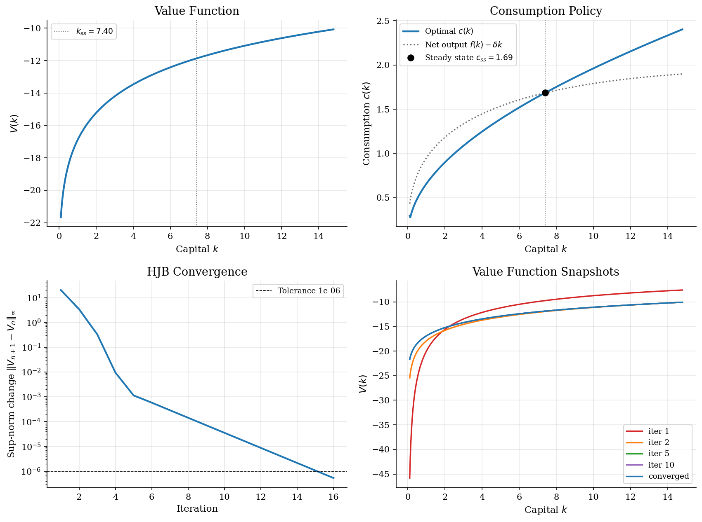
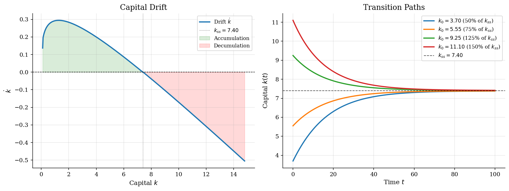

# Ramsey Capital Accumulation by HJB Upwinding

## Overview

Ramsey (1928) asked how a planner should allocate output between consumption and investment to maximize discounted utility over an infinite horizon. Cass (1965) and Koopmans (1965) embedded the problem in a neoclassical growth framework with diminishing returns and endogenous saving. The gap the continuous-time reformulation fills is computational: the discrete-time Bellman equation on a fine grid is slow to iterate, while the Hamilton-Jacobi-Bellman equation reduces the same problem to a single sparse linear solve per iteration.

The object is a *value function* mapping each capital stock to discounted utility. Its derivative pins down the consumption policy. The capital drift follows directly from the policy and drives the economy to its steady state.

Achdou, Han, Lasry, Lions, and Moll (2022) showed that the implicit upwind scheme that makes this tractable for the Ramsey problem generalizes to heterogeneous-agent economies with millions of state variables.

## Read before

- [`optimal-control/upwind-finite-differences/`](../../optimal-control/upwind-finite-differences/)
- [`dynamic-programming/optimal-growth/`](../../dynamic-programming/optimal-growth/)
- [`optimal-control/phase-diagrams/`](../../optimal-control/phase-diagrams/)

## Equations

The planner solves

```math
\max_{\lbrace c(t)\rbrace_{t \geq 0}}
\int_0^\infty e^{-\rho t} u(c(t)) dt,
```

subject to the capital accumulation constraint

```math
\dot{k}(t) = f(k(t)) - \delta k(t) - c(t), \quad k(0) \text{ given}.
```

The discount rate is $`\rho`$, the depreciation rate is $`\delta`$, and $`f(k) = A k^\alpha`$ is Cobb-Douglas production with TFP $`A`$ and capital share $`\alpha`$. Utility is CRRA with curvature $`\sigma \ne 1`$,

```math
u(c) = \frac{c^{1-\sigma}}{1 - \sigma}.
```

### From discrete-time Bellman to HJB

The HJB is the $`\Delta t \to 0`$ limit of a discrete-time Bellman equation. Write the value of starting with capital $`k`$ as $`V(k)`$ and split the planning horizon into a small interval $`[0, \Delta t]`$ and the rest. The planner picks consumption $`c`$ over the small interval and inherits the value at the end,

```math
V(k) = \max_{c \geq 0}
\lbrace u(c) \Delta t + e^{-\rho\Delta t} V(k + \dot k\Delta t)\rbrace + o(\Delta t),
\qquad \dot k = f(k) - \delta k - c.
```

Expand $`e^{-\rho \Delta t} = 1 - \rho\Delta t + o(\Delta t)`$ and $`V(k + \dot k\Delta t) = V(k) + V'(k) \dot k\Delta t + o(\Delta t)`$. Subtract $`V(k)`$, divide by $`\Delta t`$, and let $`\Delta t \to 0`$. The constant term cancels and what remains is the Hamilton-Jacobi-Bellman equation,

```math
\rho V(k) = \max_{c>0}
\lbrace
u(c) +
V'(k) (f(k) - \delta k - c)
\rbrace.
```

The discounted holding cost $`\rho V`$ is paid out of two revenue streams. The first is current utility from consumption. The second is the marginal value $`V'(k)`$ of capital times the rate at which capital accumulates. The marginal value $`V'(k)`$ is the shadow price of one extra unit of capital, the same object that the costate $`\mu`$ would carry in a Pontryagin formulation.

### First-order condition and the optimal policy

The maximand depends on $`c`$ through $`u(c) - V'(k) c`$. The first-order condition for an interior optimum is

```math
u'(c^{\ast}(k)) = V'(k),
```

which equates the marginal utility of consumption to the marginal value of capital. With CRRA utility $`u'(c) = c^{-\sigma}`$, the FOC inverts in closed form to

```math
c^{\ast}(k) = (V'(k))^{-1/\sigma}.
```

Substituting back, the implied drift of capital is

```math
s(k) \equiv \dot k = f(k) - \delta k - c^{\ast}(k),
```

and the HJB collapses to a single nonlinear ordinary differential equation for $`V`$,

```math
\rho V(k) = u(c^{\ast}(k)) + V'(k) s(k).
```

Two structural features matter for the numerical scheme. The drift $`s(k)`$ can be positive or negative, and its sign varies across the state space. Both sides of $`V'(k)`$ must therefore be available to the solver. The solver must pick the correct side at each grid point.

### Steady state

The Ramsey steady state has $`s(k_{ss}) = 0`$ and the modified golden rule

```math
f'(k_{ss}) = \rho + \delta.
```

This follows by differentiating $`\rho V = u(c) + V'(k)(f - \delta k - c)`$ at the steady state where the envelope $`V'(k_{ss}) = u'(c_{ss})`$ holds and the drift vanishes. Plugging the Cobb-Douglas marginal product gives the closed form

```math
k_{ss} = \left(\frac{\alpha A}{\rho + \delta}\right)^{1/(1-\alpha)},
```

with steady-state consumption $`c_{ss} = f(k_{ss}) - \delta k_{ss}`$.

## Worked Numerical Example

To see how the modified golden rule and the Euler equation interact, evaluate the calibration $`(\rho, \sigma, \alpha, \delta, A) = (0.05, 2.0, 0.36, 0.05, 1.0)`$ at the steady state and then at one off-steady-state capital stock.

The *modified golden rule* fixes $`k_{ss}`$ through $`f'(k_{ss}) = \rho + \delta = 0.10`$. With Cobb-Douglas production this inverts to

```math
k_{ss} = \left(\frac{\alpha A}{\rho + \delta}\right)^{1/(1-\alpha)}
       = \left(\frac{0.36}{0.10}\right)^{1/0.64}
       = (3.6)^{1.5625}
       \approx 7.3998.
```

Steady-state consumption follows from $`c_{ss} = A k_{ss}^\alpha - \delta k_{ss}`$,

```math
c_{ss} = (7.3998)^{0.36} - (0.05)(7.3998) = 2.0555 - 0.3700 = 1.6855.
```

Now pick an off-steady-state point $`k_{\text{mid}} = k_{ss}/2 \approx 3.700`$ and read the Euler equation. Differentiating $`u'(c) = V'(k)`$ along an optimal path and using the envelope condition $`\rho V'(k) = V''(k) \dot k + u'(c)(f'(k) - \delta)`$ gives the continuous-time Euler equation

```math
\frac{\dot c}{c} = \frac{f'(k) - \rho - \delta}{\sigma}.
```

The marginal product at $`k_{\text{mid}}`$ is

```math
f'(k_{\text{mid}}) = \alpha A k_{\text{mid}}^{\alpha - 1} = (0.36)(3.700)^{-0.64} \approx 0.1558.
```

The Euler equation evaluated at the midpoint reads

```math
\frac{\dot c}{c}\bigg|_{k_{\text{mid}}} = \frac{0.1558 - 0.05 - 0.05}{2.0} = \frac{0.0558}{2.0} = \boxed{0.0279}.
```

Consumption grows at about 2.8 percent per unit of time when capital is half its steady-state level. The marginal product 0.1558 exceeds the impatience-plus-depreciation hurdle 0.10, so the planner postpones consumption and the drift $`\dot k`$ is positive on the saddle path. As $`k \to k_{ss}`$ the marginal product falls toward $`\rho + \delta`$ and consumption growth decays to zero.

## Model Setup

The calibration uses one aggregate capital state, Cobb-Douglas production, CRRA utility, and no shocks. The grid spans low and high capital around the Ramsey steady state.

| Parameter | Value | Parameter | Value |
|---|---:|---|---:|
| Discount rate $`\rho`$ | 0.05 | CRRA $`\sigma`$ | 2.0 |
| Capital share $`\alpha`$ | 0.36 | Depreciation $`\delta`$ | 0.05 |
| TFP $`A`$ | 1.0 | Steady-state $`k_{ss}`$ | 7.3998 |
| Capital grid $`k \in [0.1,\, 14.80]`$ | 500 pts | HJB tolerance (sup-norm on $`V`$) | 1e-06 |

## Solution Method

What is new here relative to the discrete-time Bellman is the *upwind selection rule*. It chooses the derivative side using the direction the policy pushes capital. The implicit pseudo-time step that follows is unconditionally stable, so a single large step replaces the many small steps an explicit scheme would need.

```
             primitives (rho, sigma, alpha, delta, A), k grid
                                   |
                                   v
             +---------- HJB iteration ----------+
             |                                   |
             |  V_n  -->  [ upwind FD + FOC ]  -->  c_n, s_n
             |                                   |
             |  c_n, s_n  -->  [ implicit solve ]  -->  V_{n+1}
             |                                   |
             +------ err >= tol: repeat ----------+
                                   |
                               err < tol
                                   v
                          V*(k), c*(k), s*(k)
```

```python
# Upwind selection: choose derivative side from the sign of capital drift.
# Forward difference when drift is positive, backward when negative.
# At steady state, use net-output consumption to hold capital fixed.
dVf = np.diff(V, append=V[-1]) / dk        # forward slope (boundary: repeated)
dVb = np.diff(V, prepend=V[0]) / dk        # backward slope (boundary: repeated)

cf = np.maximum(dVf, 1e-15) ** (-1.0 / sigma)   # c implied by forward slope
cb = np.maximum(dVb, 1e-15) ** (-1.0 / sigma)   # c implied by backward slope

sf = f_k - delta * k - cf   # drift under forward slope
sb = f_k - delta * k - cb   # drift under backward slope

# upwind rule: forward if sf > 0, backward if sb < 0, steady-state otherwise
If = (sf > 0).astype(float)
Ib = (sb < 0).astype(float)
I0 = 1.0 - If - Ib

dV = dVf * If + dVb * Ib + (f_k - delta * k) ** (-sigma) * I0
c  = np.maximum(dV, 1e-15) ** (-1.0 / sigma)

# Implicit pseudo-time update: [(1/Delta + rho)*I - A] V_{n+1} = u(c) + V/Delta
# A is the tridiagonal upwind generator; Delta = 1000 makes this a near-Newton step.
B     = (1.0 / Delta + rho) * eye(N) - A_mat
V_new = spsolve(B, crra_utility(c, sigma) + V / Delta)
```

The HJB converged in 16 iterations with final sup-norm change 5.34e-07. Taking $`\Delta \to \infty`$ recovers a Newton step on $`\rho V - u(c) - \mathbf{A} V = 0`$ with the policy frozen.

## Results

The value function is increasing and concave. Extra capital raises future consumption, but diminishing marginal product lowers the marginal gain. The consumption rule comes from marginal value: below the steady state, consumption stays below net output so capital rises; above it, consumption exceeds net output so capital falls.



The drift $`s(k) = \dot k`$ drives transitions and selects the upwind derivative. Positive drift points to capital accumulation. Negative drift points to decumulation. The zero crossing is the Ramsey steady state. The *saddle path* sends each initial capital stock toward $`k_{ss}`$. Low-capital economies invest because marginal product is high. High-capital economies consume more than net output and move down.



### Steady-state and HJB diagnostics

| Variable | Analytical | Variable | Baseline HJB |
|---|---:|---|---:|
| $`k_{ss}`$ (capital) | 7.3998 | $`k_{ss}`$ (HJB grid) | 7.4057 |
| $`c_{ss}`$ (consumption) | 1.6855 | $`c_{ss}`$ (HJB grid) | 1.6858 |
| $`y_{ss}`$ (output) | 2.0555 | $`y_{ss}`$ (HJB grid) | 2.0561 |
| $`i/y`$ (saving rate) | 0.1800 | $`f'(k_{ss})`$ (MPK) | 0.0999 |
| HJB iterations | -- | HJB residual | 5.34e-07 |

## Takeaway

*Upwinding* turns the sign of the capital drift into a selection rule for the derivative. That one choice makes the HJB both stable and fast. Ramsey (1928) introduced the optimal-saving problem in continuous time. Cass and Koopmans added rigor on transversality and steady-state characterization. The quantitative surprise in the continuous-time revival was how few iterations the implicit scheme needs: the large pseudo-time step makes each update close to a Newton step, so the HJB fixed point is within reach in a handful of solves rather than hundreds. The framework goes on to anchor heterogeneous-agent economies where the same HJB structure reappears for each household type in an Aiyagari or HANK model.

## See also

- [`optimal-control/phase-diagrams/`](../../optimal-control/phase-diagrams/) -- same Ramsey model by phase-plane eigenanalysis
- [`optimal-control/ramsey-growth/`](../../optimal-control/ramsey-growth/) -- saddle-path forward shooting
- [`heterogeneous-agents/aiyagari-hact/`](../../heterogeneous-agents/aiyagari-hact/) -- Aiyagari in continuous time (HJB + KFE)

## References

- Achdou, Y., Han, J., Lasry, J.-M., Lions, P.-L., and Moll, B. (2022). "Income and Wealth Distribution in Macroeconomics: A Continuous-Time Approach." *Review of Economic Studies*, 89(1), 45-86.
- Cass, D. (1965). "Optimum Growth in an Aggregative Model of Capital Accumulation." *Review of Economic Studies*, 32(3), 233-240.
- Koopmans, T. C. (1965). "On the Concept of Optimal Economic Growth." *Pontificiae Academiae Scientiarum Scripta Varia*, 28, 225-300.
- Moll, B. (2022). "Lecture notes on continuous-time methods in macroeconomics." https://benjaminmoll.com/lectures/
- Ramsey, F. P. (1928). "A Mathematical Theory of Saving." *Economic Journal*, 38(152), 543-559.
