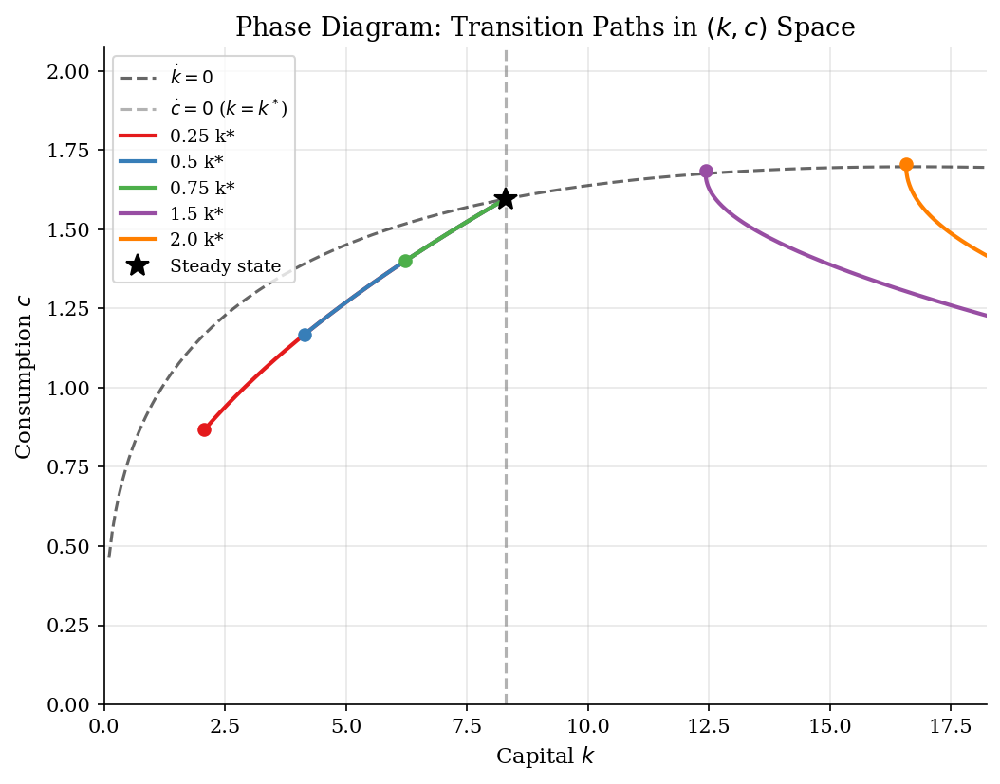
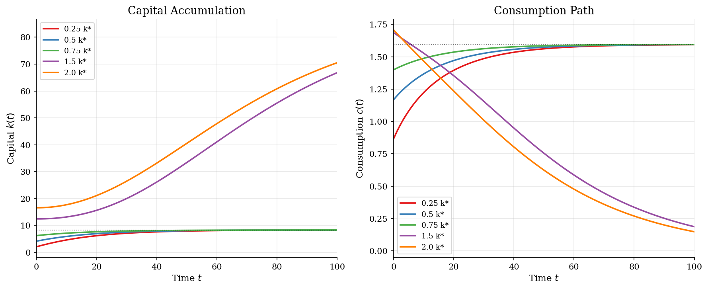
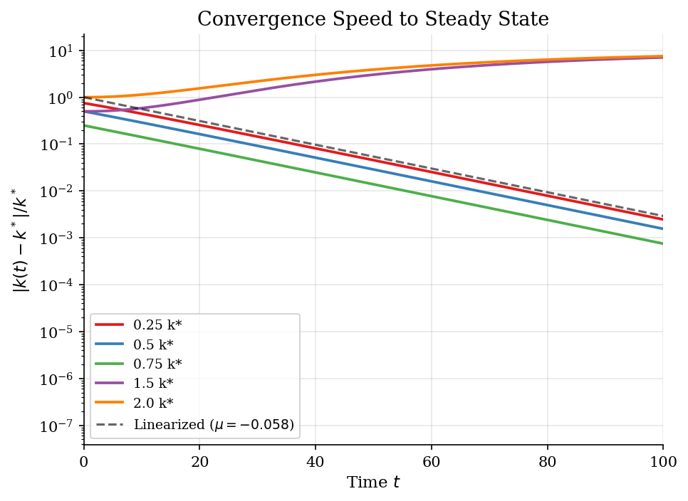

# Ramsey-Cass-Koopmans Growth Model

> Optimal saving and consumption in the neoclassical growth model, solved via the shooting method.

## Overview

The Ramsey model is the foundational continuous-time growth model. A representative household chooses a consumption path to maximize lifetime utility, taking as given the neoclassical production technology. Unlike the Solow model, the saving rate is endogenous --- it emerges from the household's intertemporal optimization.

The model features saddle-path stability: for any initial capital stock, there is a unique consumption level that places the economy on the convergent path to the steady state. The shooting method exploits this structure to solve the boundary value problem.

## Equations

$$\max_{c(t)} \int_0^\infty e^{-\rho t} \, \frac{c(t)^{1-\sigma}}{1-\sigma} \, dt$$

subject to: $\dot{k} = f(k) - \delta k - c$, with $f(k) = A k^\alpha$.

**Euler equation (Keynes-Ramsey rule):**
$$\frac{\dot{c}}{c} = \frac{1}{\sigma} \left( f'(k) - \delta - \rho \right)$$

**Steady state:**
$$f'(k^*) = \delta + \rho \implies k^* = \left(\frac{\alpha A}{\delta + \rho}\right)^{\frac{1}{1-\alpha}}$$
$$c^* = f(k^*) - \delta k^*$$

**Modified golden rule:** The steady-state capital stock equates the net marginal product of capital to the discount rate.

## Model Setup

| Parameter | Value | Description |
|-----------|-------|-------------|
| $\alpha$  | 0.33 | Capital share |
| $\delta$  | 0.05 | Depreciation rate |
| $\rho$    | 0.03 | Discount rate |
| $\sigma$  | 2.0 | CRRA coefficient |
| $A$       | 1.0 | TFP |
| $k^*$     | 8.2898 | Steady-state capital |
| $c^*$     | 1.5952 | Steady-state consumption |

## Solution Method

**Shooting Method on the Saddle Path:** The Ramsey model is a boundary value problem: $k(0) = k_0$ is given and the transversality condition requires convergence to the steady state as $t \to \infty$.

For each initial $k_0$, we search over $c(0)$ using Brent's method (bisection) to find the unique value that places the economy on the saddle path. Too-high $c(0)$ leads to capital depletion; too-low $c(0)$ leads to unbounded capital accumulation.

The ODE system is integrated using `scipy.integrate.solve_ivp` (RK45, adaptive step).

**Convergence rate (linearized):** $\mu = -0.0584$, half-life $\approx 11.9$ years.
**Empirical convergence rate:** $\hat{\mu} = -0.0559$.

## Results


*Phase diagram showing saddle paths converging to the steady state from different initial capital stocks*


*Time paths of capital and consumption from different initial conditions, all converging to steady state*


*Log-scale convergence of capital to steady state, compared with linearized prediction*

**Shooting Method Results for Different Initial Capital Stocks**

|   Initial k |   k / k* |   c(0) (saddle) |   k(50) |   c(50) |
|------------:|---------:|----------------:|--------:|--------:|
|      2.0724 |     0.25 |        0.867114 |  7.915  |  1.5617 |
|      4.1449 |     0.5  |        1.16845  |  8.0524 |  1.574  |
|      6.2173 |     0.75 |        1.39947  |  8.1751 |  1.585  |
|     12.4347 |     1.5  |        1.68563  | 33.4255 |  0.7531 |
|     16.5796 |     2    |        1.70717  | 40.5534 |  0.6226 |

## Economic Takeaway

The Ramsey model reveals the deep structure of optimal saving and capital accumulation in the neoclassical framework.

**Key insights:**
- The steady-state capital stock satisfies the **modified golden rule**: $f'(k^*) = \delta + \rho$. Unlike the golden rule ($f'(k) = \delta$), optimizing households do not maximize steady-state consumption --- they discount the future.
- The economy exhibits **saddle-path stability**: only one consumption level is consistent with intertemporal optimization for each capital stock. All other paths violate either feasibility or the transversality condition.
- **Convergence is slow**: the half-life is approximately 12 years. This is a well-known feature of the neoclassical model and partly explains persistent cross-country income differences.
- Along the saddle path, capital-poor economies have *lower* consumption but *higher* saving rates, consistent with the empirical convergence literature.
- The shooting method is the natural numerical approach for saddle-path systems: it converts a two-point BVP into a sequence of initial value problems.

## Reproduce

```bash
python run.py
```

## References

- Barro, R. and Sala-i-Martin, X. (2004). *Economic Growth*. MIT Press, 2nd edition, Ch. 2.
- Acemoglu, D. (2009). *Introduction to Modern Economic Growth*. Princeton University Press, Ch. 8.
- Romer, D. (2019). *Advanced Macroeconomics*. McGraw-Hill, 5th edition, Ch. 2.
