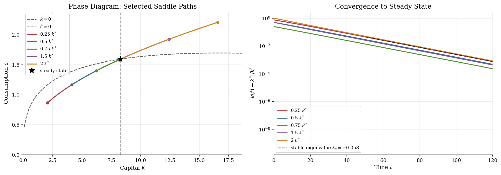
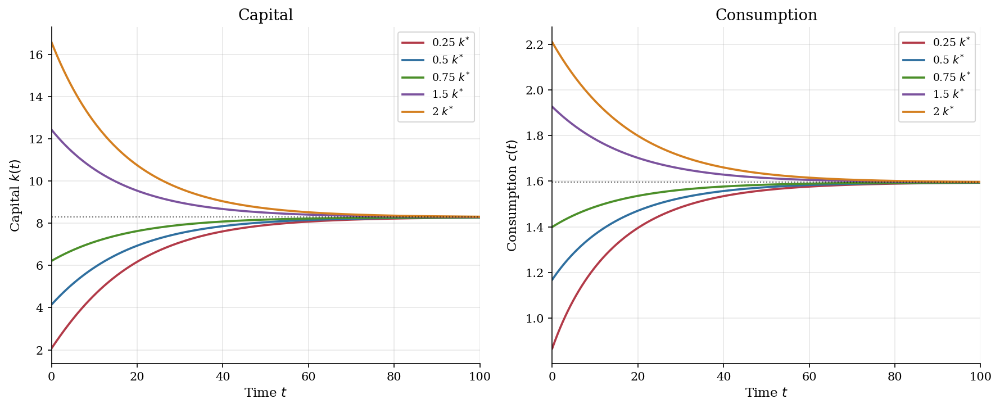

# Ramsey Saving by Saddle-Path Shooting

## Overview

In Ramsey growth, an economy inherits its capital stock. A capital-poor economy saves to build productive capacity. A capital-rich economy can consume more while capital falls toward its long-run level.

The object is the initial consumption choice. History fixes the starting capital, but consumption can jump. The right jump places the economy on the *saddle path* to the Ramsey steady state.

Shooting treats the initial consumption as the unknown. Each guess defines a full path through the Euler equation and resource law. A root search chooses the guess whose terminal capital is near the steady-state level.

Ramsey published the optimal saving rule in 1928. His paper required variational calculus and infinite-horizon optimization -- tools not standard in economics until the 1960s. The profession largely missed it for nearly four decades. Cass (1965) and Koopmans (1965) independently embedded the saving rule into a neoclassical production framework and provided the saddle-path geometry that the code implements. Cass later revealed he found Ramsey's paper only after drafting his own thesis chapter. The framework now anchors the representative-agent DSGE, real business cycle theory, and modern heterogeneous-agent macro.

## Read before

- [Scalar root finding](../../numerical-methods/root-finding/README.md)
- [Phase diagrams and backward integration](../phase-diagrams/README.md)
- [HJB growth in continuous time](../hjb-growth/README.md)

## Equations

The planner chooses a feasible path $`\lbrace c(t)\rbrace_{t\geq 0}`$ to maximize lifetime utility:

```math
\max_{\lbrace c(t)\rbrace} \int_0^\infty e^{-\rho t}
\frac{c(t)^{1-\sigma}}{1-\sigma} dt
```

subject to the capital accumulation equation, with Cobb-Douglas technology $`f(k)=Ak^\alpha`$:

```math
\dot{k}(t)=f(k(t))-\delta k(t)-c(t).
```

Here $`\rho`$ is the continuous-time discount rate. The parameter $`\delta`$ is depreciation. The parameter $`\sigma`$ is the CRRA coefficient and inverse EIS. The parameter $`A`$ is total factor productivity. The parameter $`\alpha`$ is the capital share.

The Euler equation is the *Keynes-Ramsey rule*:

```math
\frac{\dot{c}(t)}{c(t)}=
\frac{f'(k(t))-\delta-\rho}{\sigma}.
```

Together with the resource law, this gives the two-dimensional system solved by the code:

```math
\dot{k}=Ak^\alpha-\delta k-c,
```

```math
\dot{c}=\frac{\alpha A k^{\alpha-1}-\delta-\rho}{\sigma}c .
```

The steady state satisfies:

```math
f'(k^{\ast})=\rho+\delta,
```

```math
k^{\ast}=\left(\frac{\alpha A}{\rho+\delta}\right)^{1/(1-\alpha)},
```

```math
c^{\ast}=f(k^{\ast})-\delta k^{\ast}.
```

The saddle path starts from the inherited $`k_0`$. It also satisfies the infinite-horizon boundary condition:

```math
\lim_{t\to\infty} e^{-\rho t}u'(c(t))k(t)=0
```

Here $`u(c)=c^{1-\sigma}/(1-\sigma)`$ is the period utility function, so $`u'(c)=c^{-\sigma}`$. The finite shooting calculation chooses $`c_0`$ so the path is near $`(k^{\ast},c^{\ast})`$ at date $`T`$.

## Worked Numerical Example

Take one row of the shooting table and step the saddle path forward by hand. The calibration is $`\alpha = 0.33`$, $`\delta = 0.05`$, $`\rho = 0.03`$, $`\sigma = 2.0`$, $`A = 1.0`$, so the steady state is at $`f'(k^{\ast}) = \rho + \delta = 0.08`$:

```math
k^{\ast} = \left(\tfrac{0.33}{0.08}\right)^{1/0.67} = 8.2898,
```

```math
c^{\ast} = (8.2898)^{0.33} - (0.05)(8.2898) = 1.5952.
```

Start the capital-poor case from $`k_0 = 0.25 k^{\ast} = 2.0724`$ with the shooting-selected jump $`c_0 = 0.8671`$. Evaluate net output and the marginal product at $`k_0`$:

```math
f(k_0) = (2.0724)^{0.33} = 1.2719,
```

```math
f'(k_0) = (0.33)(2.0724)^{-0.67} = 0.2025.
```

Substitute into the resource law and the Keynes-Ramsey rule:

```math
\dot{k}(0) = f(k_0) - \delta k_0 - c_0 = 1.2719 - 0.1036 - 0.8671 = 0.3011,
```

```math
\frac{\dot{c}(0)}{c(0)} = \frac{f'(k_0) - \delta - \rho}{\sigma} = \frac{0.2025 - 0.05 - 0.03}{2.0} = 0.0613.
```

Both velocities are positive. Capital rises because the planner saves a large share of output. Consumption rises because the marginal product exceeds the modified golden-rule level.

Take one *explicit Euler step* of size $`\Delta t = 0.5`$:

```math
k(0.5) \approx k_0 + 0.5 \dot{k}(0) = 2.0724 + (0.5)(0.3011) = 2.2230,
```

```math
\boxed{c(0.5) \approx c_0 + 0.5\, c_0\, \tfrac{\dot{c}(0)}{c(0)} = 0.8671 + (0.5)(0.8671)(0.0613) = 0.8937.}
```

The trajectory moves north-east in the phase diagram, consistent with the colored path that starts from $`k_0/k^{\ast} = 0.25`$ in the Results figure. The Brent search in the full code keeps refining $`c_0`$ until the analogous integration out to $`T = 150`$ lands within $`2.75 \times 10^{-7}`$ of $`k^{\ast}`$.

## Model Setup

The calibration is deterministic and close to textbook growth examples. Initial states range from scarce capital to excess capital. The terminal date approximates the *transversality condition*. It is not an economic horizon.

| Parameter | Value | Parameter | Value |
|---|---:|---|---:|
| Capital share $`\alpha`$ | 0.33 | CRRA $`\sigma`$ | 2.0 |
| Depreciation $`\delta`$ | 0.05 | TFP $`A`$ | 1.0 |
| Discount rate $`\rho`$ | 0.03 | Terminal date $`T`$ | 150 |
| Steady-state capital $`k^{\ast}`$ | 8.2898 | Steady-state consumption $`c^{\ast}`$ | 1.5952 |
| Initial capital range | $`0.25k^{\ast}`$ to $`2.00k^{\ast}`$ | | |

## Solution Method

Shooting solves the Ramsey boundary value problem with repeated initial value problems. For fixed $`k_0`$, define the *terminal gap* $`G(c_0;k_0)=k(T;c_0)-k^{\ast}`$. A positive gap means early consumption was too low. A negative gap means it was too high.

The algorithm brackets $`c_0`$ with one low guess and one high guess. Brent's method searches for the jump that makes the terminal gap zero.

```
       primitives (rho, sigma, alpha, delta, A),  k_0,  T
                               |
                               v
               +------ bracket search ------+
               |  [ low c_0 ]  [ high c_0 ] |
               +----------------------------+
                               |
                               v
    +------------- Brent shooting loop ----------------+
    |                                                  |
    |   c_0 candidate --> [ ODE solve ] --> k(T)       |
    |                                                  |
    +-- terminal gap != 0 --> update c_0 bracket ------+
                               |
                         gap converged
                               v
                   [ final ODE integration ]
                               |
                               v
                 saddle path {k_t, c_t},  k*,  c*
```

```python
def find_saddle_path_c0(k0):
    c_low, c_high = bracket_saddle_consumption(k0)
    return brentq(
        lambda c0: terminal_capital_gap(k0, c0),
        c_low, c_high, xtol=1e-11, rtol=1e-11, maxiter=200,
    )
```

## Results

The phase diagram shows how shooting selects the path. The dashed curve is net output, where $`\dot{k}=0`$. The vertical line is $`k^{\ast}`$, where $`\dot{c}=0`$. Each colored path starts from a different $`k_0`$ and uses the chosen $`c_0`$. Below $`k^{\ast}`$, consumption starts low enough to build capital. Above $`k^{\ast}`$, consumption starts high enough to run capital down. The log-scale panel shows that near the steady state, $`|k(t)-k^{\ast}|`$ falls at the *stable eigenvalue* rate.



The time paths show the saving rule along the selected path. A capital-poor economy keeps consumption below output and lets capital rise. A capital-rich economy consumes more than net output and lets capital fall. Consumption moves with the Euler equation as the marginal product changes.



The table records the jump chosen by the root search. The consumption ratio is below one when the planner builds capital. It is above one when the planner runs capital down. The last column reports the relative terminal capital gap.

### Shooting Diagnostics

|   $`k_0/k^{\ast}`$ |   $`c_0`$ from shooting |   $`c_0/[f(k_0)-\delta k_0]`$ |   $`k(50)/k^{\ast}`$ |   $`c(50)/c^{\ast}`$ |   Relative terminal gap |
|--------------:|----------------------:|----------------------------:|----------------:|----------------:|--------------------------------:|
|          0.25 |              0.867114 |                       0.742 |          0.9548 |          0.979  |                        2.75e-07 |
|          0.5  |              1.16845  |                       0.84  |          0.9714 |          0.9868 |                        3.7e-07  |
|          0.75 |              1.39947  |                       0.923 |          0.9862 |          0.9936 |                        3.17e-06 |
|          1.5  |              1.92645  |                       1.15  |          1.0259 |          1.0118 |                        7.69e-08 |
|          2    |              2.20938  |                       1.302 |          1.0503 |          1.0228 |                        4.36e-10 |

## Takeaway

History fixes capital, but optimality selects the initial consumption jump. A wrong jump sends the economy toward capital exhaustion or overaccumulation. Shooting finds the jump that keeps the path feasible and on the *saddle path*.

Ramsey wrote down the saving rule in 1928. The profession could not use it for nearly four decades because the required mathematical tools were not yet standard in economics. When Cass and Koopmans revived it independently in 1965, they found that the same rule, embedded in a production economy, pins down the entire transition path from any starting capital stock. That structural insight -- one free variable, one boundary condition, one path -- is why the Ramsey framework persists at the core of modern macro.

## See also

- [HJB growth in continuous time](../hjb-growth/README.md)
- [Phase diagrams and backward integration](../phase-diagrams/README.md)
- [Scalar root finding](../../numerical-methods/root-finding/README.md)

## References

- Ramsey, F. (1928). "A Mathematical Theory of Saving." *Economic Journal*, 38(152), 543-559.
- Cass, D. (1965). "Optimum Growth in an Aggregative Model of Capital Accumulation." *Review of Economic Studies*, 32(3), 233-240.
- Koopmans, T. C. (1965). "On the Concept of Optimal Economic Growth." In *The Econometric Approach to Development Planning*. North Holland.
- Barro, R. and Sala-i-Martin, X. (2004). *Economic Growth*. MIT Press, 2nd edition, Ch. 2.
- Acemoglu, D. (2009). *Introduction to Modern Economic Growth*. Princeton University Press, Ch. 8.
