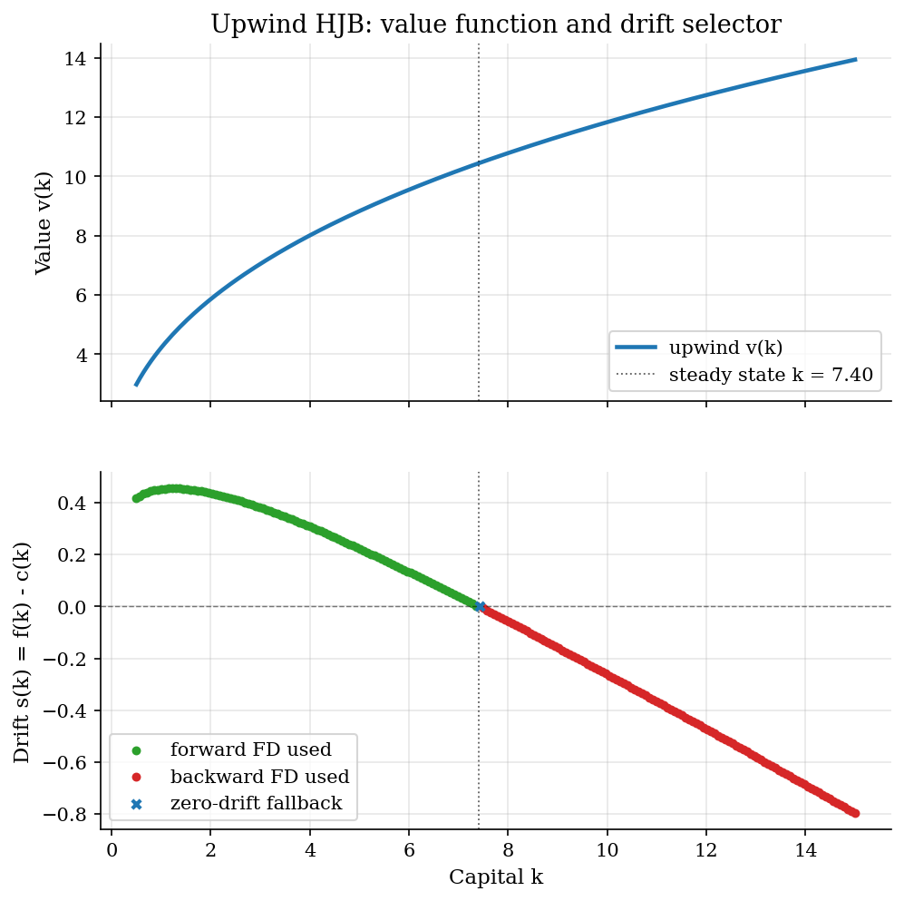
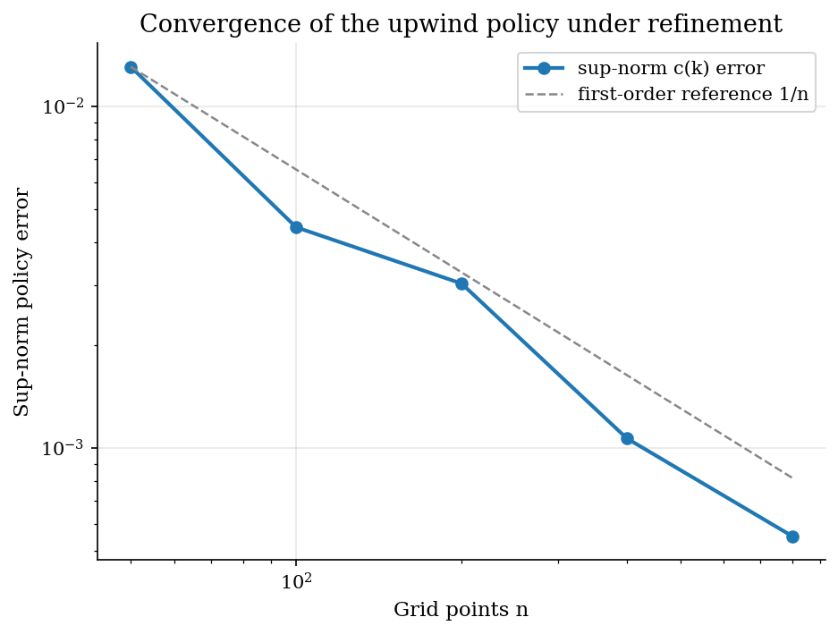
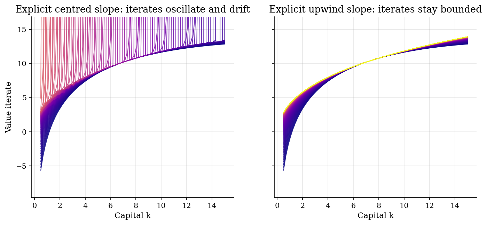

# Upwind Finite Differences for First-Order PDEs and the HJB State Constraint

## Overview

A 1D Hamilton-Jacobi-Bellman partial differential equation has one state variable and one unknown value function. The PDE is first-order: it involves the value function's first derivative but not its second. A continuous-time control problem on a bounded interval reduces to such a PDE.

At each grid point the current policy fixes the direction the state will move next. Call that direction the drift. Its sign can change across the interval. The numerical scheme has to look in that direction for the next-period value.

A symmetric solver averages both neighbours of a grid point. That produces alternating-sign oscillations on adjacent grid points that grow with each iteration. A fixed one-sided solver always looks the same way and points against the drift at one end. The upwind rule fixes both failures. It picks the one-sided difference whose neighbour the state is moving toward.

At a lower-bounded state the policy might try to push the state through the floor. The same multiplier condition that holds at a constrained optimum in static problems then forces a switch. The policy that violates the floor is swapped for the policy that holds the state exactly at the floor. The numerical scheme has to enforce the same clip.

The generic operator drives the Ramsey HJB in [`optimal-control/hjb-growth/`](../../optimal-control/hjb-growth/) and the Huggett incomplete-markets equilibrium in [`heterogeneous-agents/huggett-incomplete-markets/`](../../heterogeneous-agents/huggett-incomplete-markets/). The payoff here is threefold: forward, backward, and upwind one-sided differences; the sparse generator that the implicit HJB solve inverts; the state-constraint clip that turns the lower-boundary policy into one that respects the floor.

## Preliminary readings

- [`dynamic-programming/optimal-growth/`](../../dynamic-programming/optimal-growth/)

## Equations

The objects build up in a chain. First place a grid to discretise the state. Then approximate the value function's slope at each grid point. Then pick which one-sided slope to use at each point. Assemble those choices into a sparse matrix. At the boundary, handle the case where one of the one-sided slopes does not exist.

Place a uniform grid $`x_1 < x_2 < \cdots < x_n`$ on $`[\underline x, \overline x]`$ with spacing $`\Delta x`$. Let $`v_i = v(x_i)`$ be the value at node $`i`$, and $`s_i = s(x_i)`$ the policy-implied drift, positive when the state moves right.

The HJB involves $`v'(x)`$, so on a grid we need a finite-difference approximation to that slope. The two natural one-sided approximations at an interior node are forward and backward,

```math
D^{+} v_i = \frac{v_{i+1} - v_i}{\Delta x},
\qquad
D^{-} v_i = \frac{v_i - v_{i-1}}{\Delta x}.
```

Each one-sided slope uses one neighbour. The central slope $`(v_{i+1} - v_{i-1}) / (2 \Delta x)`$ weights both equally. That is unstable here. A first-order HJB only uses the neighbour the state is moving toward, so weighting the other one introduces information that should not be there.

Now that we have two candidate slopes, the upwind rule says which to use at each node. It selects the slope whose neighbour the state is moving toward,

```math
D v_i =
\begin{cases}
D^{+} v_i & \text{if } s_i > 0,\\
D^{-} v_i & \text{if } s_i < 0,\\
0 & \text{if } s_i = 0.
\end{cases}
```

To compute the selector, solve the first-order condition with each one-sided slope, evaluate the implied drift, and keep the side whose drift has the matching sign. Where neither sign holds, the node sits at a local steady state with zero-drift policy. Results colours each node by branch.

Now collect the per-node slope choices into a single matrix. We need this matrix because the implicit HJB step solves a linear system in $`v`$, and the matrix is the operator on that system. Split the drift into positive and negative parts $`s^{+}_i = \max(s_i, 0)`$, $`s^{-}_i = \min(s_i, 0)`$. The sparse matrix $`A`$ has super-diagonal $`s^{+}_i / \Delta x`$, sub-diagonal $`-s^{-}_i / \Delta x`$, with main-diagonal chosen so each row sums to zero. With one state, $`A`$ is tridiagonal.

```math
A_{i, i-1} = -\frac{s^{-}_i}{\Delta x},
\qquad
A_{i, i+1} = \frac{s^{+}_i}{\Delta x},
\qquad
A_{i, i} = -A_{i, i-1} - A_{i, i+1}.
```

The matrix $`A`$ is a continuous-time Markov-chain generator on the grid. A generator is a matrix whose rows sum to zero, with non-positive diagonal and non-negative off-diagonals. Multiplying a probability vector by a generator gives the rate of change of that probability under the chain. Here the row sums are zero by construction, the off-diagonals are non-negative because they are $`s^{+}_i / \Delta x \geq 0`$ and $`-s^{-}_i / \Delta x \geq 0`$, and the diagonal is non-positive because it is the negative sum of the off-diagonals.

The implicit HJB step inverts $`(\rho I - A)`$ as a sparse tridiagonal solve. The transpose $`A^{\top}`$ is the Kolmogorov forward operator: the same matrix transports the cross-sectional density forward in time. The KFE prelim develops that duality.

We now turn to the boundary. At $`x_1 = \underline x`$ the backward neighbour $`x_0`$ does not exist, so the backward slope is undefined. We need a separate rule for what the scheme does at the boundary. The forcing rule uses $`D^{+} v_1`$ when the resulting drift is non-negative, so the state moves into the interior. Otherwise the constraint binds and the policy is overridden. The condition that selects between these two cases is the same Karush-Kuhn-Tucker multiplier condition that holds at a constrained optimum in static problems,

```math
s_1 \geq 0
\quad\Longleftrightarrow\quad
v'(\underline x) \geq u'(c_{\mathrm{floor}}),
```

where $`c_{\mathrm{floor}}`$ is the consumption that zeroes the drift at the boundary, defined implicitly by $`s(c_{\mathrm{floor}}) = 0`$ given $`x = \underline x`$.

Equality holds when the constraint is slack. Strict inequality holds when the household would dissave further. The scheme overrides the lower-boundary policy with $`c_{\mathrm{floor}}`$ whenever the unconstrained forward drift would be negative. An analogous rule applies at $`x_n`$.

One last piece motivates why this discretisation converges to the right object. The HJB is a first-order PDE whose classical solution may not exist where the value function has kinks. The viscosity solution is the standard relaxation that admits such kinks and still picks the economically meaningful one. Crandall, Evans, and Lions (1984) formalised this notion. A discretisation is called *monotone* when its update is non-decreasing in each grid value. Monotonicity is what makes the discrete limit equal the viscosity solution. The upwind scheme is monotone, so its fixed point converges to the viscosity solution under grid refinement. The centred scheme is non-monotone, which is why the failure-mode comparison below diverges.

## Worked Numerical Example

Take one interior node in the Ramsey HJB with $`u(c) = \log c`$, $`f(k) = k^{\alpha}`$, $`\alpha = 0.36`$, and $`\delta = 0.05`$. Place the three-point stencil at $`k_{i-1} = 1.0`$, $`k_i = 1.1`$, $`k_{i+1} = 1.2`$, so $`\Delta k = 0.1`$, and let the current value iterate carry $`v_{i-1} = 2.00`$, $`v_i = 2.10`$, $`v_{i+1} = 2.18`$.

The two one-sided slopes at node $`i`$ are

```math
D^{+} v_i = \frac{v_{i+1} - v_i}{\Delta k} = \frac{2.18 - 2.10}{0.1} = 0.80,
\qquad
D^{-} v_i = \frac{v_i - v_{i-1}}{\Delta k} = \frac{2.10 - 2.00}{0.1} = 1.00.
```

The first-order condition for log utility is $`1/c = v'(k)`$, so each slope implies a candidate consumption,

```math
c_F = \frac{1}{D^{+} v_i} = 1.25,
\qquad
c_B = \frac{1}{D^{-} v_i} = 1.00.
```

Net resources at $`k_i`$ are $`f(k_i) - \delta k_i = 1.1^{0.36} - (0.05)(1.1) = 1.0349 - 0.055 = 0.9799`$. The two candidate drifts are

```math
s_F = 0.9799 - c_F = -0.2701,
\qquad
s_B = 0.9799 - c_B = -0.0201.
```

Both drifts are negative, so the forward test $`s_F > 0`$ fails and the backward test $`s_B < 0`$ holds. The upwind selector returns

```math
D v_i = D^{-} v_i = 1.00,
\qquad
\boxed{c^{\ast} = 1.00, \quad s^{\ast} = -0.0201.}
```

The Hamiltonian at this node evaluates to $`\log(1.00) + (1.00)(-0.0201) = -0.0201`$, the flow value the implicit step uses to update $`v_i`$.

Negative drift on both candidates is the textbook signature of a node above the steady state, where capital decumulates regardless of which slope we trust. The selector picks the backward neighbour because that is where the state is actually moving, and the sub-diagonal entry $`-s^{-}_i / \Delta k = 0.201`$ is what gets written into row $`i`$ of the generator $`A`$.

## Model Setup

The illustrative model is a Ramsey HJB on a single capital state with log utility, Cobb-Douglas production, and depreciation. The calibration exposes the upwind branches and the boundary forcing rule. Economic claims belong in the dense Ramsey tutorial.

| Symbol | Value or set | Role |
|---|---|---|
| $`x`$ | grid node | generic 1D state (prelim notation, adopted by dense tutorials) |
| $`k`$ | $`[0.5, 15.0]`$ | capital, instance of $`x`$ (from `hjb-growth/`) |
| $`a`$ | (Huggett asset grid) | asset, instance of $`x`$ (from `huggett-incomplete-markets/`) |
| $`\underline a`$ | left endpoint of asset grid | lower state-constraint boundary (from `huggett-incomplete-markets/`) |
| $`\underline x, \underline k`$ | left endpoint of generic grid | lower grid endpoint when no constraint binds |
| $`v(x)`$ | grid array | value function |
| $`s(x)`$ | grid array | policy-implied drift, signed (Huggett writes $`s_i(a)`$ with an income index) |
| $`D^{+}, D^{-}`$ | linear operators | forward and backward one-sided differences |
| $`A`$ | sparse $`n \times n`$ | upwind generator on the 1D grid (Huggett: $`\mathbf{A}^n`$; `hjb-growth/`: $`\mathbf{A}^n`$) |
| $`\rho`$ | 0.05 | continuous-time discount rate |
| $`\alpha`$ | 0.36 | capital share in Cobb-Douglas production |
| $`\delta`$ | 0.05 | depreciation rate |
| $`\Delta`$ | 1000 | implicit pseudo-time step |
| Working grid | 200 points | uniform on $`[0.5, 15.0]`$ |
| Reference grid | 4000 points | uniform on the same interval, refinement benchmark |
| HJB tolerance | $`10^{-7}`$ | sup-norm on successive value iterates |

The symbol $`A`$ here (upwind generator) collides with $`A`$ in the linearised DSGE prelim (lead matrix in a rational-expectations system). Each scope labels the matrix on first use.

## Solution Method

The scheme is implicit upwind iteration. At each pseudo-time step the solver forms forward and backward slopes at every node. It then computes the implied drift for each side and picks the side whose drift carries the matching sign. The implied consumption defines $`A`$. The next value iterate then satisfies a sparse linear system.

The matrix $`(\rho I + I / \Delta - A)`$ is strictly diagonally dominant for any positive pseudo-time step. Strict diagonal dominance means each diagonal entry exceeds the absolute sum of off-diagonals in its row, which guarantees the system is invertible and the solve is unconditionally stable regardless of $`\Delta`$. Large $`\Delta`$ drives the update toward a Newton step with the policy frozen. The Ramsey application in [`optimal-control/hjb-growth/`](../../optimal-control/hjb-growth/) collects the implementation details.

```text
Algorithm: implicit upwind HJB iteration on a 1D grid
Inputs    grid {x_i}, primitives (rho, ...), pseudo-time step Delta, tolerance eps
Output    value v, policy c, drift s, selector (forward / backward / zero)

initialise v from a myopic flow value
repeat
    for each interior node i:
        compute D+ v_i and D- v_i
        derive candidate consumptions and candidate drifts from each slope
        if forward drift positive: use D+
        elif backward drift negative: use D-
        else: use zero-drift fallback
    at the left endpoint: force forward, then apply the KT clip if needed
    at the right endpoint: force backward
    build the sparse generator A from upwind drifts
    solve [(1 / Delta + rho) I - A] v_new = u(c) + v / Delta
    if max abs(v_new - v) below eps: stop
    v = v_new
```

The KT clip at the left endpoint enforces the state constraint when one is present. When the forward-slope policy at $`\underline x`$ would push the state left, the override sets consumption to the zero-drift value. The `lib.finite_differences.kt_state_constraint_clip` helper exposes this operation. In the Ramsey calibration below the steady state is interior, so the clip does not bind. `run.py` exercises it on a synthetic input to verify the helper. The clip binds at the borrowing limit in [`heterogeneous-agents/huggett-incomplete-markets/`](../../heterogeneous-agents/huggett-incomplete-markets/), where households would dissave below $`\underline a`$ if unconstrained.

The implicit scheme is unconditionally stable. An explicit pseudo-time step on the same operator must obey a CFL-like condition $`\Delta t \lesssim \Delta x / \max_i |s_i|`$. The failure-mode figure compares explicit centred against explicit upwind at the same step size. The centred iterates diverge. The upwind iterates remain bounded.

## Results

The HJB converges in seven implicit iterations on the working grid. The sup-norm change at stop is $`9.5 \times 10^{-10}`$, well below the $`10^{-7}`$ tolerance. The reference grid also converges in seven iterations. Doubling the grid does not double the iteration count because each step is close to a Newton step.



The value function is increasing and concave in capital. The drift is positive below the steady state, negative above. The selector colours each node green for forward, red for backward. The zero-drift fallback fires at exactly one node near the steady state. The branch transition is monotone, no flickering.



The second diagnostic is refinement. Sup-norm policy error against the fine-grid reference decays at the first-order rate $`1/n`$ on average, with some non-monotonicity because the reference grid is itself discretised. First-order convergence is the expected rate for a one-sided difference on a smooth value function. The diagnostic confirms that the upwind selection rule introduces no non-convergent constant.



The failure-mode panel makes the case for upwinding directly. From the same myopic guess at the same explicit step size, the centred slope develops large spikes and hits the y-axis clip within a few dozen steps. The upwind slope marches toward the converged value function and stays bounded. The discretisation respects the direction of information flow.

## Takeaway

The upwind rule turns an unstable discretisation of a first-order PDE into a monotone scheme with a sparse generator. The state-constraint clip turns a constraint that the policy might violate into one the policy respects exactly. Both ideas come from one operator that the dense HJB and KFE tutorials reuse.

The transpose of that generator is the forward operator for the cross-sectional density. The next prelim, [`heterogeneous-agents/kolmogorov-forward-equation/`](../../heterogeneous-agents/kolmogorov-forward-equation/), develops the duality.

## References

1. Achdou, Y., Han, J., Lasry, J.-M., Lions, P.-L., and Moll, B. (2022). "Income and Wealth Distribution in Macroeconomics: A Continuous-Time Approach." *Review of Economic Studies* 89(1), 45-86. Primary reference for upwinding HJB equations in continuous-time heterogeneous-agent macroeconomics.
2. Achdou, Y., and Capuzzo-Dolcetta, I. (2010). "Mean Field Games: Numerical Methods." *SIAM Journal on Numerical Analysis* 48(4), 1136-1162. Stability and consistency of upwind schemes for first-order HJB equations.
3. Crandall, M. G., Evans, L. C., and Lions, P.-L. (1984). "Some Properties of Viscosity Solutions of Hamilton-Jacobi Equations." *Transactions of the American Mathematical Society* 282(2), 487-502. Monotone schemes converging to viscosity solutions of first-order HJB equations.
4. LeVeque, R. J. (2002). *Finite Volume Methods for Hyperbolic Problems*. Cambridge University Press. Chapter 4 develops upwind methods for advection equations as a pedagogical anchor.
- **See also.** The same upwind generator and KT clip drive the Ramsey HJB solve in [`optimal-control/hjb-growth/`](../../optimal-control/hjb-growth/) and the Huggett borrowing-limit clip and asset-grid generator in [`heterogeneous-agents/huggett-incomplete-markets/`](../../heterogeneous-agents/huggett-incomplete-markets/).
