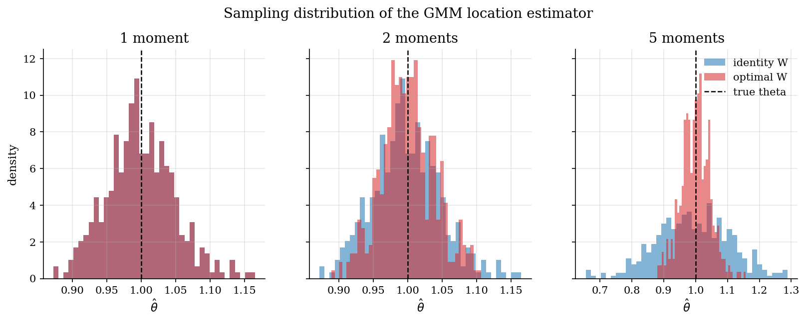
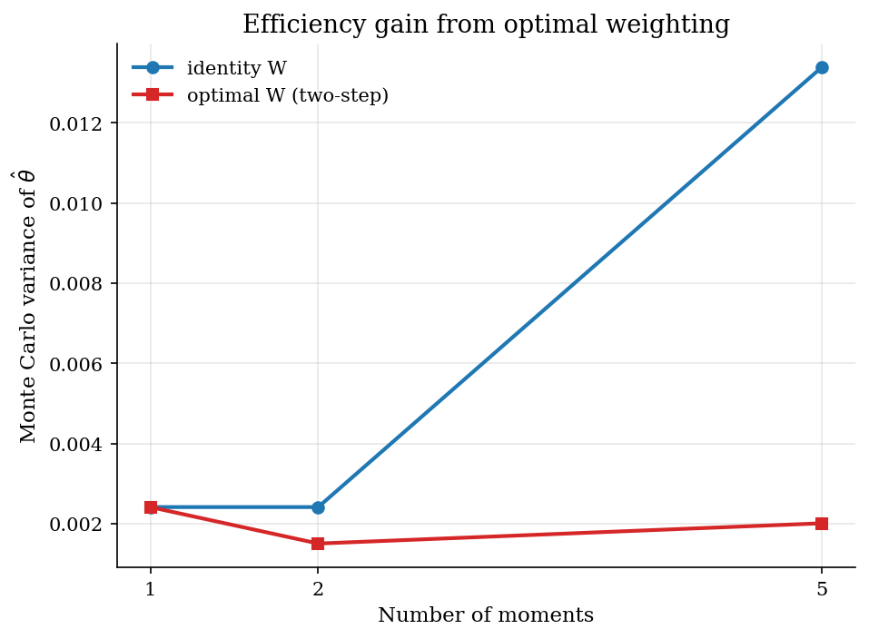
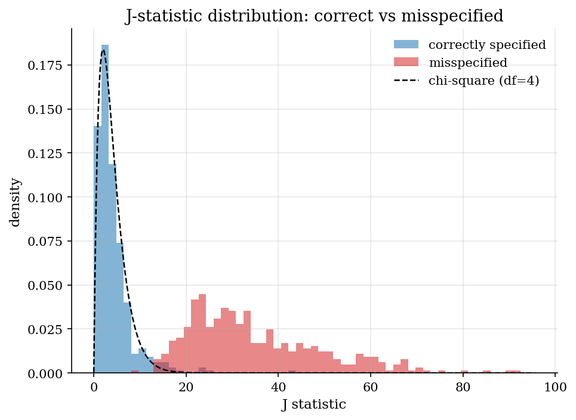

# GMM Foundations: Moment Conditions, Identification, and Optimal Weighting

## Overview

An applied researcher wants to estimate a structural parameter from data. The parameter satisfies a vector of moment conditions in the population. The model implies more moments than parameters, so the estimator must combine them. Two questions then arise. Which moments should the researcher target? How should those moments be weighted in the criterion?

This tutorial answers both questions in the simplest possible setting. The economic object is a single location parameter that shifts a non-symmetric error distribution. The reader sees moment conditions, the GMM criterion, and the asymptotic variance formula on the same page. Hansen's two-step procedure then replaces an arbitrary weighting with the inverse moment covariance, and a Monte Carlo measures the resulting efficiency gain.

The dense tutorials in the catalog assume this material. The Method-of-Simulated-Moments criterion in [`computational-methods/simulation-based-estimation/`](../../computational-methods/simulation-based-estimation/) and the SMM step in [`agent-based-models/brock-hommes-asset-pricing/`](../../agent-based-models/brock-hommes-asset-pricing/) both apply a weighting matrix that this prelim derives. The adversarial estimator in [`structural-econometrics/adversarial-estimation/`](../../structural-econometrics/adversarial-estimation/) is compared to optimally-weighted SMM, with the comparison anchored here.

The reader takes away three things. The moment-condition definition of GMM with a representative example. The asymptotic variance formula and Hansen's two-step weighting derivation. A working intuition for when adding moments helps and when it hurts.

## Preliminary readings

- [`computational-methods/numerical-optimization/`](../../computational-methods/numerical-optimization/)

## Equations

Let $`x_1, \ldots, x_n`$ be an i.i.d. sample from a distribution indexed by an unknown parameter $`\theta_0 \in \Theta \subseteq \mathbb{R}^p`$. A moment condition is a vector-valued function $`g(\theta, x) \in \mathbb{R}^q`$ that the population satisfies at the truth,

```math
\mathbb{E}[g(\theta_0, x)] = 0.
```

The dimension $`q`$ counts moments and the dimension $`p`$ counts parameters. The model is *just-identified* when $`q = p`$ and *over-identified* when $`q > p`$. Over-identification is the case of interest: with more moments than parameters, no $`\theta`$ matches every moment exactly in a finite sample, and the estimator must trade them off.

The sample analogue of the moment condition is the empirical mean

```math
\bar g(\theta) = \frac{1}{n} \sum_{i=1}^{n} g(\theta, x_i).
```

GMM defines the estimator as the minimiser of a weighted quadratic form in $`\bar g`$. Let $`W \in \mathbb{R}^{q \times q}`$ be a symmetric positive-definite weighting matrix. The GMM criterion is

```math
Q(\theta) = \bar g(\theta)^{\top} W \, \bar g(\theta),
\qquad
\hat\theta = \arg\min_{\theta} Q(\theta).
```

Different choices of $`W`$ produce different estimators with the same point of consistency but different finite-sample precision. The job of two-step weighting is to pick the $`W`$ that minimises asymptotic variance.

Under standard regularity conditions the GMM estimator is asymptotically normal,

```math
\sqrt{n} \, (\hat\theta - \theta_0) \to_d \mathcal{N}\!\left(0, \;
(G^{\top} W G)^{-1} G^{\top} W \Omega W G (G^{\top} W G)^{-1}
\right),
```

where $`G = \mathbb{E}[\partial g(\theta_0, x) / \partial \theta^{\top}] \in \mathbb{R}^{q \times p}`$ is the moment Jacobian and $`\Omega = \mathrm{Var}[g(\theta_0, x)] \in \mathbb{R}^{q \times q}`$ is the moment covariance. The Jacobian carries identifying information. The covariance carries informativeness.

The sandwich variance is minimised when $`W \propto \Omega^{-1}`$, and the efficient asymptotic variance collapses to

```math
\mathrm{AVar}(\hat\theta_{\mathrm{eff}}) = (G^{\top} \Omega^{-1} G)^{-1}.
```

Adding a moment that lies in the span of existing moments leaves $`G^{\top} \Omega^{-1} G`$ unchanged after the optimal reweighting and so brings zero efficiency gain. Adding a moment with information orthogonal to existing ones shrinks the asymptotic variance strictly. The Results section exhibits both regimes.

Hansen's two-step procedure makes the optimal weighting feasible without prior knowledge of $`\Omega`$. A first-step estimator $`\hat\theta^{(1)}`$ uses an arbitrary positive-definite weight, typically $`W = I_q`$. The first-step moment vectors then estimate the covariance,

```math
\hat\Omega = \frac{1}{n} \sum_{i=1}^{n}
g(\hat\theta^{(1)}, x_i) \, g(\hat\theta^{(1)}, x_i)^{\top}
\;-\; \bar g(\hat\theta^{(1)}) \, \bar g(\hat\theta^{(1)})^{\top}.
```

The second-step estimator re-minimises the criterion with $`W = \hat\Omega^{-1}`$, and the asymptotic variance attains the efficient bound.

The simulated method of moments replaces population moments by simulated moments when the analytic moment is unavailable. Let $`\tilde m(\theta)`$ denote the moment computed on simulated data at parameter $`\theta`$ and let $`m_{\mathrm{data}}`$ denote the same moment on observed data. The SMM moment vector is

```math
\hat m(\theta) = \tilde m(\theta) - m_{\mathrm{data}},
```

and the SMM estimator minimises $`\hat m(\theta)^{\top} W \hat m(\theta)`$. The weighting matrix that minimises SMM asymptotic variance is the same $`\Omega^{-1}`$ derived above, up to a simulation-noise inflation factor. The dense tutorials [`computational-methods/simulation-based-estimation/`](../../computational-methods/simulation-based-estimation/) and [`agent-based-models/brock-hommes-asset-pricing/`](../../agent-based-models/brock-hommes-asset-pricing/) build on this identity.

The J statistic tests over-identification. At the second-step estimator under optimal weighting,

```math
J = n \cdot Q(\hat\theta) = n \, \bar g(\hat\theta)^{\top} \hat\Omega^{-1} \bar g(\hat\theta).
```

Under correct specification $`J \to_d \chi^2_{q - p}`$. A large $`J`$ relative to the chi-square reference indicates that at least one moment condition is violated in the population, so the model is misspecified rather than estimated poorly.

## Model Setup

The illustration uses a scalar location model

```math
x_i = \theta + \varepsilon_i,
\qquad
\varepsilon_i \sim 0.85 \cdot \mathcal{N}(-0.30, 0.70^2) \;+\; 0.15 \cdot \mathcal{N}(1.70, 1.20^2).
```

The mixture weights and means are pinned so the error has zero population mean. The positive third central moment makes the higher moments informative beyond the first one. The single unknown parameter is $`\theta_0 = 1`$.

| Object | Symbol | Role |
|---|---|---|
| Parameter | $`\theta`$ | location to be estimated [from `computational-methods/simulation-based-estimation/`; `agent-based-models/brock-hommes-asset-pricing/` uses $`\beta`$ as its intensity-of-choice parameter in the same role] |
| Moment vector | $`g(\theta, x)`$ | population-zero residual vector evaluated at sample [Hayashi notation; dense tutorials use $`m`$ for the same object and adopt $`g`$ on cut] |
| Jacobian | $`G`$ | $`\mathbb{E}[\partial g / \partial \theta^{\top}]`$ at the truth [prelim introduces this name] |
| Weighting matrix | $`W`$ | symmetric positive-definite, sets relative moment importance [from `agent-based-models/brock-hommes-asset-pricing/` step 4 of SMM pseudocode, where it is the silent matrix this prelim derives] |
| Moment covariance | $`\Omega`$ | $`\mathrm{Var}[g(\theta_0, x)]`$, the optimal-weighting target [prelim introduces this; dense tutorials adopt the name on cut] |
| SMM moment | $`\hat m(\theta) = \tilde m(\theta) - m_{\mathrm{data}}`$ | simulated-minus-observed summary [from `computational-methods/simulation-based-estimation/` (`m_sim - m_obs`), `agent-based-models/brock-hommes-asset-pricing/` (`m(beta) - m_data`)] |
| J statistic | $`J = n \cdot Q(\hat\theta)`$ | over-identification test under optimal weighting [Hansen (1982)] |
| Sample size | $`n`$ | 500 observations per Monte Carlo replication |
| Monte Carlo replications | $`M`$ | 400 |

The three moment specifications differ in $`q`$:

| Set | Moments | Identification |
|---|---|---|
| 1 moment | mean residual | just-identified ($`q = p = 1`$) |
| 2 moments | mean residual, centred squared residual minus population variance | over-identified by 1 |
| 5 moments | mean, variance, third central moment, 0.05-quantile check, 0.95-quantile check | over-identified by 4 |

The quantile moments use the standard check-function identity $`\mathbb{E}[\mathbf{1}\{\varepsilon \le q_{\alpha}\} - \alpha] = 0`$, evaluated at the population quantiles of the error. The population quantiles are computed once on a four-million-draw reference sample so the same moment set is comparable across Monte Carlo replications.

The misspecified data-generating process adds a state-dependent shift $`0.20 \cdot (\varepsilon_i^2 - \mathrm{Var}(\varepsilon))`$ to the error, which preserves the first moment but violates the second-through-fifth moment conditions. This is the input to the J-statistic exhibit.

## Solution Method

The numerical recipe has three pieces. A Nelder-Mead minimiser searches over the scalar $`\theta`$. The criterion $`Q(\theta) = \bar g(\theta)^{\top} W \bar g(\theta)`$ is recomputed at each candidate $`\theta`$. The weighting matrix $`W`$ is set in two passes for the over-identified specifications.

```text
Algorithm: two-step GMM for the location model
Inputs   sample x, moment function g(theta, x), number of moments q
Output   theta_hat, W_optimal

1. Set W = I_q (identity weighting).
2. Solve theta_hat_1 = argmin_theta gbar(theta)' W gbar(theta) by Nelder-Mead.
3. If q = p (just-identified), return theta_hat_1; the weight is irrelevant.
4. Compute Omega_hat as the sample covariance of g(theta_hat_1, x_i).
5. Set W_optimal to the inverse of (Omega_hat + 1e-10 * I_q).
6. Solve theta_hat = argmin_theta gbar(theta)' W_optimal gbar(theta)
   starting from theta_hat_1.
7. Return theta_hat, W_optimal.
```

The ridge term $`10^{-10} \cdot I_q`$ guards against an ill-conditioned $`\hat\Omega`$ when two moments are nearly collinear in the sample. The economic content sits in steps 4 and 6: step 4 estimates which moments are informative relative to one another, and step 6 reweights so the criterion penalises a mismatch in an informative moment more than a mismatch in a redundant one.

The Monte Carlo wraps the algorithm in an outer loop over $`M = 400`$ samples. The same sequence of seeds produces deterministic Monte Carlo arrays. For each moment set the loop records the identity-weighted and optimally-weighted estimates. For the five-moment specification the loop also records the J statistic, evaluated at the second-step estimator under $`W_{\mathrm{opt}}`$. A second Monte Carlo with a misspecified data-generating process repeats the J-statistic exhibit under the alternative.

## Results

The sampling-distribution figure puts the three moment specifications side by side, with histograms of $`\hat\theta`$ under identity weighting and under optimal weighting. All three histograms centre on the truth, so consistency is not at issue. The dispersion tells the efficiency story.



The one-moment case is just-identified, so identity and optimal weightings coincide. The two-moment case shows a visible narrowing under optimal weighting: variance falls from 0.00242 to 0.00151, roughly a 38% reduction. The five-moment case shows a much sharper contrast in the other direction. Identity weighting on five moments is worse than identity weighting on one moment, because the third moment and the two quantile checks have very different scales and the criterion is dominated by whichever residual happens to be largest in magnitude. Optimal weighting on the same five moments brings the variance back down to 0.00201, comfortably below the five-moment-identity figure but slightly above the two-moment-optimal figure. The lesson is two-sided: adding moments without reweighting hurts, and adding moments with reweighting helps relative to no reweighting at the same moment count, but the finite-sample noise in $`\hat\Omega`$ can prevent the variance from being strictly monotone across moment counts.

The efficiency-gain figure summarises the same numbers as a curve. The horizontal axis is the moment count. The vertical axis is the Monte Carlo variance of $`\hat\theta`$.



The blue curve under identity weighting is non-monotone in the moment count and rises sharply between two and five moments. The red curve under optimal weighting lies strictly below the blue curve at every moment count. The classical asymptotic statement is that optimal weighting is variance-non-increasing in the moment set as long as $`\hat\Omega`$ is consistent. The finite-sample picture is more nuanced. Estimating $`\hat\Omega`$ from the same data introduces noise that grows with $`q`$, and at small samples the red curve can tick up between adjacent moment counts even though it stays below the identity counterpart. The headline result is the gap between the two curves: *at any over-identified moment set, optimally-weighted GMM is more efficient than identity-weighted GMM, and the gap widens with the moment count.* Asymptotic monotonicity within the optimal curve is a stronger claim that needs more data than $`n = 500`$ here.

The J-statistic figure tests the moment conditions themselves. Under correct specification the five-moment $`J`$ should follow a chi-square with $`q - p = 4`$ degrees of freedom. Under misspecification it should drift to the right.



The blue histogram is close to the chi-square reference. The mean of $`J`$ under correct specification is 4.16, close to the chi-square mean of 4. The red histogram under the misspecified data shifts hard to the right, with a mean near 35. A researcher would reject the model at any conventional level. The J statistic is the natural diagnostic to read alongside any two-step GMM estimate. A small criterion at the second step is reassuring; a large $`J`$ relative to $`\chi^2_{q - p}`$ flags a moment condition that the model cannot match in the population.

## Takeaway

GMM is a recipe for converting moment conditions into a point estimate. The two-step procedure makes the optimal weighting matrix feasible without prior knowledge of the moment covariance. Adding moments helps only when each new moment carries identifying information orthogonal to existing ones. The J statistic turns the criterion value into a specification test for over-identified models.

The same machinery extends to settings where moments are not analytic. The simulated method of moments replaces $`\bar g(\theta)`$ with a simulated counterpart and inherits the same optimal-weighting derivation; that extension is the subject of [`computational-methods/simulation-based-estimation/`](../../computational-methods/simulation-based-estimation/) and [`agent-based-models/brock-hommes-asset-pricing/`](../../agent-based-models/brock-hommes-asset-pricing/). Conditional moments built from instruments give the IV-GMM estimator that underpins much of modern empirical micro and macro.

## References

- [Hansen, L. P. (1982). Large Sample Properties of Generalized Method of Moments Estimators. *Econometrica*, 50(4), 1029-1054.](https://doi.org/10.2307/1912775) Equations 3.1-3.7 derive the two-step weighting matrix and the efficiency bound.
- Hayashi, F. (2000). *Econometrics*, Princeton University Press, Chapter 3. The pedagogical anchor; develops GMM as a generalisation of OLS and instrumental variables.
- Hall, A. R. (2005). *Generalized Method of Moments*, Oxford University Press. Book-length treatment of identification, testing, and finite-sample behaviour.
- [McFadden, D. (1989). A Method of Simulated Moments for Estimation of Discrete Response Models Without Numerical Integration. *Econometrica*, 57(5), 995-1026.](https://doi.org/10.2307/1913621) Bridge to SMM.
- [Pakes, A. and Pollard, D. (1989). Simulation and the Asymptotics of Optimization Estimators. *Econometrica*, 57(5), 1027-1057.](https://doi.org/10.2307/1913622) Paired SMM paper with the asymptotic theory.

**See also.** The optimal-weighting matrix glossed over in MSM step 4 of [`computational-methods/simulation-based-estimation/`](../../computational-methods/simulation-based-estimation/) is the $`W = \Omega^{-1}`$ derived here. The silent weighting matrix $`W`$ in step 4 of the SMM pseudocode in [`agent-based-models/brock-hommes-asset-pricing/`](../../agent-based-models/brock-hommes-asset-pricing/) is the same matrix. The optimally-weighted SMM benchmark against which [`structural-econometrics/adversarial-estimation/`](../../structural-econometrics/adversarial-estimation/) compares its discriminator-based estimator uses this two-step procedure.
