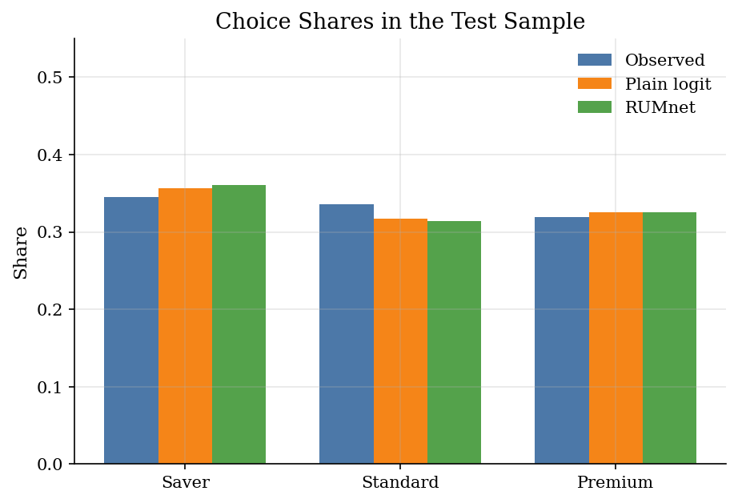
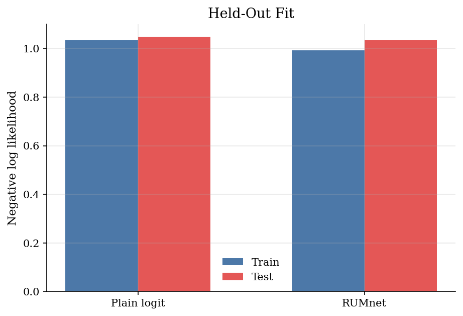
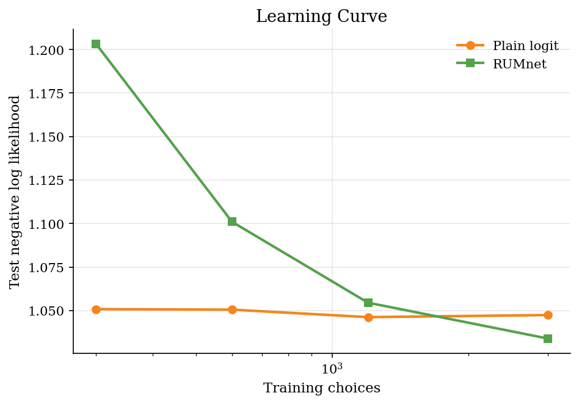
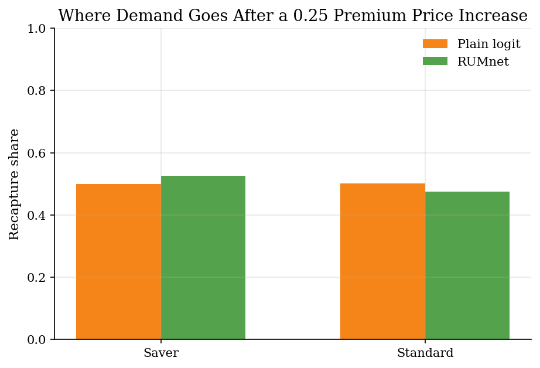
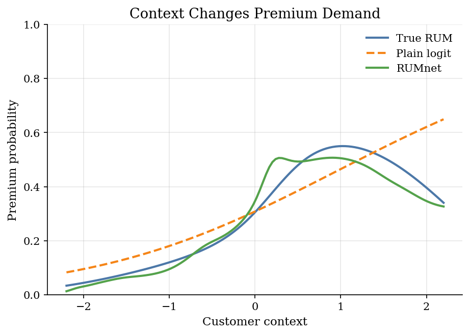

# Choice Prediction with RUMnets

## Overview

A retailer observes which product a customer buys. It also observes the product prices, product qualities, and a customer context variable.

A plain logit puts those objects into a linear utility index. That is easy to estimate, but it can miss nonlinear taste patterns. A flexible neural predictor can fit those patterns, but it may no longer look like an economic choice model.

The tutorial keeps those two concerns separate. Prediction improves only if the model learns the nonlinear utility surface out of sample. Economic discipline comes from keeping probabilities tied to utility maximization over a choice set.

RUMnets keep the random-utility discipline. The utility function is flexible, but choice probabilities still come from maximizing utility with random tastes. This tutorial uses a small synthetic example to show the idea.

## Preliminary readings

- [`choice/logit-discrete-choice/`](../../choice/logit-discrete-choice/)
- [`numerical-methods/simulated-likelihood/`](../../numerical-methods/simulated-likelihood/)
- [`numerical-methods/neural-networks-regression/`](../../numerical-methods/neural-networks-regression/)

## Equations

Consumer $`i`$ chooses one product $`j \in \mathcal{J}`$. Product $`j`$ has price
$`p_{ij}`$ and quality $`q_{ij}`$. The customer has observed context $`z_i`$ and an
unobserved taste draw $`\eta_i`$.

The baseline is a plain logit with linear utility in a small feature vector

```math
 x^{L}_{ij}=(p_{ij}, q_{ij}, p_{ij}z_i, q_{ij}z_i). 
```

With product intercepts $`a^L_j`$ and slopes $`b^L`$, baseline utility is

```math
 v^L_{ij}=a^L_j+x^{L}_{ij} b^L. 
```

The baseline choice probability is

```math
 P^L_{ij}=\frac{\exp(v^L_{ij})}{\sum_{k\in\mathcal{J}}\exp(v^L_{ik})}. 
```

The logit estimate minimizes the average negative log likelihood

```math
 Q_L(a^L,b^L)=\frac{-1}{N}\sum_{i=1}^{N}\log P^L_{i y_i}. 
```

Here $`N`$ is the number of choice occasions and $`y_i \in \mathcal{J}`$ is the product chosen by consumer $`i`$.

The data-generating model is still random utility, but the systematic utility is
not linear. The simulation uses

```math
 U_{ij}=v^0_{ij}+\varepsilon_{ij}, \quad \varepsilon_{ij}\sim \mathrm{Type\ I\ EV}. 
```

One convenient way to write the nonlinear part is

```math
 v^0_{ij}=\delta_j+\alpha_i p_{ij}+\beta_i q_{ij}+m_j(z_i)+\ell_j(q_{ij},z_i)+\sigma_j(z_i)+r_{ij}(\eta_i). 
```

Here $`\delta_j`$ is the product-specific intercept in the systematic utility.

The random price and quality tastes are

```math
 \alpha_i=-(1.05+0.22\tanh(z_i)+0.12\eta_i+0.08\eta_i\tanh(z_i)). 
```

```math
 \beta_i=0.78+0.30\tanh(1.10z_i+0.45\eta_i). 
```

The context term is product-specific:

```math
 m(z_i)=(-0.35\tanh(1.20z_i)+0.10(z_i^2-1), 0.10\tanh(1.20z_i)-0.08(z_i^2-1), 0.55\tanh(1.20z_i)-0.28(z_i^2-1)). 
```

The quality-context complementarity is

```math
 \ell_j(q_{ij},z_i)=\kappa_j\tanh(1.15(q_{ij}-1.25)z_i), \quad \kappa=(-0.15,0.20,0.62). 
```

The extra nonlinear product shifter is

```math
 \sigma_j(z_i)=(0,0.12\tanh(1.80z_i)^2,0.35\tanh(1.50z_i)^2). 
```

The latent-taste interaction is

```math
 r_{ij}(\eta_i)=0.18\eta_i\tanh(q_{ij}z_i). 
```

This is the misspecification: plain logit can use $`p_{ij}z_i`$ and $`q_{ij}z_i`$,
but it cannot represent the saturation and hump shapes exactly.

## Worked Numerical Example

Two products (Saver and Premium) with prices $`(p_1, p_2) = (1.0, 2.0)`$, qualities $`(q_1, q_2) = (1.0, 2.0)`$, customer context $`z = 0.5`$, and a single latent draw $`\eta = 0`$ to isolate the neural surface. Linear-utility weights are $`a_1 = 0`$, $`a_2 = 0.2`$, $`b_p = -0.5`$, $`b_q = 0.4`$, and $`b_{pz} = b_{qz} = 0`$. The hidden layer has one unit with bias $`d = 0`$ and weights $`W = 0`$ everywhere except on the $`q_{ij} z_i`$ feature, where $`W_{qz} = 1.0`$; the output weight is $`c = 0.3`$.

Form the linear part of utility for each product:

```math
v^{\mathrm{lin}}_{1} = a_1 + b_p p_1 + b_q q_1 = 0 + (-0.5)(1.0) + (0.4)(1.0) = -0.1.
```

```math
v^{\mathrm{lin}}_{2} = a_2 + b_p p_2 + b_q q_2 = 0.2 + (-0.5)(2.0) + (0.4)(2.0) = 0.0.
```

Evaluate the single hidden unit. The non-zero feature is $`q_{ij} z`$, so the pre-activation is $`W_{qz} \, q_{ij} z`$:

```math
h_1 = \tanh(1.0 \cdot 1.0 \cdot 0.5) = \tanh(0.5) = 0.4621.
```

```math
h_2 = \tanh(1.0 \cdot 2.0 \cdot 0.5) = \tanh(1.0) = 0.7616.
```

Combine the linear part with the neural correction $`c \cdot h_j`$:

```math
v_1 = -0.1 + (0.3)(0.4621) = -0.1 + 0.1386 = 0.0386.
```

```math
v_2 = 0.0 + (0.3)(0.7616) = 0.0 + 0.2285 = 0.2285.
```

Apply the softmax: $`e^{0.0386} = 1.0394`$ and $`e^{0.2285} = 1.2567`$, with sum $`2.2961`$. The RUMnet choice probabilities are

```math
P_1 = \frac{1.0394}{2.2961} = 0.4527, \qquad P_2 = \frac{1.2567}{2.2961} = \boxed{0.5473}.
```

The linear part alone gives $`v_1 - v_2 = -0.1`$, which would put $`P_2`$ near $`0.525`$. The tanh hidden unit, fed by the same $`q_{ij} z`$ feature the linear logit already uses, bends the utility surface so that the higher-quality Premium product gains an extra $`0.0899`$ in utility relative to Saver. Random-utility discipline is preserved: the choice probability is still a softmax over a deterministic index plus Type I extreme value noise.

The RUMnet keeps the same random-utility structure but replaces the linear
index with a neural utility. For fixed latent draw $`\eta_r`$, define

```math
 \tilde x_{ijr}=(p_{ij},q_{ij},z_i,p_{ij}z_i,q_{ij}z_i,z_i^2,q_{ij}z_i^2,\eta_r,p_{ij}\eta_r,q_{ij}\eta_r,z_i\eta_r,q_{ij}z_i\eta_r). 
```

The one-hidden-layer utility is

```math
 h_{ijr}(\theta)=\tanh(W^{\top}\tilde x_{ijr}+d). 
```

```math
 v_{\theta}(i,j,r)=a_j+b_p p_{ij}+b_q q_{ij}+b_{pz}p_{ij}z_i+b_{qz}q_{ij}z_i+c^{\top}h_{ijr}(\theta). 
```

Conditional on draw $`r`$, the RUM probability is

```math
 P_{ijr}(\theta)=\frac{\exp(v_{\theta}(i,j,r))}{\sum_{k\in\mathcal{J}}\exp(v_{\theta}(i,k,r))}. 
```

The simulated RUMnet probability averages over the fixed draws:

```math
 \widehat P_{ij}(\theta)=\frac{1}{R}\sum_{r=1}^{R}P_{ijr}(\theta). 
```

The estimated RUMnet minimizes the penalized simulated likelihood

```math
 Q_R(\theta)=\frac{-1}{N}\sum_{i=1}^{N}\log \max(\widehat P_{i y_i}(\theta),10^{-12})+\lambda\frac{\theta_{\mathrm{net}}^{\top}\theta_{\mathrm{net}}}{d_{\mathrm{net}}}. 
```

Here $`\theta_{\mathrm{net}}`$ is the subset of neural-layer weights in $`\theta`$ and $`d_{\mathrm{net}}`$ is the count of those weights.

## Model Setup

| Object | Value | Role |
|---|---:|---|
| Products | 3 | Saver, Standard, and Premium alternatives |
| Training choices | 3,000 | Used for estimation |
| Test choices | 1,500 | Held out for evaluation |
| Product variables | price, quality | Observed attributes in each choice set |
| Customer context | one scalar $`z_i`$ | Shifts the value of product quality |
| Latent taste draws | 9 | Fixed normal quantiles in the RUMnet likelihood |
| Hidden units | 6 | Size of the neural utility layer |
| RUMnet penalty $`\lambda`$ | 0.012 | Shrinks the neural weights in small samples |
| Learning-curve sizes | 300, 600, 1,200, 3,000 | Training samples used in the learning curve |
| Price shock | +0.25 on Premium | Used to compare substitution predictions |

## Solution Method

The estimation uses fixed common latent draws so the simulated likelihood is a smooth function of $`\theta`$; the smoothness argument is in [`numerical-methods/simulated-likelihood/`](../../numerical-methods/simulated-likelihood/).

The baseline and the RUMnet answer the same choice question. The baseline asks
whether a linear utility index is enough. The RUMnet keeps the same price,
quality, context, and latent-taste inputs, but lets a small neural layer bend
the utility surface before the softmax.

The first step estimates the plain logit. With
$`\theta_L=(a^L_2,a^L_3,b^L)`$ and $`a^L_1=0`$ for normalization, the optimizer
solves

```math
 \hat\theta_L=\arg\min_{\theta_L} Q_L(\theta_L). 
```

The RUMnet starts near that estimate:

```math
 a_j^{(0)}=\hat a^L_j, \quad (b_p^{(0)},b_q^{(0)},b_{pz}^{(0)},b_{qz}^{(0)})=\hat b^L. 
```

The neural weights and biases are initialised per the generic recipe in [`numerical-methods/neural-networks-regression/`](../../numerical-methods/neural-networks-regression/). With small weights at initialisation, the first RUMnet probabilities are close to the fitted logit probabilities. The neural part then bends the utility surface as training proceeds.

For any trial $`\theta`$, the code forms $`\tilde x_{ijr}`$ for all consumers,
products, and latent draws. It then evaluates $`h_{ijr}(\theta)`$,
$`v_\theta(i,j,r)`$, $`P_{ijr}(\theta)`$, and finally $`\widehat P_{ij}(\theta)`$.
The same fixed draws are used for every trial $`\theta`$.

After estimation, the Premium price counterfactual recomputes fitted shares
after adding $`\Delta p`$ to Premium. If $`s_j`$ is the baseline fitted share and
$`s_j^{+}`$ is the fitted share after the price increase, the recapture rate for
receiving product $`n`$ is

```math
 D_{n,\mathrm{Premium}}=\frac{s_n^{+}-s_n}{s_{\mathrm{Premium}}-s_{\mathrm{Premium}}^{+}}. 
```

```text
Algorithm: RUMnet simulated likelihood and price-shock recapture

Input:
    D_N = {(y_i, p_i, q_i, z_i)}[i=1]^N
    E_R = {eta_r}[r=1]^R
    price shock Delta p on product j = Premium

Output:
    theta_R_hat
    P_hat_ij(theta_R_hat) for each test choice occasion
    fitted shares s_j and shocked shares s_j^+
    recapture rates D[n,Premium]

1. Build the linear-logit features:
       x^L_ij = (p_ij, q_ij, p_ij z_i, q_ij z_i).

2. Estimate the baseline logit:
       P^L_ij(theta_L) = exp(a^L_j + x^L_ij b^L)
                          / sum_k exp(a^L_k + x^L_ik b^L),
       Q_L(theta_L) = (-1 / N) sum_i log P^L[i,y_i](theta_L),
       theta_L_hat = arg min[theta_L] Q_L(theta_L).

3. Initialize the RUMnet:
       a_j^(0) = a^L_j_hat,
       (b_p^(0), b_q^(0), b_pz^(0), b_qz^(0)) = b^L_hat,
       W^(0), c^(0) = small random values, d^(0) = 0.

4. For a trial theta and every (i,j,r), build:
       x_tilde_ijr = (p_ij, q_ij, z_i, p_ij z_i, q_ij z_i,
                      z_i^2, q_ij z_i^2, eta_r, p_ij eta_r,
                      q_ij eta_r, z_i eta_r, q_ij z_i eta_r),
       h_ijr(theta) = tanh(W' x_tilde_ijr + d),
       v_theta(i,j,r) = a_j + b_p p_ij + b_q q_ij
                        + b_pz p_ij z_i + b_qz q_ij z_i
                        + c' h_ijr(theta).

5. Convert utilities into RUM probabilities:
       P_ijr(theta) = exp(v_theta(i,j,r))
                      / sum_k exp(v_theta(i,k,r)),
       P_hat_ij(theta) = (1 / R) sum_r P_ijr(theta).

6. Estimate the RUMnet:
       Q_R(theta) = (-1 / N) sum_i log max(P_hat[i,y_i](theta), 1e-12)
                    + lambda ||theta_net||^2 / d_net,
       theta_R_hat = arg min_theta Q_R(theta).

7. Evaluate the Premium price shock on the test sample:
       s_j = (1 / N_test) sum_i P_hat_ij(theta_R_hat),
       s_j^+ = (1 / N_test) sum_i P_hat_ij^+(theta_R_hat),
       D[n,Premium] = (s_n^+ - s_n) / (s_Premium - s_Premium^+).
```

The learning curve repeats this estimation on growing prefixes of the same
training sample. This shows the tradeoff: the RUMnet has more approximation
power, but it needs enough data for that flexibility to help out of sample.

## Results

Both models match average product shares closely. Share fit is the easy diagnostic. The harder question is whether the model captures held-out choice probabilities and substitution after a price change.



The RUMnet improves the held-out likelihood in this synthetic design. It has enough flexibility to pick up the nonlinear context pattern, but it still scores choices through random-utility probabilities.



The learning curve shows why the flexible model is not free. With little data, the RUMnet overfits the nonlinear utility surface. With the full sample, the nonlinear structure is learned well enough to beat the misspecified logit on the test set.



A Premium price increase moves demand to the other products. The two models need not allocate that lost demand in the same way because they imply different utility distances between products and consumers.



The context curve shows the main difference. The true data-generating process makes Premium demand change nonlinearly with customer context. The small RUMnet tracks more of that curve than the linear logit baseline.



The likelihood table separates in-sample fit from held-out prediction.

**Fit Comparison**

| Model       |   Train NLL |   Test NLL |   Test accuracy |
|:------------|------------:|-----------:|----------------:|
| Plain logit |      1.0334 |     1.0474 |           0.452 |
| RUMnet      |      0.9917 |     1.0339 |           0.464 |

The share table checks that the fitted probabilities aggregate to observed product shares.

**Test Share Fit**

| Product   |   Observed share |   Plain logit |   RUMnet |
|:----------|-----------------:|--------------:|---------:|
| Saver     |           0.3447 |        0.3568 |   0.3605 |
| Standard  |           0.336  |        0.3171 |   0.3138 |
| Premium   |           0.3193 |        0.326  |   0.3257 |

The recapture table reports where the lost Premium demand goes after the price increase.

**Premium Price Shock**

| Model       | Product   |   Base share |   After shock |   Recapture |
|:------------|:----------|-------------:|--------------:|------------:|
| Plain logit | Saver     |       0.3568 |        0.3813 |      0.4989 |
| Plain logit | Standard  |       0.3171 |        0.3417 |      0.5011 |
| Plain logit | Premium   |       0.326  |        0.277  |     -1      |
| RUMnet      | Saver     |       0.3605 |        0.3896 |      0.5251 |
| RUMnet      | Standard  |       0.3138 |        0.3401 |      0.4749 |
| RUMnet      | Premium   |       0.3257 |        0.2704 |     -1      |

The learning-curve table reports held-out fit after estimating both models on growing samples.

**Learning Curve**

|   Training choices | Model       |   Test NLL |   Test accuracy |
|-------------------:|:------------|-----------:|----------------:|
|                300 | Plain logit |     1.0508 |          0.456  |
|                300 | RUMnet      |     1.2033 |          0.41   |
|                600 | Plain logit |     1.0505 |          0.456  |
|                600 | RUMnet      |     1.101  |          0.4367 |
|               1200 | Plain logit |     1.0462 |          0.4527 |
|               1200 | RUMnet      |     1.0545 |          0.4513 |
|               3000 | Plain logit |     1.0474 |          0.452  |
|               3000 | RUMnet      |     1.0339 |          0.464  |

## Takeaway

RUMnets are useful when the utility index needs more flexibility than a linear logit. The neural part changes the shape of utility, but the probability formula still comes from random utility maximization. Fixed latent draws make the estimator a standard sample-average likelihood.

## References

- [Aouad, A. and Desir, A. (2023). Representing Random Utility Choice Models with Neural Networks. arXiv:2207.12877.](https://arxiv.org/abs/2207.12877)
- [Train, K. (2009). *Discrete Choice Methods with Simulation* (2nd ed.). Cambridge University Press.](https://eml.berkeley.edu/books/choice2.html)
- [McFadden, D. (1974). Conditional Logit Analysis of Qualitative Choice Behavior. In *Frontiers in Econometrics*. Academic Press.](https://eml.berkeley.edu/reprints/mcfadden/zarembka.pdf)
