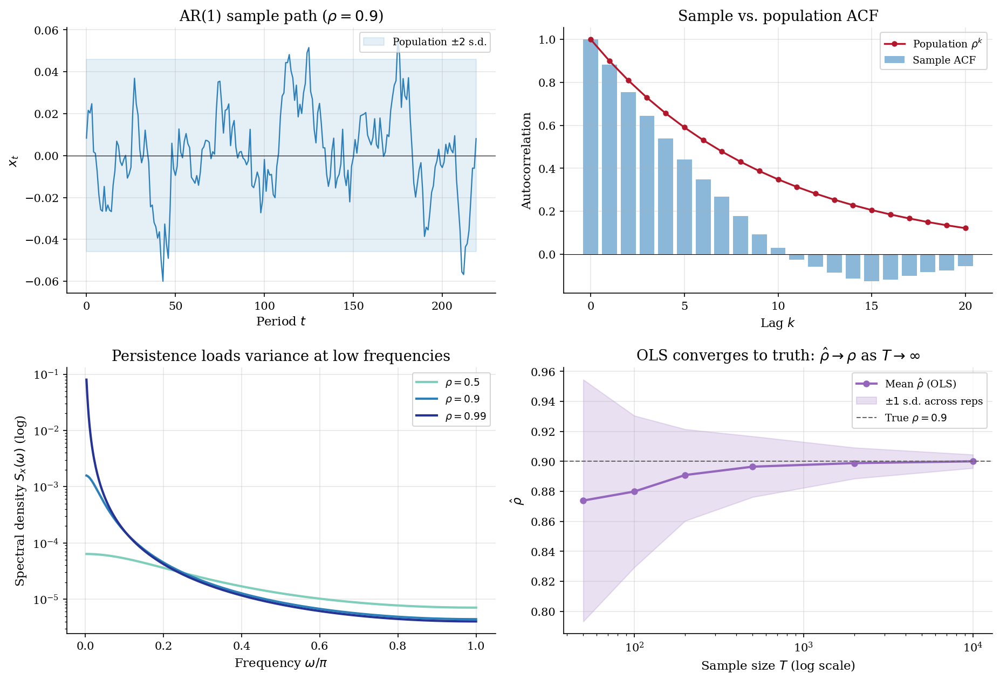
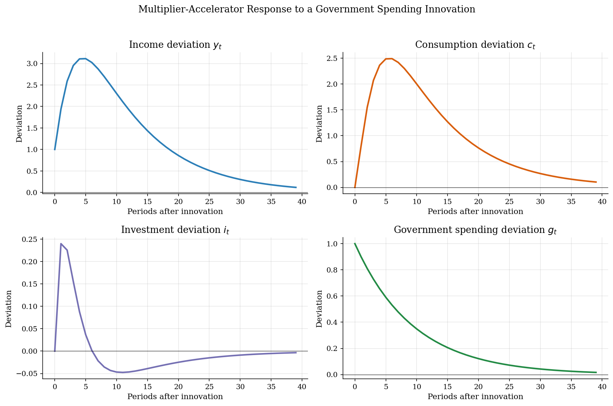

# Autoregressive Processes: Stationarity, Estimation, and Persistence

## Overview

Serial dependence is the rule in macroeconomic and financial data. Box and Jenkins (1970) showed that a small number of autoregressive coefficients can capture the memory of most economic time series. Hamilton (1994) made AR processes the entry point to time-series analysis because they parametrize exactly how much of today's state survives to tomorrow.

The object is an *autoregressive process of order p*. The AR(p) nests two questions: what persistence structure is consistent with a stationary distribution, and how precisely can OLS recover that structure from finite samples.

The computation simulates sample paths, applies OLS to estimate AR coefficients, traces autocorrelation and spectral density analytically and from samples, and shows how estimation error shrinks as the sample grows. A multiplier-accelerator economy illustrates how AR(1) persistence maps into macro dynamics.

## Read before

- [Discretizing Persistent Shocks](../../dynamic-programming/shock-discretization/README.md)

## Equations

Let $`y_1, \ldots, y_T`$ be a covariance-stationary time series with zero mean. The autoregressive coefficients $`\phi_1, \phi_2, \ldots, \phi_p`$ express each observation as a linear function of its $`p`$ lags plus an unpredictable innovation. The *AR(p) law of motion* is

```math
y_t = \phi_1 y_{t-1} + \phi_2 y_{t-2} + \cdots + \phi_p y_{t-p} + \varepsilon_t,
\qquad \varepsilon_t \sim \mathcal{N}(0, \sigma^2).
```

For the AR(1) special case the single coefficient $`\phi_1 = \rho`$ carries the full persistence structure. Covariance stationarity requires $`|\rho| < 1`$; without that bound the variance grows without limit and the process never returns to a fixed distribution.

The Yule-Walker equations link the autocovariance function $`\gamma_k = \mathrm{Cov}(y_t, y_{t-k})`$ to the AR coefficients. For an AR(1):

```math
\gamma_k = \rho^k \, \gamma_0, \qquad \gamma_0 = \frac{\sigma^2}{1 - \rho^2}.
```

The autocorrelation function is $`\mathrm{Corr}(y_t, y_{t-k}) = \rho^k`$: it decays geometrically with lag $`k`$. The partial autocorrelation function (PACF) cuts to zero after lag $`p`$, so a sharp PACF cutoff identifies the AR order.

The spectral density of an AR(1) concentrates variance at low frequencies when $`\rho`$ is large. It is

```math
S_y(\omega) = \frac{\sigma^2}{2\pi \,|1 - \rho\,e^{-i\omega}|^2}, \qquad \omega \in [0, \pi].
```

As $`\rho \to 1`$ the peak at $`\omega = 0`$ grows without bound, which is the spectral fingerprint of near-unit-root persistence.

In the multiplier-accelerator application, income $`y_t`$ is driven by government spending $`g_t`$ following an AR(1) with persistence $`\rho_g`$. Deviations from steady state satisfy

```math
y_t = \beta(1+\alpha)y_{t-1} - \alpha\beta\, y_{t-2} + g_t,
\qquad g_t = \rho_g g_{t-1} + \eta_t,
```

where $`\beta`$ is the marginal propensity to consume and $`\alpha`$ is the accelerator coefficient. The characteristic roots of the income equation determine whether the endogenous propagation damps or amplifies the AR(1) forcing.

## Worked Numerical Example

Four steps of an AR(1) recursion by hand. Take $`\rho = 0.7`$, $`\sigma = 1`$, and starting value $`y_0 = 0`$. The *AR(1) recursion* feeds each realization into the next period.

Draw innovations $`\varepsilon_1 = 1.0`$, $`\varepsilon_2 = -0.5`$, $`\varepsilon_3 = 0.8`$, $`\varepsilon_4 = 0.2`$.

```math
y_1 = (0.7)(0) + 1.0 = 1.000,
```

```math
y_2 = (0.7)(1.000) + (-0.5) = 0.200,
```

```math
y_3 = (0.7)(0.200) + 0.8 = 0.940,
```

```math
y_4 = (0.7)(0.940) + 0.2 = \boxed{0.858}.
```

The series does not move one-for-one with each shock. A negative innovation at $`t=2`$ partially cancels the positive level from $`t=1`$; a positive shock at $`t=3`$ recovers it. With $`\rho = 0.7`$ the half-life is $`\log(0.5)/\log(0.7) \approx 1.9`$ periods: shocks decay much faster than at $`\rho = 0.9`$ (half-life 6.6 periods).

## Model Setup

| Parameter | Value | Parameter | Value |
|---|---:|---|---:|
| AR(1) persistence $`\rho`$ | 0.90 | Innovation s.d. $`\sigma`$ | 0.01 |
| Simulated periods $`T`$ | 220 | Burn-in | 200 |
| IRF horizon | 40 | Max ACF lag | 20 |
| MPC $`\beta`$ (multiplier) | 0.80 | Accelerator $`\alpha`$ | 0.30 |
| Gov. spending persistence $`\rho_g`$ | 0.90 | Steady-state $`\bar G`$ | 1.00 |
| OLS sample sizes (convergence) | 50 – 10 000 | Repetitions per $`T`$ | 500 |

## Solution Method

AR(1) population moments are closed form; no iteration is needed. Estimation uses OLS on the lagged design matrix, which is equivalent to Yule-Walker for an AR(1).

```
        data  y_1, ..., y_T
                  |
                  v
   [ OLS / Yule-Walker ]
                  |
                  v
       φ̂_1, ..., φ̂_p,  σ̂²
```

```python
# OLS estimation of an AR(p) on a mean-zero series.
def estimate_ar_ols(y: np.ndarray, p: int) -> tuple[np.ndarray, float]:
    T = len(y)
    # Build the (T-p) x p design matrix of lagged values.
    X = np.column_stack([y[p - 1 - k : T - 1 - k] for k in range(p)])
    y_dep = y[p:]
    # OLS: phi_hat = (X'X)^{-1} X'y
    phi_hat = np.linalg.lstsq(X, y_dep, rcond=None)[0]
    residuals = y_dep - X @ phi_hat
    sigma_hat2 = float(np.dot(residuals, residuals) / (T - p))
    return phi_hat, sigma_hat2
```

OLS is consistent: $`\hat\phi \to \phi`$ as $`T \to \infty`$ under stationarity. The convergence panel in Results plots $`\hat\rho`$ against $`T`$ and shows the $`1/\sqrt{T}`$ shrinkage of estimation error around the truth $`\rho = 0.9`$.

## Results

The simulated AR(1) path stays within its analytic two-standard-deviation band. The sample ACF tracks the population decay $`\rho^k`$ closely; the spectral density concentrates power at low frequencies as persistence rises.



Each income line rises then falls back in the multiplier-accelerator response. The accelerator amplifies the initial impact and stretches the decay relative to the bare AR(1) forcing.



### AR(1) Analytical Benchmarks

| Object | $`\rho=0.5`$ | $`\rho=0.9`$ | $`\rho=0.99`$ |
|:---|---:|---:|---:|
| Unconditional variance | 0.000133 | 0.000526 | 0.005025 |
| Half-life (periods) | 1.0 | 6.6 | 69.0 |
| First-order autocorrelation | 0.50 | 0.90 | 0.99 |
| Spectral peak frequency | 0 | 0 | 0 |

## Takeaway

*Persistence* is the central parameter of an AR process. It determines variance inflation, the speed of mean reversion, and how long a shock shapes forecasts. The stationarity condition $`|\rho| < 1`$ is not a technical nuisance; it is the assumption that allows moments to exist and OLS to converge. Box and Jenkins (1970) built an identification toolkit around ACF and PACF shapes because those shapes are the observational fingerprints of the AR order and persistence. Hamilton (1994) placed AR processes at the foundation of time-series econometrics because they are the parsimonious workhorse for serially dependent data. Every structural model that feeds an AR(1) income process into a Bellman equation inherits the persistence properties derived here.

## See also

- [Reduced-Form VARs](../reduced-form-var/README.md)
- [Minnesota-Prior SVARs](../minnesota-svar/README.md)
- [Aiyagari Saving and Capital-Market Clearing](../../dynamic-programming/aiyagari/README.md)

## References

- Box, G. E. P. and Jenkins, G. M. (1970). *Time Series Analysis: Forecasting and Control*. Holden-Day.
- Hamilton, J. D. (1994). *Time Series Analysis*. Princeton University Press, Ch. 3.
- Samuelson, P. A. (1939). Interactions between the Multiplier Analysis and the Principle of Acceleration. *Review of Economics and Statistics*, 21(2), 75-78.
