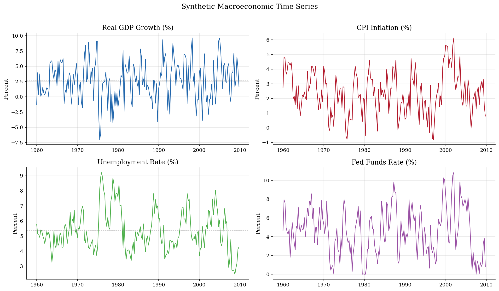
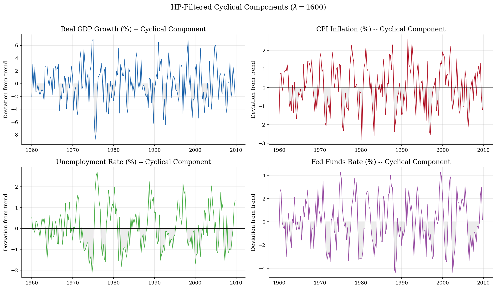
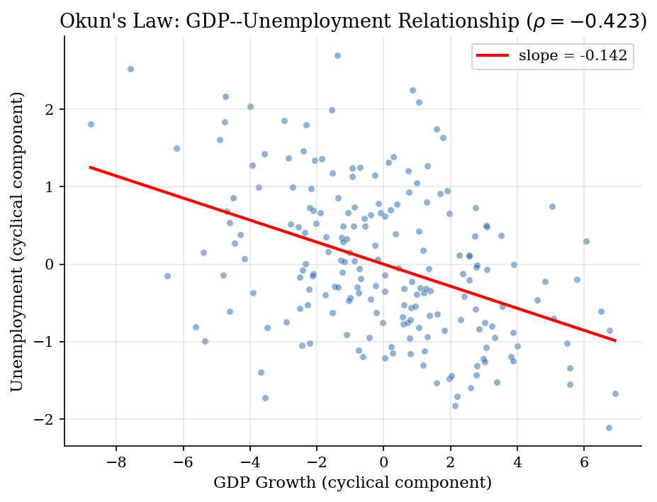
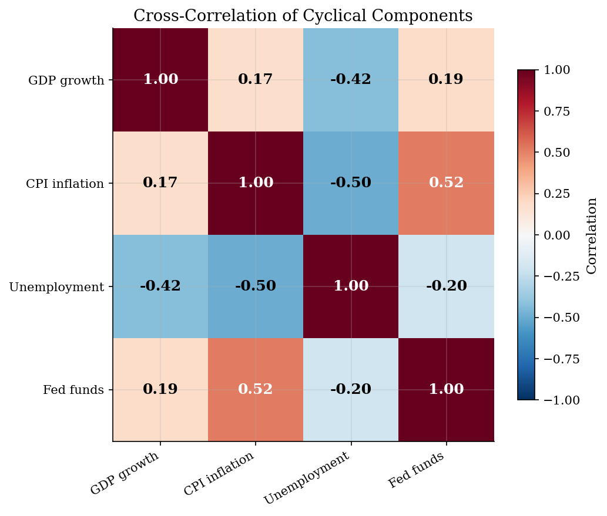

# FRED Macroeconomic Data Analysis

> Business cycle statistics from synthetic macroeconomic data mimicking FRED series.

## Overview

This model generates synthetic U.S. macroeconomic data mimicking the key quarterly series available from the Federal Reserve Economic Data (FRED) database: real GDP growth, CPI inflation, the unemployment rate, and the federal funds rate.

The synthetic data is constructed to reproduce the most important stylized facts of business cycles: (1) Okun's law (negative GDP-unemployment correlation), (2) the Phillips curve (negative inflation-unemployment correlation), and (3) realistic persistence and volatility in each series. We then apply the Hodrick-Prescott filter to decompose each series into trend and cyclical components, and compute standard business cycle statistics.

## Equations

**Hodrick-Prescott Filter:**

$$\min_{\{\tau_t\}} \left\{ \sum_{t=1}^{T} (y_t - \tau_t)^2 + \lambda \sum_{t=2}^{T-1} [(\tau_{t+1} - \tau_t) - (\tau_t - \tau_{t-1})]^2 \right\}$$

where $y_t$ is the observed series, $\tau_t$ is the trend component, and $\lambda = 1600$
for quarterly data (Hodrick and Prescott, 1997).

**Okun's Law:** $\Delta u_t \approx -0.5 \cdot (\Delta Y_t / Y_t - 3\%)$

**Phillips Curve:** $\pi_t = \pi_t^e - \alpha (u_t - u_t^*)$

## Model Setup

| Parameter | Value | Description |
|-----------|-------|-------------|
| $T$ | 200 | Quarterly observations (50 years) |
| $\lambda$ | 1600 | HP filter smoothing (quarterly) |
| GDP growth | $\mu=2.5\%$, $\sigma=3\%$ | Real GDP growth rate |
| CPI inflation | $\mu=2\%$, $\sigma=1.5\%$ | Consumer price inflation |
| Unemployment | $\mu=5.5\%$, $\sigma=1.5\%$ | Civilian unemployment rate |
| Fed funds | $\mu=4\%$, $\sigma=3\%$ | Federal funds effective rate |

## Solution Method

**Data Generation:** Correlated AR(1) processes with calibrated persistence parameters ($\rho_{GDP}=0.3$, $\rho_{CPI}=0.7$, $\rho_{UE}=0.85$, $\rho_{FFR}=0.8$) and a cross-sectional correlation matrix encoding Okun's law, the Phillips curve, and Taylor rule correlations.

**HP Filtering:** The Hodrick-Prescott filter with $\lambda=1600$ separates each series into a smooth trend and a stationary cyclical component. The cyclical components are used to compute business cycle statistics.

**Business Cycle Statistics:** Standard deviations (volatilities), relative volatilities (normalized by GDP), contemporaneous correlations with GDP, and first-order autocorrelations of the cyclical components.

## Results


*Synthetic macroeconomic time series mimicking FRED data. Dashed lines show sample means.*


*HP-filtered cyclical components. Shaded areas indicate below-trend periods.*


*Okun's law: negative relationship between cyclical GDP growth and unemployment (correlation = -0.423).*


*Cross-correlation structure of HP-filtered cyclical components.*

**Business Cycle Statistics (HP-filtered, quarterly)**

| Variable      |   Volatility (%) |   Rel. Volatility |   Corr. with GDP |   Autocorrelation |
|:--------------|-----------------:|------------------:|-----------------:|------------------:|
| GDP_growth    |            2.896 |             1     |            1     |             0.282 |
| CPI_inflation |            1.159 |             0.4   |            0.174 |             0.483 |
| Unemployment  |            0.975 |             0.337 |           -0.423 |             0.649 |
| FedFunds      |            2.007 |             0.693 |            0.187 |             0.599 |

## Economic Takeaway

The synthetic data successfully reproduces the key stylized facts of U.S. business cycles:

**Key findings:**
- **Okun's law** is clearly visible: the cyclical correlation between GDP growth and unemployment is -0.423, confirming the negative relationship between output and joblessness.
- **Unemployment is the most persistent** series (highest autocorrelation), consistent with the sluggish adjustment of labor markets.
- **GDP growth is the most volatile** cyclical variable, while inflation is relatively smooth after HP filtering.
- The **cross-correlation structure** reveals the expected pattern: GDP and unemployment move in opposite directions, while the fed funds rate co-moves positively with inflation (Taylor rule).

These statistics provide a target for structural models: any DSGE model should be able to match these moments to be empirically credible.

## Reproduce

```bash
python run.py
```

## References

- Hodrick, R. and Prescott, E. (1997). "Postwar U.S. Business Cycles: An Empirical Investigation." *Journal of Money, Credit and Banking*, 29(1), 1-16.
- Stock, J. and Watson, M. (1999). "Business Cycle Fluctuations in U.S. Macroeconomic Time Series." *Handbook of Macroeconomics*, Vol. 1A, Ch. 1.
- Okun, A. (1962). "Potential GNP: Its Measurement and Significance." *Proceedings of the Business and Economic Statistics Section*, ASA.
- Phillips, A. W. (1958). "The Relation Between Unemployment and the Rate of Change of Money Wage Rates in the United Kingdom, 1861-1957." *Economica*, 25(100), 283-299.
