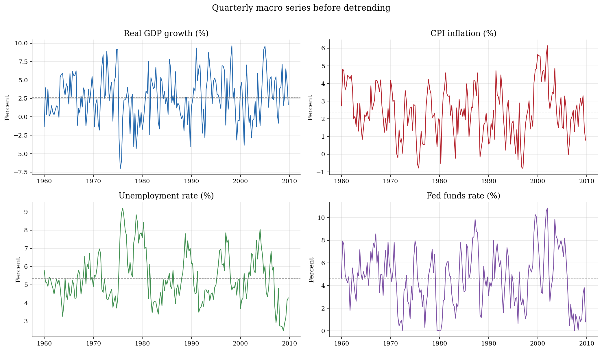
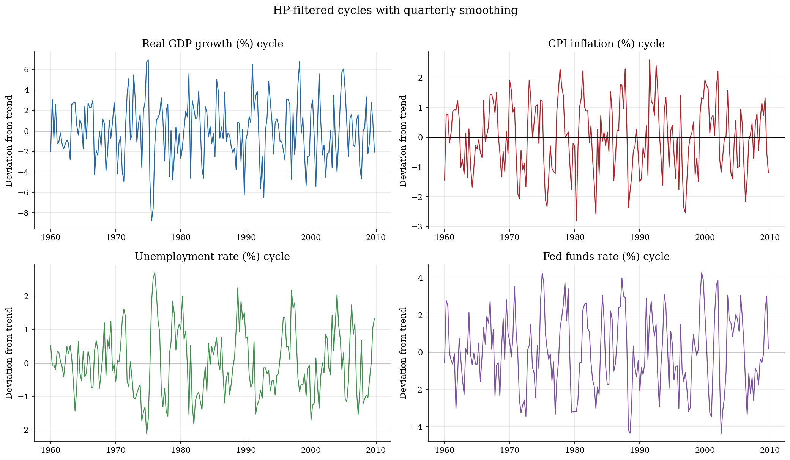
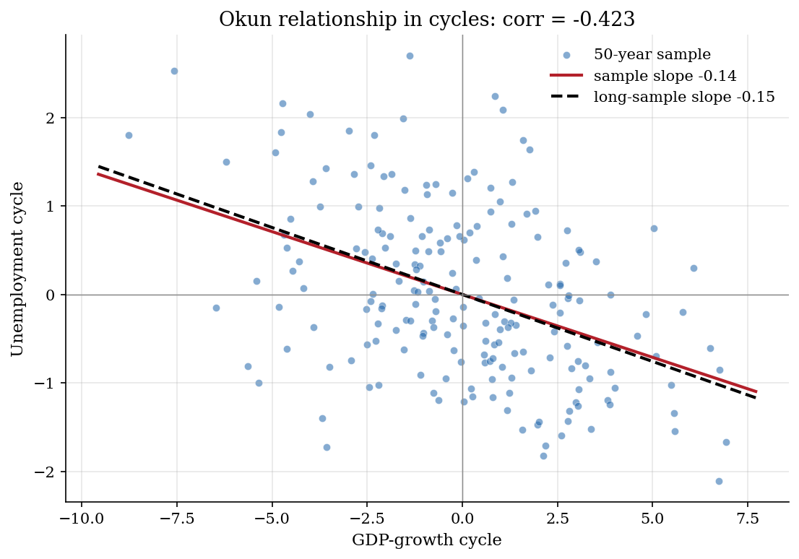
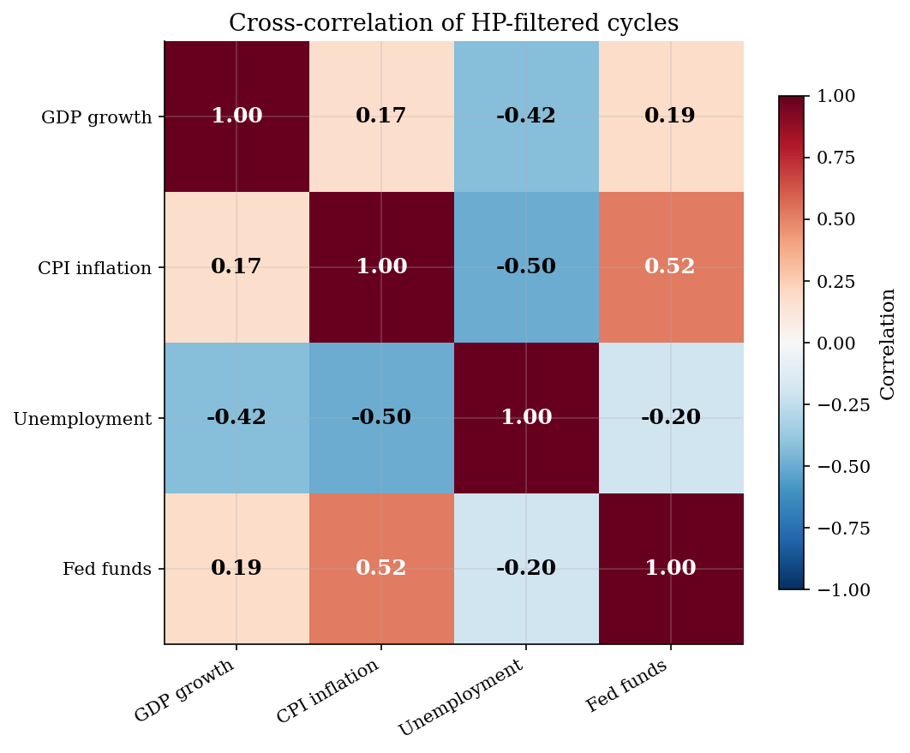

# Business-Cycle Moments from a FRED-Style Macro Panel

## Overview

Macroeconomic models are often judged by business-cycle moments. Researchers pull quarterly output growth, inflation, unemployment, and a policy rate from FRED (Federal Reserve Economic Data), detrend each series, and report the resulting volatilities, correlations, and persistence estimates. The gap in the literature before FRED was data fragmentation: series were housed in incompatible formats across different agencies, making replication costly. A standardized retrieval layer changed that.

The object here is a small *FRED-style panel*. It is simulated so the page runs without an API key or a changing data release.

The computational need is detrending. HP filtering puts each series into a cycle. Sample moments then summarize volatility, comovement, persistence, and an Okun slope.

## Read before

- [HP filter and trend-cycle decomposition](../hp-filter/README.md)
- [Simulating stationary vector processes](../var-simulation/README.md)
- [Okun's law in business-cycle models](../okun-phillips/README.md)

## Equations

Let

```math
y_t = (g_t,\pi_t,u_t,i_t)'
```

collect GDP growth, CPI inflation, unemployment, and the federal funds rate,
all measured in percentage points. The synthetic data are generated from a
stationary vector process

```math
s_t = \rho \odot s_{t-1} + \sqrt{1-\rho^2}\odot \varepsilon_t,
\qquad
\varepsilon_t \sim N(0,C),
\qquad
y_t=\mu+\sigma^{y}\odot s_t.
```

The vector $`s_t`$ is a standardized latent state and $`\sigma^{y}`$ is the 4-vector of series standard deviations (3.0, 1.5, 1.5, 3.0). It is a separate quantity from the HP-cycle standard deviation $`\sigma^{c}_j = \mathrm{sd}(c_{j,t})`$ defined below; the superscripts $`y`$ and $`c`$ keep the DGP scaling and the cycle moment distinct.
Here $`\odot`$ is element-by-element multiplication. The correlation matrix $`C`$
sets the contemporaneous macro relationships in the example. The parameter
$`\rho_j`$ controls how slowly each series adjusts after an innovation.

For each observed series $`y_{j,t}`$, the *HP filter* chooses a trend $`\tau_{j,t}`$
by solving

```math
\min_{\tau_j}
\sum_{t=1}^{T} (y_{j,t}-\tau_{j,t})^2 + \lambda\sum_{t=2}^{T-1}
[(\tau_{j,t+1}-\tau_{j,t})-(\tau_{j,t}-\tau_{j,t-1})]^2.
```

The cycle is $`c_{j,t}=y_{j,t}-\tau_{j,t}`$. The reported moments are

```math
\sigma^{c}_j=\mathrm{sd}(c_{j,t}),\qquad
r_{j,g}=\mathrm{corr}(c_{j,t},c_{g,t}),\qquad
a_j=\mathrm{corr}(c_{j,t},c_{j,t-1}).
```

The Okun diagnostic is the finite-sample regression

```math
c_{u,t}=\alpha_O+\beta_O c_{g,t}+e_t,
```

where $`c_{g,t}`$ is the GDP-growth cycle and $`c_{u,t}`$ is the unemployment
cycle.

## Worked Numerical Example

Take three quarterly observations of GDP growth: $`y_1 = 100`$, $`y_2 = 103`$, $`y_3 = 104`$ (percentage-point deviations from a long-run mean, scaled for arithmetic clarity). The standard HP smoothing parameter for quarterly data is $`\lambda = 1600`$.

With only $`T = 3`$ observations there is one interior period, so the penalty has a single second-difference term. The HP objective becomes

```math
\min_{\tau_1,\tau_2,\tau_3}
\bigl(y_1-\tau_1\bigr)^2
+\bigl(y_2-\tau_2\bigr)^2
+\bigl(y_3-\tau_3\bigr)^2
+\lambda\bigl(\tau_3-2\tau_2+\tau_1\bigr)^2.
```

Let $`D = \tau_3 - 2\tau_2 + \tau_1`$ denote the second difference of the trend. The first-order conditions with respect to each $`\tau_j`$ give

```math
\tau_1 = y_1 - \lambda D, \qquad
\tau_2 = y_2 + 2\lambda D, \qquad
\tau_3 = y_3 - \lambda D.
```

Substituting back into the definition of $`D`$ yields one equation in $`D`$ alone:

```math
D = (y_1 - 2y_2 + y_3) - 6\lambda D
\implies
D = \frac{y_1 - 2y_2 + y_3}{1 + 6\lambda}.
```

For the three observations above, the raw second difference is $`y_1 - 2y_2 + y_3 = 100 - 206 + 104 = -2`$. Plugging in $`\lambda = 1600`$:

```math
D = \frac{-2}{1 + 6 \times 1600} = \frac{-2}{9601} \approx -0.000208.
```

The trend at the middle period is

```math
\tau_2 = 103 + 2(1600)(-0.000208) = 103 - 0.666 \approx 102.334,
```

so the HP cycle at period 2 is

```math
c_2 = y_2 - \tau_2 = 103 - 102.334 = \boxed{0.666}.
```

The large $`\lambda`$ forces the trend close to the straight line through the endpoints (100 to 104), leaving the kink at $`y_2 = 103`$ almost entirely in the cycle. If $`\lambda = 0`$, the trend would interpolate the data exactly and the cycle would be zero. This tradeoff between fit and smoothness is the core mechanism that the full-panel HP filter applies series by series.

## Model Setup

| Parameter | Value | Parameter | Value |
|---|---:|---|---:|
| Sample length $`T`$ | 200 | Benchmark length $`T_B`$ | 5000 |
| HP smoothing $`\lambda`$ | 1600 | Series count | 4 |

| Series | Mean | Std. dev. | Persistence | Role |
|---|---:|---:|---:|---|
| GDP growth | 2.5 | 3.0 | 0.30 | Output-growth cycle |
| CPI inflation | 2.0 | 1.5 | 0.70 | Price-pressure cycle |
| Unemployment | 5.5 | 1.5 | 0.85 | Labor-market slack |
| Fed funds | 4.0 | 3.0 | 0.80 | Short-rate indicator |

Innovation correlation matrix $`C`$:

| | GDP | CPI | Unemployment | Fed funds |
|---|---:|---:|---:|---:|
| GDP | 1.00 | 0.20 | -0.60 | 0.30 |
| CPI | 0.20 | 1.00 | -0.30 | 0.50 |
| Unemployment | -0.60 | -0.30 | 1.00 | -0.20 |
| Fed funds | 0.30 | 0.50 | -0.20 | 1.00 |

## Solution Method

The *HP filter* solves one sparse linear system per series, choosing a trend that tracks the data while penalizing curvature in trend growth. The residual is the cycle, and cycle statistics give the moment table. A long simulation on the same process provides a benchmark for sampling variation in the 50-year panel.

```
             quarterly panel y_t, lambda, T_B
                             |
                             v
    +---------- data pipeline ----------+
    |                                   |
    |   y_t --> [ HP filter ] --> c_t   |
    |                                   |
    +-----------------------------------+
                             |
                             v
    +------- moment table ----------+
    |                               |
    |   c_t --> [ volatility ]      |
    |   c_t --> [ GDP correlation ] |
    |   c_t --> [ autocorrelation ] |
    |   c_t --> [ Okun regression ] |
    |                               |
    +-------------------------------+
                             |
                             v
                   moment table M, Okun slope
```

## Results

The raw panel is the starting object: rates and growth rates in observed units. GDP growth moves quickly, while unemployment and the policy rate move slowly.



The HP cycles put each series on its own detrended scale. These cycles are the inputs for the moment table.



Output above trend is associated with unemployment below trend. The dashed line shows the long simulation benchmark, not a historical U.S. estimate. The 50-year sample correlation is -0.423; the long-sample benchmark is -0.450.



The correlation matrix checks the full cycle panel. The signs match the calibration. Unemployment is countercyclical. Inflation and the policy rate are procyclical.



The table reports the finite sample and benchmark moments. Benchmark columns use the same process, so they show sampling variation rather than validation with real data.

| Variable      |   Volatility (%) |   Rel. volatility |   Corr. with GDP |   Long-sample corr. |   Autocorr. |   Long-sample autocorr. |
|:--------------|-----------------:|------------------:|-----------------:|--------------------:|------------:|------------------------:|
| GDP growth    |            2.896 |             1     |            1     |               1     |       0.282 |                   0.223 |
| CPI inflation |            1.159 |             0.4   |            0.174 |               0.171 |       0.483 |                   0.529 |
| Unemployment  |            0.975 |             0.337 |           -0.423 |              -0.45  |       0.649 |                   0.638 |
| Fed funds     |            2.007 |             0.693 |            0.187 |               0.222 |       0.599 |                   0.622 |

### Business-cycle moment diagnostics

| Moment | Sample | Long-sample benchmark |
|:---|---:|---:|
| Okun slope $`\beta_O`$ | -0.14 | -0.13 |
| GDP-unemployment correlation | -0.42 | -0.45 |
| Most persistent cycle | Unemployment | Unemployment |

## Takeaway

*Precautionary data practice* starts before the model: standardized retrieval lets moments replicate across teams and vintages. FRED made that routine in macroeconomics the same way version control made code reproducible.

In this calibration, GDP growth and unemployment move against each other. Unemployment carries the longest cyclical memory. Sampling and filtering keep the 50-year panel from matching the long benchmark exactly. Stock and Watson (1999) showed that this gap is a property of the data, not a sign of misspecification, and it became a standing target for heterogeneous-agent business-cycle models.

## See also

- [HP filter and trend-cycle decomposition](../hp-filter/README.md)
- [Simulating stationary vector processes](../var-simulation/README.md)
- [Aiyagari saving and capital-market clearing](../../dynamic-programming/aiyagari/README.md)

## References

- Federal Reserve Bank of St. Louis. FRED, Federal Reserve Economic Data. https://fred.stlouisfed.org
- Hodrick, R. and Prescott, E. (1997). "Postwar U.S. Business Cycles: An Empirical Investigation." *Journal of Money, Credit and Banking*, 29(1), 1-16.
- Stock, J. and Watson, M. (1999). "Business Cycle Fluctuations in U.S. Macroeconomic Time Series." *Handbook of Macroeconomics*, Vol. 1A, Ch. 1.
- Okun, A. (1962). "Potential GNP: Its Measurement and Significance." *Proceedings of the Business and Economic Statistics Section*, ASA.
