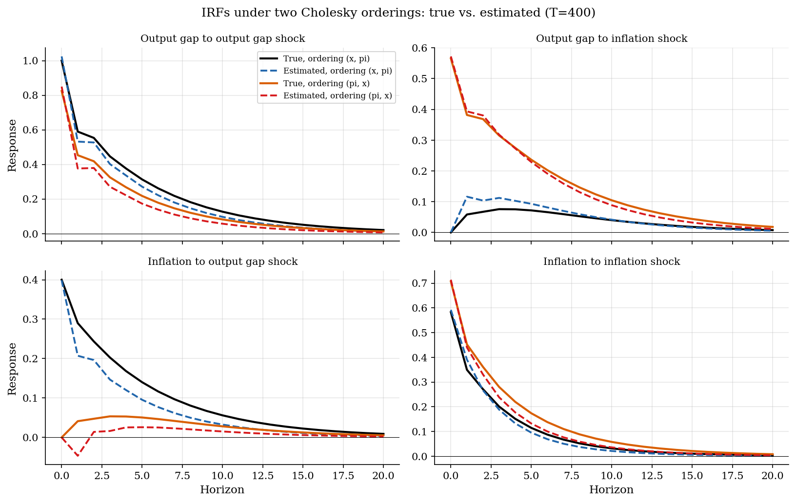
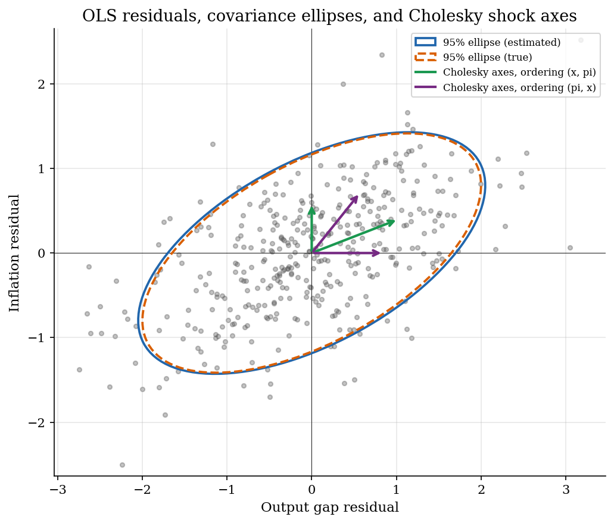
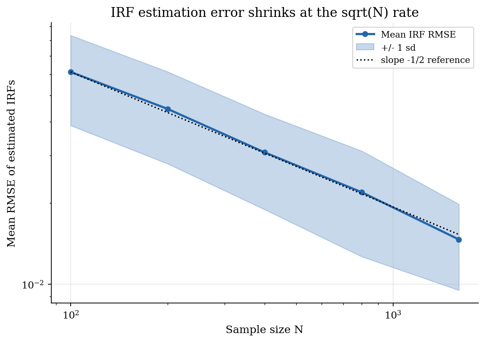

# Reduced-Form VARs: Estimation, Impulse Responses, and Cholesky Identification

## Overview

A macroeconomist wants to describe the joint dynamics of a small number of variables, like output and inflation, without writing down a structural model. A reduced-form vector autoregression treats each variable as a linear function of its own and the others' recent lags, plus a serially uncorrelated forecast error. The coefficient matrices are estimated equation by equation by ordinary least squares.

The forecast errors are correlated across variables. Naming a shock to one variable requires an extra assumption about which errors are allowed to react contemporaneously to which others. The recursive choice is the simplest: pick an ordering and let the lower-triangular Cholesky factor of the error covariance map orthogonal structural shocks to reduced-form errors. A different ordering gives different impulse responses, so the ordering is an identifying assumption, not a property of the data.

This tutorial estimates a bivariate VAR(2) on a simulated output-gap-and-inflation panel, identifies shocks under two orderings, and shows how the estimated impulse responses approach the true ones as the sample grows. The same reduced-form setup feeds the Bayesian shrinkage version in [`time-series/minnesota-svar/`](../../time-series/minnesota-svar/) and the autoregressive backbone of the factor forecast in [`time-series/stock-watson/`](../../time-series/stock-watson/).

## Equations

We need a vector-valued analogue of the univariate AR(p) model in [`time-series/ar-processes/`](../../time-series/ar-processes/). Let $`t`$ index time and let $`y_t \in \mathbb{R}^k`$ collect the $`k`$ endogenous variables at date $`t`$. The reduced-form vector autoregression of order $`p`$ writes each $`y_t`$ as an intercept plus a linear function of $`p`$ lags plus a multivariate forecast error:

```math
y_t = c + A_1 y_{t-1} + A_2 y_{t-2} + \cdots + A_p y_{t-p} + u_t,
\qquad
u_t \sim (0, \Sigma_u).
```

Here $`A_1, \ldots, A_p`$ are $`k \times k`$ coefficient matrices, $`c \in \mathbb{R}^k`$ is the intercept, and $`u_t`$ is the reduced-form residual with covariance matrix $`\Sigma_u`$. The residuals are uncorrelated over time but generally correlated across equations, so $`\Sigma_u`$ need not be diagonal.

We need a one-step recursion that keeps track of all lags at once so that powers of one matrix generate impulse responses. Stacking the current and lagged values into a tall vector $`Y_t = (y_t', y_{t-1}', \ldots, y_{t-p+1}')'`$ of length $`kp`$ gives the companion form (a first-order rewrite of the higher-order VAR):

```math
Y_t = F  Y_{t-1} + e_t,
\qquad
F =
\begin{bmatrix}
A_1 & A_2 & \cdots & A_{p-1} & A_p \\
I_k & 0   & \cdots & 0       & 0   \\
0   & I_k & \cdots & 0       & 0   \\
\vdots & & \ddots & & \vdots \\
0   & 0   & \cdots & I_k     & 0
\end{bmatrix}.
```

The top $`k`$ rows reproduce the VAR equation. The remaining rows shift past observations down by one. The system is stable when the spectral radius of $`F`$ is less than one, in which case the unconditional variance of $`y_t`$ is finite.

We need an estimator for $`(c, A_1, \ldots, A_p)`$ that uses each equation's information without joint nonlinear optimization. Stack the $`p`$ lags and the constant into one design row $`x_t = (1, y_{t-1}', \ldots, y_{t-p}')'`$ of length $`1 + kp`$. The ordinary-least-squares estimator solves each equation separately:

```math
\hat\beta_i = \left(\sum_t x_t x_t'\right)^{-1} \sum_t x_t  y_{i,t}, \qquad i = 1, \ldots, k.
```

Equation-by-equation OLS coincides with the multivariate Gaussian maximum-likelihood estimator under standard assumptions, so for reduced-form purposes it is the default. With raw sample length $`T`$, the design uses $`T - p`$ rows (one row per period from $`p + 1`$ to $`T`$) and each equation has $`kp + 1`$ regressors, so the residual covariance is estimated as $`\hat\Sigma_u = (T - p - kp - 1)^{-1} \sum_t \hat u_t \hat u_t'`$.

We need a way to name shocks so that impulse responses describe how the system reacts to one orthogonal disturbance at a time. The recursive scheme factors $`\Sigma_u`$ into a lower-triangular matrix $`P`$ and its transpose, and treats the transformed residual as the structural shock vector:

```math
\Sigma_u = P  P',
\qquad
\varepsilon_t = P^{-1} u_t,
\qquad
E[\varepsilon_t \varepsilon_t'] = I_k.
```

Triangularity of $`P`$ is the identifying restriction. The first variable in the ordering reacts on impact only to its own structural shock. The second reacts on impact to its own shock and to the first. And so on. Reordering the variables before taking the Cholesky factor gives a different $`P`$ and a different set of impulse responses.

We need to turn $`P`$ and the dynamics in $`F`$ into the response of every variable to every shock at every horizon. The impulse response at horizon $`j`$ is the top $`k \times k`$ block of $`F^j`$ post-multiplied by $`P`$:

```math
\Phi_j = J  F^j  J'  P,
\qquad
J = \begin{bmatrix} I_k & 0_k & \cdots & 0_k \end{bmatrix} \in \mathbb{R}^{k \times kp}.
```

Entry $`(\Phi_j)_{ik}`$ reads as the response of variable $`i`$ to a unit-variance structural shock $`k`$, $`j`$ periods after the shock. Setting $`j = 0`$ recovers $`P`$, which encodes the impact restrictions; setting $`j > 0`$ propagates those restrictions through the estimated lag matrices.

## Model Setup

| Object | Symbol | Role |
|---|---|---|
| Time index | $`t`$ | Discrete date, $`t = 1, \ldots, T`$ |
| Endogenous vector | $`y_t`$ | Output gap and inflation, $`k = 2`$ |
| VAR lag order | $`p`$ | Lags carried by each equation, set to $`p = 2`$ |
| Lag coefficient matrices | $`A_1, A_2`$ | $`k \times k`$ slopes [from `minnesota-svar/`] |
| Intercept | $`c`$ | $`k`$-vector intercept [from `minnesota-svar/`] |
| Reduced-form residual | $`u_t`$ | Multivariate forecast error [from `minnesota-svar/`] |
| Residual covariance | $`\Sigma_u`$ | $`k \times k`$ cross-equation covariance [from `minnesota-svar/`] |
| Companion matrix | $`F`$ | $`kp \times kp`$ first-order rewrite [prelim introduces] |
| Selector matrix | $`J`$ | Extracts the $`k`$-vector top block [prelim introduces] |
| Cholesky factor | $`P`$ | Lower-triangular with $`\Sigma_u = P P'`$ [from `minnesota-svar/`] |
| Structural shock | $`\varepsilon_t`$ | Orthonormal innovations, $`\varepsilon_t = P^{-1} u_t`$ [from `minnesota-svar/`] |
| Impulse response | $`\Phi_j`$ | $`k \times k`$ response matrix at horizon $`j`$ [from `minnesota-svar/`] |
| Sample size | $`T`$ | 400 observations after a 200-period burn-in |
| Horizon | $`H`$ | 20 quarters for IRF plots |
| Monte Carlo trials | $`K`$ | 200 trials per sample size for the RMSE sweep |

The annotations record which symbols are shared with the dense tutorial that builds on this prelim. Reusing names keeps the cross-references in `minnesota-svar/` rename-free.

## Solution Method

The procedure has three stages. The first two are mechanical. The third encodes the identifying restriction.

```text
Procedure: Reduced-form VAR with recursive Cholesky identification
Inputs : series y for periods 1 to T; lag order p; horizon H;
         ordering pi over the k variables.
Outputs: estimated intercept c, lag matrices A_1 ... A_p, residual
         covariance Sigma_u, impulse responses Phi_0 ... Phi_H.

1. Stack the design matrix.
   X has one row per period t from p+1 to T. Each row contains a 1,
   then the k-vector y at period t-1, then y at t-2, and so on up to
   y at t-p. Y has the same number of rows; row t is y at period t.

2. Estimate the reduced form by OLS.
   beta_hat = inverse(X' X) (X' Y)               # one regression per equation
   residuals = Y - X beta_hat
   Sigma_u_hat = residuals' residuals / (T - p - kp - 1)

3. Identify recursively.
   Permute rows and columns of Sigma_u_hat by the ordering pi.
   P_perm = lower Cholesky of the permuted covariance.
   Un-permute rows and columns to express P in original variable order.

4. Propagate impulse responses.
   Build the companion matrix F from the estimated lag matrices.
   For j = 0, 1, ..., H:  Phi_j = J Fj J' P, where Fj is the j-th
   power of F and J selects the top k rows.
```

Sign restrictions, narrative restrictions, and external-instrument identification keep the reduced-form layer unchanged and replace step 3 with an alternative map from $`\Sigma_u`$ to a structural impact matrix. They are named here but not derived; the prelim's job is the reduced form plus the simplest identification scheme.

## Results

The headline run uses a bivariate VAR(2) on $`T = 400`$ simulated observations. The true companion matrix has spectral radius $`0.83`$, well inside the unit circle. The estimated radius is $`0.81`$, so the fitted system is also stable. Coefficient deviations are at most about $`0.1`$ in absolute value at this sample size.

The four panels show the impulse responses under each of the two possible orderings. Each panel reports four lines: the true response and the OLS estimate under the ordering that puts the output gap first, and the true response and the OLS estimate under the ordering that puts inflation first.



The top-right and bottom-left panels make the identifying restriction visible. With the output gap ordered first, an inflation shock has zero impact on the output gap. With inflation ordered first, an output-gap shock has zero impact on inflation. Both restrictions are imposed by the lower-triangular Cholesky factor, not estimated from the data. The dashed estimated lines sit close to the solid true lines under both orderings, but the two true lines themselves are different objects. The choice of ordering changes which shock is interpretable on impact.

The scatter shows the OLS residuals together with the covariance structure and the two Cholesky axes.



The estimated $`95\%`$ covariance ellipse (solid blue) tracks the true ellipse (dashed orange) closely at $`T = 400`$. The green arrows are the columns of the Cholesky factor under the ordering that puts the output gap first; the purple arrows are the columns of the factor under the reverse ordering. Each set of arrows describes a different decomposition of the same residual cloud into orthogonal shocks. In each set, one arrow lies on a coordinate axis: that arrow is the impact response to the shock to the second-ordered variable, and its zero on the first-ordered variable's axis is the recursive zero-impact restriction. The other arrow points freely into the residual cloud; it is the impact response to the first-ordered shock and tilts away from a coordinate axis whenever the two residuals are correlated.

The Monte Carlo sweep estimates the same VAR at five sample sizes between $`100`$ and $`1600`$ observations and reports the mean and one-standard-deviation band of the impulse-response RMSE across $`200`$ trials per sample size.



The mean error falls from $`0.061`$ at $`T = 100`$ to $`0.015`$ at $`T = 1600`$. The slope on log-log axes matches the dotted reference line of slope $`-1/2`$, which is the rate predicted by standard OLS asymptotics. Larger samples shrink the band as well as the mean.

## Takeaway

The reduced-form VAR is a small projection: each variable on its own lags and the others' lags, fitted by OLS. The recursive identification step is separate. It selects an ordering, factors the residual covariance, and treats the lower-triangular factor as the impact map from orthogonal shocks to forecast errors. Different orderings produce different impulse responses for the same reduced form, so the ordering is part of the assumptions, not part of the data.

This same reduced form is used downstream under additional structure. Bayesian shrinkage replaces equation-by-equation OLS with the Minnesota-prior posterior in [`time-series/minnesota-svar/`](../../time-series/minnesota-svar/). Sign restrictions, narrative restrictions, and external instruments replace the lower-triangular factor with weaker identifying assumptions, leaving the reduced form alone.

## References

- Sims, C. A. (1980). "Macroeconomics and Reality." *Econometrica*, 48(1), 1-48. Founding paper on reduced-form VARs and recursive identification.
- Hamilton, J. D. (1994). *Time Series Analysis*. Princeton University Press, Chapter 11. Textbook treatment of OLS VAR estimation, companion form, and recursive impulse responses.
- Stock, J. H. and Watson, M. W. (2001). "Vector Autoregressions." *Journal of Economic Perspectives*, 15(4), 101-115. Practitioner overview distinguishing reduced-form, recursive, and structural VARs.
- Lütkepohl, H. (2005). *New Introduction to Multiple Time Series Analysis*. Springer, Chapters 9-10. Reference for SVAR identification beyond the recursive case.
- **See also.** The Bayesian shrinkage version of the same reduced form is in [`time-series/minnesota-svar/`](../../time-series/minnesota-svar/), which keeps the Minnesota prior and the policy-shock interpretation and points back here for the OLS estimator and the Cholesky derivation. The factor-augmented forecast in [`time-series/stock-watson/`](../../time-series/stock-watson/) uses the same lag-stacking and OLS mechanics in its forecasting equation. The univariate predecessor is in [`time-series/ar-processes/`](../../time-series/ar-processes/), where the AR(1) impulse response is the scalar special case of $`\Phi_j`$ here.
