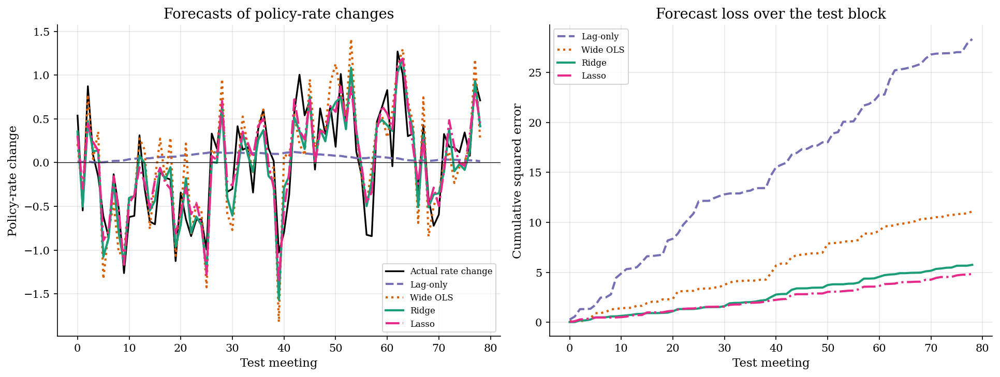
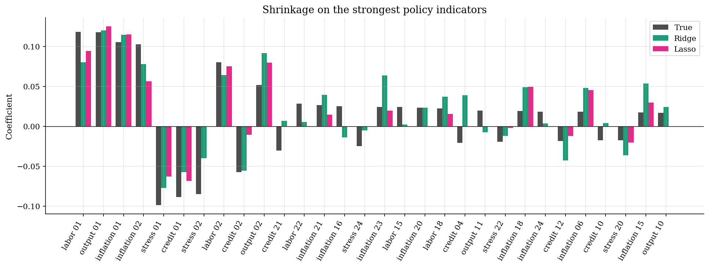
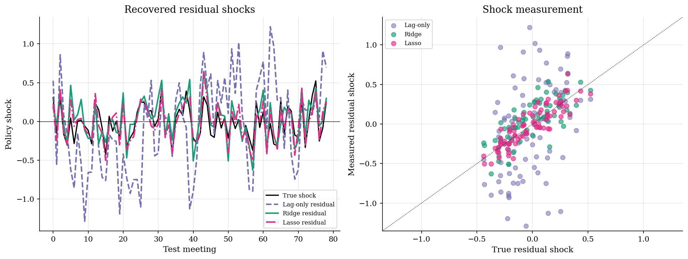
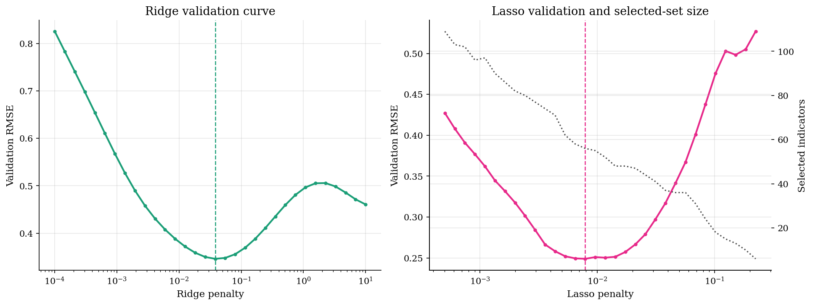

# Policy Forecasting with Ridge, Lasso, and Sparsity

## Overview

A central bank moves the policy rate after reading a large flow of economic text. Inflation, labor, credit, output, and financial-stress language all contain signals. Each individual indicator is noisy.

The economic object is the *policy shock*: the part of the rate change not predicted by the information set available at the meeting. A better forecast changes the measured shock series.

The example simulates many correlated policy-concept indicators. A few signals are strong, but many weak signals also matter. That distinction matters because a sparse selected model is not the same statement as a sparse economy. Ridge and Lasso were introduced to handle exactly this regime: many correlated predictors where OLS is unstable or infeasible. Neither paper considered the shock-measurement application, and the gap between statistical sparsity and economic sparsity had not been worked through explicitly at the time.

## Read before

- [Variance and bias under correlated regressors](../../supervised-learning/bias-variance/README.md)
- [Cross-validation and blocked time-series splits](../../supervised-learning/cross-validation/README.md)
- [OLS in matrix form](../../supervised-learning/ols-matrix/README.md)

## Equations

Let $`r_t`$ be the policy-rate level and let $`\Delta r_t`$ be the rate change at
meeting $`t`$. The information set contains a lagged policy rate and a vector
$`x_t`$ of standardized policy-concept indicators.

```math
\Delta r_t = \phi r_{t-1} + x_t'\beta + u_t.
```

Here $`\phi`$ is the autoregressive coefficient on the lagged policy rate.

The systematic policy component is

```math
m_t = \phi r_{t-1} + x_t'\beta,
```

and the policy shock is the residual

```math
u_t = \Delta r_t - m_t.
```

The forecast uses a linear rule $`f_t=b_0+z_t'b`$, where
$`z_t=(r_{t-1},x_t')'`$. Ridge estimates the coefficients by

```math
\hat b_{\mathrm{ridge}} = \arg\min_b \frac{1}{n}\sum_{t=1}^n (\Delta r_t-b_0-z_t'b)^2 +\lambda\sum_{j=1}^p b_j^2.
```

Lasso replaces the quadratic penalty with an absolute-value penalty.

```math
\hat b_{\mathrm{lasso}} = \arg\min_b \frac{1}{n}\sum_{t=1}^n (\Delta r_t-b_0-z_t'b)^2 +\lambda\sum_{j=1}^p |b_j|.
```

The tuning parameter $`\lambda`$ is chosen on a blocked validation sample. Ridge
keeps many small correlated signals. Lasso can set coefficients exactly to
zero, so it produces a compressed selected set.

## Worked Numerical Example

Use orthonormal predictors ($`X'X = I`$) with four indicators and OLS estimates $`\hat\beta_{\mathrm{OLS}} = (0.5,\ 1.0,\ 0.1,\ -0.3)`$. Set $`\lambda = 0.4`$. Orthonormality reduces both estimators to scalar formulas that expose the shrinkage geometry directly.

For ridge, the closed-form solution $`\hat b_{\mathrm{ridge}} = (X'X + \lambda I)^{-1}X'y`$ collapses to

```math
\hat\beta^j_{\mathrm{ridge}} = \frac{\hat\beta^j_{\mathrm{OLS}}}{1 + \lambda}.
```

With $`\lambda = 0.4`$, the denominator is $`1.4`$ for every coefficient:

```math
\hat\beta_{\mathrm{ridge}} = \frac{1}{1.4}(0.5,\ 1.0,\ 0.1,\ -0.3) = (0.357,\ 0.714,\ 0.0714,\ -0.214).
```

For lasso, coordinate descent on orthonormal $`X`$ reduces to soft-thresholding with threshold $`\lambda/2`$:

```math
\hat\beta^j_{\mathrm{lasso}} = \mathrm{sign}(\hat\beta^j_{\mathrm{OLS}})\cdot\max\!\left(|\hat\beta^j_{\mathrm{OLS}}| - \tfrac{\lambda}{2},\ 0\right).
```

Apply the threshold $`\lambda/2 = 0.2`$ coefficient by coefficient:

```math
\hat\beta^1_{\mathrm{lasso}} = \mathrm{sign}(0.5)\cdot\max(0.5 - 0.2,\ 0) = +0.3,
```

```math
\hat\beta^2_{\mathrm{lasso}} = \mathrm{sign}(1.0)\cdot\max(1.0 - 0.2,\ 0) = +0.8,
```

```math
\hat\beta^3_{\mathrm{lasso}} = \mathrm{sign}(0.1)\cdot\max(0.1 - 0.2,\ 0) = 0 \quad (\text{exact zero}),
```

```math
\hat\beta^4_{\mathrm{lasso}} = \mathrm{sign}(-0.3)\cdot\max(0.3 - 0.2,\ 0) = -0.1.
```

Collecting the ridge result:

```math
\hat\beta_{\mathrm{ridge}} = (0.357,\ 0.714,\ 0.0714,\ -0.214).
```

Collecting the lasso result:

```math
\hat\beta_{\mathrm{lasso}} = (0.3,\ 0.8,\ 0,\ -0.1).
```

Lasso zeros the third coefficient because $`|0.1| < \lambda/2 = 0.2`$; ridge merely shrinks it to $`0.071`$. Both estimators shrink coefficient 2 (the strongest signal) the least in absolute terms, but lasso shrinks it less than ridge because lasso's penalty is linear rather than quadratic. This is the bias-variance tradeoff made concrete: ridge trades bias uniformly across all coefficients, while lasso concentrates bias on small signals and grants near-unbiased recovery to large ones.

## Model Setup

| Object | Value | Object | Value |
|---|---:|---|---:|
| Policy meetings | 260 | Training meetings | 125 |
| Policy-concept groups | 5 | Validation meetings | 55 |
| Indicators per group | 24 | Test meetings | 79 |
| Total indicators | 120 | True shock sd | 0.20 |
| Ridge $`\lambda`$ | 0.0381 | Lasso $`\lambda`$ | 0.0079 |

## Solution Method

The forecast exercise uses time blocks rather than random folds. The validation block comes after the training block, and the test block comes last. This keeps the tuning exercise close to a real policy-forecasting problem.

Ridge has a closed-form penalized least-squares solution after centering and scaling the regressors. Lasso uses cyclic coordinate descent. The intercept is never penalized.

```
   (X, y), lambda              (X, y), lambda
        |                           |
        v                           v
  +-- Ridge --+               +-- Lasso --+
  | [ closed  ]|               | [ coord   ]|
  | [ form    ]|               | [ descent ]|
  +------------+               +-----------+
        |                           |
   beta_ridge                  beta_lasso
        \                           /
         \                         /
          v                       v
     +-- time-blocked validation --+
     |  [ split: train / valid /  ]|
     |  [        test             ]|
     +-----------------------------+
                    |
             lambda selection
                    |
                    v
          test-block forecasts
                    |
                    v
          policy shocks = actual - forecast
```

## Results

The forecast plot compares measured policy movements on the held-out meetings. Ridge lowers RMSE from 0.599 for the lag-only benchmark to 0.270. Wide OLS has more freedom but pays for estimating many noisy coefficients.



The coefficient plot sorts indicators by the true signal size. Ridge shrinks many correlated predictors toward zero without selecting a small subset. Lasso selects 56 indicators, so it compresses the rule more aggressively.



Policy shocks are residuals from the forecast rule. When the systematic component is forecast better, the residual series lines up more closely with the true shock. The ridge residual-shock correlation is 0.773.



The validation curves show the tuning tradeoff. Low penalties fit many noisy coefficients. High penalties can underfit. For lasso, the selected-set size falls as the penalty rises.



### Forecast diagnostics

| Model    | Penalty   |   Test RMSE |   Relative RMSE |   Corr. with true systematic policy |   Shock correlation |   Selected indicators |
|:---------|:----------|------------:|----------------:|------------------------------------:|--------------------:|----------------------:|
| Lag-only | not tuned |      0.5989 |          1      |                              0.031  |              0.3654 |                     0 |
| Wide OLS | 0         |      0.3748 |          0.6258 |                              0.886  |              0.5995 |                   120 |
| Ridge    | 0.0381    |      0.2699 |          0.4506 |                              0.9523 |              0.7728 |                   120 |
| Lasso    | 0.0079    |      0.2476 |          0.4134 |                              0.9781 |              0.8826 |                    56 |

The selection table separates statistical selection from economic sparsity. The true rule contains many small nonzero indicators, so missed dense signal matters even when the selected model forecasts well. Note that the false-inclusion count is always zero by DGP construction: every one of the 120 indicators has a nonzero true coefficient, so any indicator lasso selects is true by construction. The zero reflects the DGP, not lasso precision, and should not be read as a measurement of lasso selectivity.

| Statistic                                |   Value |
|:-----------------------------------------|--------:|
| True nonzero policy indicators           | 120     |
| Lasso-selected policy indicators         |  56     |
| False inclusions by lasso                |   0     |
| True indicators missed by lasso          |  64     |
| Dense-signal share missed by lasso       |   0.51  |
| Ridge coefficient correlation with truth |   0.644 |
| Lasso coefficient correlation with truth |   0.74  |

## Takeaway

Ridge is useful when many weak correlated predictors contain real information. Lasso is useful when the researcher wants selection and compression. In this run, lasso misses a substantial share of weak dense signal while still producing a compact forecasting rule. *Sparsity* is therefore a modeling restriction, not an economic conclusion by itself. The quantitative surprise in the original papers was how well penalized methods recover dense signal relative to OLS in wide-data regimes. The framework became the foundation for high-dimensional forecasting in macroeconomics and text-as-data applications.

## See also

- [LASSO and model selection in forecasting](../../supervised-learning/lasso-selection/README.md)
- [Principal components regression](../../supervised-learning/pcr/README.md)
- [Text indicators and factor models](../../time-series/text-factor-models/README.md)

## References

- Hoerl, A. E. and Kennard, R. W. (1970). Ridge Regression: Biased Estimation for Nonorthogonal Problems. *Technometrics*, 12(1), 55-67.
- Tibshirani, R. (1996). Regression Shrinkage and Selection via the Lasso. *Journal of the Royal Statistical Society, Series B*, 58(1), 267-288.
