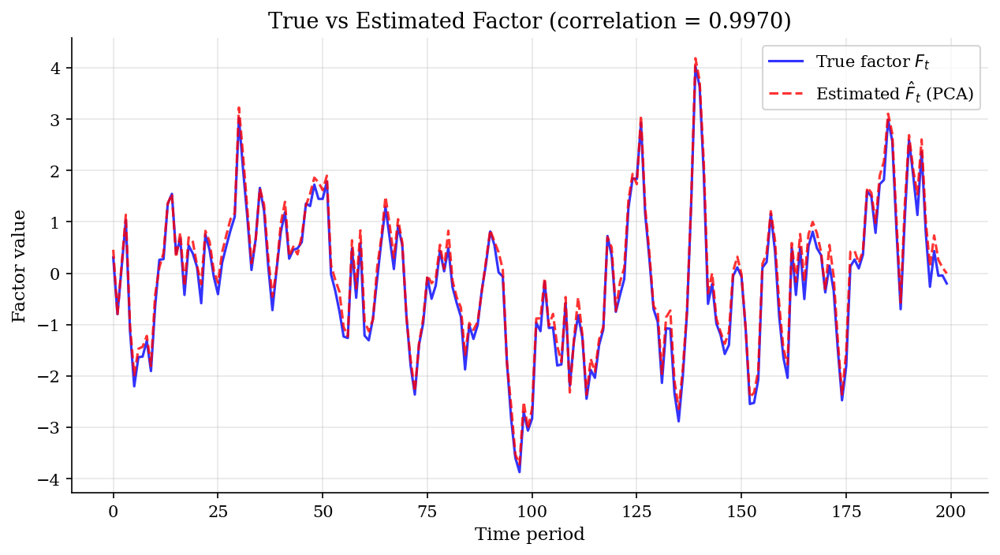
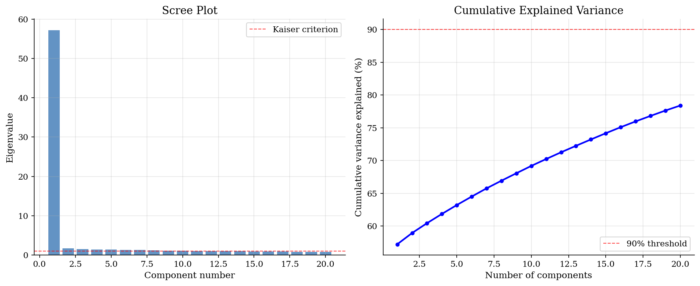
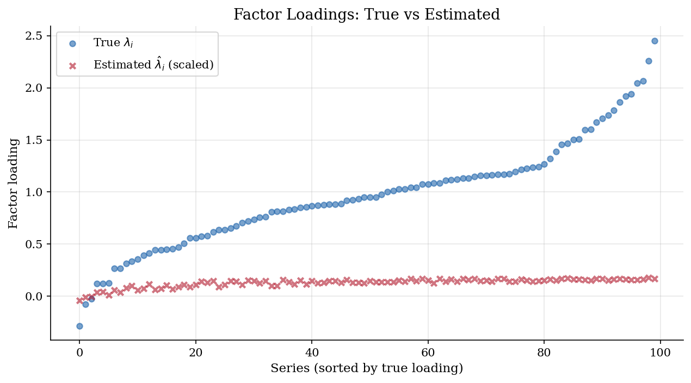
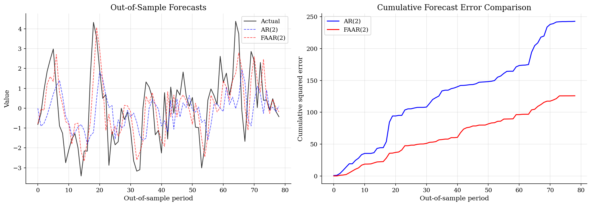

# Stock-Watson Diffusion Index / Factor Model

> Principal component estimation of common factors from a large panel, with factor-augmented forecasting.

## Overview

Stock and Watson (2002) showed that a small number of estimated factors, extracted via principal components from a large panel of macroeconomic time series, can substantially improve forecasts relative to standard autoregressive models.

The key insight is that in a data-rich environment with $N$ series and $T$ periods, one can consistently estimate the latent common factors as $N, T \to \infty$, even though the factor loadings are unknown. This model demonstrates the approach with a synthetic panel where the true data generating process is known, allowing us to verify that PCA recovers the true factor.

## Equations

**Static Factor Model:**

$$X_{it} = \lambda_i' F_t + e_{it}, \qquad i = 1, \ldots, N, \quad t = 1, \ldots, T$$

where $F_t$ is a $r \times 1$ vector of common factors, $\lambda_i$ is the $r \times 1$
loading vector for series $i$, and $e_{it}$ is the idiosyncratic component.

**PCA Estimation (Bai and Ng, 2002):**

The estimated factors $\hat{F}$ are $\sqrt{T}$ times the eigenvectors corresponding to the
$r$ largest eigenvalues of the $T \times T$ matrix $(NT)^{-1} X X'$.

**Factor-Augmented Autoregression (FAAR):**

$$y_{t+h} = \alpha + \sum_{j=1}^{p} \beta_j y_{t-j+1} + \gamma' \hat{F}_t + \varepsilon_{t+h}$$

## Model Setup

| Parameter | Value | Description |
|-----------|-------|-------------|
| $N$ | 100 | Number of series (cross-section) |
| $T$ | 200 | Number of time periods |
| $r$ | 1 | True number of factors |
| $\rho_F$ | 0.8 | Factor AR(1) persistence |
| $\lambda_i$ | $\sim N(1, 0.25)$ | Factor loadings |
| $\sigma_{e,i}$ | $\sim U(0.5, 1.5)$ | Idiosyncratic std. deviations |
| AR lags ($p$) | 2 | Lags in forecasting equation |
| Horizon ($h$) | 1 | Forecast horizon |

## Solution Method

**Step 1 -- Standardization:** Each series is demeaned and scaled to unit variance.

**Step 2 -- Eigendecomposition:** Compute the eigenvalues and eigenvectors of the $N \times N$ sample covariance matrix $(1/T) Z'Z$ where $Z$ is the standardized panel. The estimated factors are the projections of the data onto the top eigenvectors.

**Step 3 -- Forecasting:** Compare an AR(p) model (using only own lags) with a factor-augmented AR model (FAAR) that adds the estimated factor as a predictor. Evaluation uses an expanding-window out-of-sample exercise.

**Key result:** The first principal component explains **57.2%** of the total variance and has correlation **0.9970** with the true factor. The FAAR model achieves **28.0%** lower RMSE than the pure AR(2) benchmark.

## Results


*True common factor vs PCA estimate (correlation = 0.9970). PCA recovers the latent factor up to a scale normalization.*


*Scree plot and cumulative variance explained. The sharp drop after the first eigenvalue correctly indicates one dominant factor.*


*Factor loadings sorted by true value. PCA estimates track the cross-sectional pattern of true loadings.*


*Forecast comparison: FAAR reduces RMSE by 28.0% relative to AR(2). Right panel shows cumulative squared errors.*

**Top 5 Eigenvalues and Variance Explained**

| Component   |   Eigenvalue |   Var. Explained (%) |   Cumulative (%) |
|:------------|-------------:|---------------------:|-----------------:|
| PC1         |       57.198 |                57.2  |            57.2  |
| PC2         |        1.727 |                 1.73 |            58.93 |
| PC3         |        1.5   |                 1.5  |            60.43 |
| PC4         |        1.414 |                 1.41 |            61.84 |
| PC5         |        1.357 |                 1.36 |            63.2  |

**Out-of-Sample Forecast Comparison**

| Model   |   RMSE |   Relative RMSE |
|:--------|-------:|----------------:|
| AR(2)   | 1.753  |            1    |
| FAAR(2) | 1.2621 |            0.72 |

## Economic Takeaway

The Stock-Watson diffusion index approach demonstrates a powerful principle: when many correlated time series share a common source of variation, principal components can extract this latent factor even with unknown loadings.

**Key insights:**
- **Factor recovery:** With N=100 series and T=200 periods, PCA achieves a correlation of 0.9970 with the true factor. The Bai-Ng (2002) theory guarantees consistency as min(N,T) grows.
- **Scree plot diagnostics:** The sharp drop after the first eigenvalue correctly identifies the true number of factors (r=1). The first PC explains 57.2% of total variance.
- **Forecast gains:** Adding the estimated factor to an AR(2) model reduces RMSE by 28.0%. This gain comes from the factor capturing common movements that predict the target series.
- **Practical implication:** Factor models are the workhorse for nowcasting and short-term macro forecasting at central banks. The approach scales naturally to hundreds of predictors without running into overfitting problems.

## Reproduce

```bash
python run.py
```

## References

- Stock, J. and Watson, M. (2002). "Forecasting Using Principal Components from a Large Number of Predictors." *Journal of the American Statistical Association*, 97(460), 1167-1179.
- Bai, J. and Ng, S. (2002). "Determining the Number of Factors in Approximate Factor Models." *Econometrica*, 70(1), 191-221.
- Stock, J. and Watson, M. (2006). "Forecasting with Many Predictors." *Handbook of Economic Forecasting*, Vol. 1, Ch. 10.
- Bai, J. (2003). "Inferential Theory for Factor Models of Large Dimensions." *Econometrica*, 71(1), 135-171.
